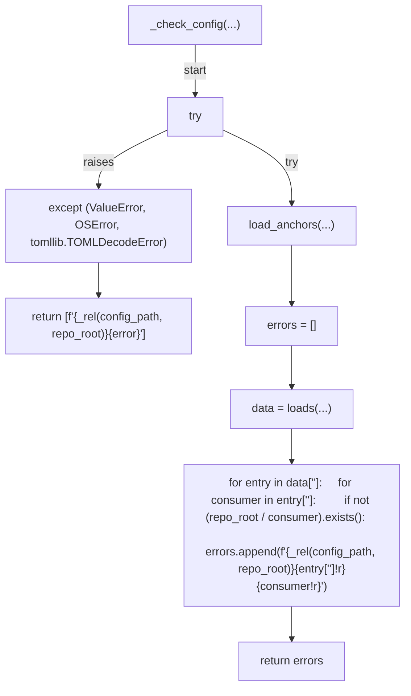
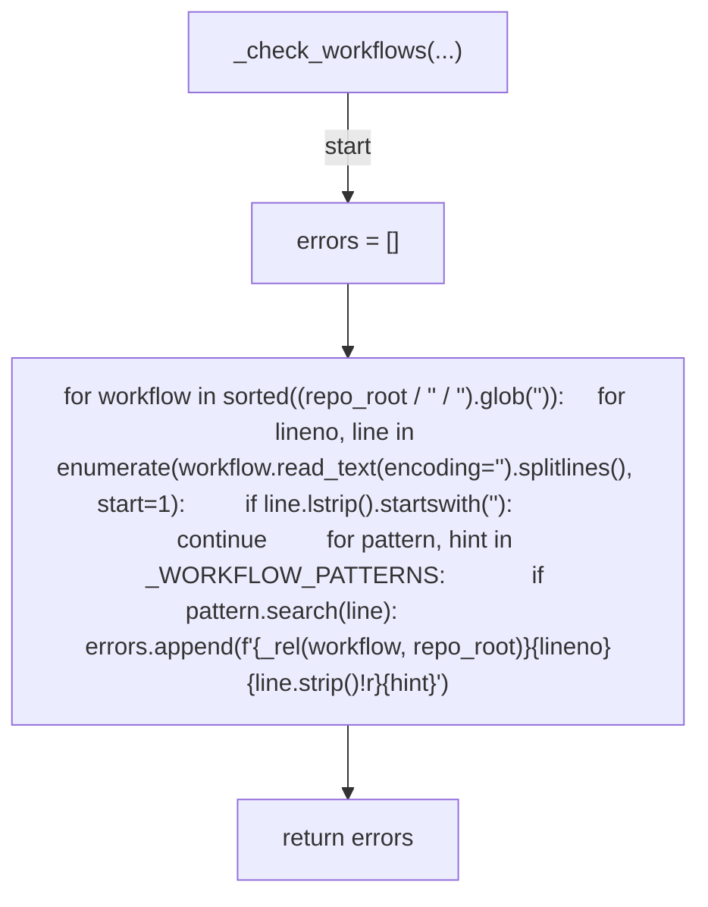
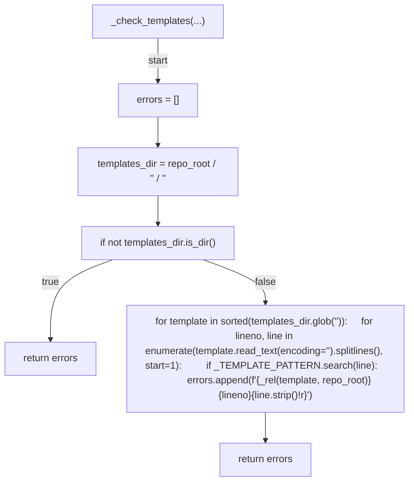
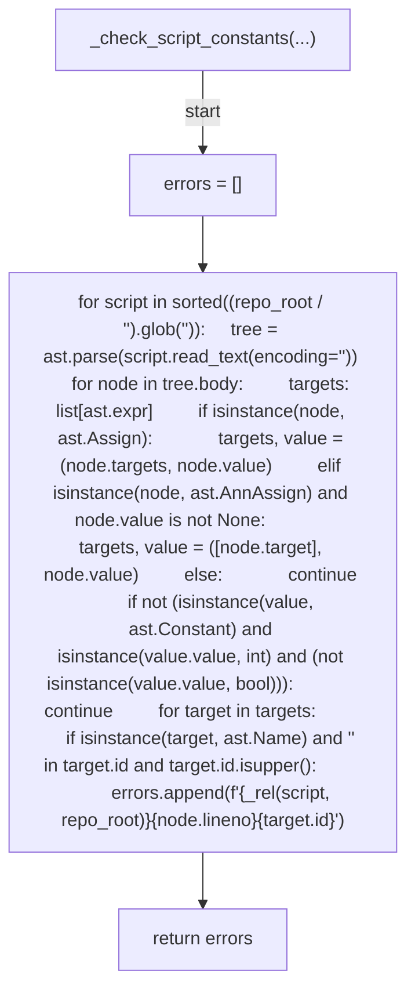
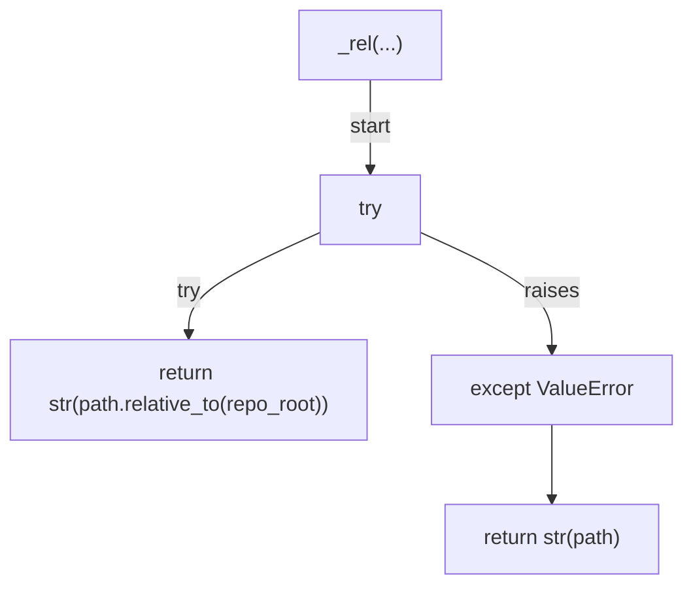
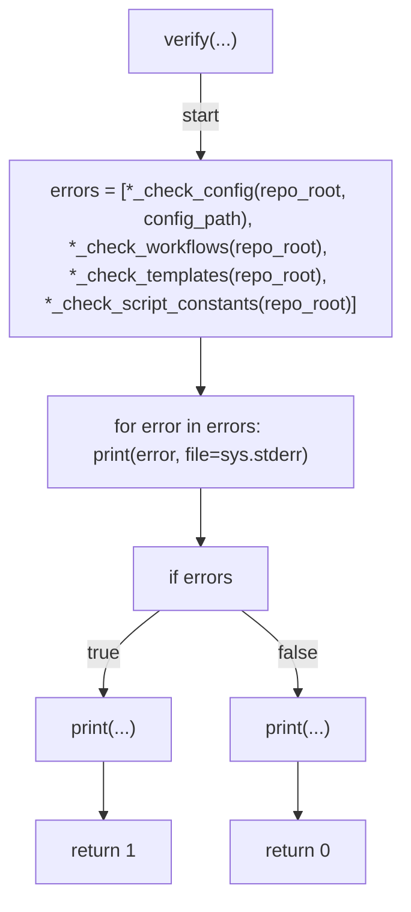
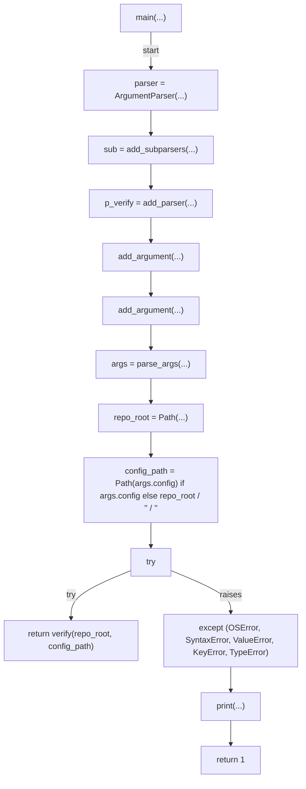

# AST graph: scripts/scan_issue_anchor_drift.py

This file is generated from `scripts/scan_issue_anchor_drift.py` by `python3 scripts/script_ast_graph.py all-doc`. Do not edit it by hand: content under `docs/generated/scripts/` is owned by the post-merge automation (refs #1540); update the source script instead.

## _check_config(...)

## _check_workflows(...)

## _check_templates(...)

## _check_script_constants(...)

## _rel(...)

## verify(...)

## main(...)

