# AST graph: scripts/scan_markdown_links.py

This file is generated from `scripts/scan_markdown_links.py` by `python3 scripts/script_ast_graph.py all-doc`. Do not edit it by hand: content under `docs/generated/scripts/` is owned by the post-merge automation (refs #1540) -- update the source script instead.

## rel(...)

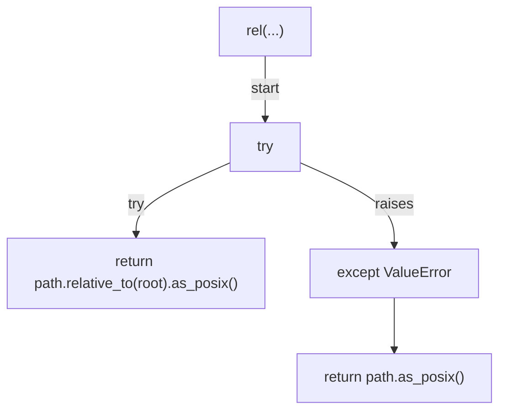

## iter_markdown_files(...)

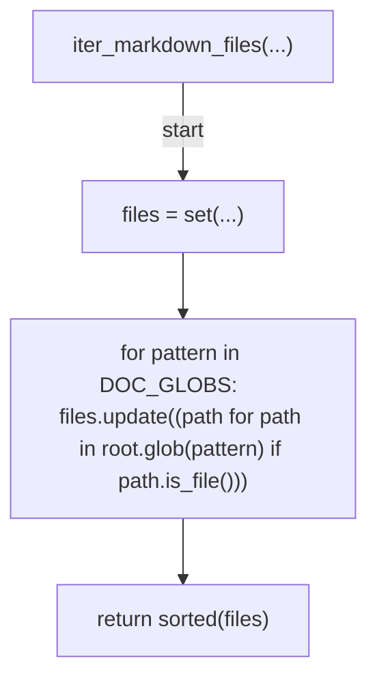

## extract_target(...)

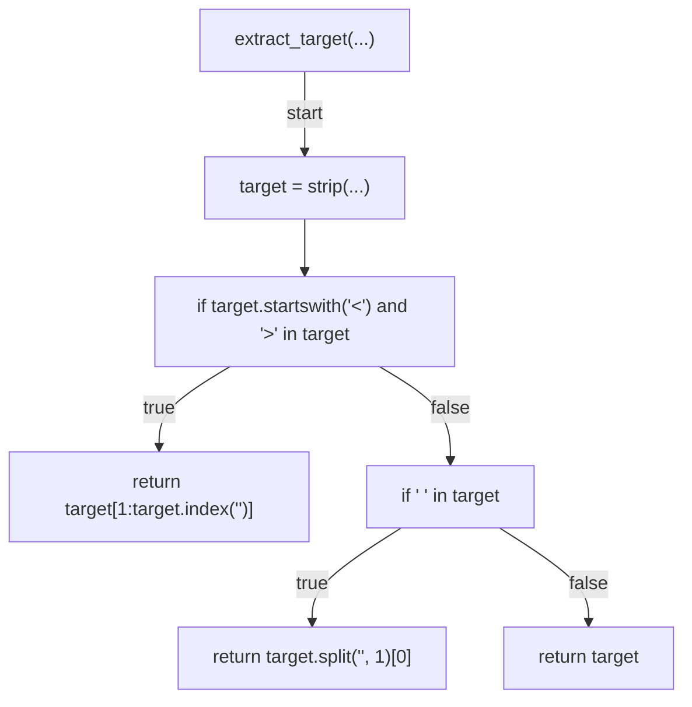

## iter_links(...)

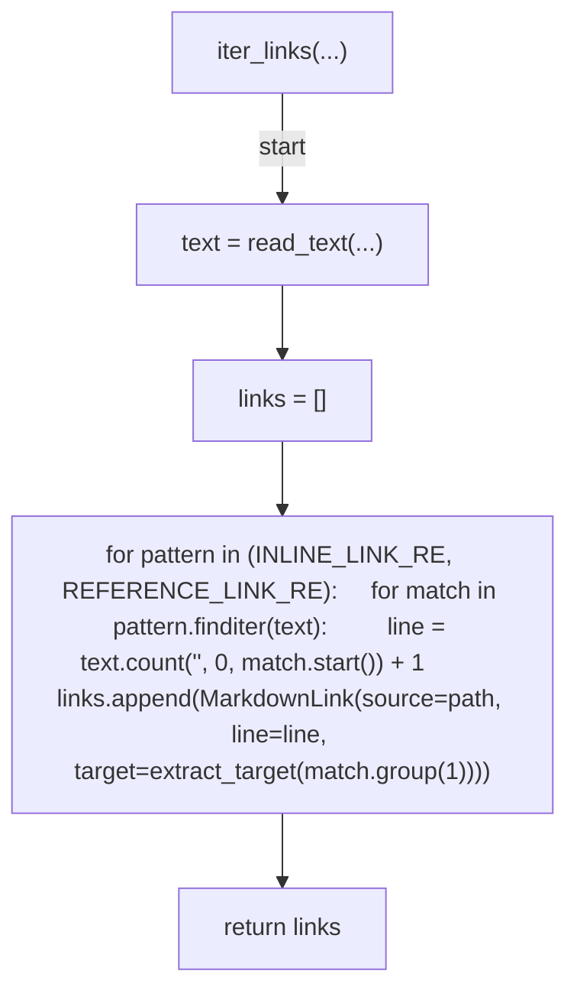

## strip_inline_markdown(...)

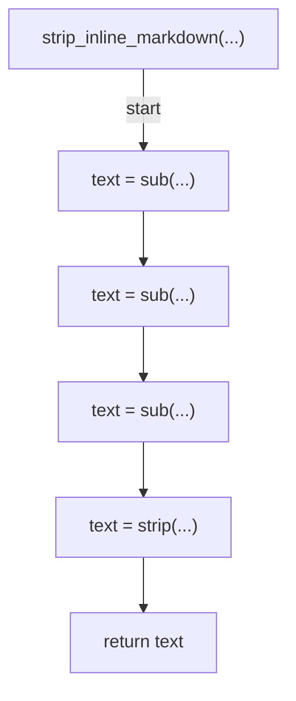

## slugify_heading(...)

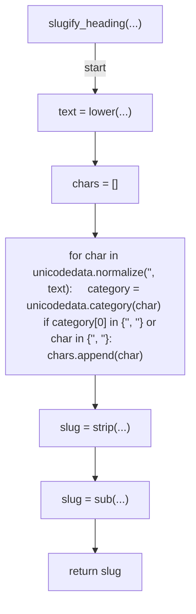

## collect_anchors(...)

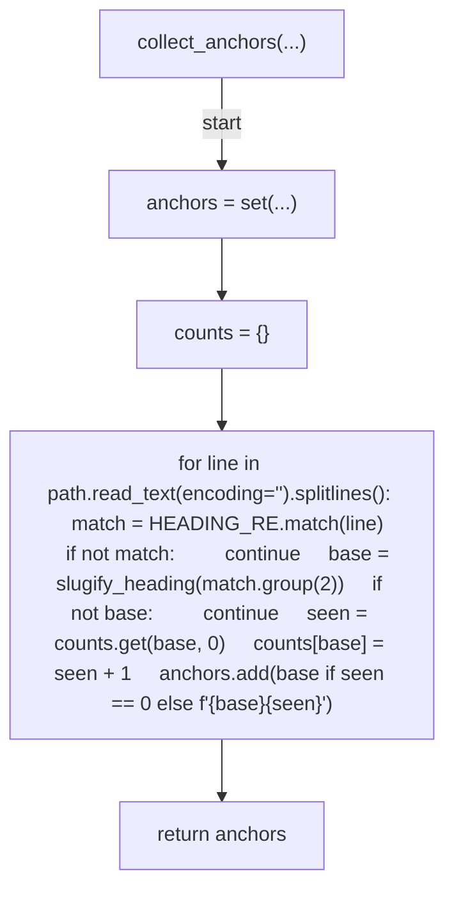

## should_skip_target(...)

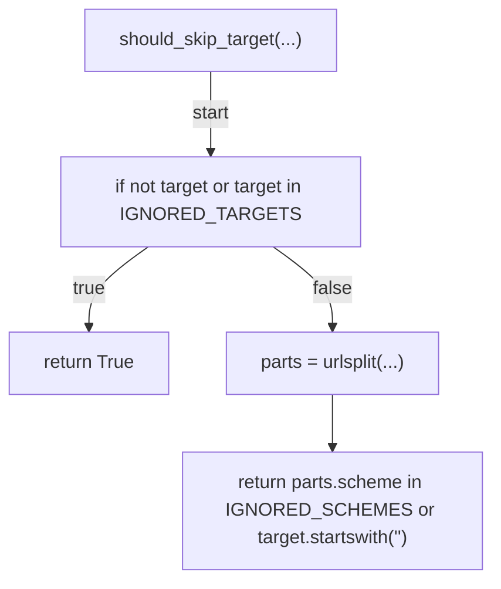

## resolve_link(...)

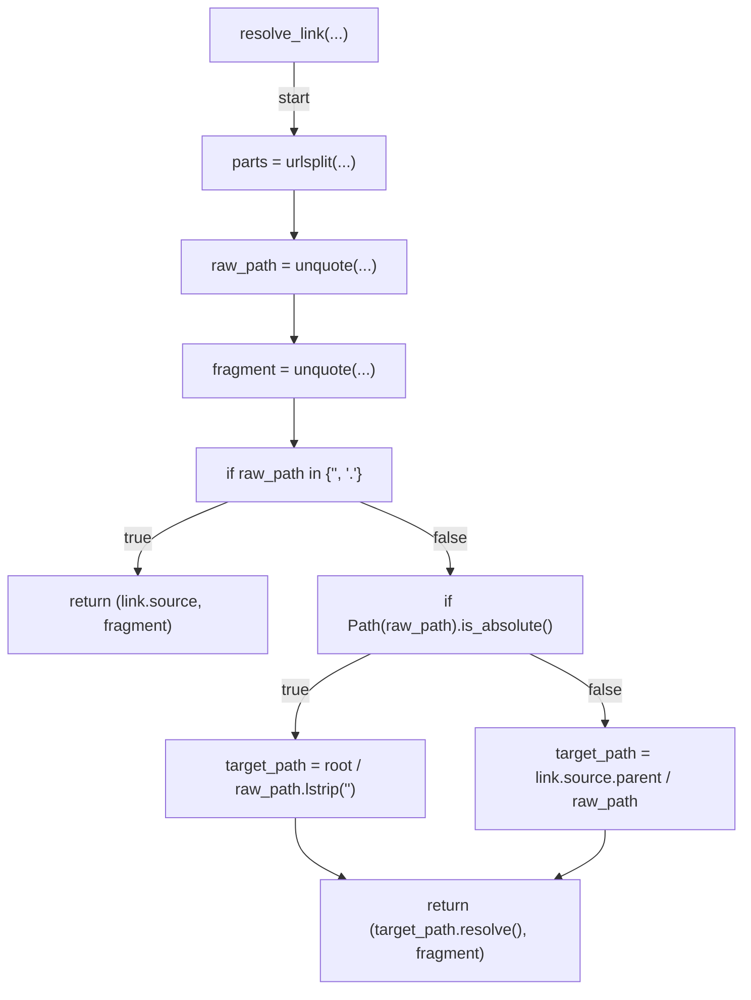

## verify_link(...)

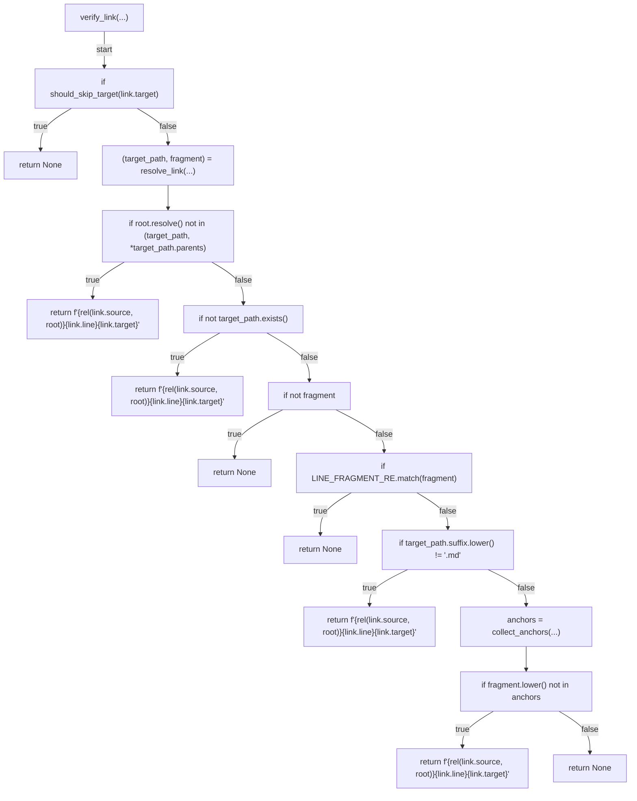

## verify(...)

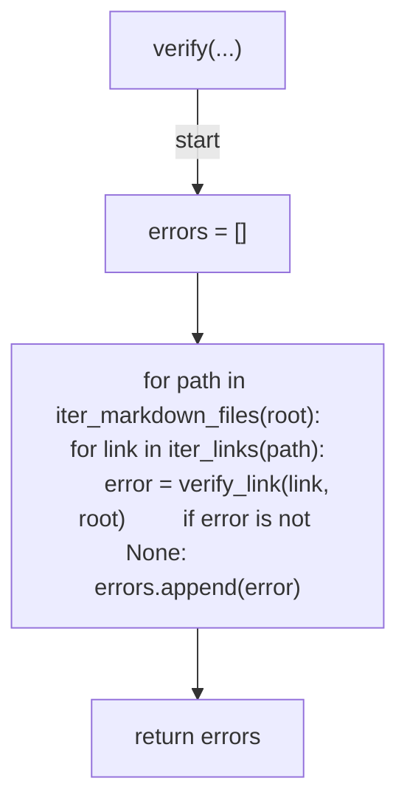

## cmd_verify(...)

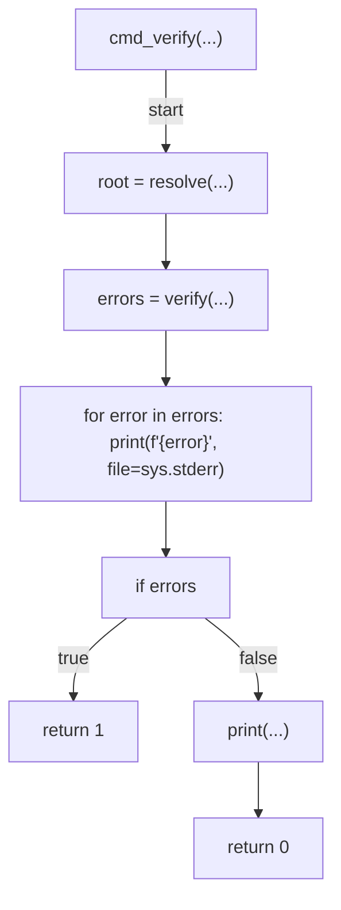

## build_parser(...)

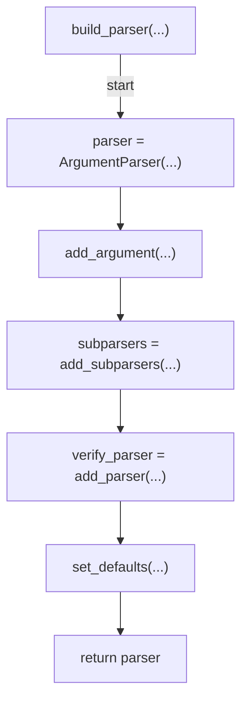

## main(...)

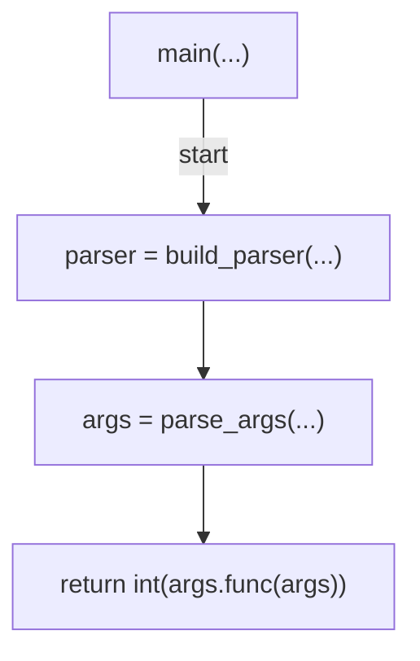
