# AST graph: scripts/scan_mermaid_syntax.py

This file is generated from `scripts/scan_mermaid_syntax.py` by `python3 scripts/script_ast_graph.py all-doc`. Do not edit it by hand: content under `docs/generated/scripts/` is owned by the post-merge automation (refs #1540) -- update the source script instead.

## rel(...)

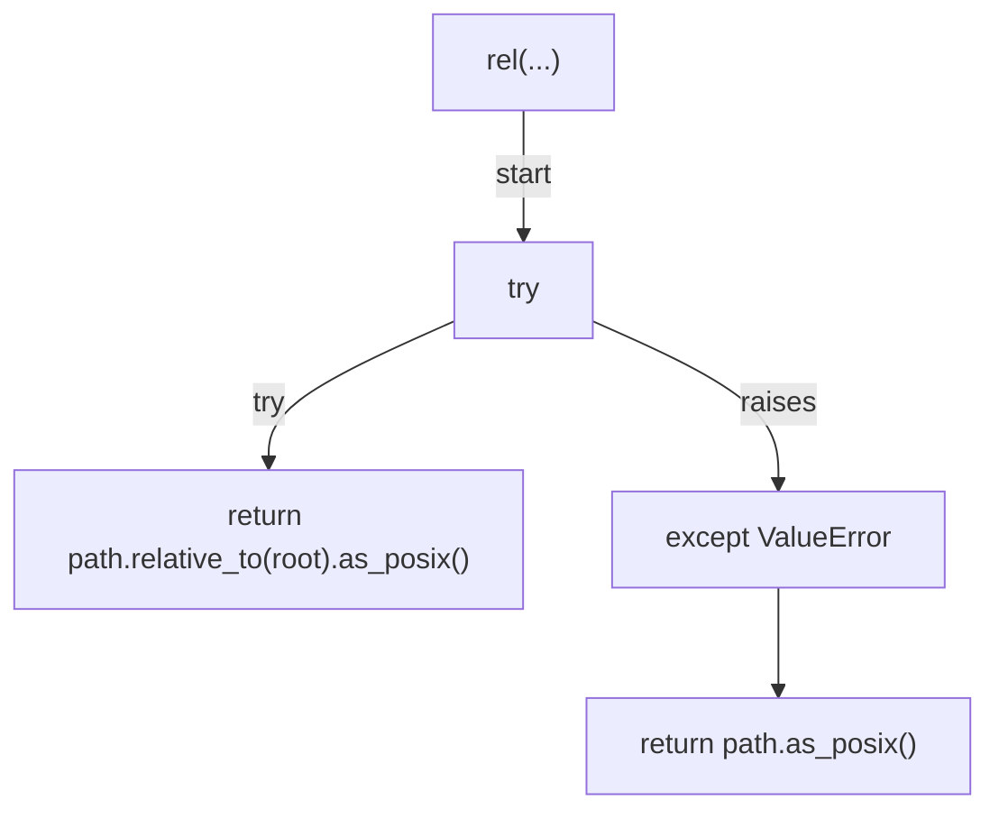

## is_exempt(...)

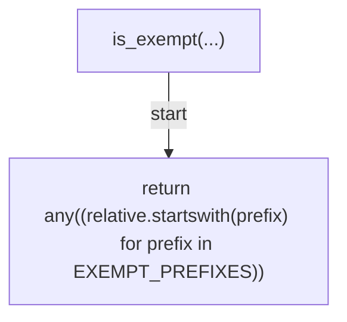

## iter_docs_markdown(...)

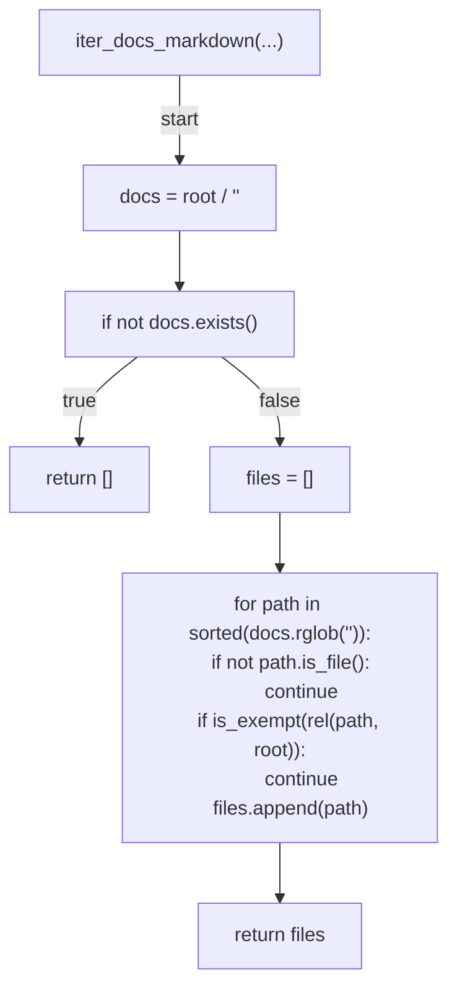

## _fence_marker(...)

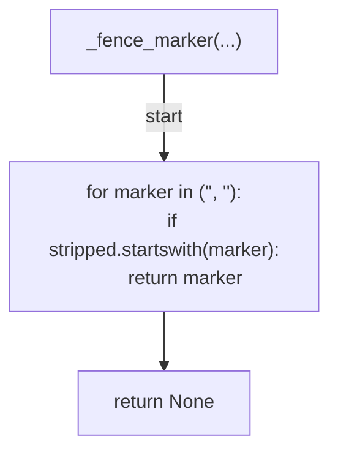

## extract_blocks(...)

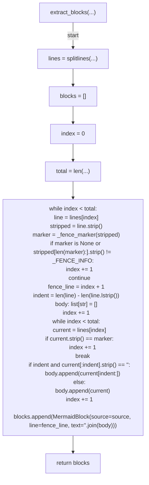

## collect_blocks(...)

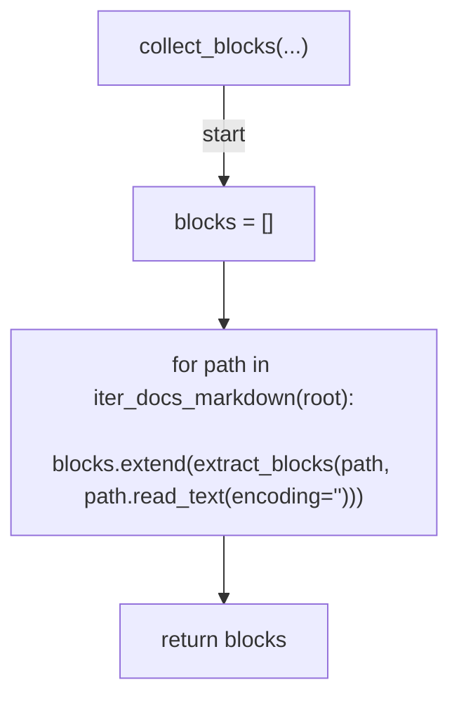

## format_error(...)

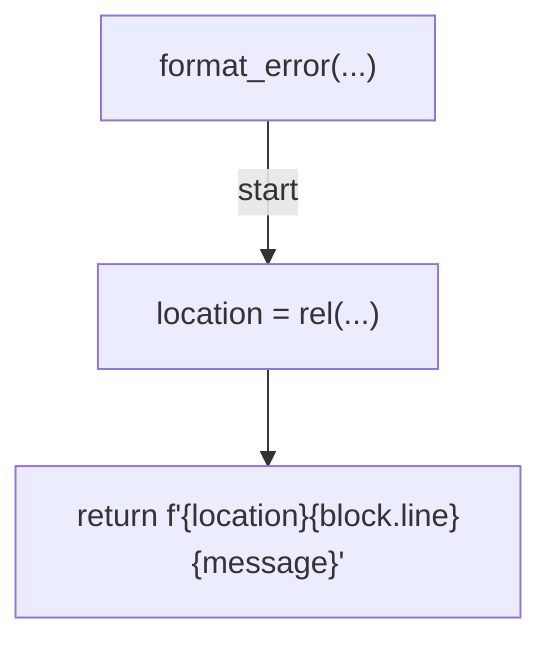

## run_parser(...)

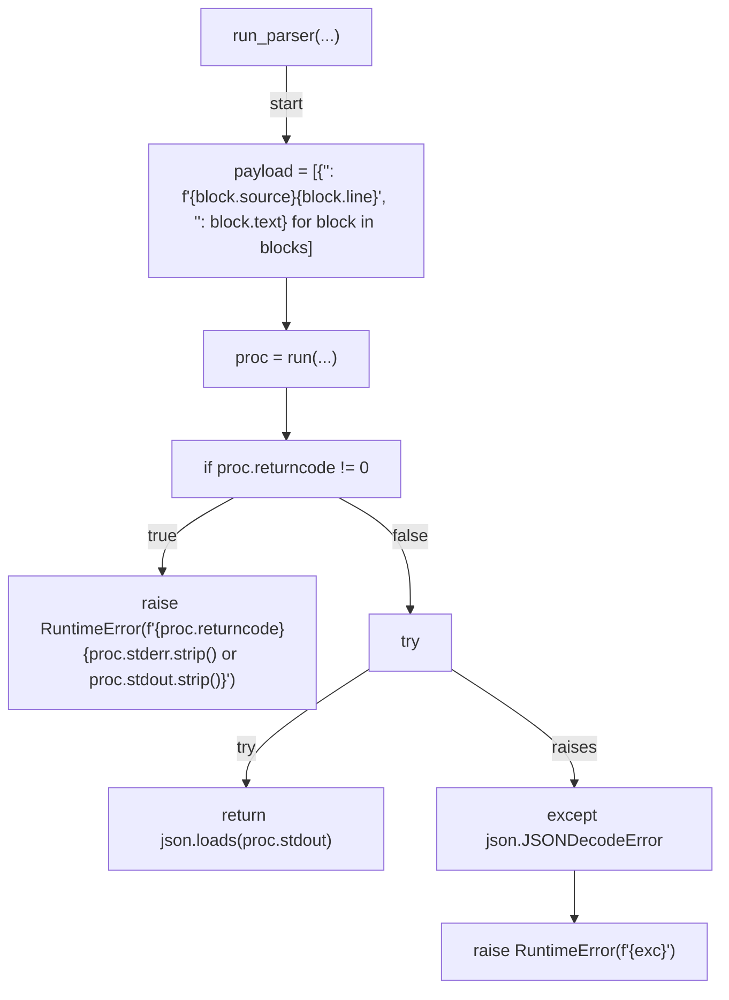

## diagnostics(...)

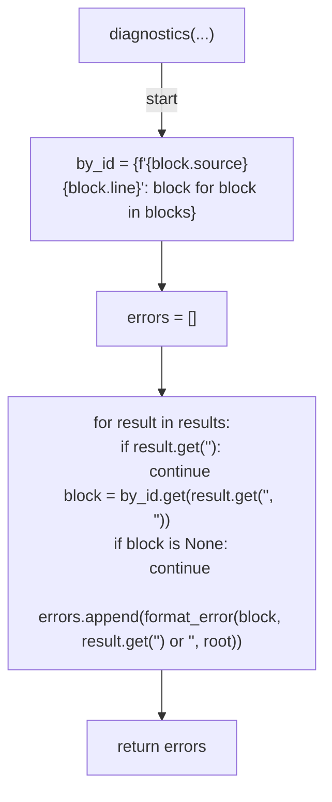

## verify(...)

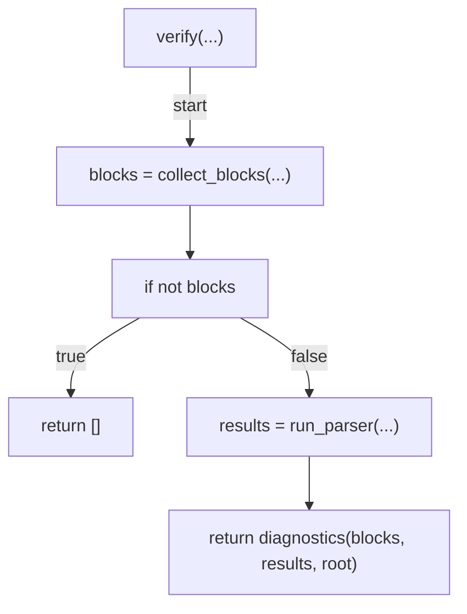

## resolve_bun(...)

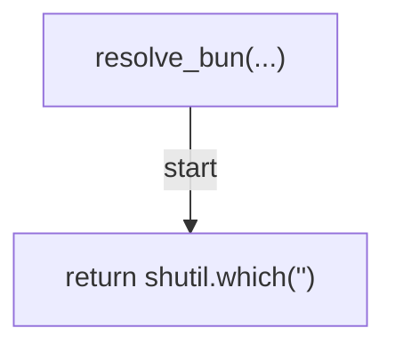

## cmd_verify(...)

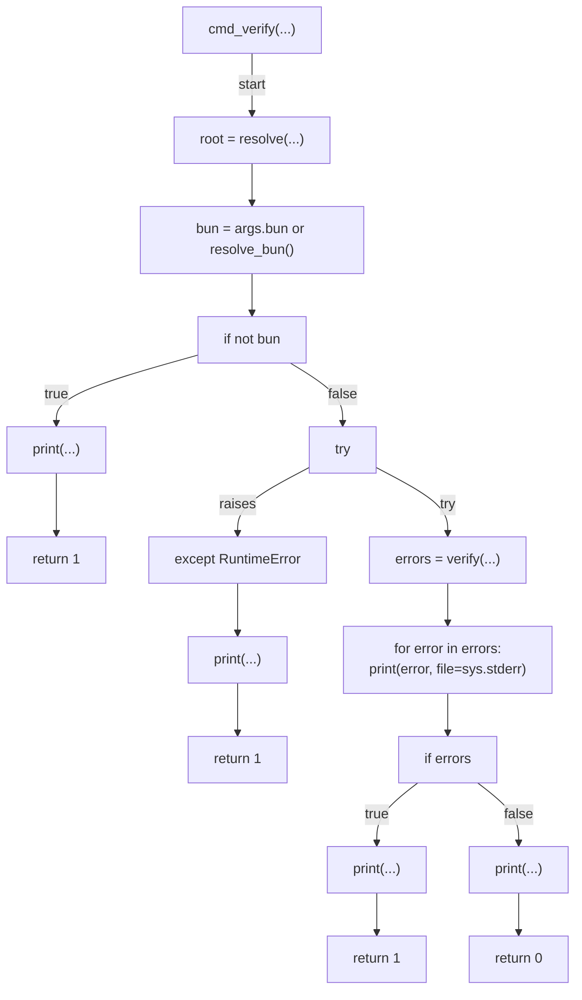

## build_parser(...)

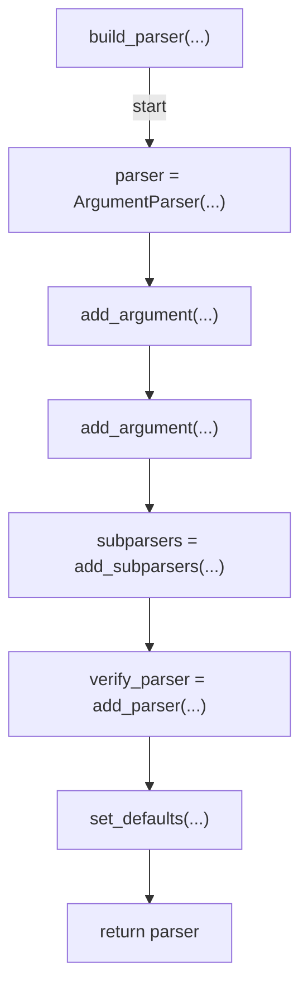

## main(...)

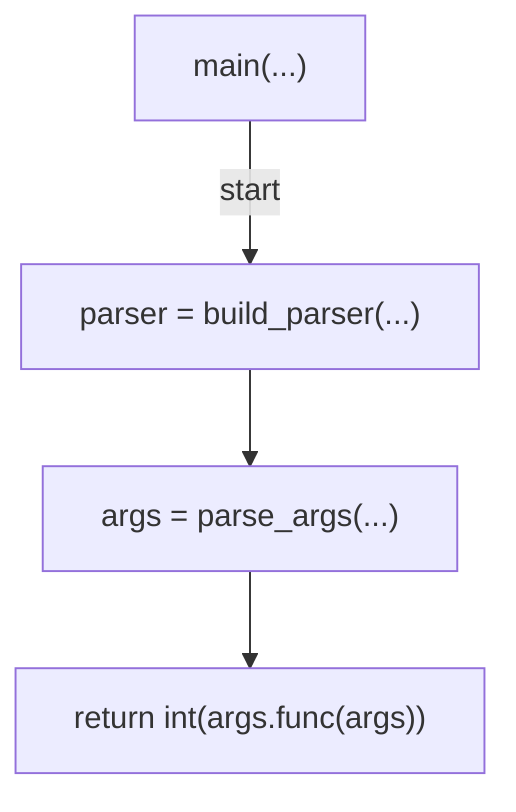
