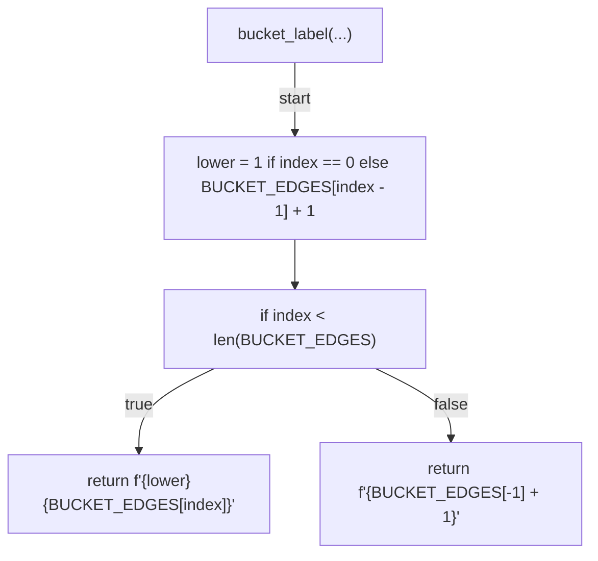
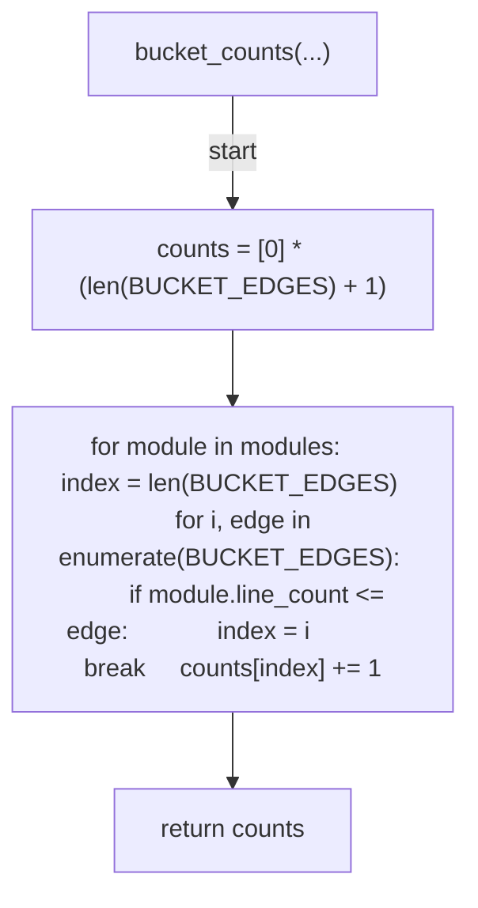
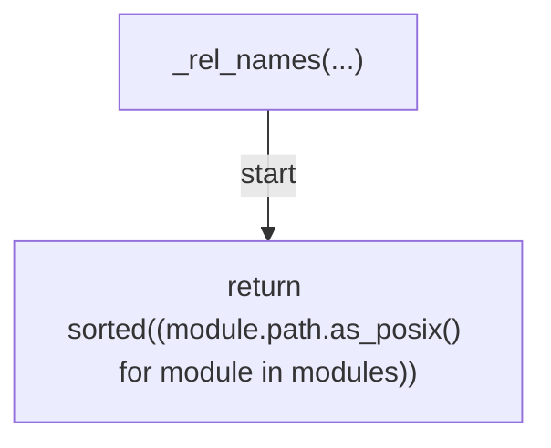
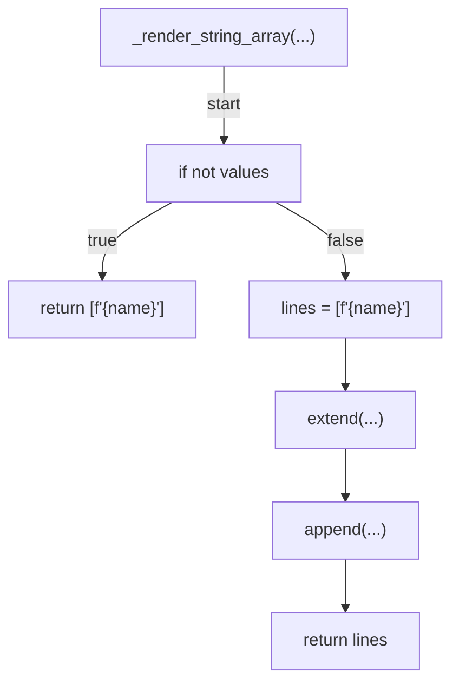
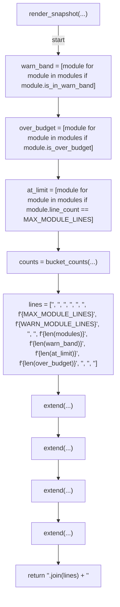
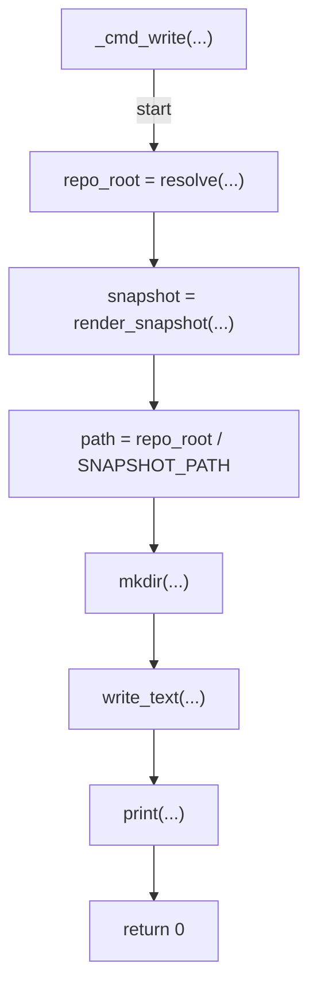
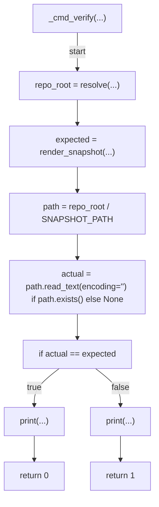
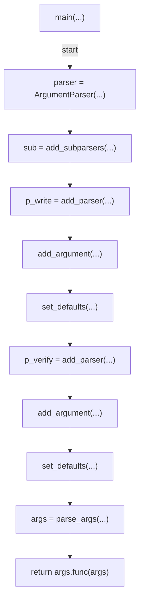

# AST graph: scripts/scan_module_size_distribution.py

This file is generated from `scripts/scan_module_size_distribution.py` by `python3 scripts/script_ast_graph.py all-doc`. Do not edit it by hand: content under `docs/generated/scripts/` is owned by the post-merge automation (refs #1540); update the source script instead.

## bucket_label(...)

## bucket_counts(...)

## _rel_names(...)

## _render_string_array(...)

## render_snapshot(...)

## _cmd_write(...)

## _cmd_verify(...)

## main(...)

