# AST graph: scripts/scan_non_ascii.py

This file is generated from `scripts/scan_non_ascii.py` by `python3 scripts/script_ast_graph.py all-doc`. Do not edit it by hand: content under `docs/generated/scripts/` is owned by the post-merge automation (refs #1540); update the source script instead.

## extract_event(...)

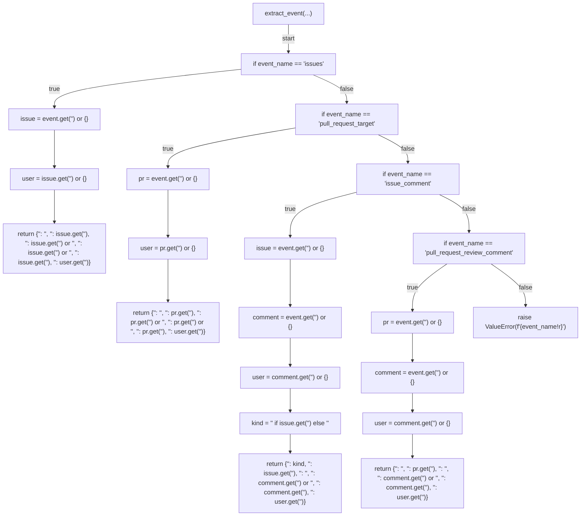

## detect_non_ascii(...)

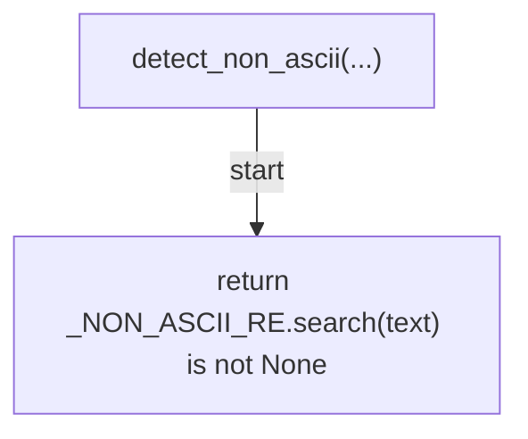

## has_ack_marker(...)

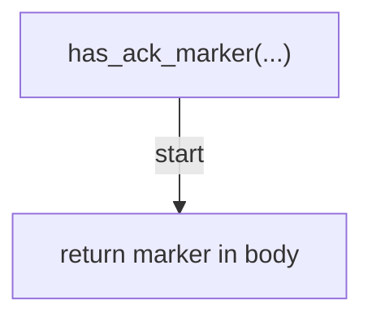

## trust_class(...)

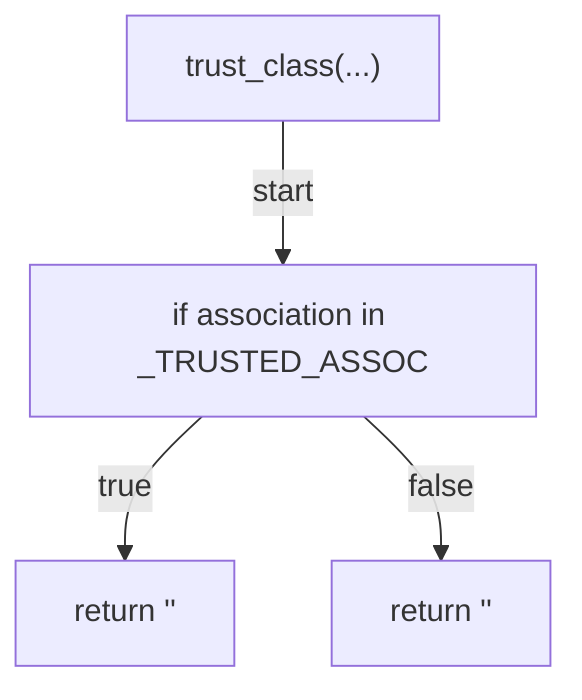

## classify_action(...)

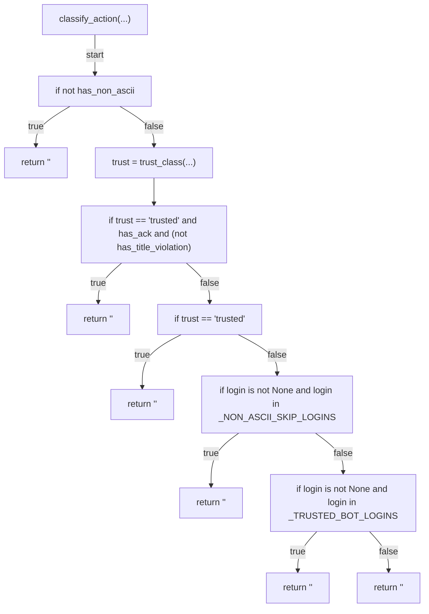

## escape_for_comment(...)

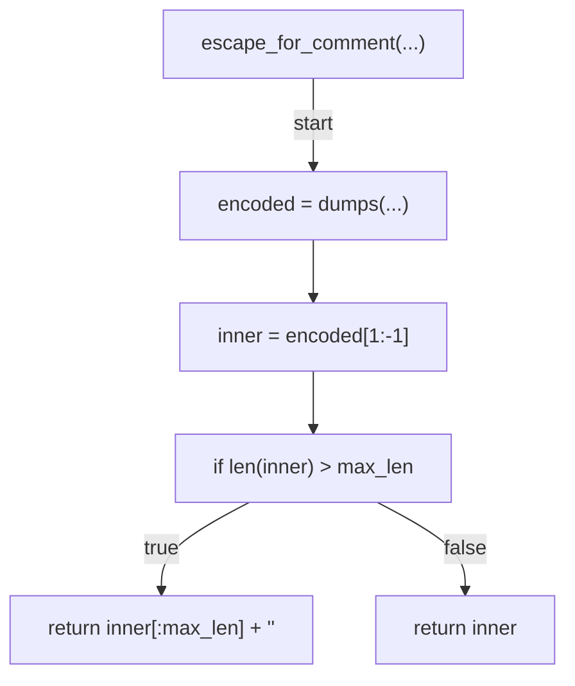

## build_advisory_comment(...)

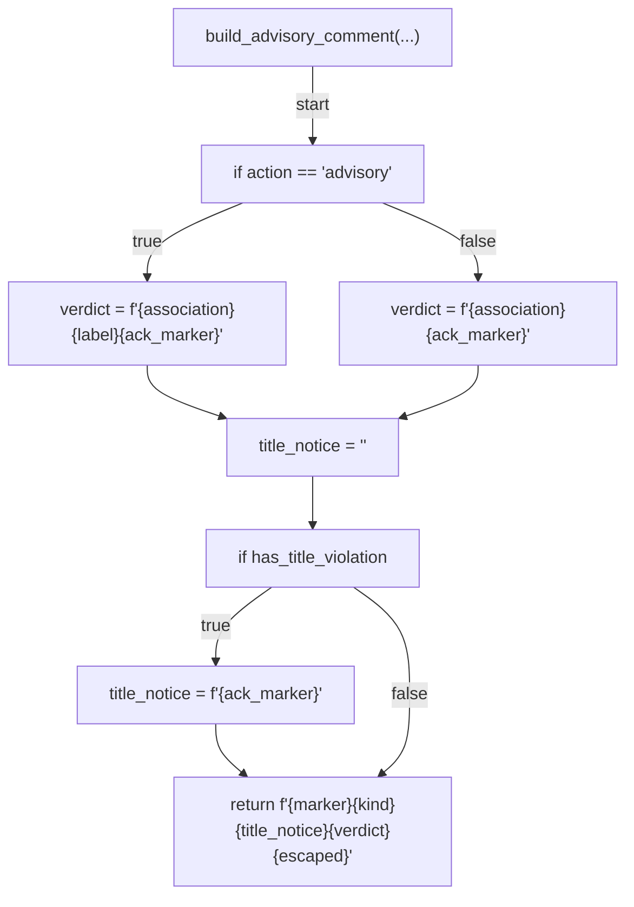

## build_summary(...)

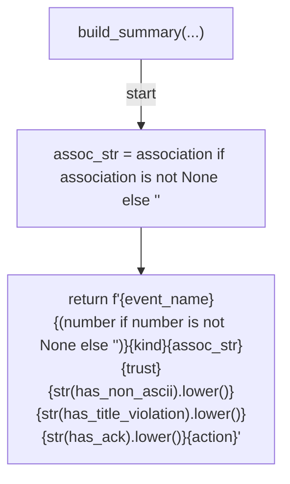

## gh_api(...)

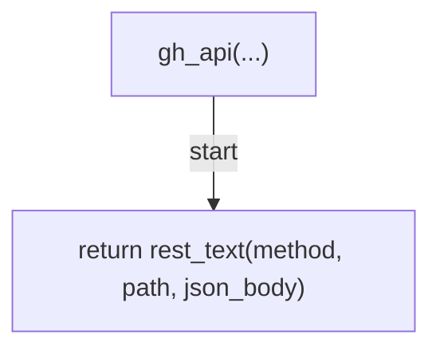

## find_existing_comment_id(...)

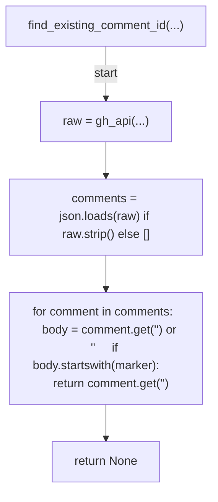

## apply_label(...)

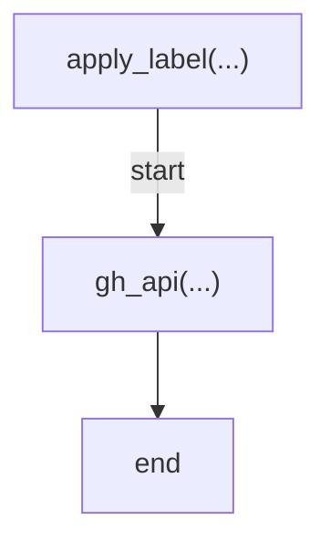

## post_or_update_comment(...)

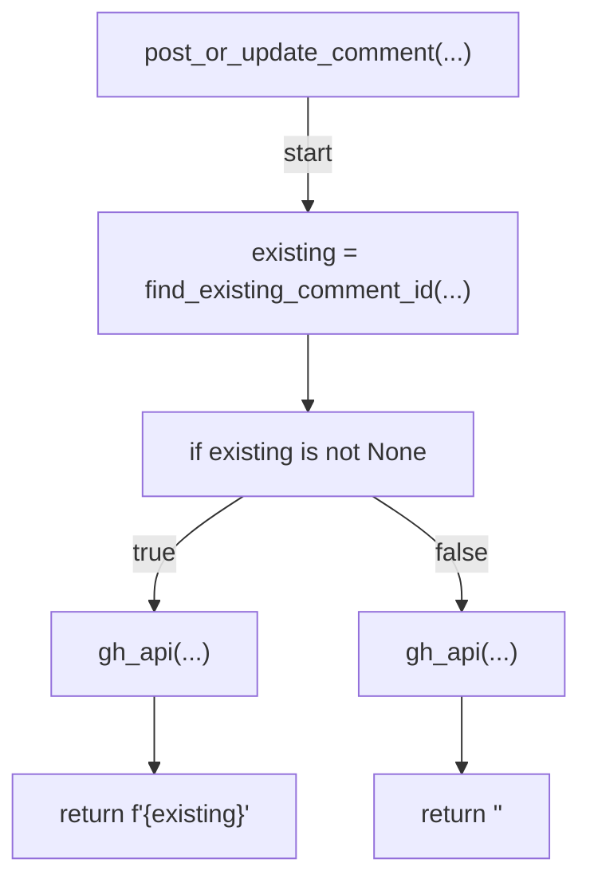

## block_external(...)

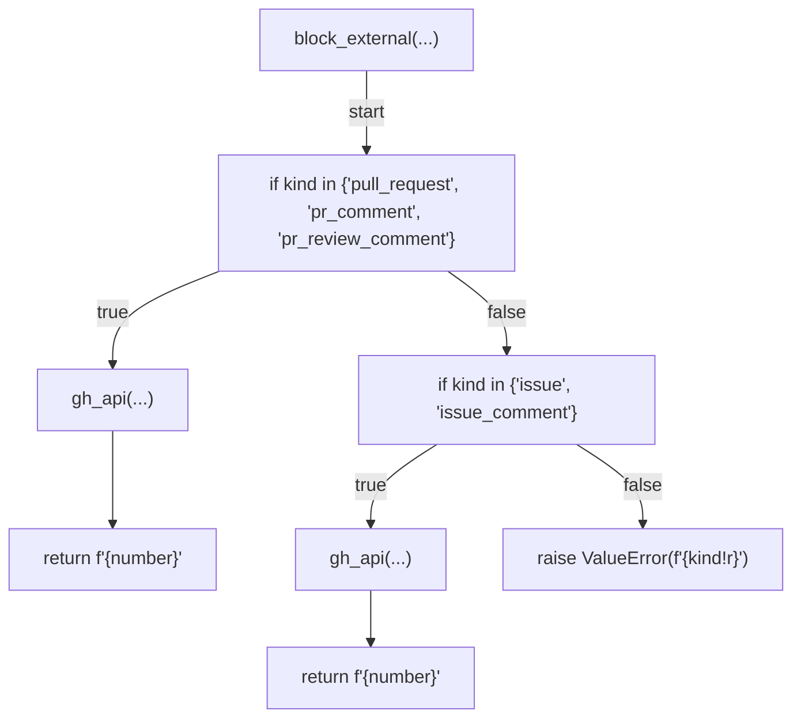

## _append_summary(...)

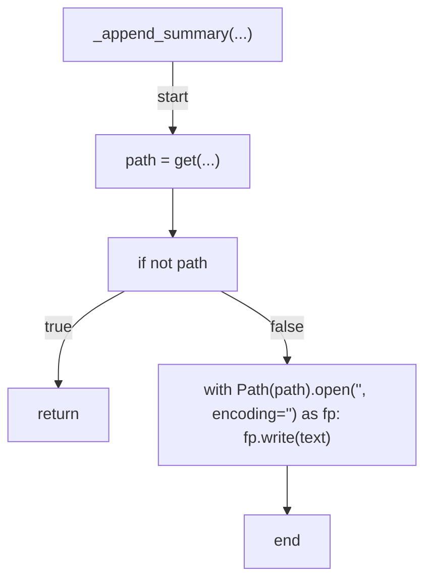

## run(...)

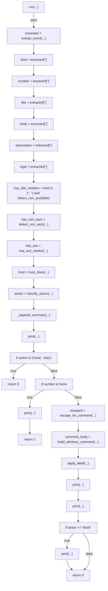

## _cmd_run(...)

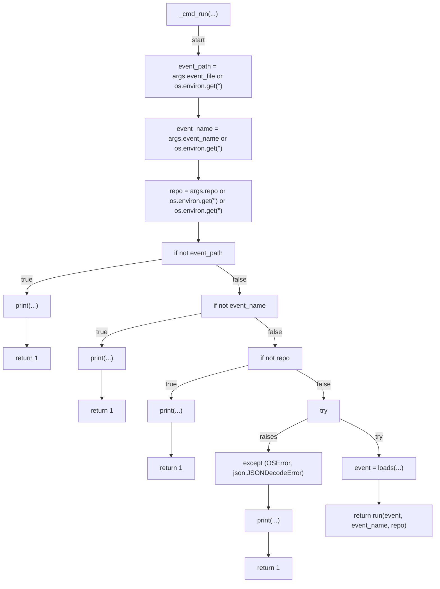

## main(...)

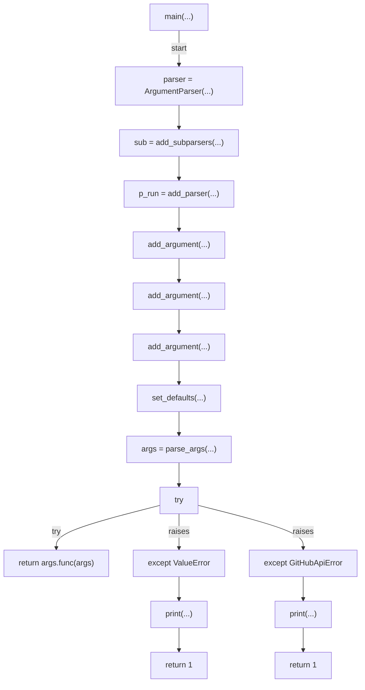
