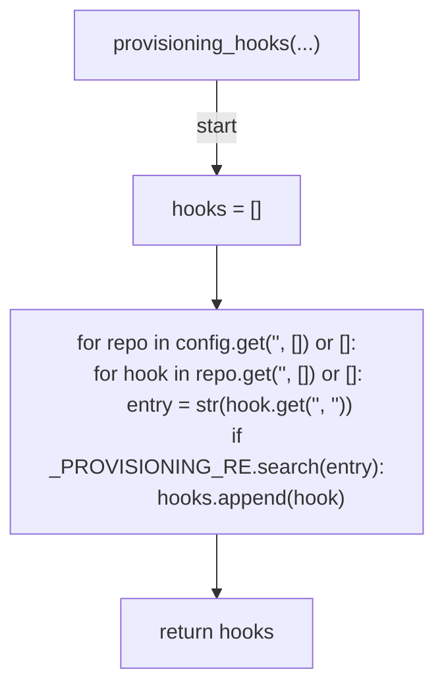
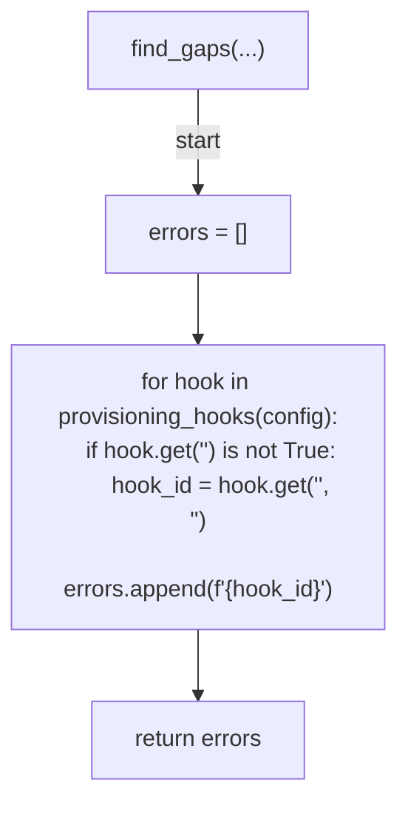
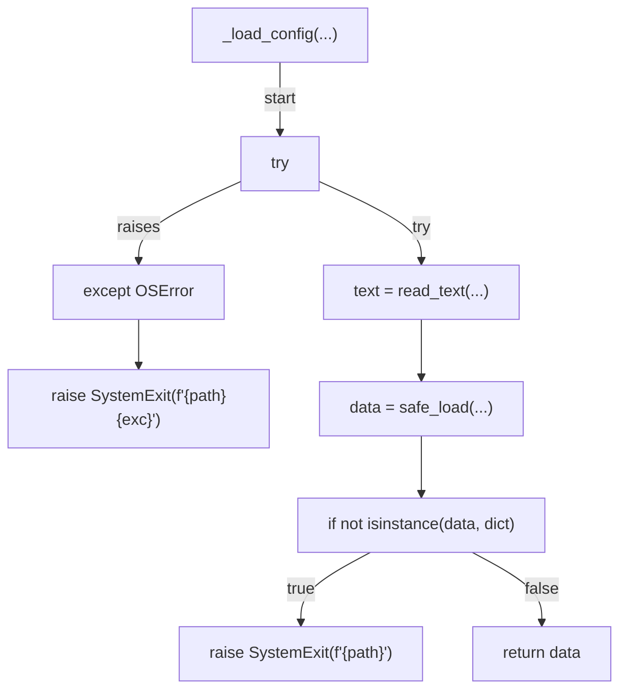
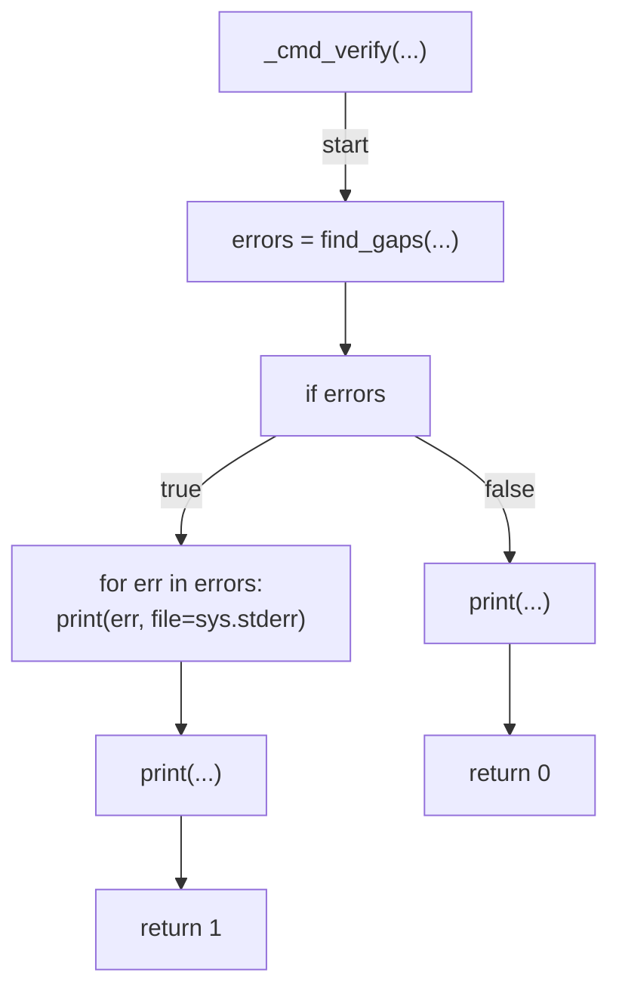
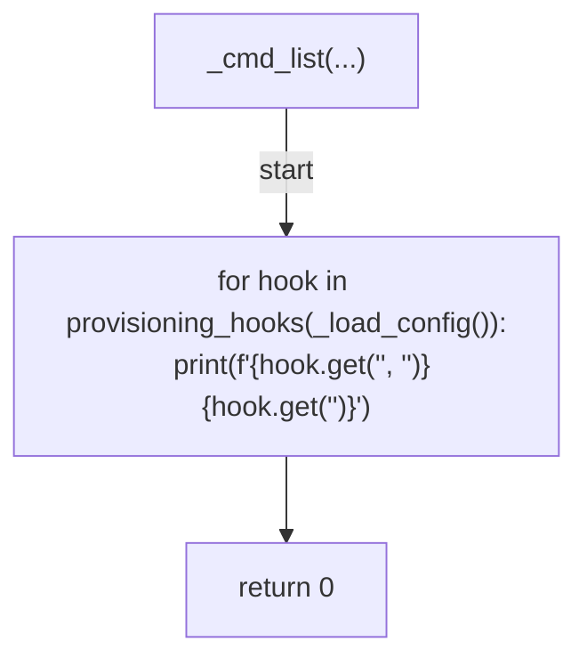
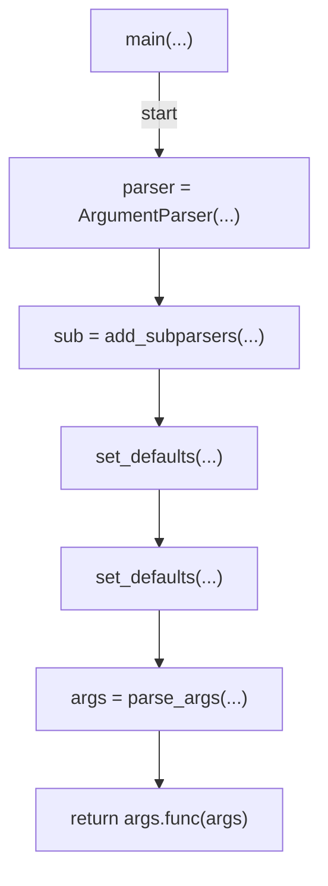

# AST graph: scripts/scan_provisioning_hook_serial.py

This file is generated from `scripts/scan_provisioning_hook_serial.py` by `python3 scripts/script_ast_graph.py all-doc`. Do not edit it by hand: content under `docs/generated/scripts/` is owned by the post-merge automation (refs #1540) -- update the source script instead.

## provisioning_hooks(...)

## find_gaps(...)

## _load_config(...)

## _cmd_verify(...)

## _cmd_list(...)

## main(...)

