# AST graph: scripts/scan_retro_followup_drift.py

This file is generated from `scripts/scan_retro_followup_drift.py` by `python3 scripts/script_ast_graph.py all-doc`. Do not edit it by hand: content under `docs/generated/scripts/` is owned by the post-merge automation (refs #1540); update the source script instead.

## parse_followup_refs(...)

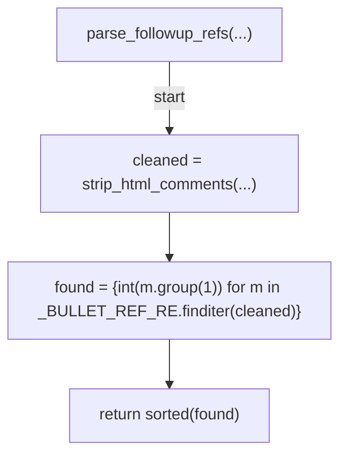
```mermaid
flowchart TD
    N001["parse_followup_refs(...)"]
    N002["cleaned = strip_html_comments(...)"]
    N003["found = {int(m.group(1)) for m in _BULLET_REF_RE.finditer(cleaned)}"]
    N004["return sorted(found)"]
    N001 -->|"start"| N002
    N002 --> N003
    N003 --> N004
```

## _parse_iso(...)

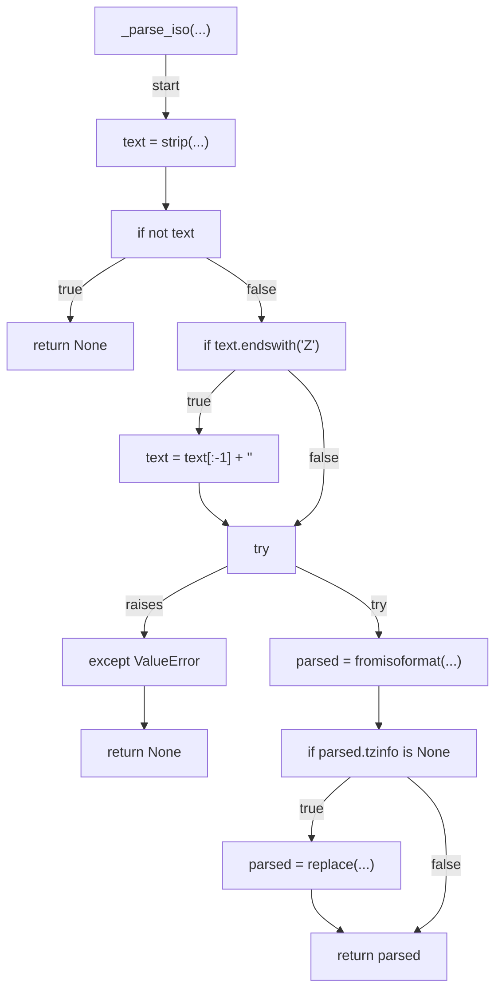
```mermaid
flowchart TD
    N001["_parse_iso(...)"]
    N002["text = strip(...)"]
    N003["if not text"]
    N004["return None"]
    N005["if text.endswith('Z')"]
    N006["text = text[:-1] + '<str>'"]
    N007["try"]
    N008["parsed = fromisoformat(...)"]
    N009["except ValueError"]
    N010["return None"]
    N011["if parsed.tzinfo is None"]
    N012["parsed = replace(...)"]
    N013["return parsed"]
    N001 -->|"start"| N002
    N002 --> N003
    N003 -->|"true"| N004
    N003 -->|"false"| N005
    N005 -->|"true"| N006
    N006 --> N007
    N005 -->|"false"| N007
    N007 -->|"try"| N008
    N007 -->|"raises"| N009
    N009 --> N010
    N008 --> N011
    N011 -->|"true"| N012
    N012 --> N013
    N011 -->|"false"| N013
```

## days_between(...)

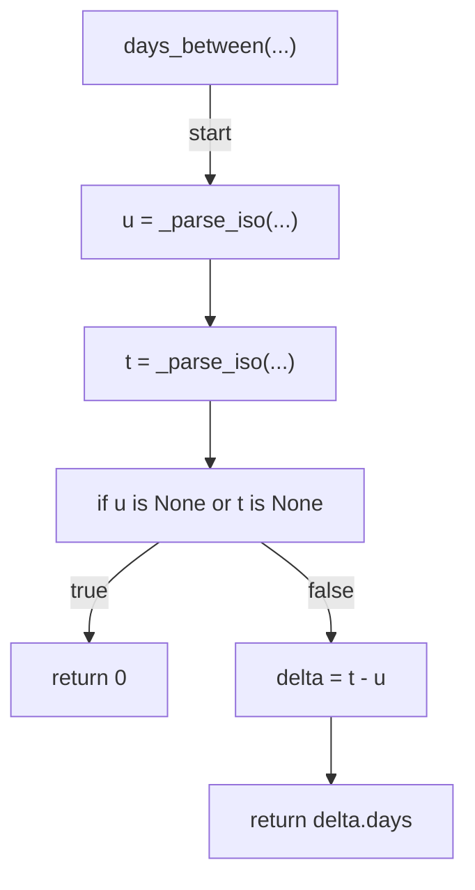
```mermaid
flowchart TD
    N001["days_between(...)"]
    N002["u = _parse_iso(...)"]
    N003["t = _parse_iso(...)"]
    N004["if u is None or t is None"]
    N005["return 0"]
    N006["delta = t - u"]
    N007["return delta.days"]
    N001 -->|"start"| N002
    N002 --> N003
    N003 --> N004
    N004 -->|"true"| N005
    N004 -->|"false"| N006
    N006 --> N007
```

## classify_followup_drift(...)

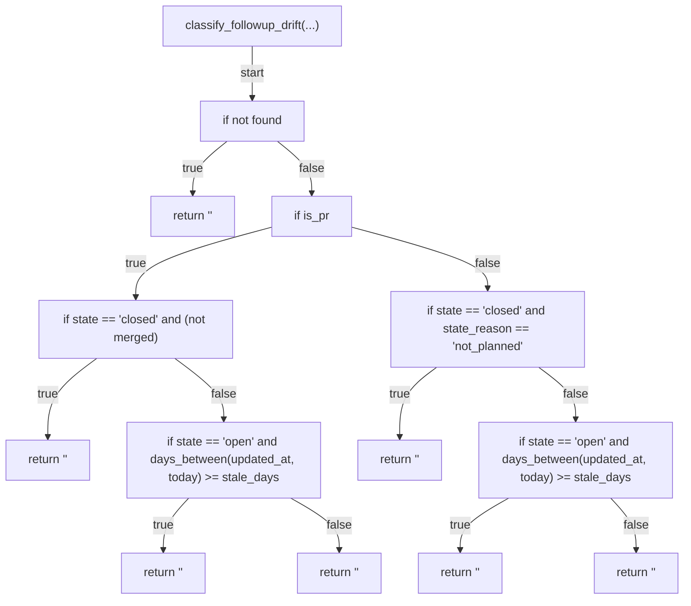
```mermaid
flowchart TD
    N001["classify_followup_drift(...)"]
    N002["if not found"]
    N003["return '<str>'"]
    N004["if is_pr"]
    N005["if state == 'closed' and (not merged)"]
    N006["return '<str>'"]
    N007["if state == 'open' and days_between(updated_at, today) >= stale_days"]
    N008["return '<str>'"]
    N009["return '<str>'"]
    N010["if state == 'closed' and state_reason == 'not_planned'"]
    N011["return '<str>'"]
    N012["if state == 'open' and days_between(updated_at, today) >= stale_days"]
    N013["return '<str>'"]
    N014["return '<str>'"]
    N001 -->|"start"| N002
    N002 -->|"true"| N003
    N002 -->|"false"| N004
    N004 -->|"true"| N005
    N005 -->|"true"| N006
    N005 -->|"false"| N007
    N007 -->|"true"| N008
    N007 -->|"false"| N009
    N004 -->|"false"| N010
    N010 -->|"true"| N011
    N010 -->|"false"| N012
    N012 -->|"true"| N013
    N012 -->|"false"| N014
```

## aggregate_drift(...)

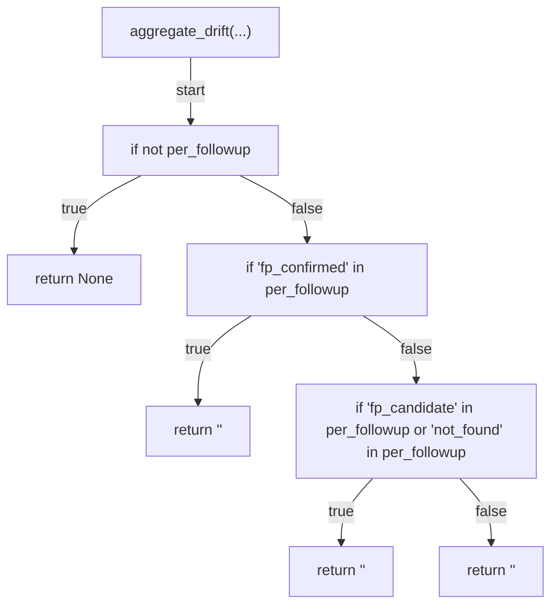
```mermaid
flowchart TD
    N001["aggregate_drift(...)"]
    N002["if not per_followup"]
    N003["return None"]
    N004["if 'fp_confirmed' in per_followup"]
    N005["return '<str>'"]
    N006["if 'fp_candidate' in per_followup or 'not_found' in per_followup"]
    N007["return '<str>'"]
    N008["return '<str>'"]
    N001 -->|"start"| N002
    N002 -->|"true"| N003
    N002 -->|"false"| N004
    N004 -->|"true"| N005
    N004 -->|"false"| N006
    N006 -->|"true"| N007
    N006 -->|"false"| N008
```

## decide_target_label(...)

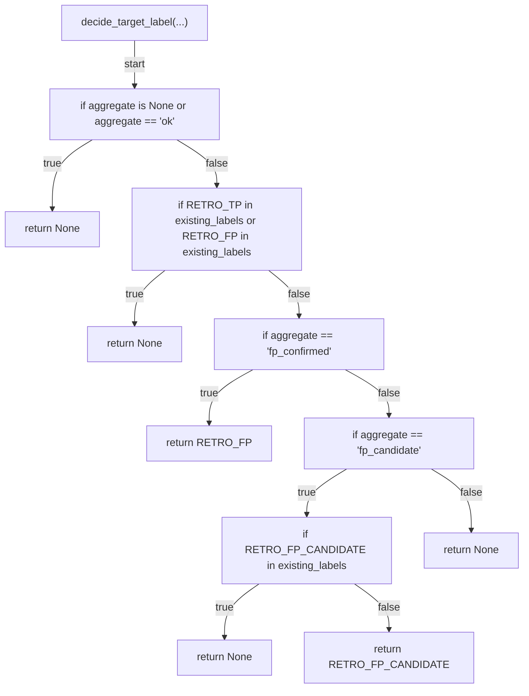
```mermaid
flowchart TD
    N001["decide_target_label(...)"]
    N002["if aggregate is None or aggregate == 'ok'"]
    N003["return None"]
    N004["if RETRO_TP in existing_labels or RETRO_FP in existing_labels"]
    N005["return None"]
    N006["if aggregate == 'fp_confirmed'"]
    N007["return RETRO_FP"]
    N008["if aggregate == 'fp_candidate'"]
    N009["if RETRO_FP_CANDIDATE in existing_labels"]
    N010["return None"]
    N011["return RETRO_FP_CANDIDATE"]
    N012["return None"]
    N001 -->|"start"| N002
    N002 -->|"true"| N003
    N002 -->|"false"| N004
    N004 -->|"true"| N005
    N004 -->|"false"| N006
    N006 -->|"true"| N007
    N006 -->|"false"| N008
    N008 -->|"true"| N009
    N009 -->|"true"| N010
    N009 -->|"false"| N011
    N008 -->|"false"| N012
```

## is_pr_payload(...)

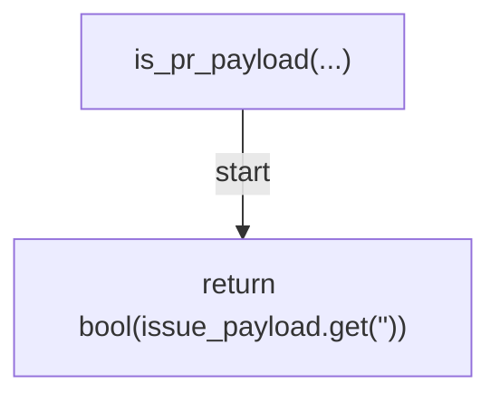
```mermaid
flowchart TD
    N001["is_pr_payload(...)"]
    N002["return bool(issue_payload.get('<str>'))"]
    N001 -->|"start"| N002
```

## build_summary(...)

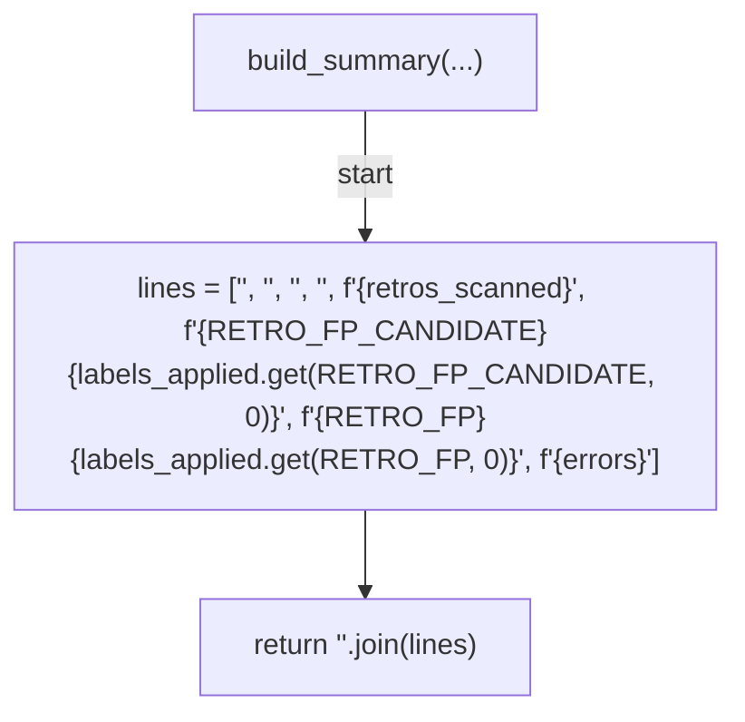
```mermaid
flowchart TD
    N001["build_summary(...)"]
    N002["lines = ['<str>', '<str>', '<str>', '<str>', f'<str>{retros_scanned}<str>', f'<str>{RETRO_FP_CANDIDATE}<str>{labels_applied.get(RETRO_FP_CANDIDATE, 0)}<str>', f'<str>{RETRO_FP}<str>{labels_applied.get(RETRO_FP, 0)}<str>', f'<str>{errors}<str>']"]
    N003["return '<str>'.join(lines)"]
    N001 -->|"start"| N002
    N002 --> N003
```

## gh_api(...)

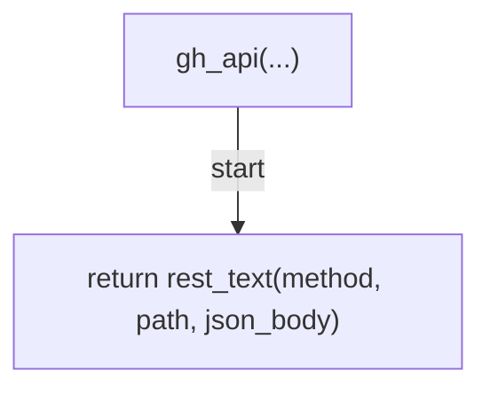
```mermaid
flowchart TD
    N001["gh_api(...)"]
    N002["return rest_text(method, path, json_body)"]
    N001 -->|"start"| N002
```

## is_404_error(...)

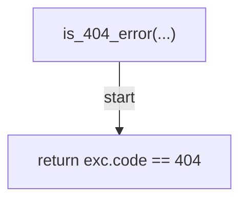
```mermaid
flowchart TD
    N001["is_404_error(...)"]
    N002["return exc.code == 404"]
    N001 -->|"start"| N002
```

## search_retro_issues(...)

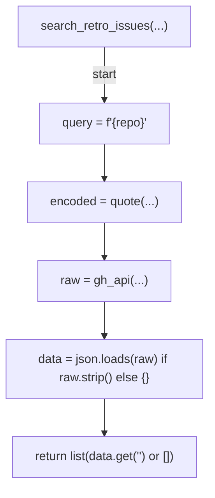
```mermaid
flowchart TD
    N001["search_retro_issues(...)"]
    N002["query = f'<str>{repo}<str>'"]
    N003["encoded = quote(...)"]
    N004["raw = gh_api(...)"]
    N005["data = json.loads(raw) if raw.strip() else {}"]
    N006["return list(data.get('<str>') or [])"]
    N001 -->|"start"| N002
    N002 --> N003
    N003 --> N004
    N004 --> N005
    N005 --> N006
```

## fetch_issue_or_pr(...)

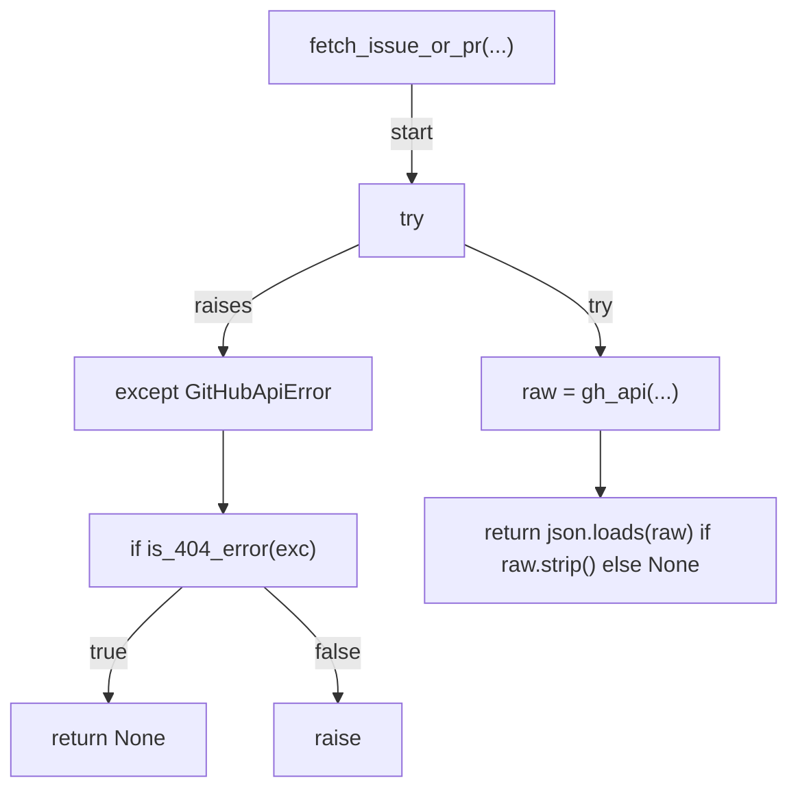
```mermaid
flowchart TD
    N001["fetch_issue_or_pr(...)"]
    N002["try"]
    N003["raw = gh_api(...)"]
    N004["except GitHubApiError"]
    N005["if is_404_error(exc)"]
    N006["return None"]
    N007["raise"]
    N008["return json.loads(raw) if raw.strip() else None"]
    N001 -->|"start"| N002
    N002 -->|"try"| N003
    N002 -->|"raises"| N004
    N004 --> N005
    N005 -->|"true"| N006
    N005 -->|"false"| N007
    N003 --> N008
```

## fetch_pr_merged(...)

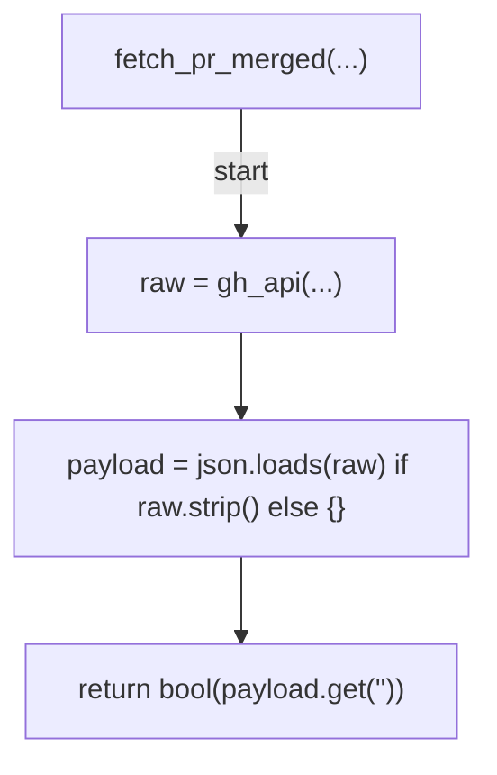
```mermaid
flowchart TD
    N001["fetch_pr_merged(...)"]
    N002["raw = gh_api(...)"]
    N003["payload = json.loads(raw) if raw.strip() else {}"]
    N004["return bool(payload.get('<str>'))"]
    N001 -->|"start"| N002
    N002 --> N003
    N003 --> N004
```

## apply_label(...)

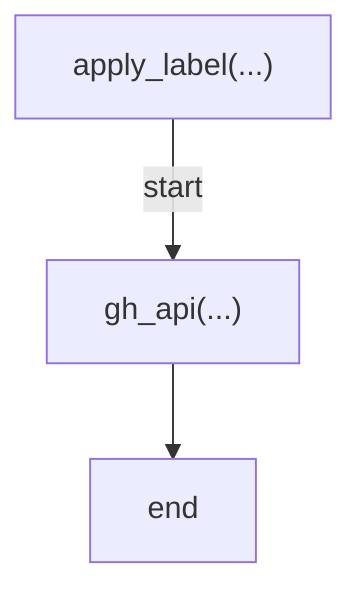
```mermaid
flowchart TD
    N001["apply_label(...)"]
    N002["gh_api(...)"]
    N003["end"]
    N001 -->|"start"| N002
    N002 --> N003
```

## _append_summary(...)

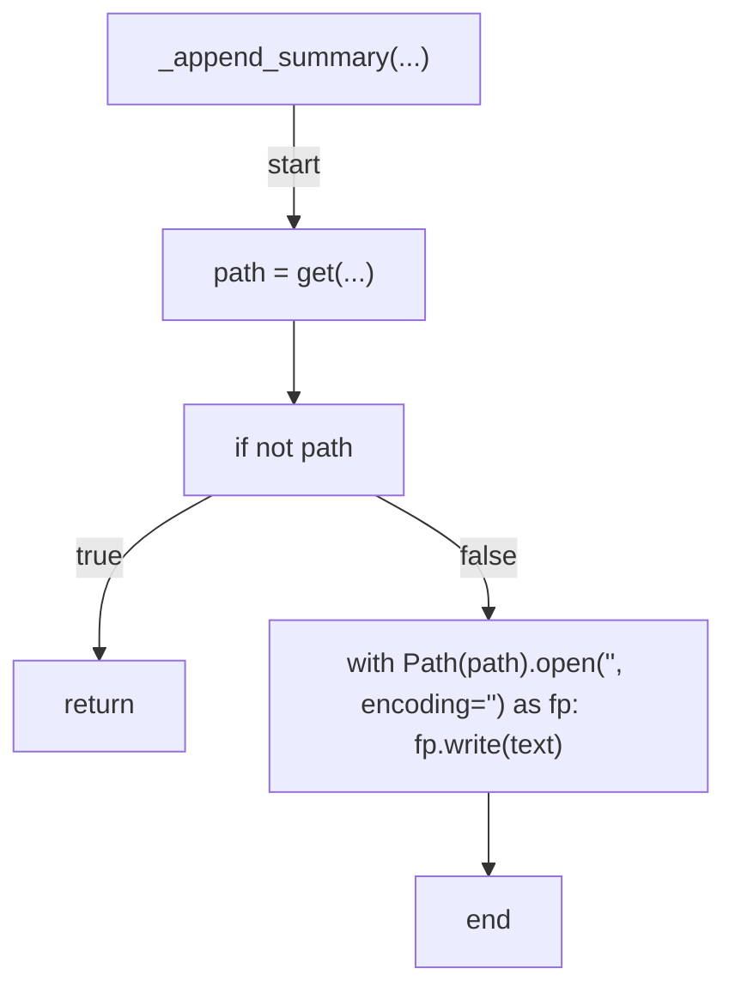
```mermaid
flowchart TD
    N001["_append_summary(...)"]
    N002["path = get(...)"]
    N003["if not path"]
    N004["return"]
    N005["with Path(path).open('<str>', encoding='<str>') as fp:     fp.write(text)"]
    N006["end"]
    N001 -->|"start"| N002
    N002 --> N003
    N003 -->|"true"| N004
    N003 -->|"false"| N005
    N005 --> N006
```

## _resolve_one_followup(...)

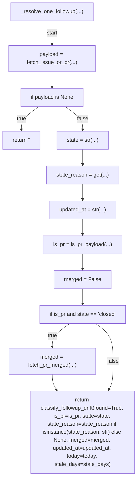
```mermaid
flowchart TD
    N001["_resolve_one_followup(...)"]
    N002["payload = fetch_issue_or_pr(...)"]
    N003["if payload is None"]
    N004["return '<str>'"]
    N005["state = str(...)"]
    N006["state_reason = get(...)"]
    N007["updated_at = str(...)"]
    N008["is_pr = is_pr_payload(...)"]
    N009["merged = False"]
    N010["if is_pr and state == 'closed'"]
    N011["merged = fetch_pr_merged(...)"]
    N012["return classify_followup_drift(found=True, is_pr=is_pr, state=state, state_reason=state_reason if isinstance(state_reason, str) else None, merged=merged, updated_at=updated_at, today=today, stale_days=stale_days)"]
    N001 -->|"start"| N002
    N002 --> N003
    N003 -->|"true"| N004
    N003 -->|"false"| N005
    N005 --> N006
    N006 --> N007
    N007 --> N008
    N008 --> N009
    N009 --> N010
    N010 -->|"true"| N011
    N011 --> N012
    N010 -->|"false"| N012
```

## _retro_existing_labels(...)

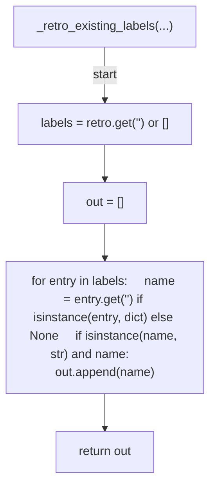
```mermaid
flowchart TD
    N001["_retro_existing_labels(...)"]
    N002["labels = retro.get('<str>') or []"]
    N003["out = []"]
    N004["for entry in labels:     name = entry.get('<str>') if isinstance(entry, dict) else None     if isinstance(name, str) and name:         out.append(name)"]
    N005["return out"]
    N001 -->|"start"| N002
    N002 --> N003
    N003 --> N004
    N004 --> N005
```

## run(...)

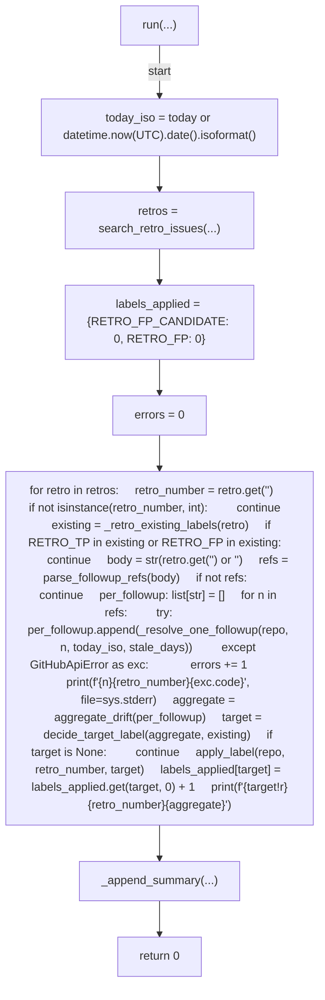
```mermaid
flowchart TD
    N001["run(...)"]
    N002["today_iso = today or datetime.now(UTC).date().isoformat()"]
    N003["retros = search_retro_issues(...)"]
    N004["labels_applied = {RETRO_FP_CANDIDATE: 0, RETRO_FP: 0}"]
    N005["errors = 0"]
    N006["for retro in retros:     retro_number = retro.get('<str>')     if not isinstance(retro_number, int):         continue     existing = _retro_existing_labels(retro)     if RETRO_TP in existing or RETRO_FP in existing:         continue     body = str(retro.get('<str>') or '<str>')     refs = parse_followup_refs(body)     if not refs:         continue     per_followup: list[str] = []     for n in refs:         try:             per_followup.append(_resolve_one_followup(repo, n, today_iso, stale_days))         except GitHubApiError as exc:             errors += 1             print(f'<str>{n}<str>{retro_number}<str>{exc.code}<str>', file=sys.stderr)     aggregate = aggregate_drift(per_followup)     target = decide_target_label(aggregate, existing)     if target is None:         continue     apply_label(repo, retro_number, target)     labels_applied[target] = labels_applied.get(target, 0) + 1     print(f'<str>{target!r}<str>{retro_number}<str>{aggregate}<str>')"]
    N007["_append_summary(...)"]
    N008["return 0"]
    N001 -->|"start"| N002
    N002 --> N003
    N003 --> N004
    N004 --> N005
    N005 --> N006
    N006 --> N007
    N007 --> N008
```

## _cmd_run(...)

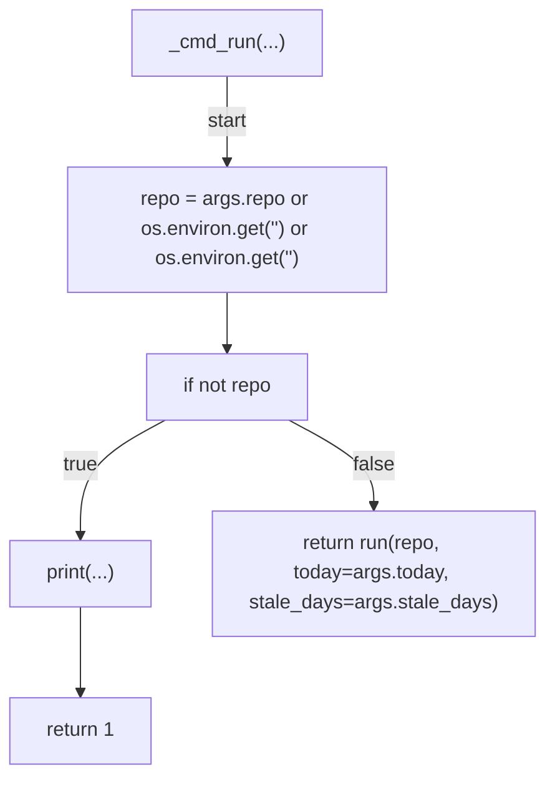
```mermaid
flowchart TD
    N001["_cmd_run(...)"]
    N002["repo = args.repo or os.environ.get('<str>') or os.environ.get('<str>')"]
    N003["if not repo"]
    N004["print(...)"]
    N005["return 1"]
    N006["return run(repo, today=args.today, stale_days=args.stale_days)"]
    N001 -->|"start"| N002
    N002 --> N003
    N003 -->|"true"| N004
    N004 --> N005
    N003 -->|"false"| N006
```

## main(...)

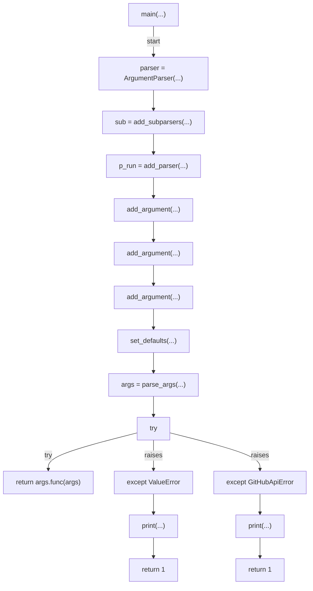
```mermaid
flowchart TD
    N001["main(...)"]
    N002["parser = ArgumentParser(...)"]
    N003["sub = add_subparsers(...)"]
    N004["p_run = add_parser(...)"]
    N005["add_argument(...)"]
    N006["add_argument(...)"]
    N007["add_argument(...)"]
    N008["set_defaults(...)"]
    N009["args = parse_args(...)"]
    N010["try"]
    N011["return args.func(args)"]
    N012["except ValueError"]
    N013["print(...)"]
    N014["return 1"]
    N015["except GitHubApiError"]
    N016["print(...)"]
    N017["return 1"]
    N001 -->|"start"| N002
    N002 --> N003
    N003 --> N004
    N004 --> N005
    N005 --> N006
    N006 --> N007
    N007 --> N008
    N008 --> N009
    N009 --> N010
    N010 -->|"try"| N011
    N010 -->|"raises"| N012
    N012 --> N013
    N013 --> N014
    N010 -->|"raises"| N015
    N015 --> N016
    N016 --> N017
```
