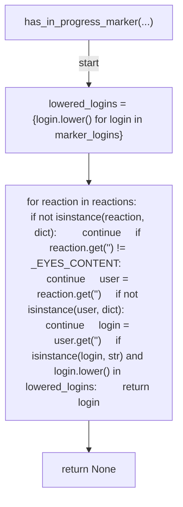
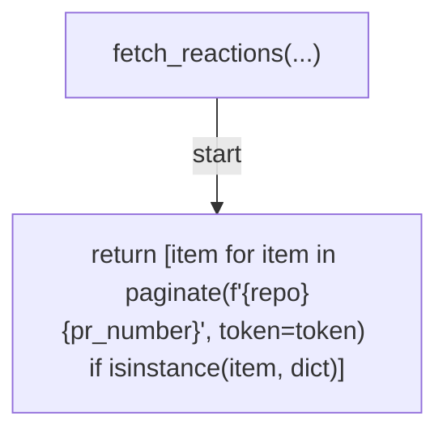
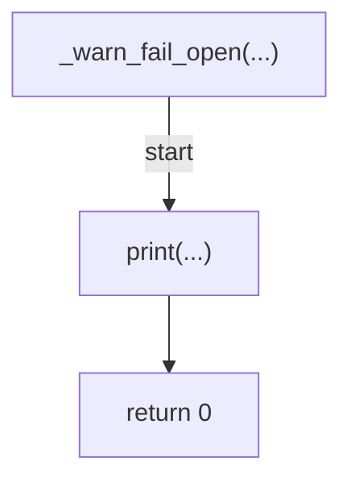
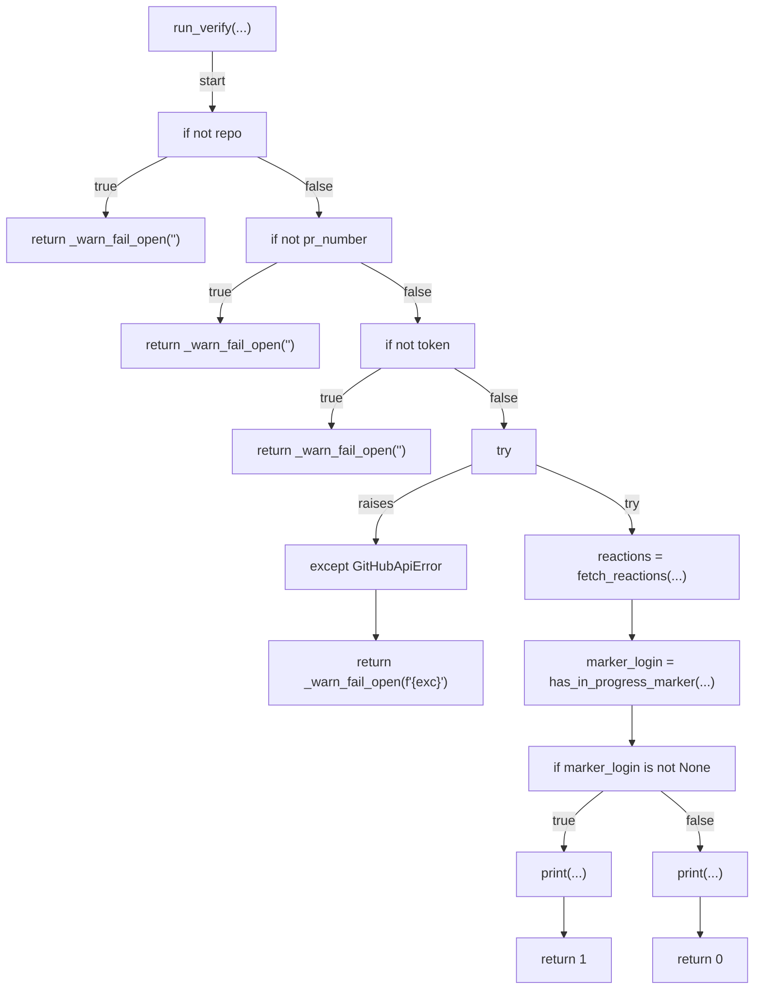
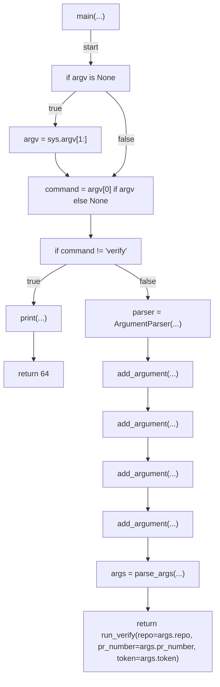

# AST graph: scripts/scan_review_in_progress_marker.py

This file is generated from `scripts/scan_review_in_progress_marker.py` by `python3 scripts/script_ast_graph.py all-doc`. Do not edit it by hand: content under `docs/generated/scripts/` is owned by the post-merge automation (refs #1540); update the source script instead.

## has_in_progress_marker(...)

## fetch_reactions(...)

## _warn_fail_open(...)

## run_verify(...)

## main(...)

