# AST graph: scripts/scan_routing_table_drift.py

This file is generated from `scripts/scan_routing_table_drift.py` by `python3 scripts/script_ast_graph.py all-doc`. Do not edit it by hand: content under `docs/generated/scripts/` is owned by the post-merge automation (refs #1540); update the source script instead.

## extract_table_lines(...)

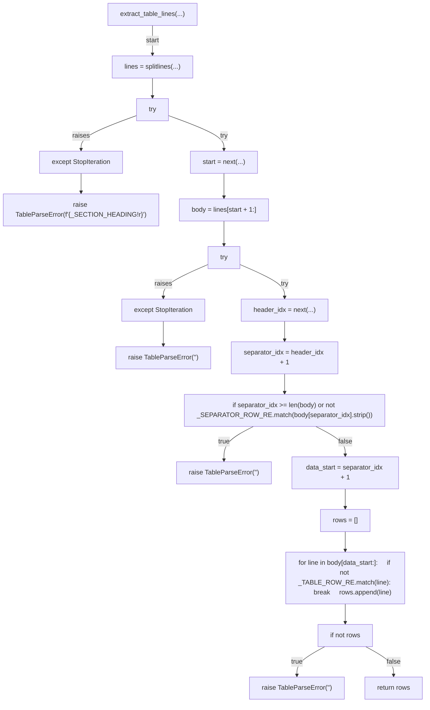

## split_row(...)

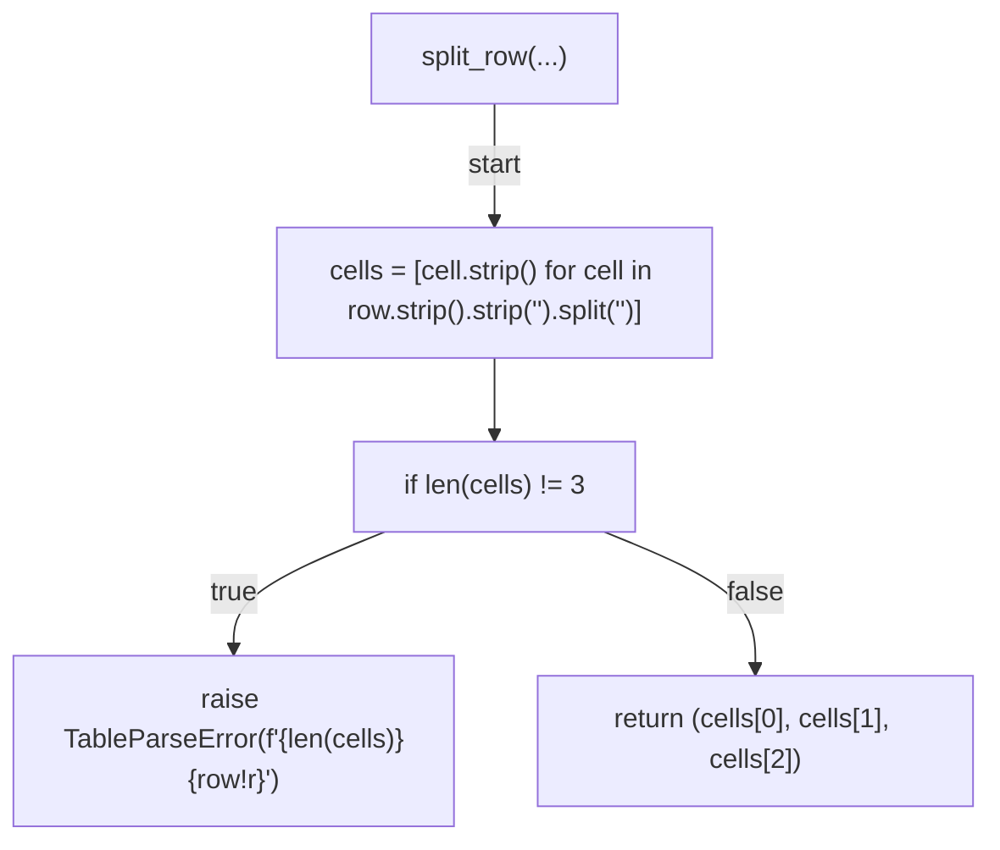

## _require_combinator_join(...)

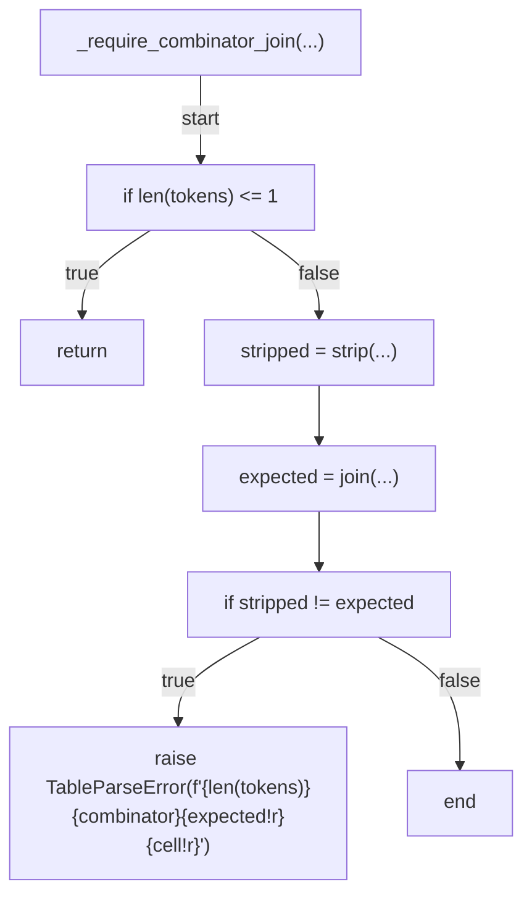

## parse_condition(...)

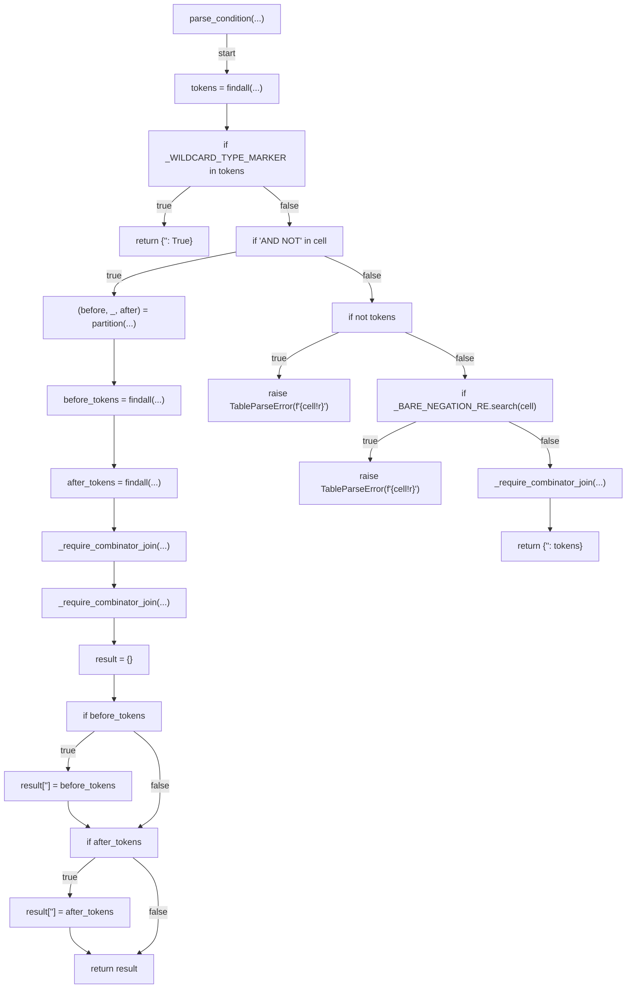

## parse_action(...)

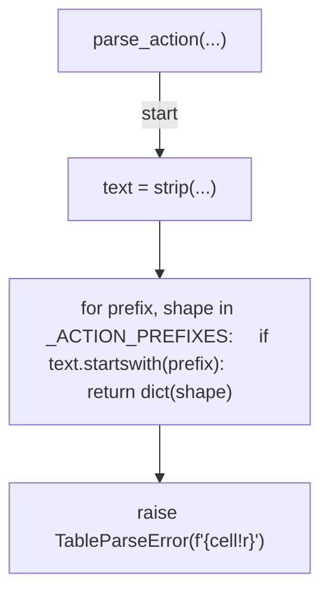

## parse_body_read(...)

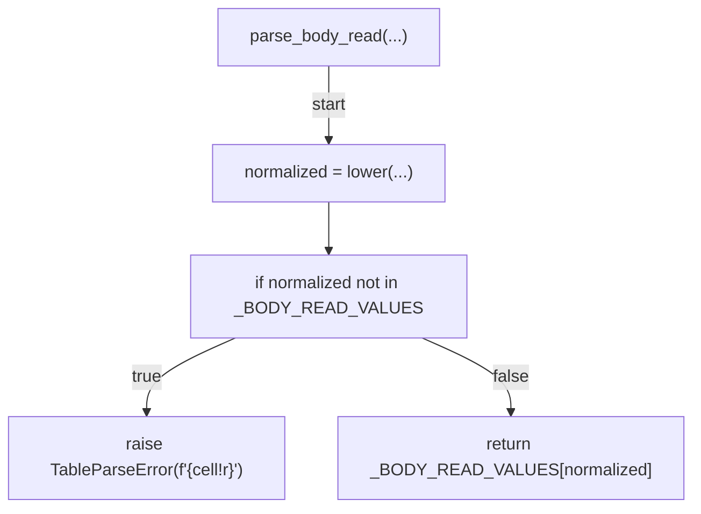

## parse_runbook_rules(...)

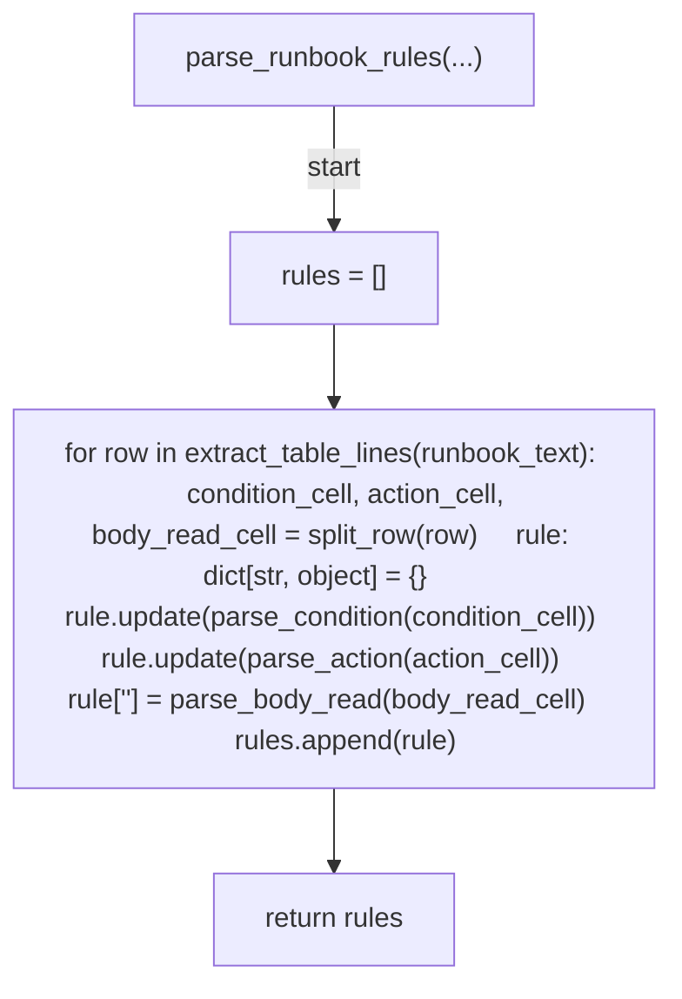

## normalize_registry_rules(...)

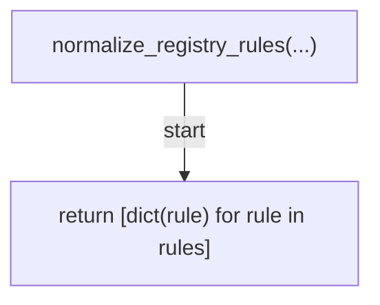

## diff_rules(...)

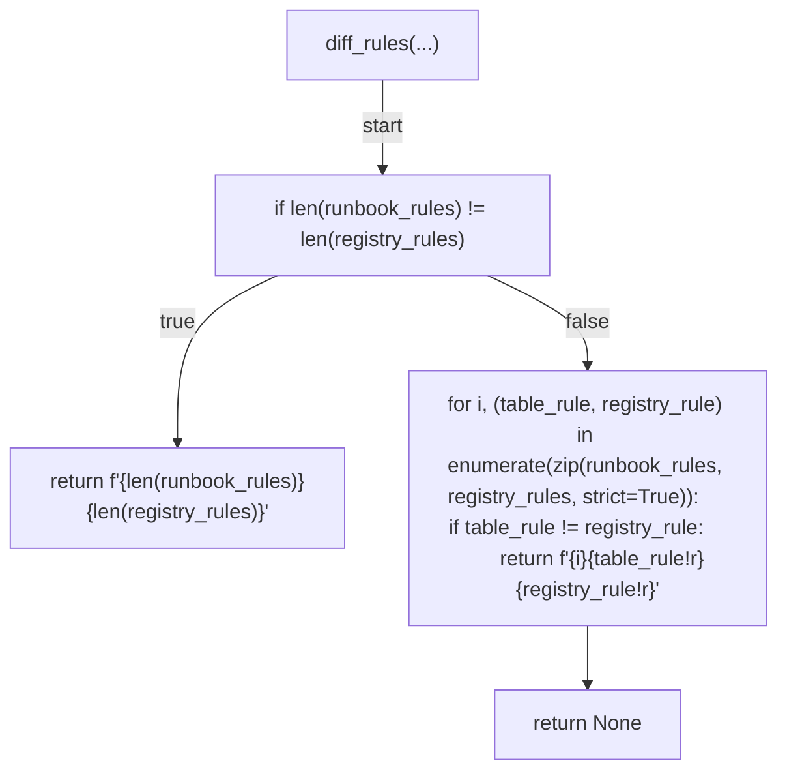

## _display_path(...)

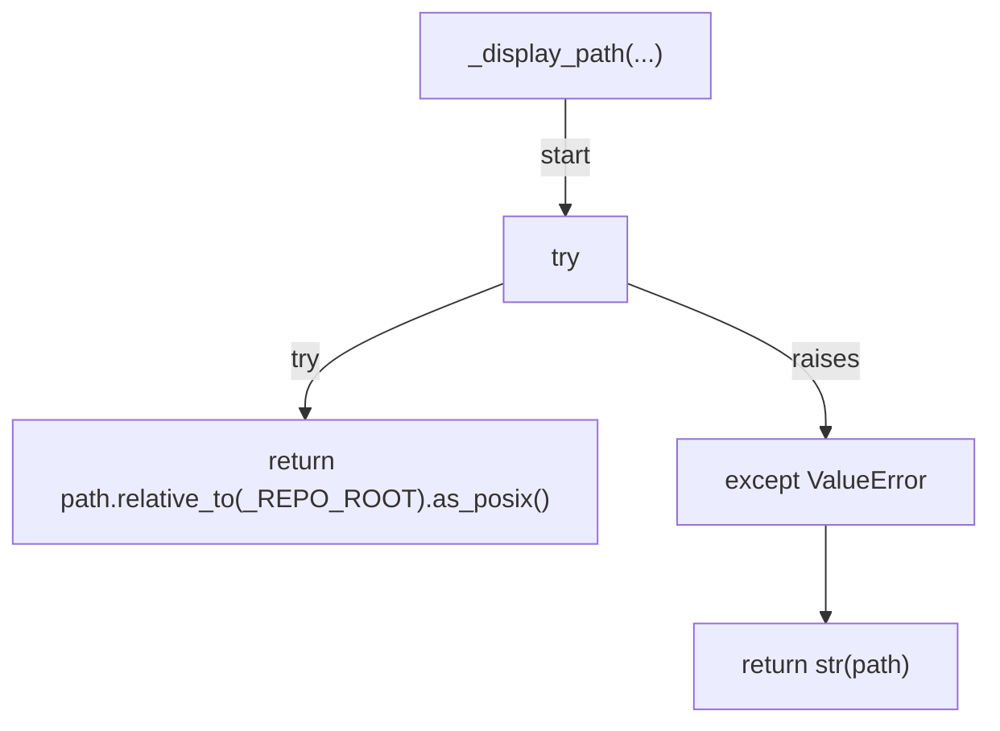

## verify(...)

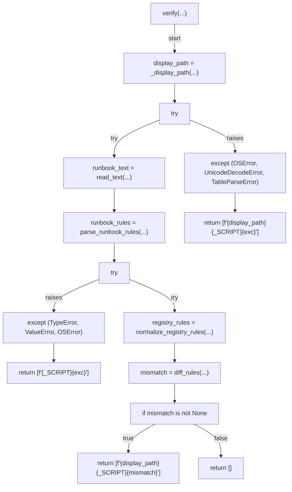

## main(...)

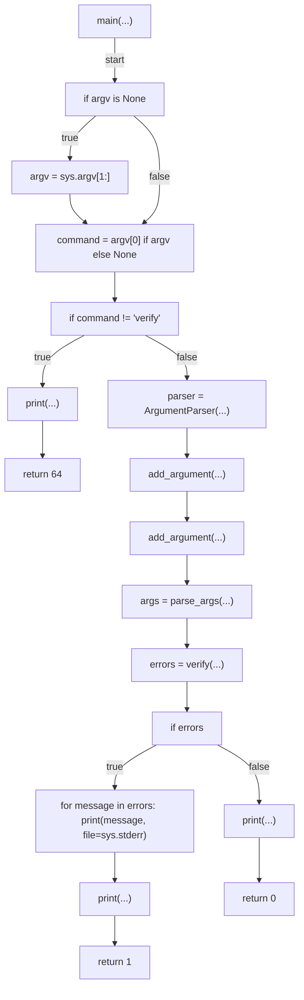
