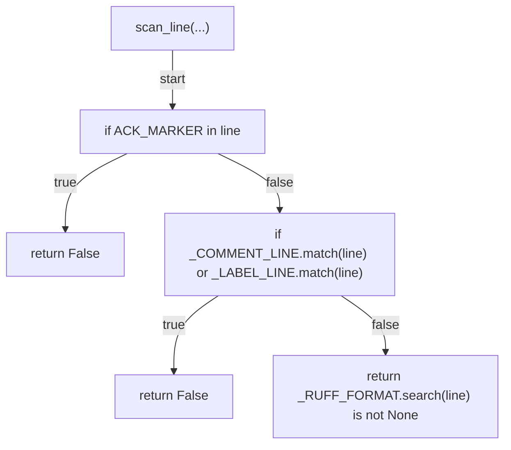
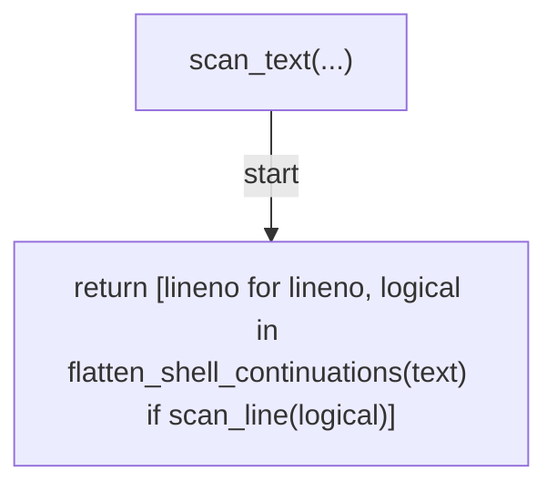
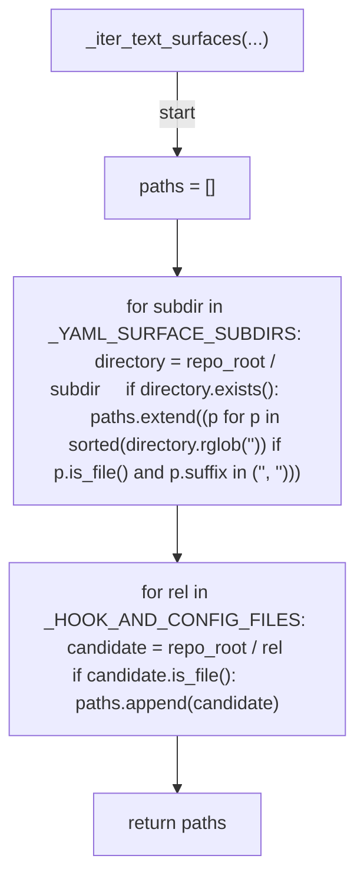
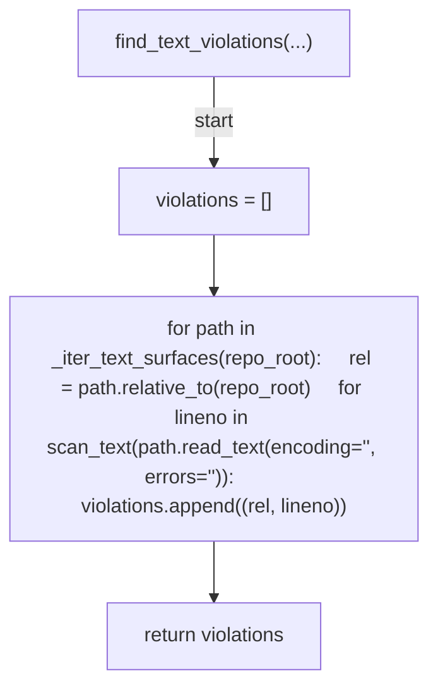
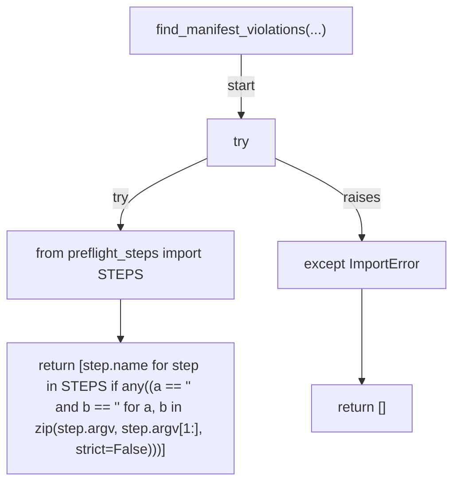
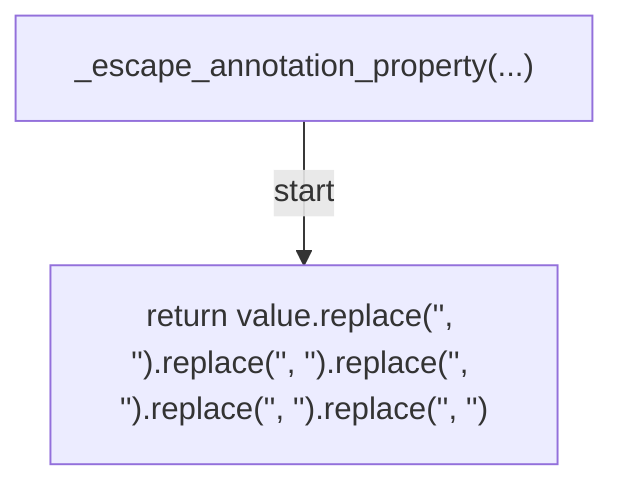
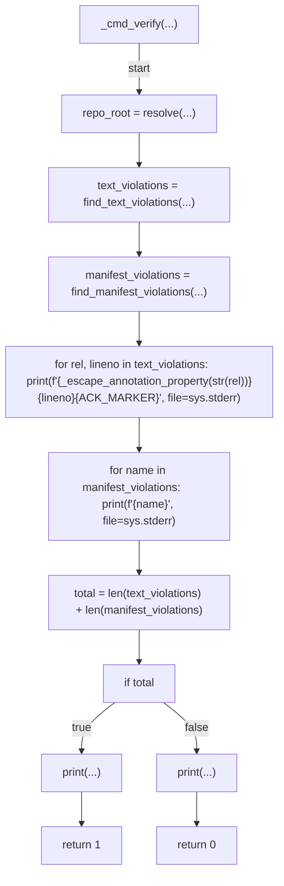
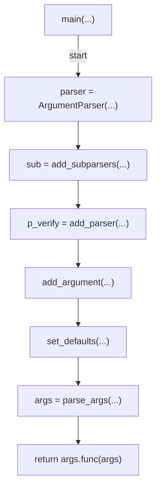

# AST graph: scripts/scan_ruff_format.py

This file is generated from `scripts/scan_ruff_format.py` by `python3 scripts/script_ast_graph.py all-doc`. Do not edit it by hand: content under `docs/generated/scripts/` is owned by the post-merge automation (refs #1540); update the source script instead.

## scan_line(...)

## scan_text(...)

## _iter_text_surfaces(...)

## find_text_violations(...)

## find_manifest_violations(...)

## _escape_annotation_property(...)

## _cmd_verify(...)

## main(...)

