# AST graph: scripts/scan_runbook_template_drift.py

This file is generated from `scripts/scan_runbook_template_drift.py` by `python3 scripts/script_ast_graph.py all-doc`. Do not edit it by hand: content under `docs/generated/scripts/` is owned by the post-merge automation (refs #1540); update the source script instead.

## _fence_at(...)

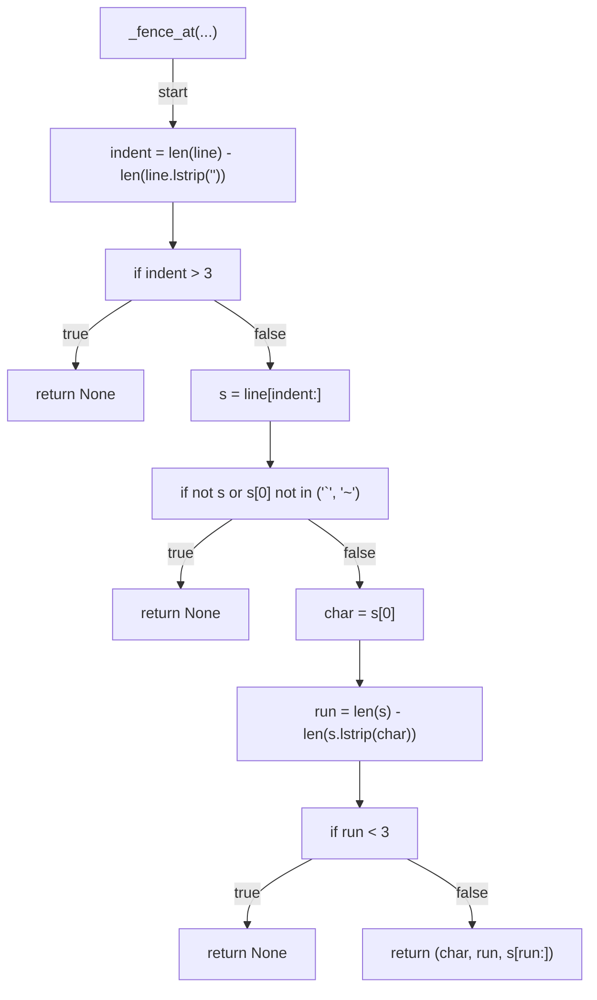

## _strip_fenced_code_blocks(...)

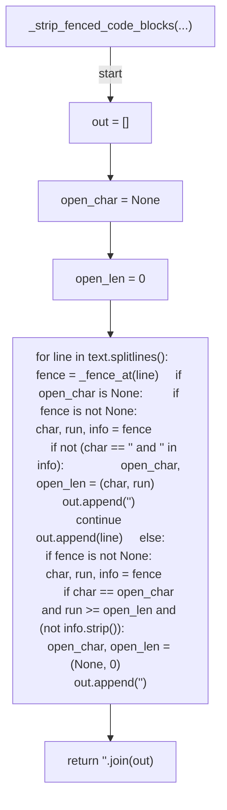

## extract_h2_headings(...)

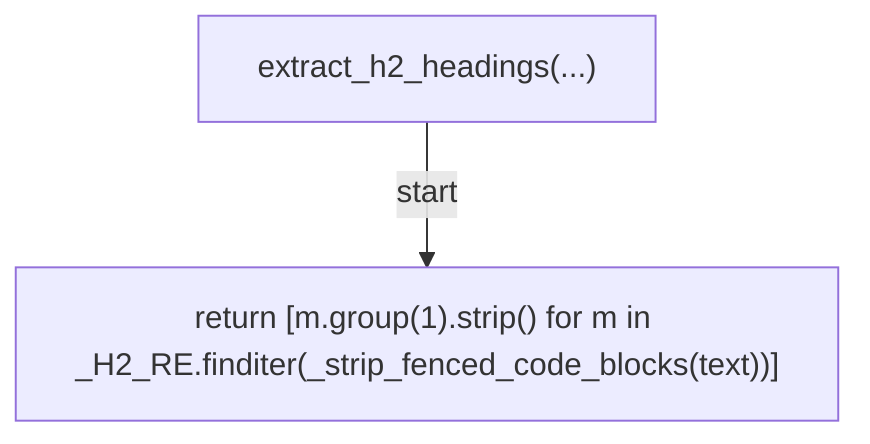

## check_conformance(...)

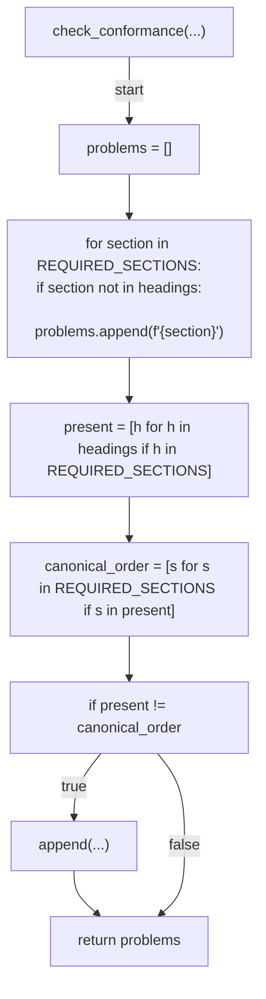

## parse_waivers(...)

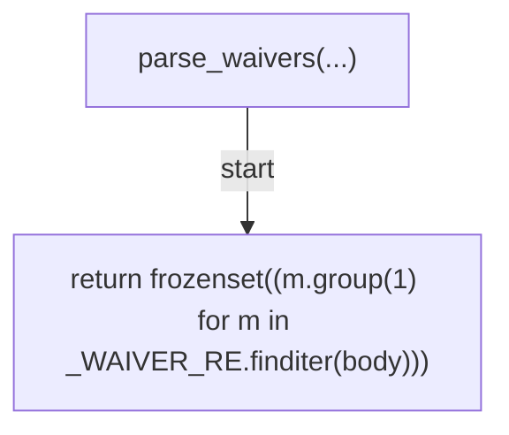

## _is_runbook(...)

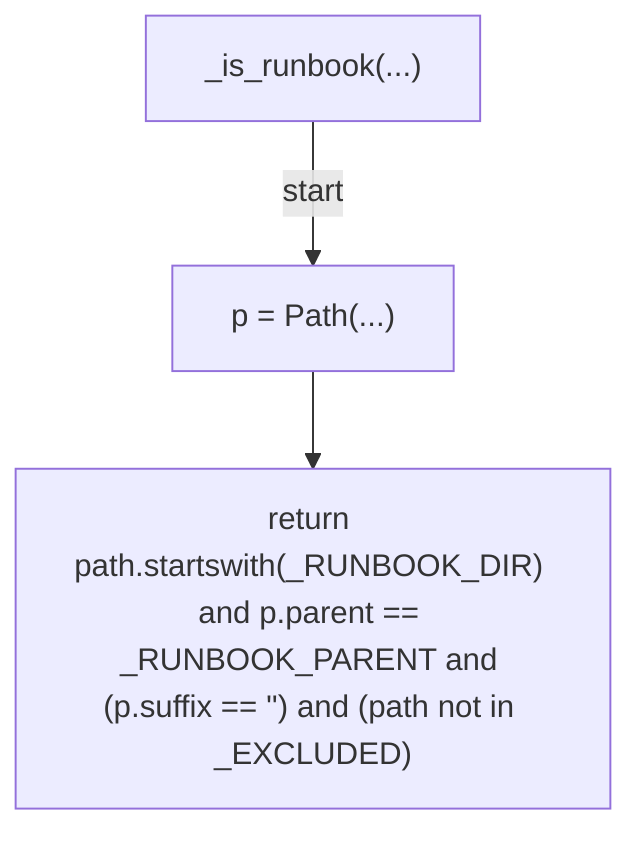

## get_changed_runbooks(...)

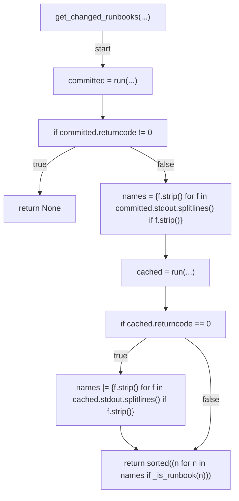

## run_gate(...)

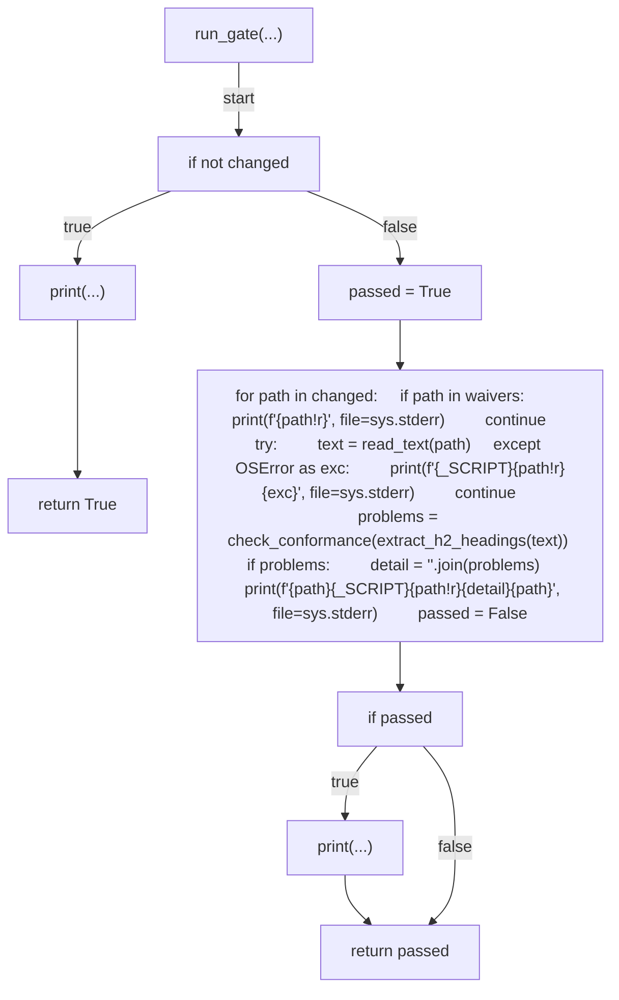

## _read_text(...)

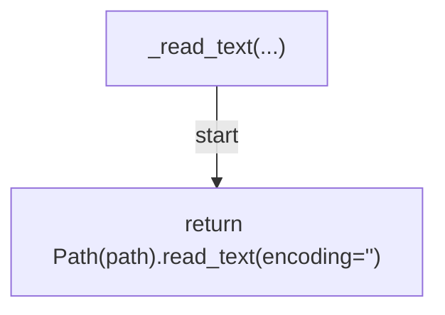

## _audit_all(...)

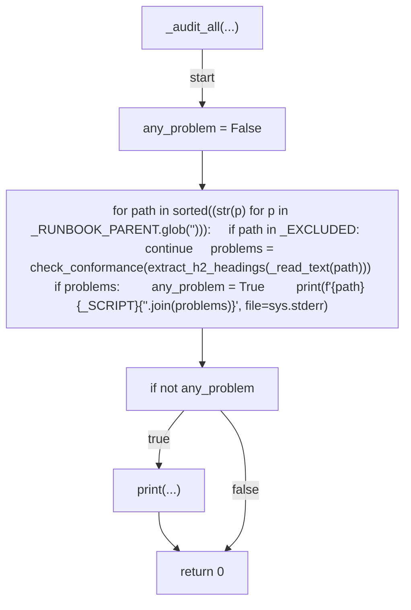

## main(...)

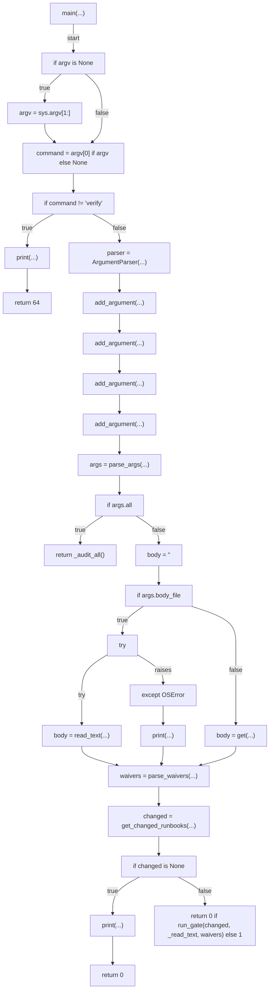
