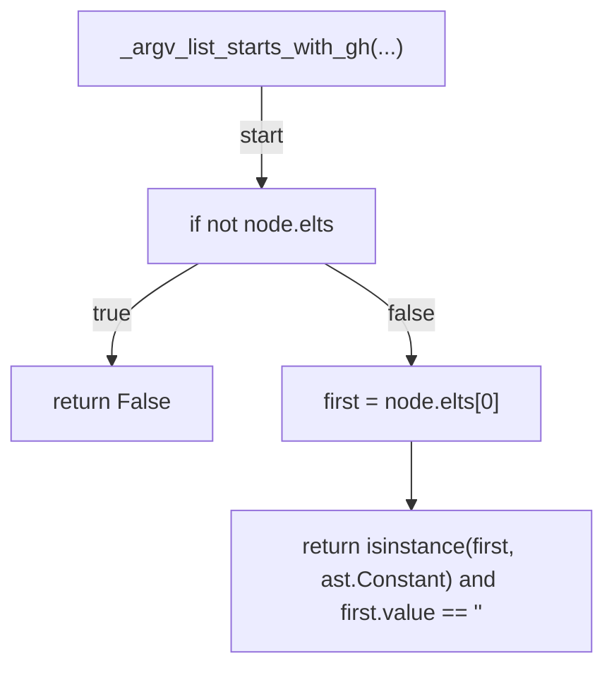
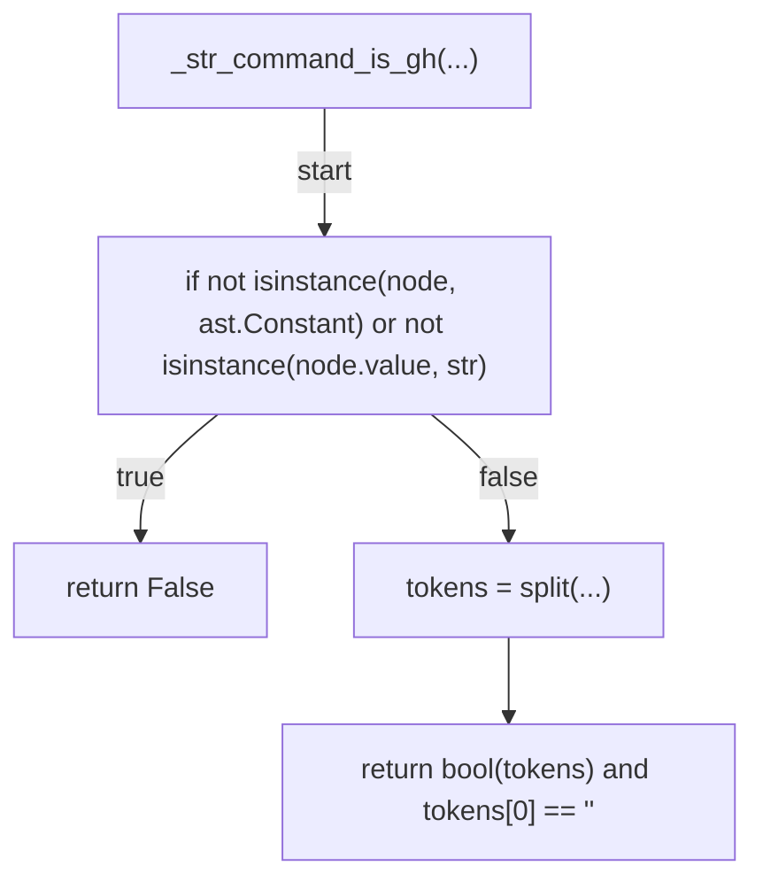
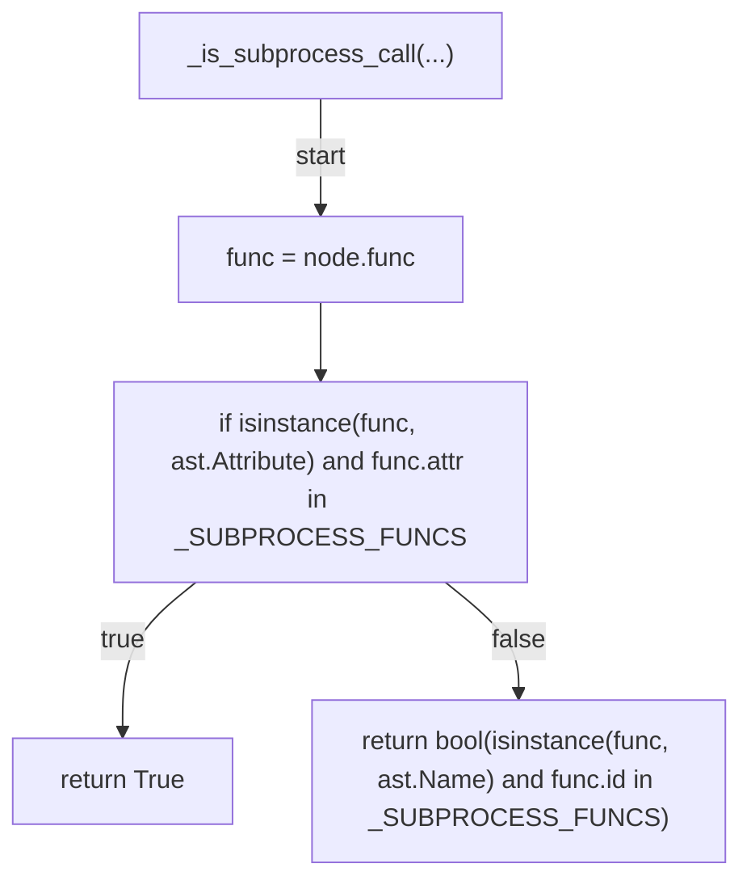
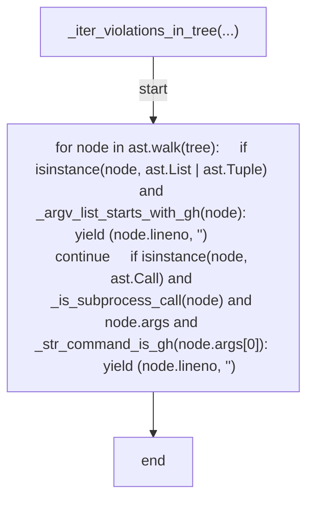
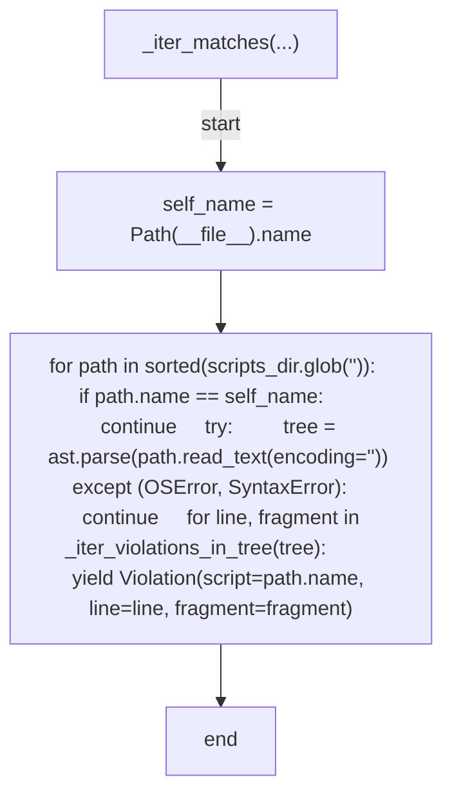
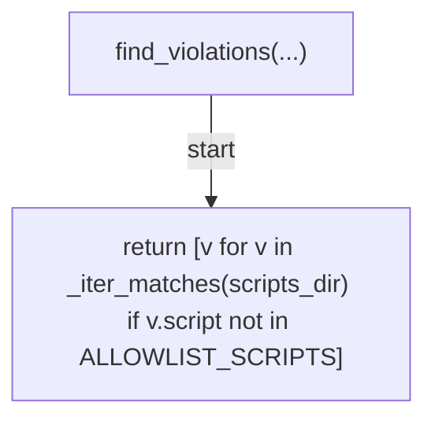
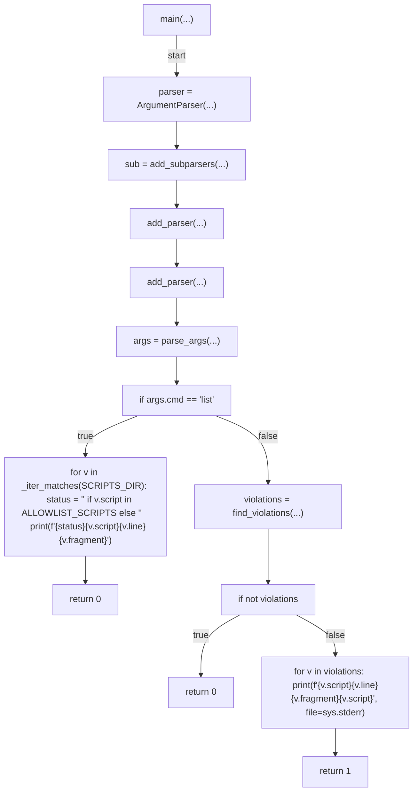

# AST graph: scripts/scan_scripts_gh_calls.py

This file is generated from `scripts/scan_scripts_gh_calls.py` by `python3 scripts/script_ast_graph.py all-doc`. Do not edit it by hand: content under `docs/generated/scripts/` is owned by the post-merge automation (refs #1540); update the source script instead.

## _argv_list_starts_with_gh(...)

## _str_command_is_gh(...)

## _is_subprocess_call(...)

## _iter_violations_in_tree(...)

## _iter_matches(...)

## find_violations(...)

## main(...)

