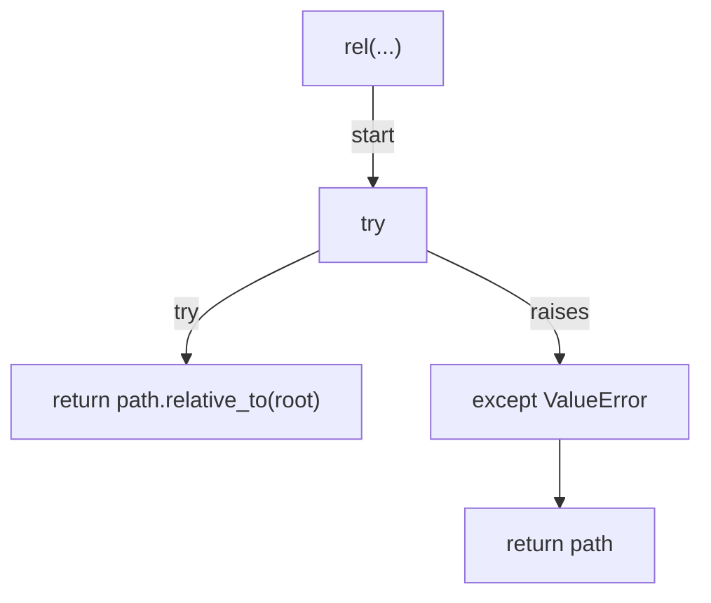
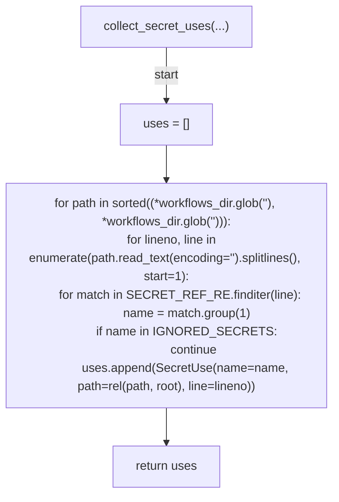
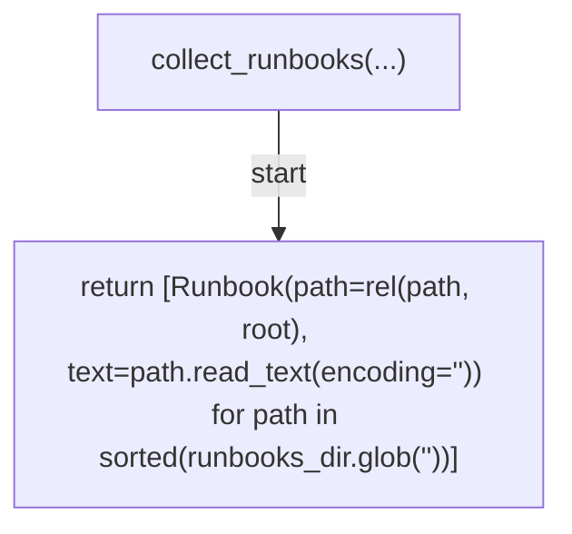
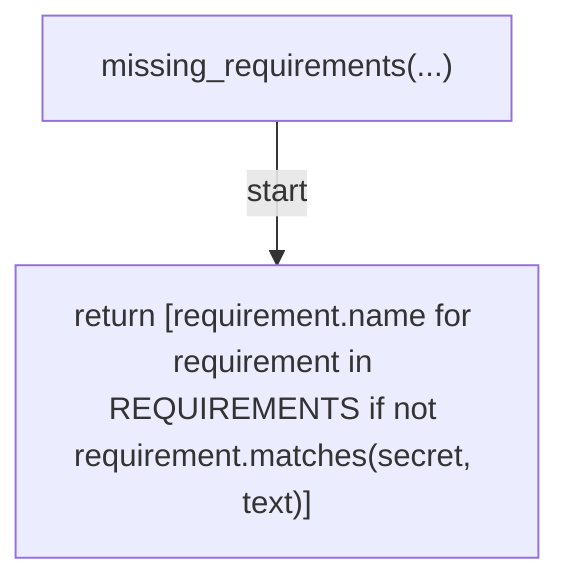
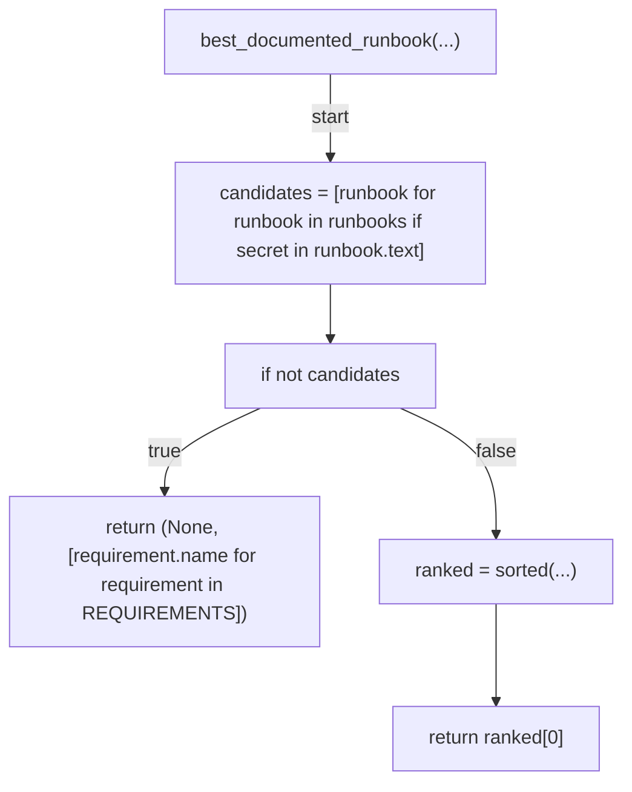
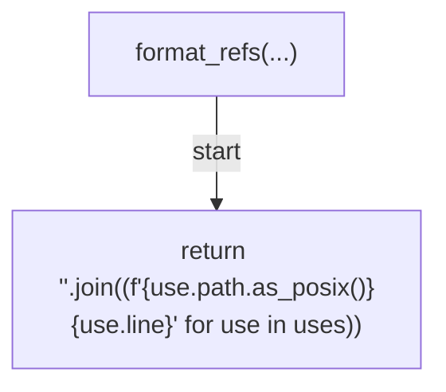
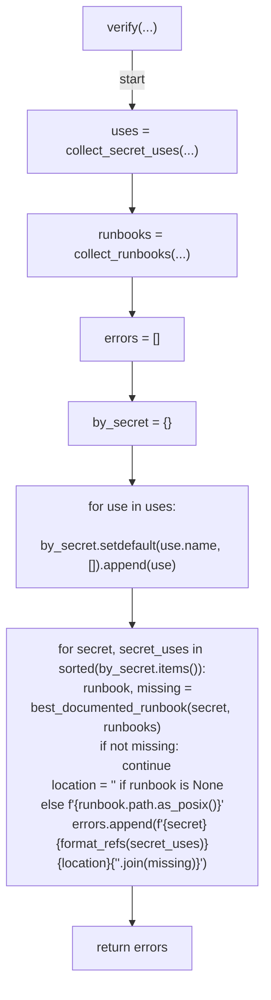
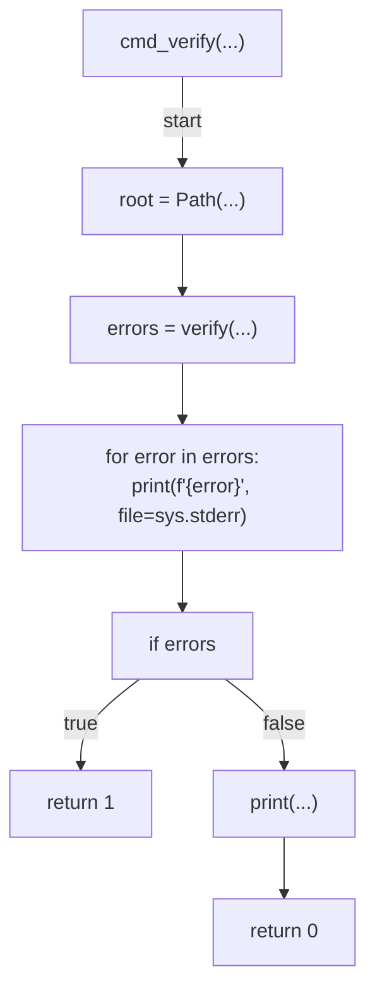
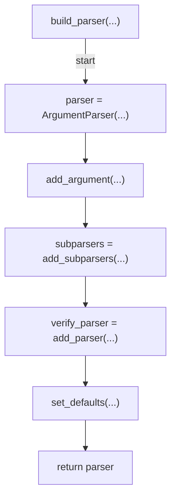
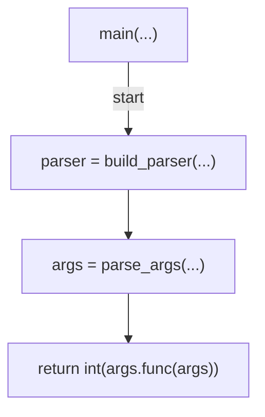

# AST graph: scripts/scan_secret_runbooks.py

This file is generated from `scripts/scan_secret_runbooks.py` by `python3 scripts/script_ast_graph.py all-doc`. Do not edit it by hand: content under `docs/generated/scripts/` is owned by the post-merge automation (refs #1540) -- update the source script instead.

## rel(...)

## collect_secret_uses(...)

## collect_runbooks(...)

## missing_requirements(...)

## best_documented_runbook(...)

## format_refs(...)

## verify(...)

## cmd_verify(...)

## build_parser(...)

## main(...)

