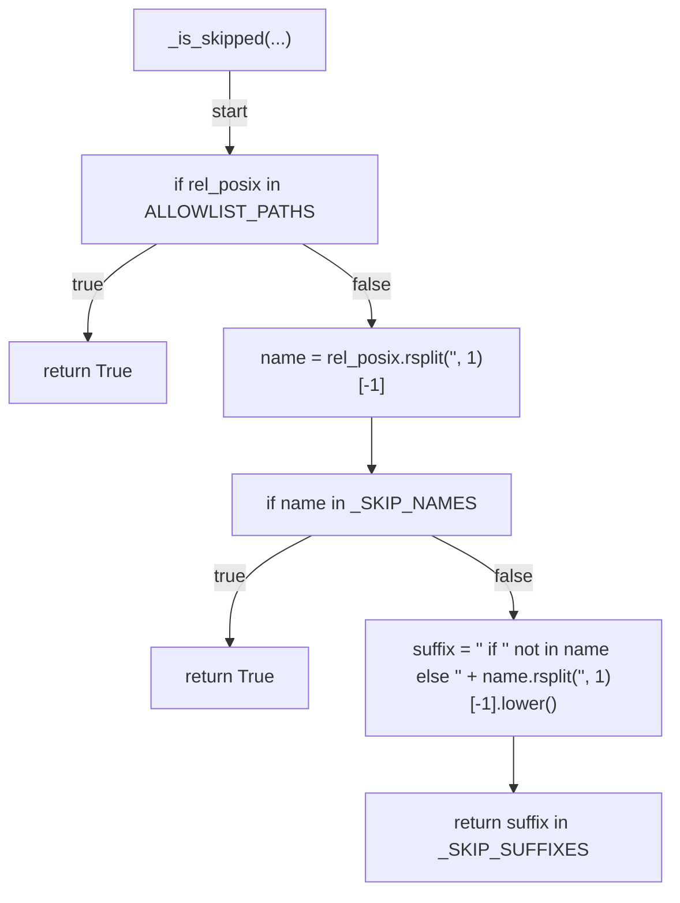
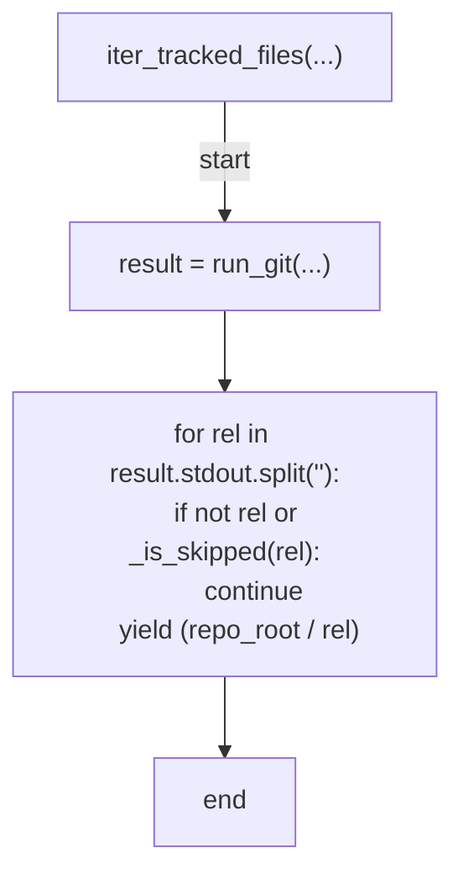
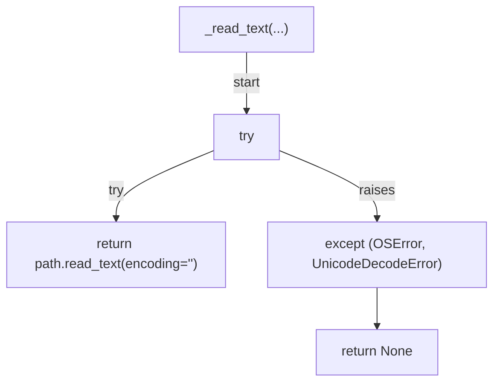
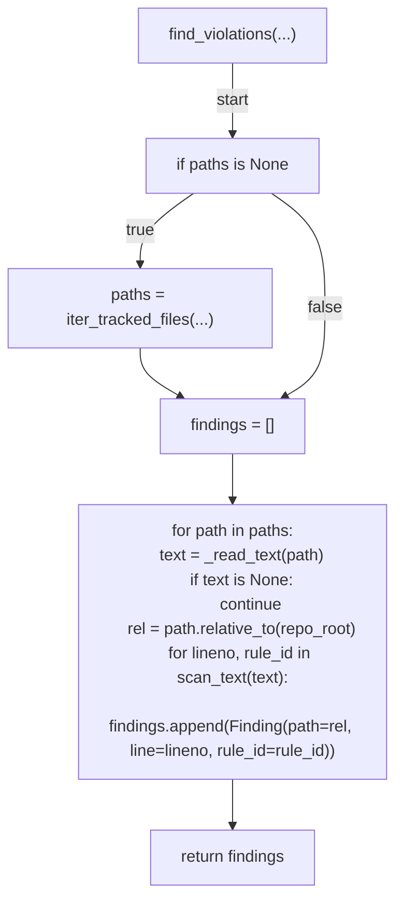
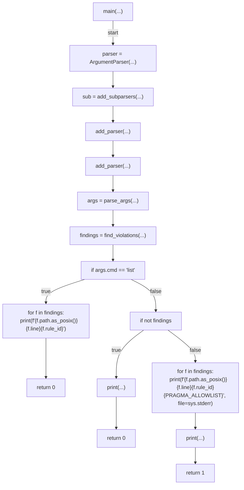

# AST graph: scripts/scan_secrets.py

This file is generated from `scripts/scan_secrets.py` by `python3 scripts/script_ast_graph.py all-doc`. Do not edit it by hand: content under `docs/generated/scripts/` is owned by the post-merge automation (refs #1540) -- update the source script instead.

## _is_skipped(...)

## iter_tracked_files(...)

## _read_text(...)

## find_violations(...)

## main(...)

