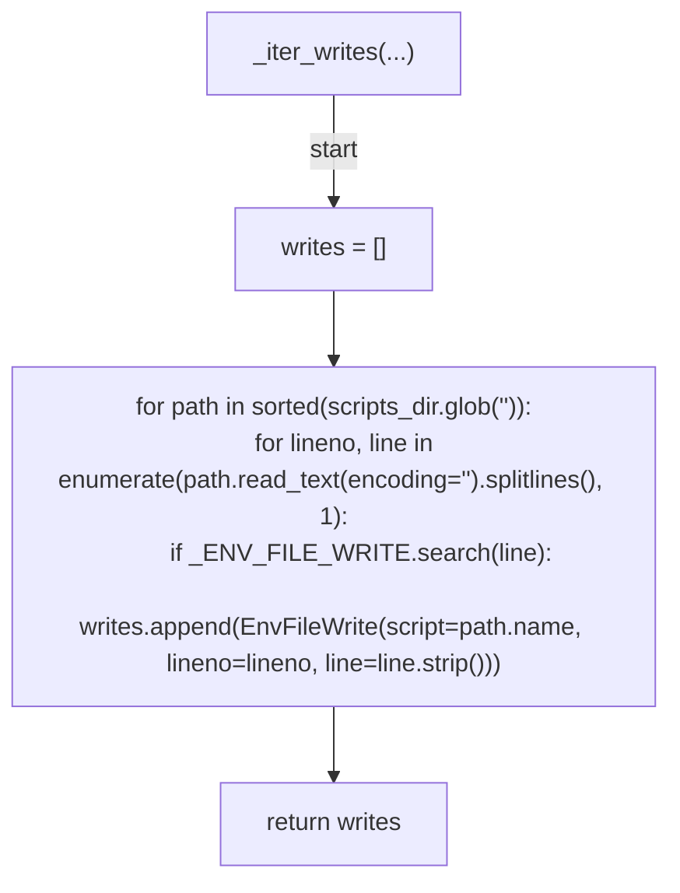
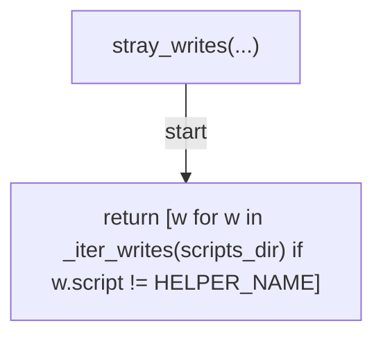
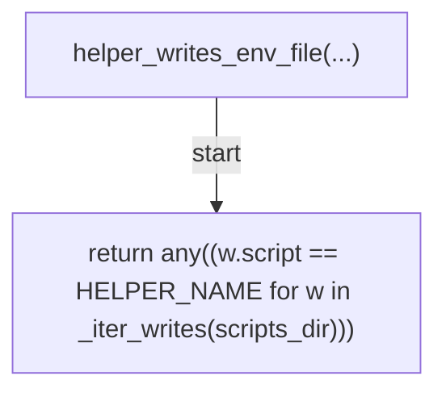
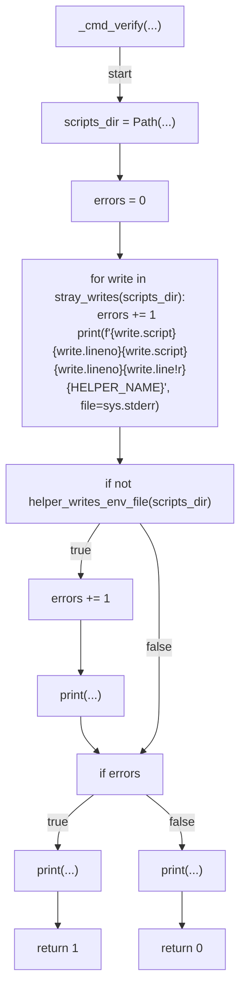
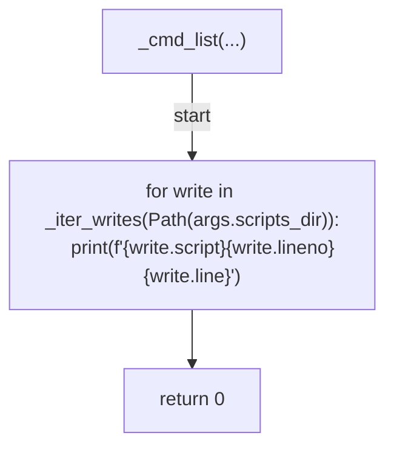
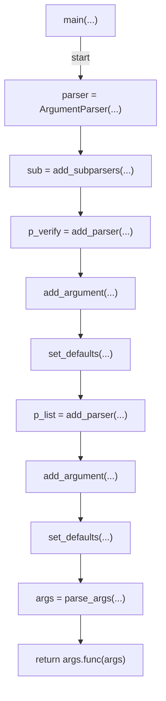

# AST graph: scripts/scan_session_path_drift.py

This file is generated from `scripts/scan_session_path_drift.py` by `python3 scripts/script_ast_graph.py all-doc`. Do not edit it by hand: content under `docs/generated/scripts/` is owned by the post-merge automation (refs #1540) -- update the source script instead.

## _iter_writes(...)

## stray_writes(...)

## helper_writes_env_file(...)

## _cmd_verify(...)

## _cmd_list(...)

## main(...)

