# AST graph: scripts/scan_ssot_drift.py

This file is generated from `scripts/scan_ssot_drift.py` by `python3 scripts/script_ast_graph.py all-doc`. Do not edit it by hand: content under `docs/generated/scripts/` is owned by the post-merge automation (refs #1540); update the source script instead.

## workflow_targets_pull_request(...)

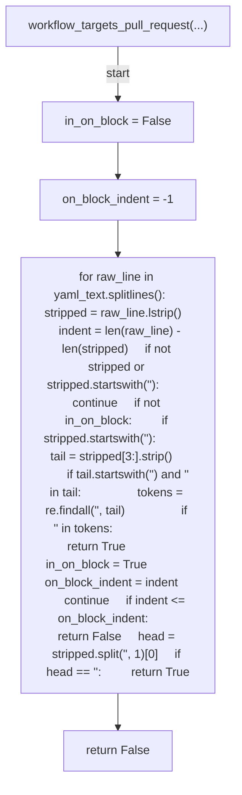

## extract_script_refs(...)

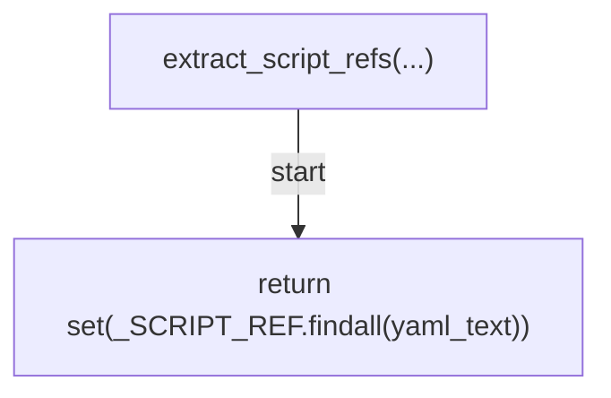

## collect_workflow_refs(...)

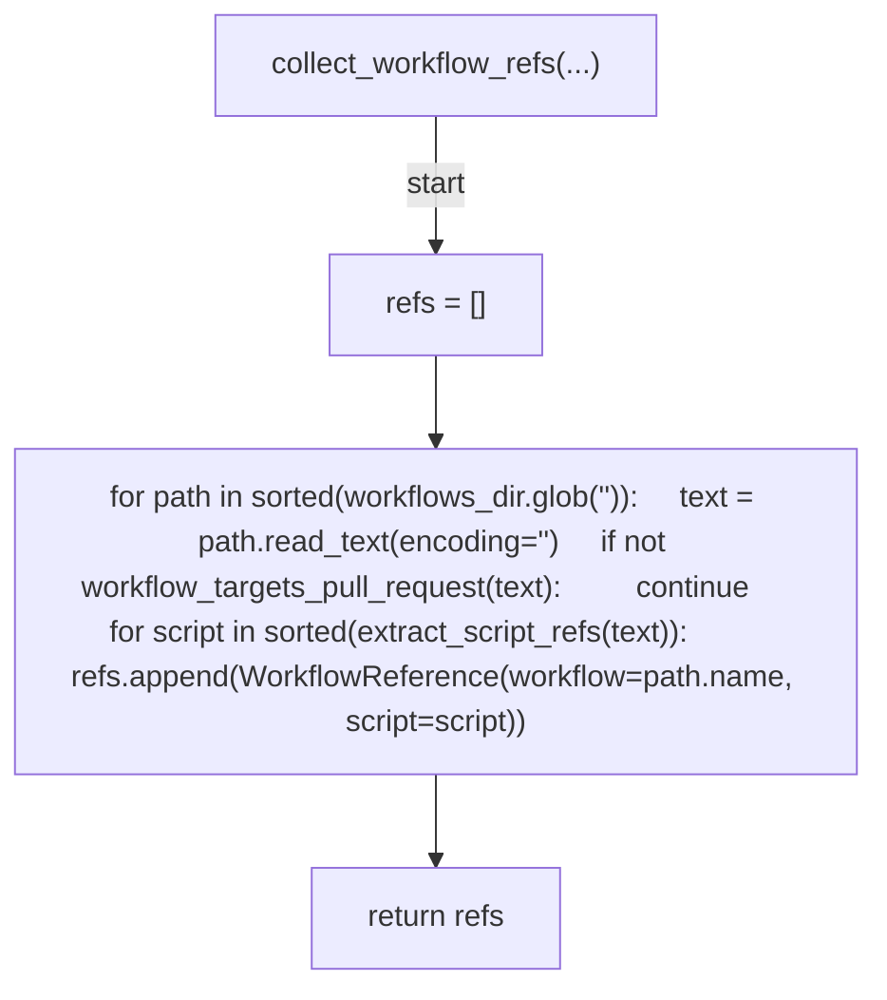

## diff_steps_vs_workflows(...)

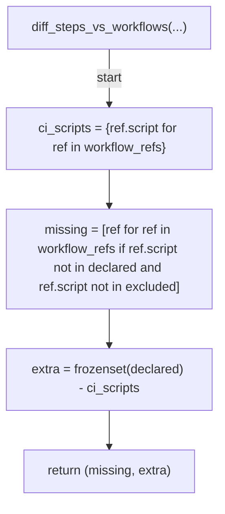

## _as_list(...)

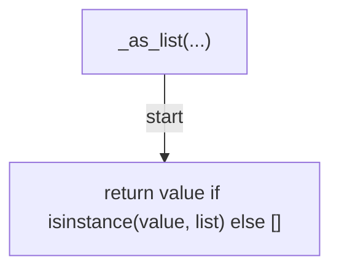

## _as_dict(...)

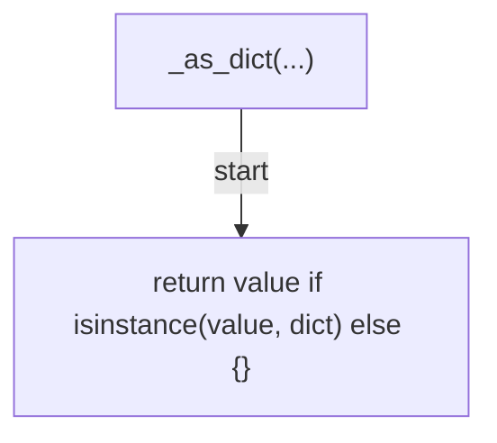

## pretooluse_manifest(...)

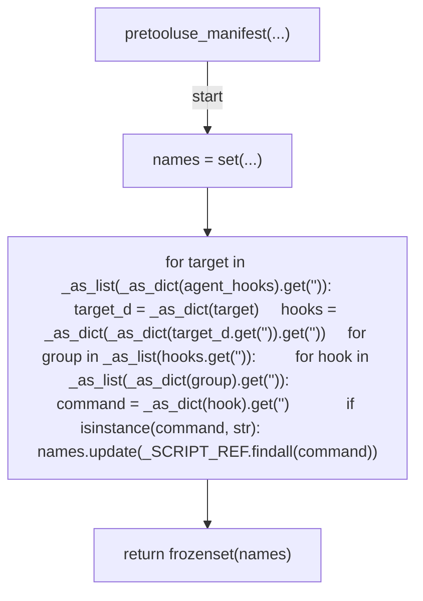

## steps_manifest(...)

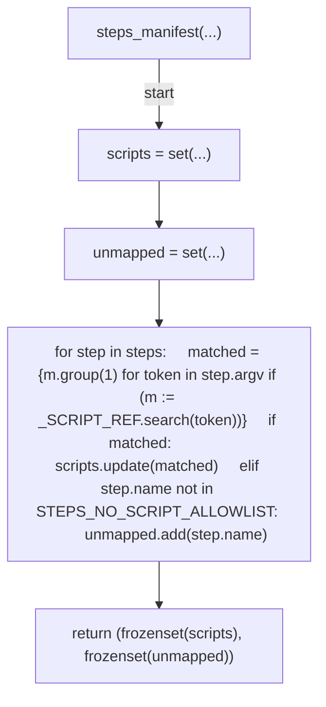

## pre_commit_manifest(...)

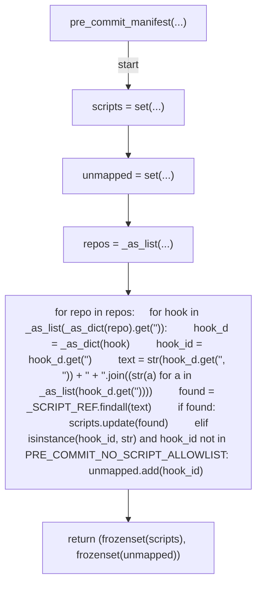

## _ci_scripts(...)

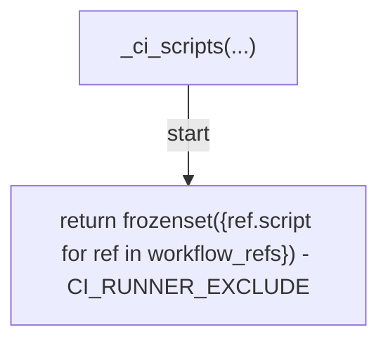

## ci_manifest(...)

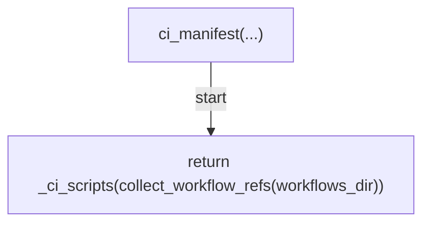

## server_native_rules(...)

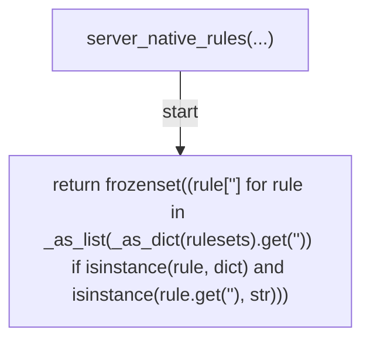

## registry_scripts_for_plane(...)

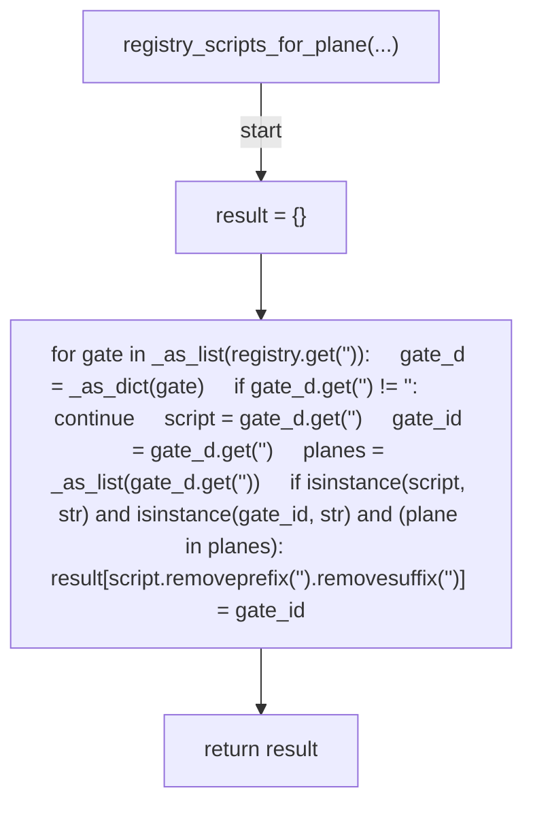

## registry_native_rules_for_plane(...)

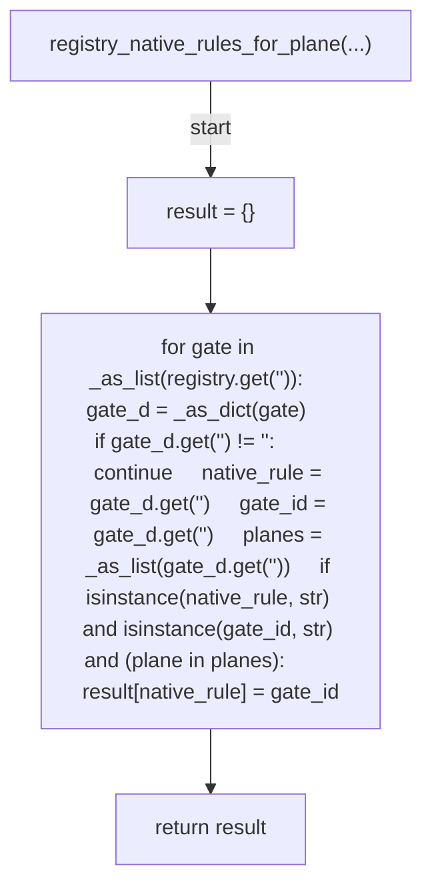

## registry_cluster_planes(...)

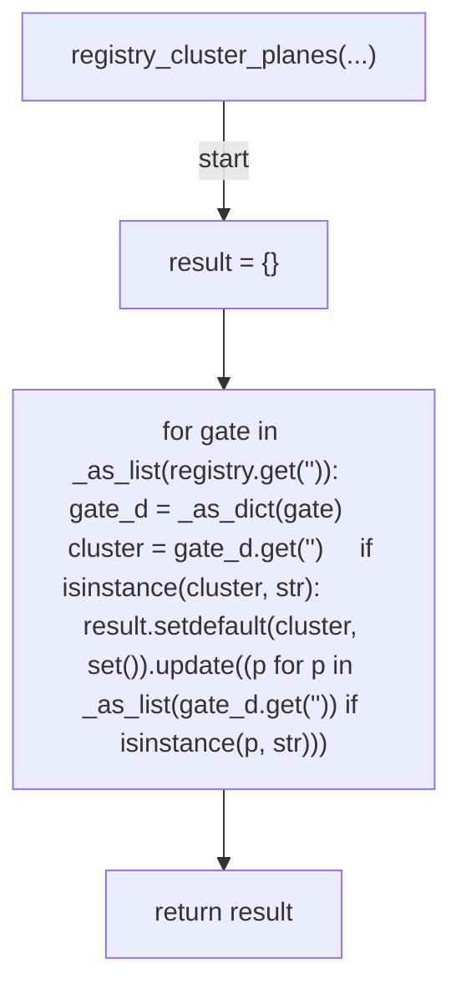

## registry_ci_only_scripts(...)

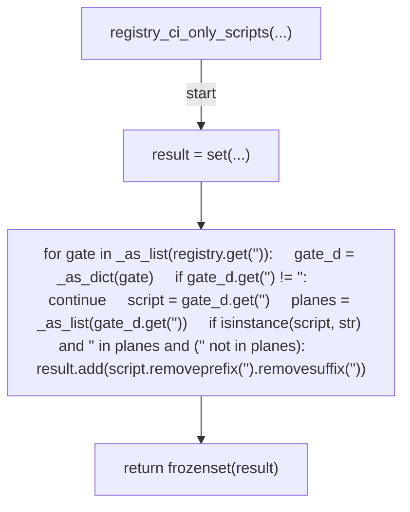

## diff_plane(...)

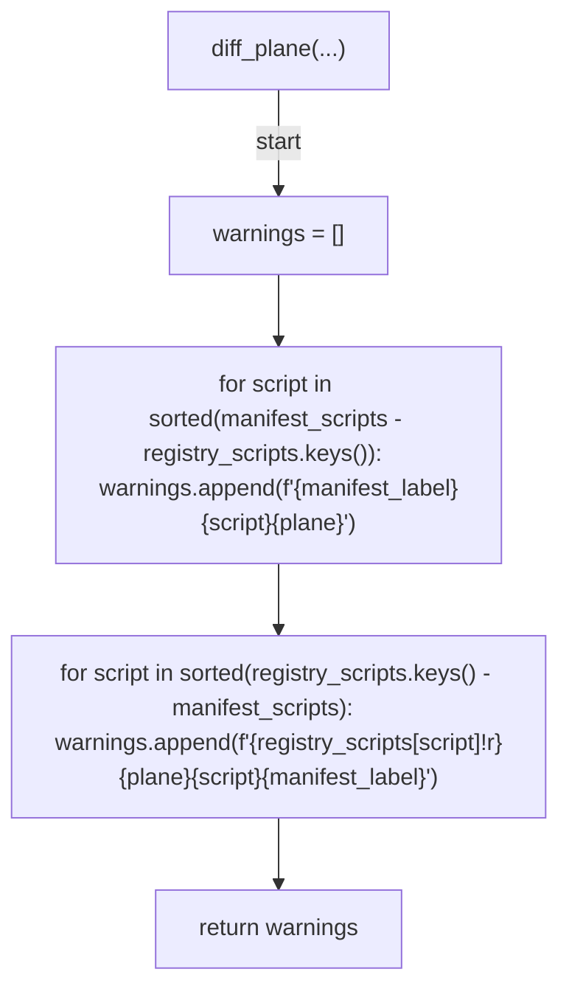

## diff_native(...)

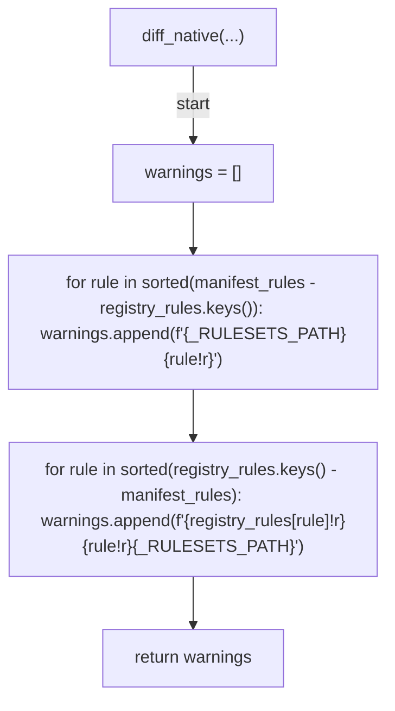

## diff_clusters(...)

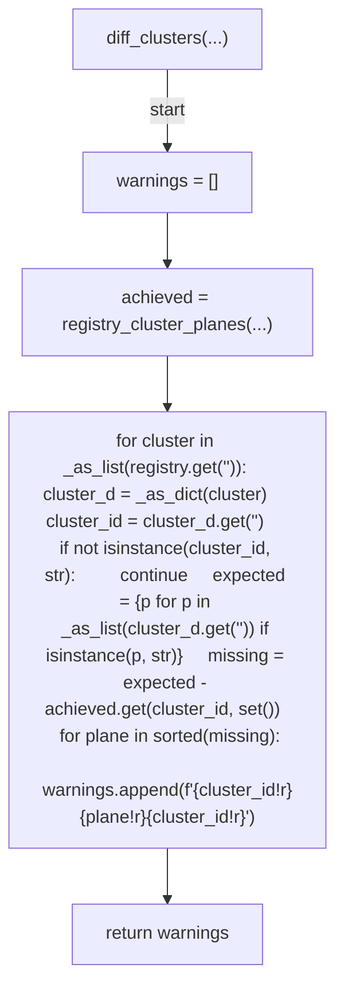

## diff_unmapped(...)

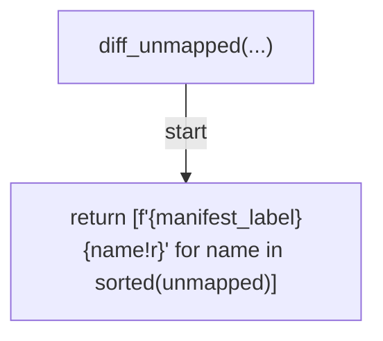

## verify_registry(...)

```mermaid
flowchart TD
    N001["verify_registry(...)"]
    N002["warnings = []"]
    N003["pretooluse_scripts = pretooluse_manifest(...)"]
    N004["warnings += diff_plane(pretooluse_scripts, registry_scripts_for_plane(registry, '<str>'), manifest_label=_AGENT_HOOKS_PATH, plane='<str>')"]
    N005["warnings += diff_plane(push_scripts, registry_scripts_for_plane(registry, '<str>'), manifest_label='<str>', plane='<str>')"]
    N006["warnings += diff_unmapped(push_unmapped, manifest_label='<str>')"]
    N007["(commit_scripts, commit_unmapped) = pre_commit_manifest(...)"]
    N008["warnings += diff_plane(commit_scripts, registry_scripts_for_plane(registry, '<str>'), manifest_label=_PRE_COMMIT_CONFIG_PATH, plane='<str>')"]
    N009["warnings += diff_unmapped(commit_unmapped, manifest_label=_PRE_COMMIT_CONFIG_PATH)"]
    N010["ci_scripts = _ci_scripts(...)"]
    N011["warnings += diff_plane(ci_scripts, registry_scripts_for_plane(registry, '<str>'), manifest_label='<str>', plane='<str>')"]
    N012["warnings += diff_native(server_native_rules(rulesets), registry_native_rules_for_plane(registry, '<str>'))"]
    N013["warnings += diff_clusters(registry)"]
    N014["blocking = [DriftWarning(message=message) for message in warnings]"]
    N015["excluded = registry_ci_only_scripts(registry) | frozenset(STEPS_VS_WORKFLOW_RESIDUAL_ALLOWLIST) | CI_RUNNER_EXCLUDE"]
    N016["(missing_steps, extra_declared) = diff_steps_vs_workflows(...)"]
    N017["blocking += [DriftWarning(message=f'<str>{ref.script}<str>{ref.workflow!r}<str>', workflow=ref.workflow) for ref in missing_steps]"]
    N018["advisory = [f'<str>{name!r}<str>{name}<str>' for name in sorted(extra_declared)]"]
    N019["return VerifyResult(blocking=blocking, advisory=advisory)"]
    N001 -->|"start"| N002
    N002 --> N003
    N003 --> N004
    N004 --> N005
    N005 --> N006
    N006 --> N007
    N007 --> N008
    N008 --> N009
    N009 --> N010
    N010 --> N011
    N011 --> N012
    N012 --> N013
    N013 --> N014
    N014 --> N015
    N015 --> N016
    N016 --> N017
    N017 --> N018
    N018 --> N019
```

## _load_json(...)

```mermaid
flowchart TD
    N001["_load_json(...)"]
    N002["return json.loads(path.read_text(encoding='<str>'))"]
    N001 -->|"start"| N002
```

## _load_yaml(...)

```mermaid
flowchart TD
    N001["_load_yaml(...)"]
    N002["return yaml.safe_load(path.read_text(encoding='<str>'))"]
    N001 -->|"start"| N002
```

## main(...)

```mermaid
flowchart TD
    N001["main(...)"]
    N002["if argv is None"]
    N003["argv = sys.argv[1:]"]
    N004["command = argv[0] if argv else None"]
    N005["if command != 'verify'"]
    N006["print(...)"]
    N007["return 64"]
    N008["parser = ArgumentParser(...)"]
    N009["add_argument(...)"]
    N010["add_argument(...)"]
    N011["add_argument(...)"]
    N012["add_argument(...)"]
    N013["add_argument(...)"]
    N014["add_argument(...)"]
    N015["args = parse_args(...)"]
    N016["registry_path = _REPO_ROOT / args.registry"]
    N017["agent_hooks_path = _REPO_ROOT / args.agent_hooks"]
    N018["pre_commit_path = _REPO_ROOT / args.pre_commit_config"]
    N019["rulesets_path = _REPO_ROOT / args.rulesets"]
    N020["workflows_dir = _REPO_ROOT / args.workflows_dir"]
    N021["for label, path in (('<str>', registry_path), ('<str>', agent_hooks_path), ('<str>', pre_commit_path), ('<str>', rulesets_path)):     if not path.exists():         print(f'<str>{_SCRIPT}<str>{label}<str>{path}<str>', file=sys.stderr)         return 1"]
    N022["if not workflows_dir.is_dir()"]
    N023["print(...)"]
    N024["return 1"]
    N025["try"]
    N026["registry = _load_json(...)"]
    N027["agent_hooks = _load_json(...)"]
    N028["pre_commit_config = _load_yaml(...)"]
    N029["rulesets = _load_json(...)"]
    N030["except (OSError, ValueError, yaml.YAMLError)"]
    N031["print(...)"]
    N032["return 1"]
    N033["if not isinstance(registry, dict)"]
    N034["print(...)"]
    N035["return 1"]
    N036["workflow_refs = collect_workflow_refs(...)"]
    N037["(push_scripts, push_unmapped) = steps_manifest(...)"]
    N038["result = verify_registry(...)"]
    N039["for message in result.advisory:     print(f'<str>{_SCRIPT}<str>{message}', file=sys.stderr)"]
    N040["if result.blocking"]
    N041["for warning in result.blocking:     if warning.workflow:         print(f'<str>{warning.workflow}<str>{_SCRIPT}<str>{warning.message}', file=sys.stderr)     else:         print(f'<str>{_SCRIPT}<str>{warning.message}', file=sys.stderr)"]
    N042["print(...)"]
    N043["return 1"]
    N044["print(...)"]
    N045["return 0"]
    N001 -->|"start"| N002
    N002 -->|"true"| N003
    N003 --> N004
    N002 -->|"false"| N004
    N004 --> N005
    N005 -->|"true"| N006
    N006 --> N007
    N005 -->|"false"| N008
    N008 --> N009
    N009 --> N010
    N010 --> N011
    N011 --> N012
    N012 --> N013
    N013 --> N014
    N014 --> N015
    N015 --> N016
    N016 --> N017
    N017 --> N018
    N018 --> N019
    N019 --> N020
    N020 --> N021
    N021 --> N022
    N022 -->|"true"| N023
    N023 --> N024
    N022 -->|"false"| N025
    N025 -->|"try"| N026
    N026 --> N027
    N027 --> N028
    N028 --> N029
    N025 -->|"raises"| N030
    N030 --> N031
    N031 --> N032
    N029 --> N033
    N033 -->|"true"| N034
    N034 --> N035
    N033 -->|"false"| N036
    N036 --> N037
    N037 --> N038
    N038 --> N039
    N039 --> N040
    N040 -->|"true"| N041
    N041 --> N042
    N042 --> N043
    N040 -->|"false"| N044
    N044 --> N045
```
