# AST graph: scripts/scan_ssot_schema.py

This file is generated from `scripts/scan_ssot_schema.py` by `python3 scripts/script_ast_graph.py all-doc`. Do not edit it by hand: content under `docs/generated/scripts/` is owned by the post-merge automation (refs #1540); update the source script instead.

## live_label_names(...)

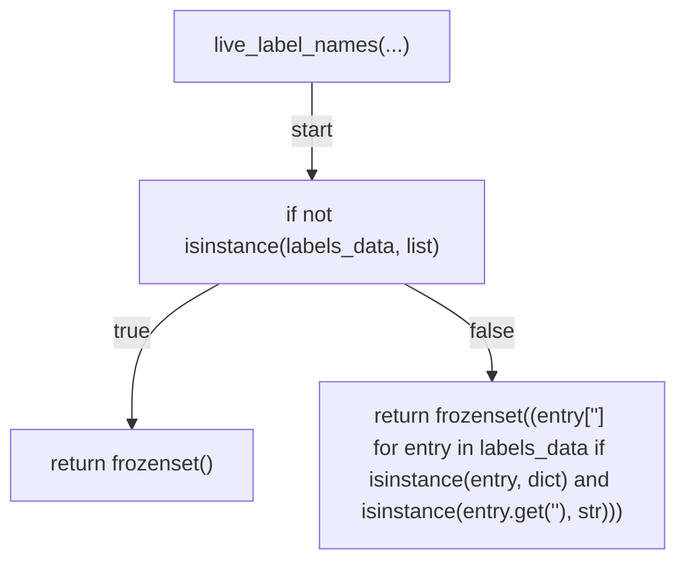

## consumer_label_universe(...)

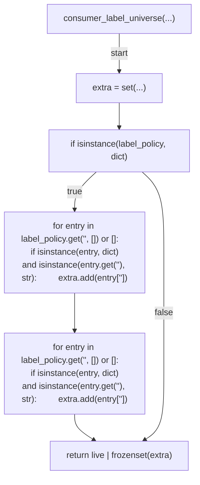

## _as_list(...)

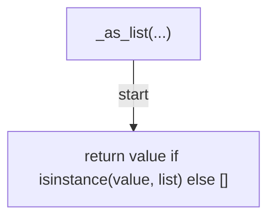

## _assert_schema_shape(...)

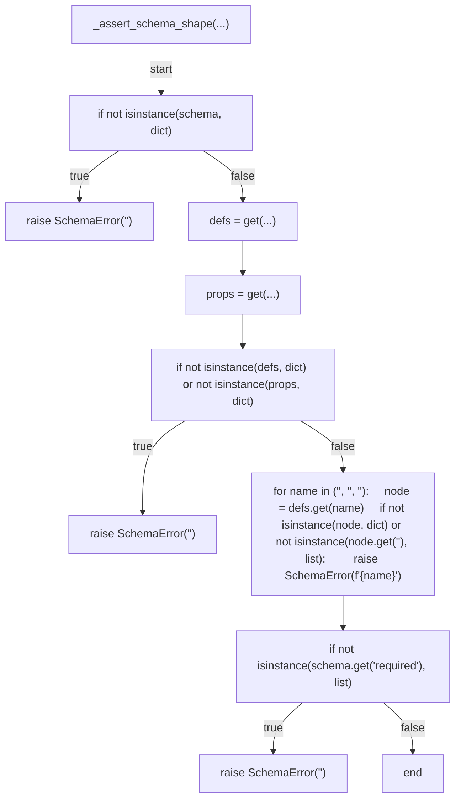

## _check_gate_kinds(...)

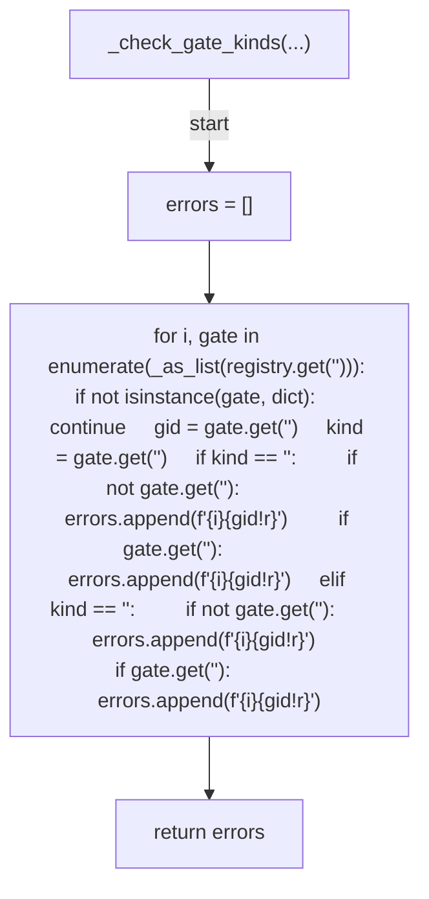

## _check_tracked_paths(...)

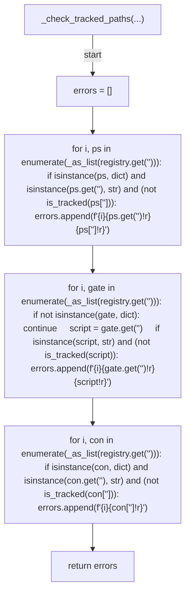

## _check_id_refs(...)

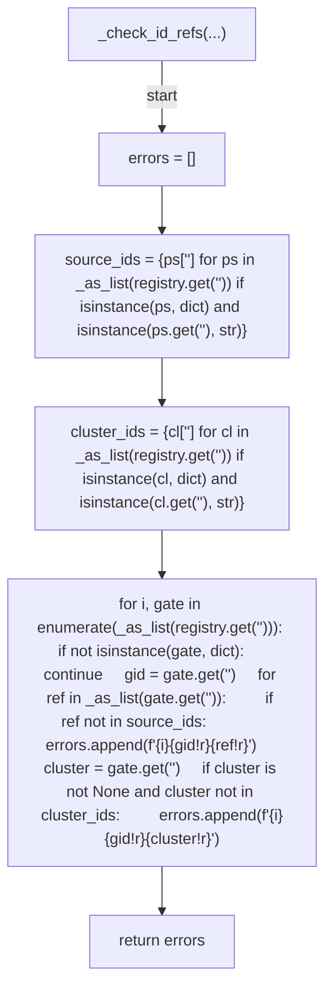

## _routing_labels(...)

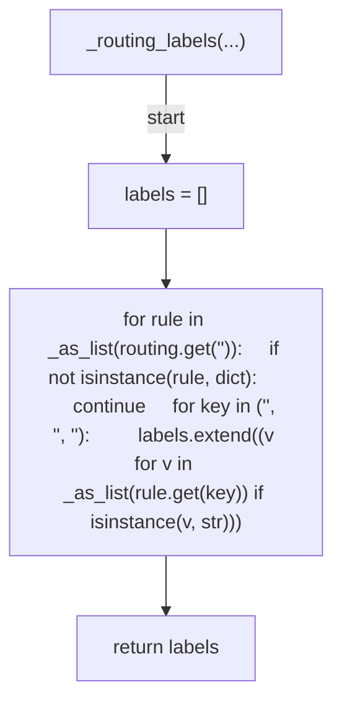

## _check_routing(...)

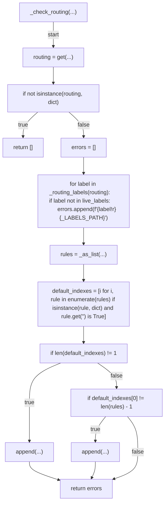

## _check_consumers(...)

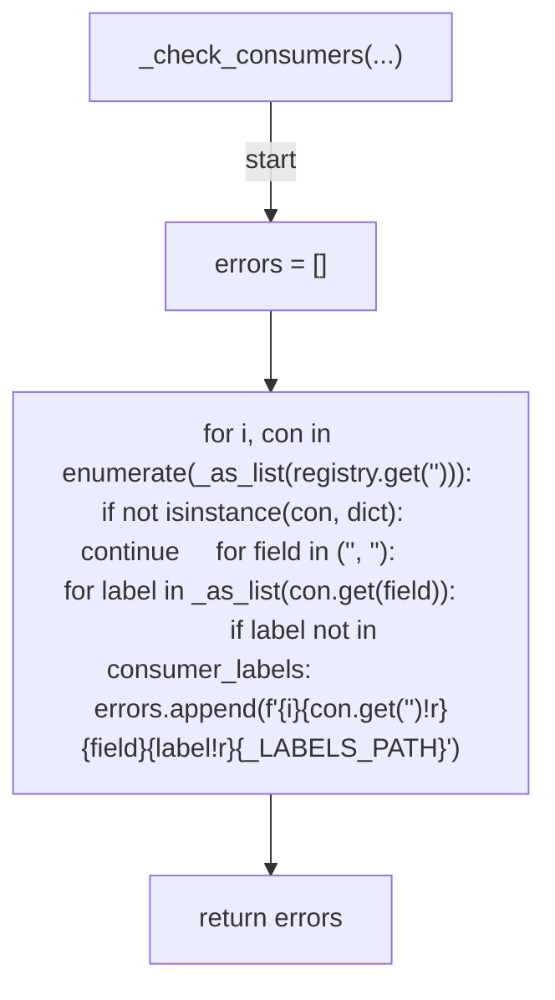

## verify_registry(...)

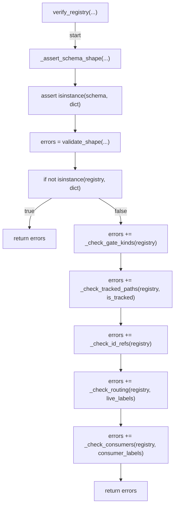

## build_tracked_checker(...)

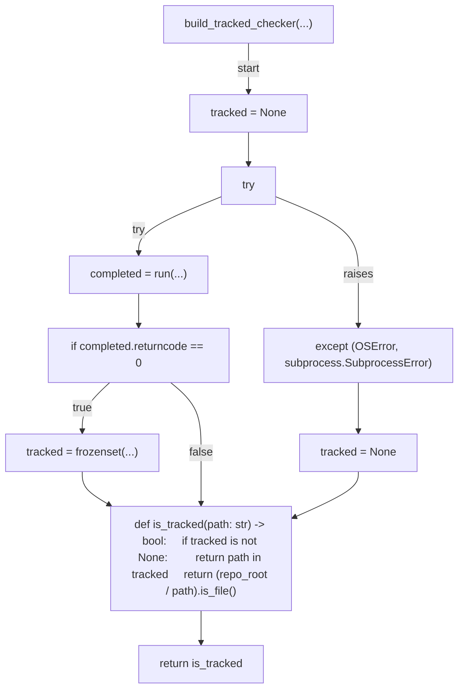

## _load_json(...)

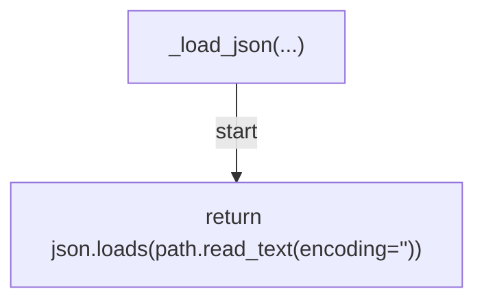

## main(...)

```mermaid
flowchart TD
    N001["main(...)"]
    N002["if argv is None"]
    N003["argv = sys.argv[1:]"]
    N004["command = argv[0] if argv else None"]
    N005["if command != 'verify'"]
    N006["print(...)"]
    N007["return 64"]
    N008["parser = ArgumentParser(...)"]
    N009["add_argument(...)"]
    N010["add_argument(...)"]
    N011["add_argument(...)"]
    N012["add_argument(...)"]
    N013["add_argument(...)"]
    N014["args = parse_args(...)"]
    N015["registry_path = _REPO_ROOT / args.registry"]
    N016["schema_path = _REPO_ROOT / args.schema"]
    N017["labels_path = _REPO_ROOT / args.labels"]
    N018["label_policy_path = _REPO_ROOT / args.label_policy"]
    N019["for label, path in (('<str>', registry_path), ('<str>', schema_path), ('<str>', labels_path), ('<str>', label_policy_path)):     if not path.exists():         print(f'<str>{_SCRIPT}<str>{label}<str>{path}<str>', file=sys.stderr)         return 1"]
    N020["try"]
    N021["registry = _load_json(...)"]
    N022["schema = _load_json(...)"]
    N023["labels_data = _load_json(...)"]
    N024["label_policy = loads(...)"]
    N025["except (OSError, ValueError, tomllib.TOMLDecodeError)"]
    N026["print(...)"]
    N027["return 1"]
    N028["live_labels = live_label_names(...)"]
    N029["consumer_labels = consumer_label_universe(...)"]
    N030["is_tracked = build_tracked_checker(...)"]
    N031["try"]
    N032["errors = verify_registry(...)"]
    N033["except SchemaError"]
    N034["print(...)"]
    N035["return 1"]
    N036["if errors"]
    N037["for message in errors:     print(f'<str>{_SCRIPT}<str>{message}', file=sys.stderr)"]
    N038["return 1"]
    N039["print(...)"]
    N040["return 0"]
    N001 -->|"start"| N002
    N002 -->|"true"| N003
    N003 --> N004
    N002 -->|"false"| N004
    N004 --> N005
    N005 -->|"true"| N006
    N006 --> N007
    N005 -->|"false"| N008
    N008 --> N009
    N009 --> N010
    N010 --> N011
    N011 --> N012
    N012 --> N013
    N013 --> N014
    N014 --> N015
    N015 --> N016
    N016 --> N017
    N017 --> N018
    N018 --> N019
    N019 --> N020
    N020 -->|"try"| N021
    N021 --> N022
    N022 --> N023
    N023 --> N024
    N020 -->|"raises"| N025
    N025 --> N026
    N026 --> N027
    N024 --> N028
    N028 --> N029
    N029 --> N030
    N030 --> N031
    N031 -->|"try"| N032
    N031 -->|"raises"| N033
    N033 --> N034
    N034 --> N035
    N032 --> N036
    N036 -->|"true"| N037
    N037 --> N038
    N036 -->|"false"| N039
    N039 --> N040
```
