# AST graph: scripts/scan_test_presence_drift.py

This file is generated from `scripts/scan_test_presence_drift.py` by `python3 scripts/script_ast_graph.py all-doc`. Do not edit it by hand: content under `docs/generated/scripts/` is owned by the post-merge automation (refs #1540) -- update the source script instead.

## discover_scripts(...)

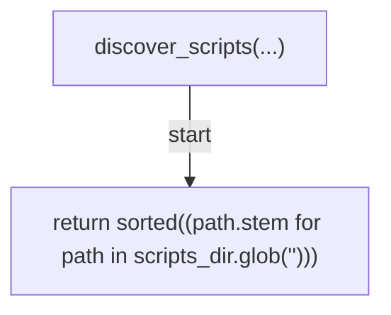

## test_module_candidates(...)

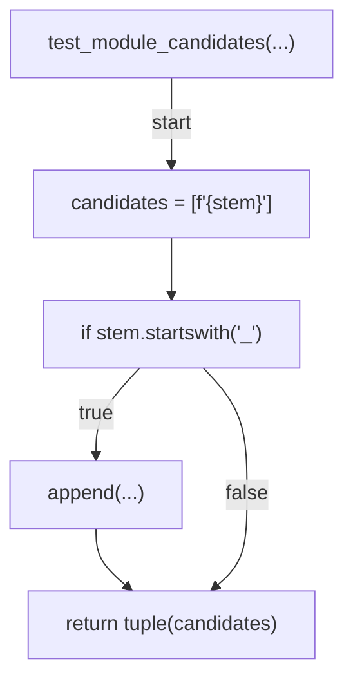

## has_test_module(...)

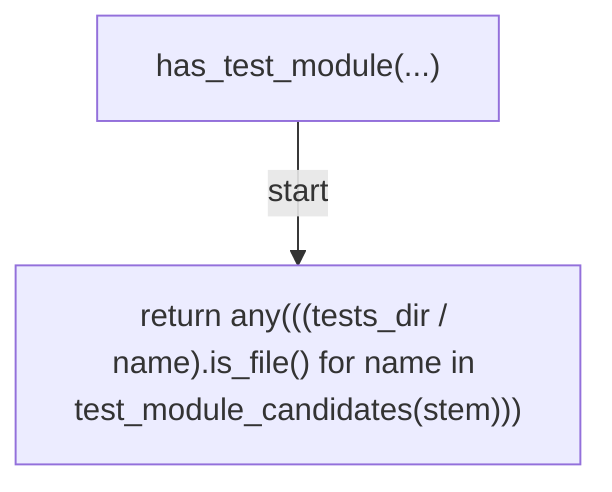

## module_imports(...)

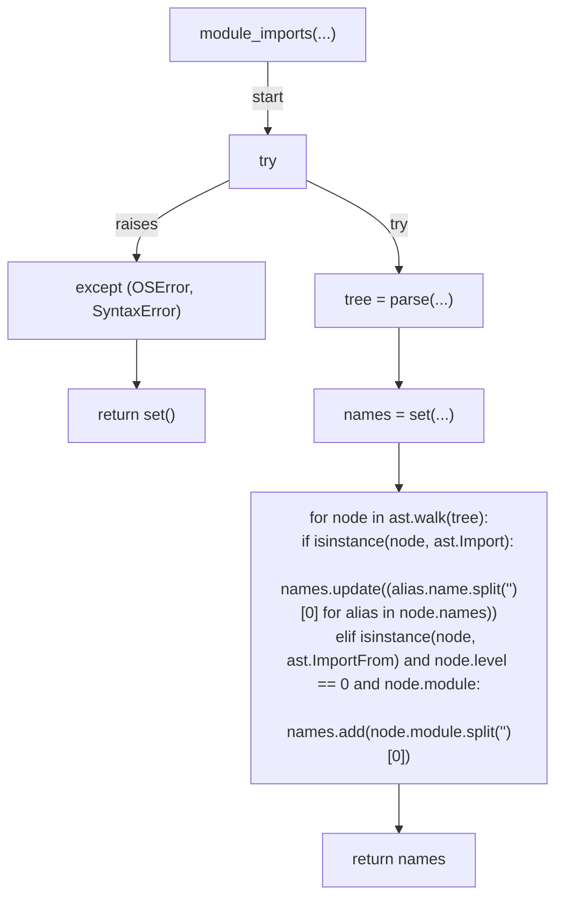

## detect_github_api_scripts(...)

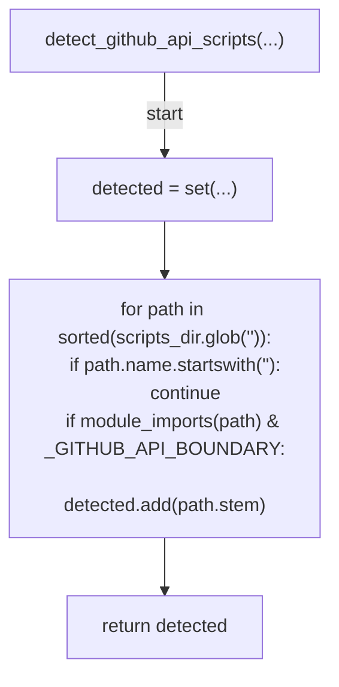

## parse_contract_registry_scripts(...)

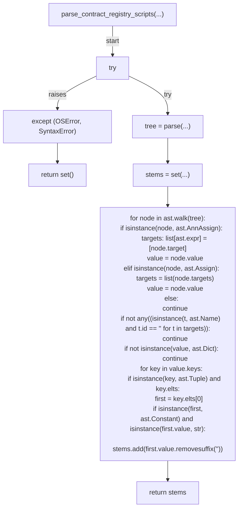

## find_missing_tests(...)

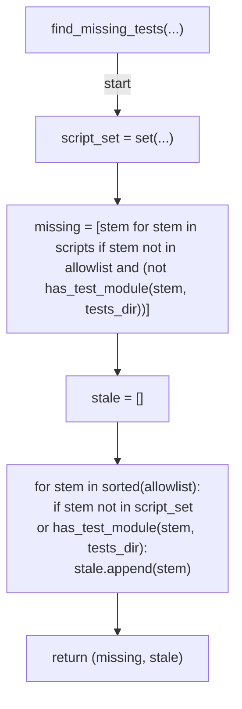

## find_github_api_drift(...)

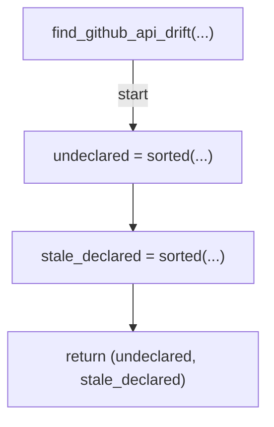

## find_missing_cli_contracts(...)

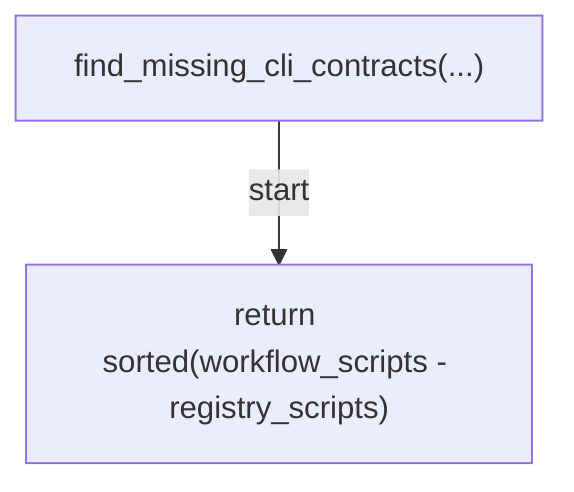

## collect_workflow_scripts(...)

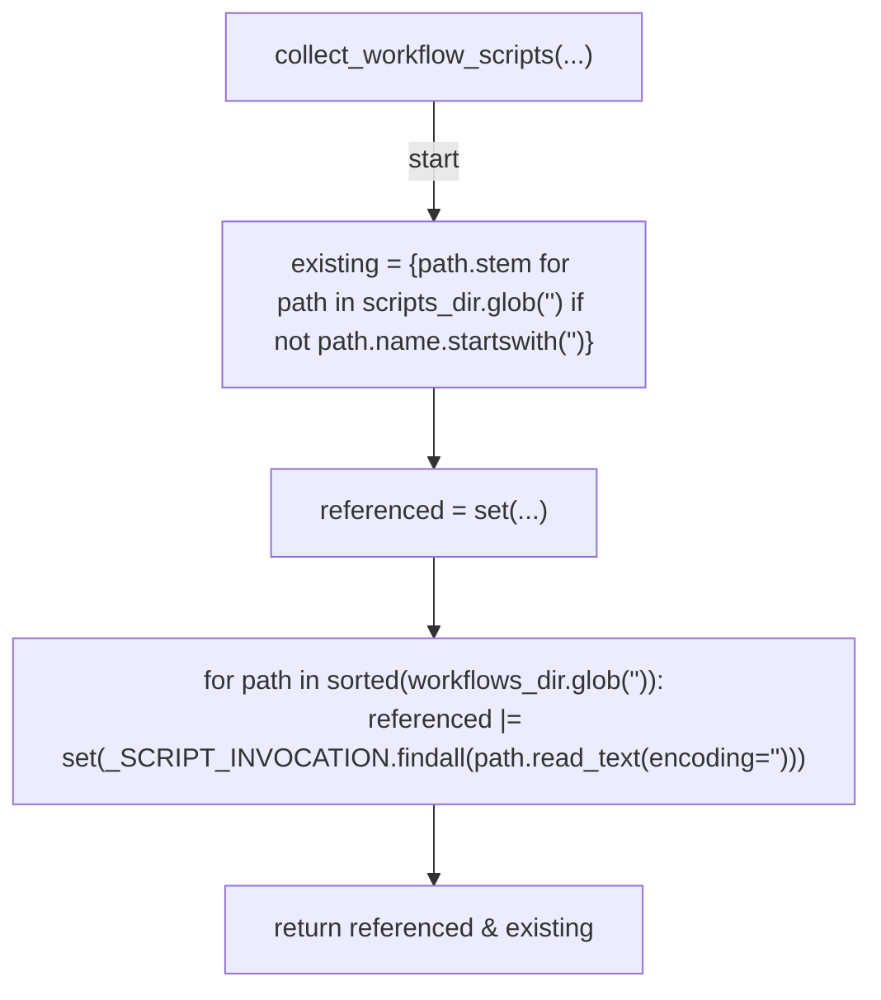

## cmd_verify(...)

```mermaid
flowchart TD
    N001["cmd_verify(...)"]
    N002["scripts_dir = Path(...)"]
    N003["tests_dir = Path(...)"]
    N004["workflows_dir = Path(...)"]
    N005["scripts = discover_scripts(...)"]
    N006["(missing, stale) = find_missing_tests(...)"]
    N007["detected_api = detect_github_api_scripts(...)"]
    N008["(undeclared_api, stale_api) = find_github_api_drift(...)"]
    N009["workflow_scripts = collect_workflow_scripts(...)"]
    N010["registry_scripts = parse_contract_registry_scripts(...)"]
    N011["missing_contract = find_missing_cli_contracts(...)"]
    N012["for stem in missing:
    print(f\"<str>{stem}<str>{stem}<str>{stem.lstrip('<str>')}<str>\", file=sys.stderr)"]
    N013["for stem in stale:
    print(f'<str>{stem}<str>', file=sys.stderr)"]
    N014["for stem in undeclared_api:
    print(f'<str>{stem}<str>{stem}<str>{stem}<str>', file=sys.stderr)"]
    N015["for stem in stale_api:
    print(f'<str>{stem}<str>', file=sys.stderr)"]
    N016["for stem in missing_contract:
    print(f'<str>{stem}<str>{stem}<str>{CONTRACT_TEST_MODULE}<str>', file=sys.stderr)"]
    N017["if missing or stale or undeclared_api or stale_api or missing_contract"]
    N018["return 1"]
    N019["return 0"]
    N001 -->|"start"| N002
    N002 --> N003
    N003 --> N004
    N004 --> N005
    N005 --> N006
    N006 --> N007
    N007 --> N008
    N008 --> N009
    N009 --> N010
    N010 --> N011
    N011 --> N012
    N012 --> N013
    N013 --> N014
    N014 --> N015
    N015 --> N016
    N016 --> N017
    N017 -->|"true"| N018
    N017 -->|"false"| N019
```

## main(...)

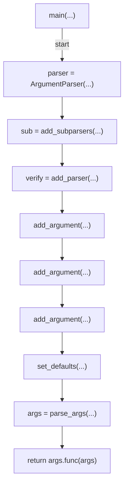
