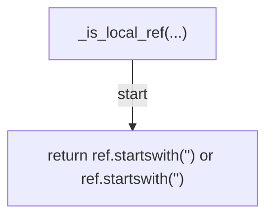
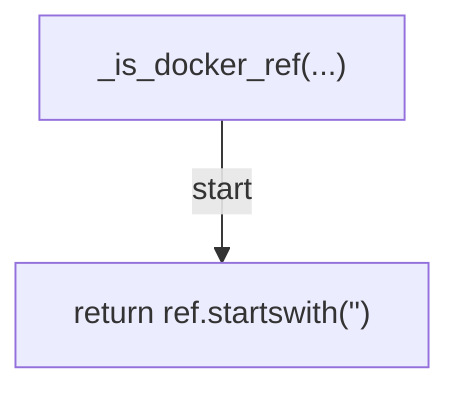
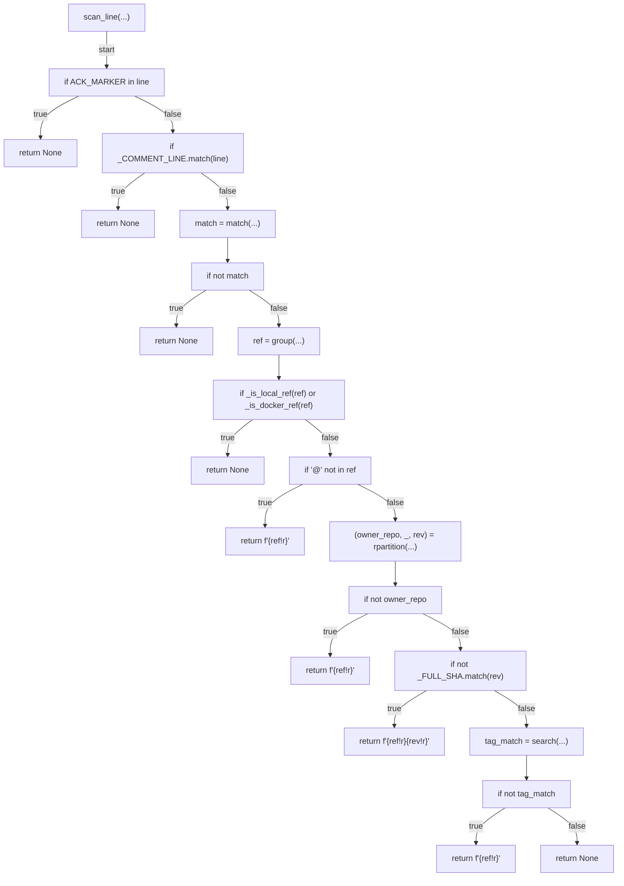
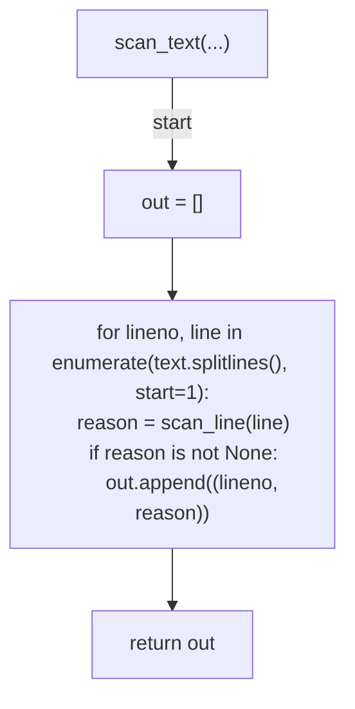
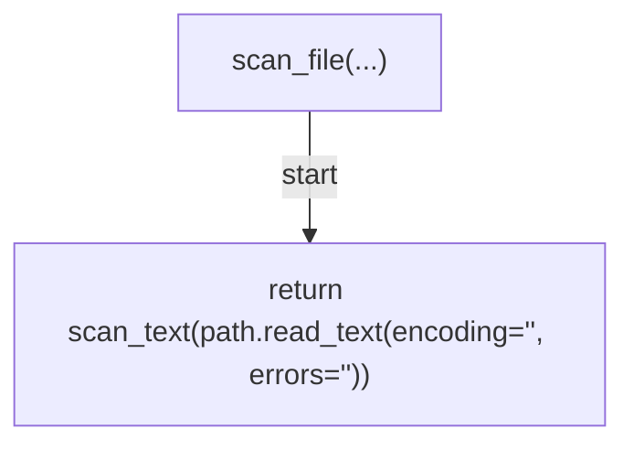
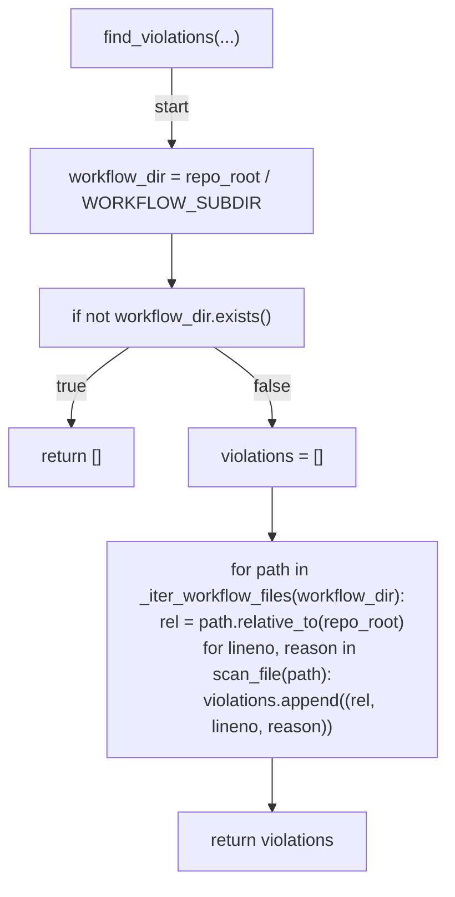
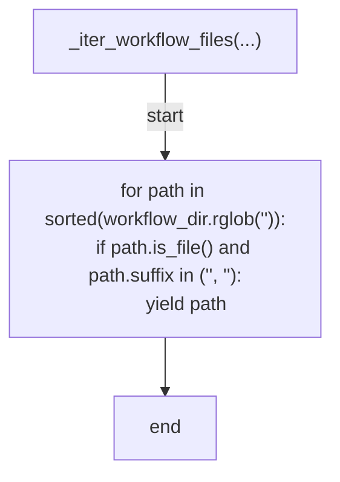
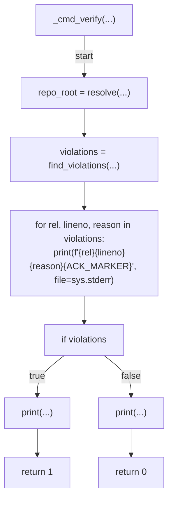
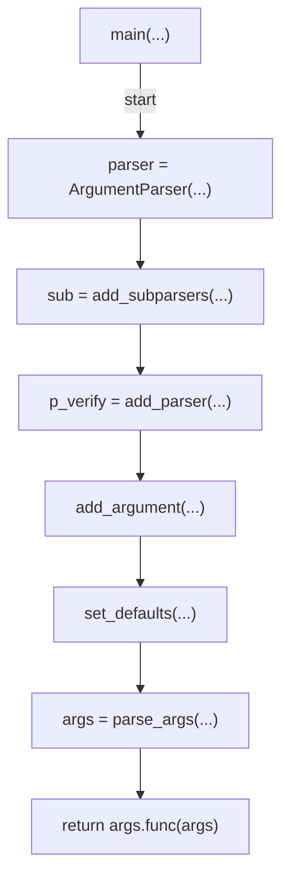

# AST graph: scripts/scan_workflow_action_pins.py

This file is generated from `scripts/scan_workflow_action_pins.py` by `python3 scripts/script_ast_graph.py all-doc`. Do not edit it by hand: content under `docs/generated/scripts/` is owned by the post-merge automation (refs #1540) -- update the source script instead.

## _is_local_ref(...)

## _is_docker_ref(...)

## scan_line(...)

## scan_text(...)

## scan_file(...)

## find_violations(...)

## _iter_workflow_files(...)

## _cmd_verify(...)

## main(...)

