# AST graph: scripts/scan_workflow_llm_budget.py

This file is generated from `scripts/scan_workflow_llm_budget.py` by `python3 scripts/script_ast_graph.py all-doc`. Do not edit it by hand: content under `docs/generated/scripts/` is owned by the post-merge automation (refs #1540); update the source script instead.

## load_policy(...)

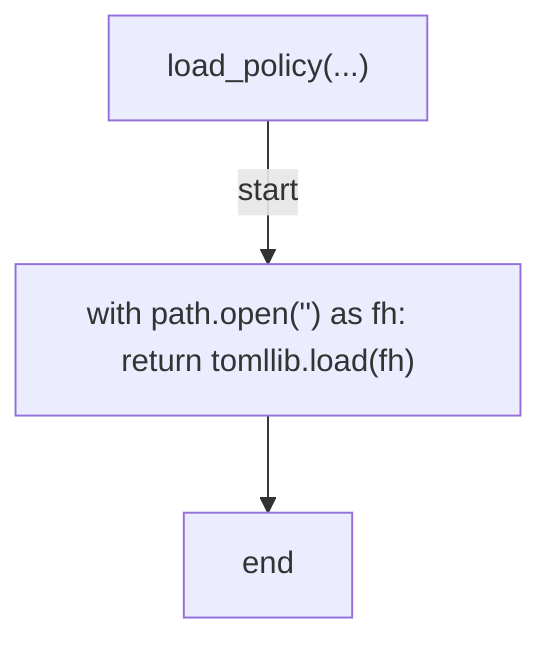

## extract_markers(...)

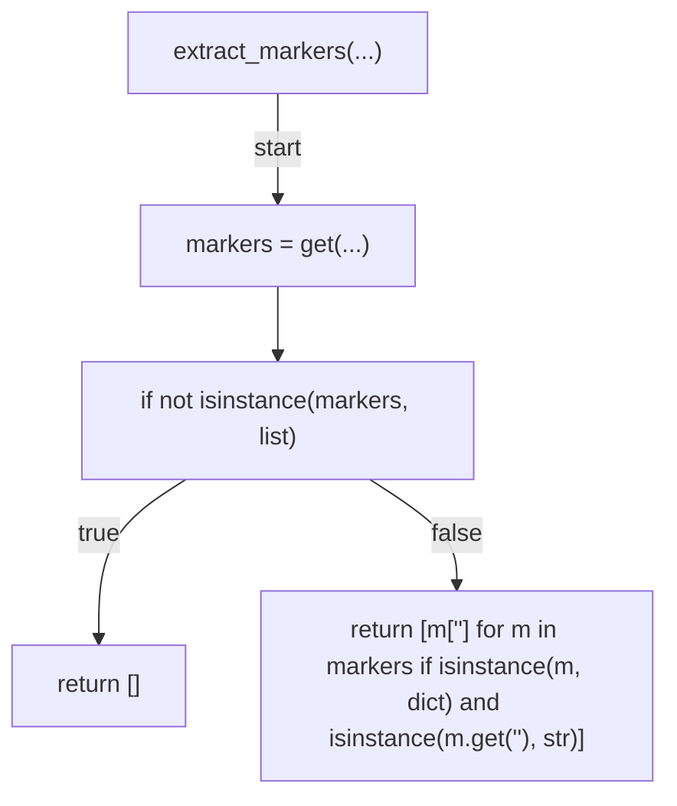

## extract_budgets(...)

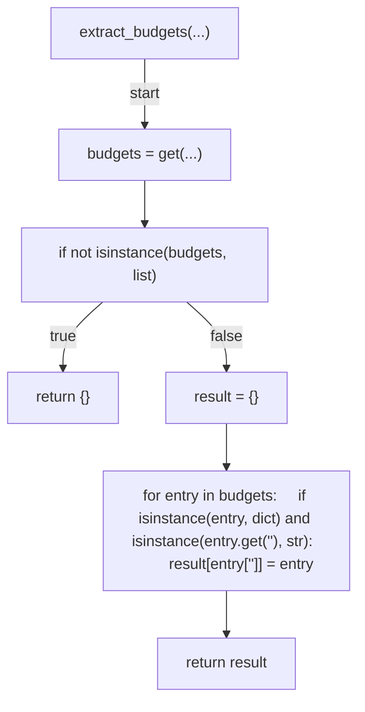

## _is_finite_nonnegative(...)

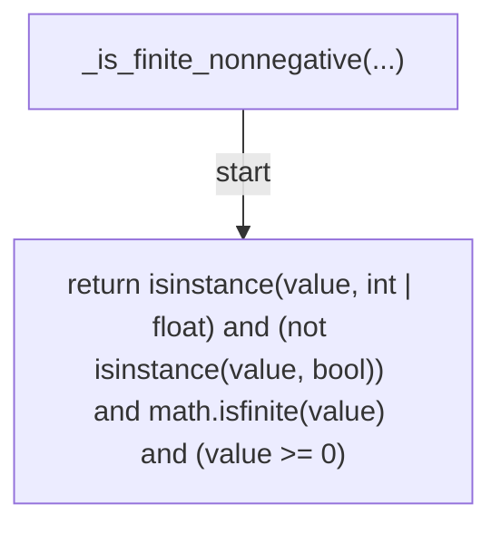

## _is_finite_positive(...)

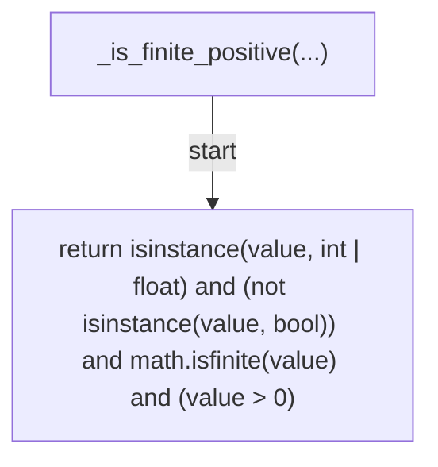

## missing_budget_keys(...)

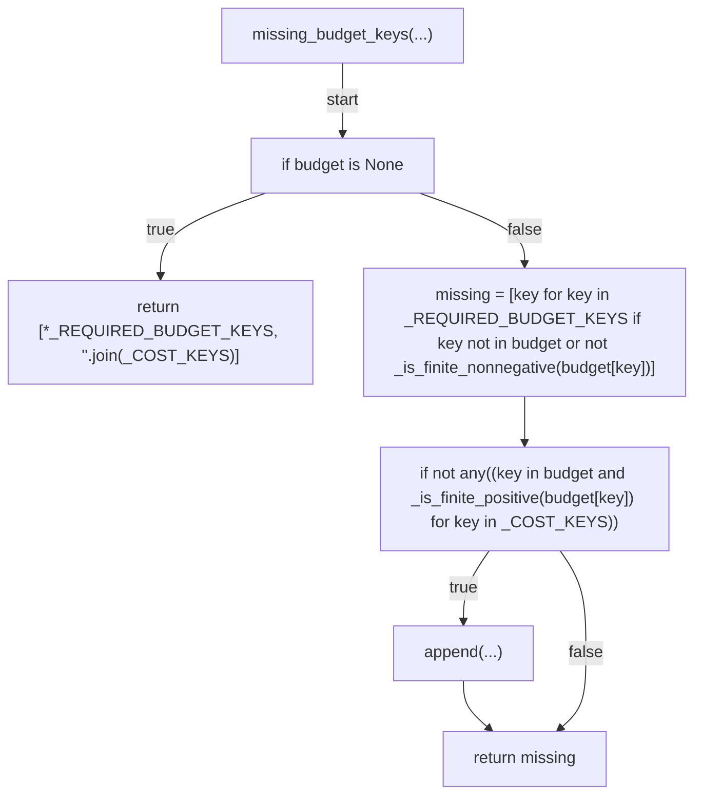

## scan_line(...)

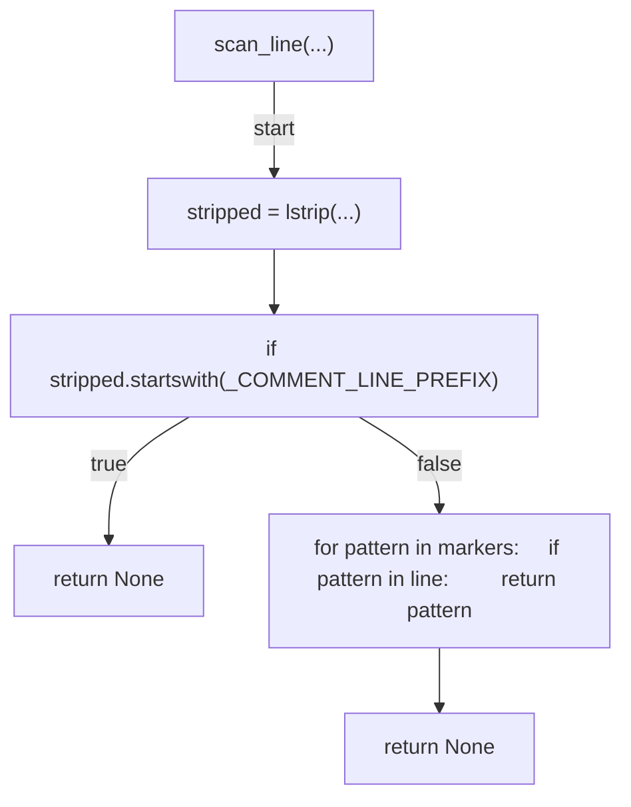

## scan_text(...)

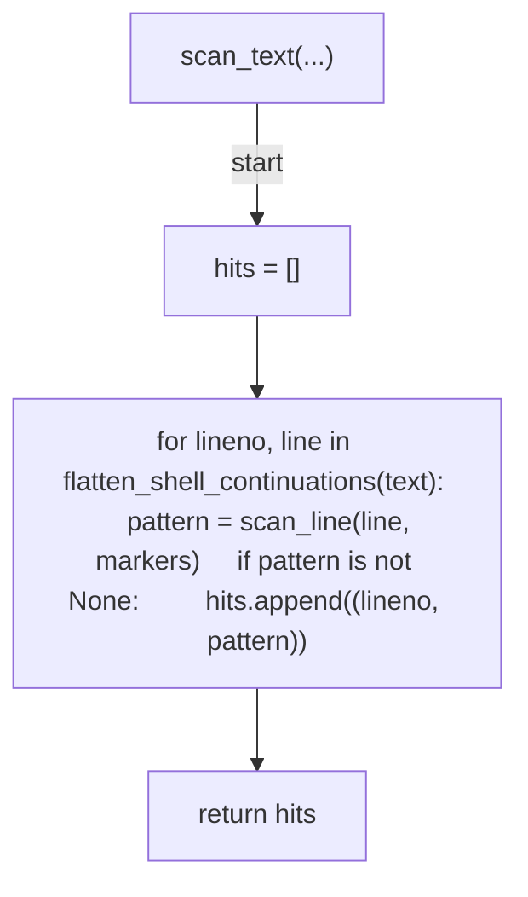

## _iter_workflow_files(...)

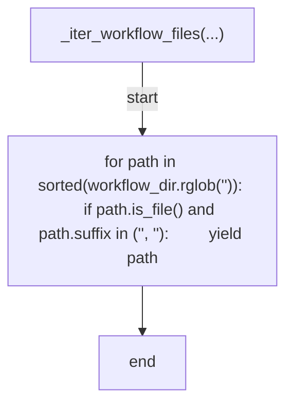

## find_marker_hits(...)

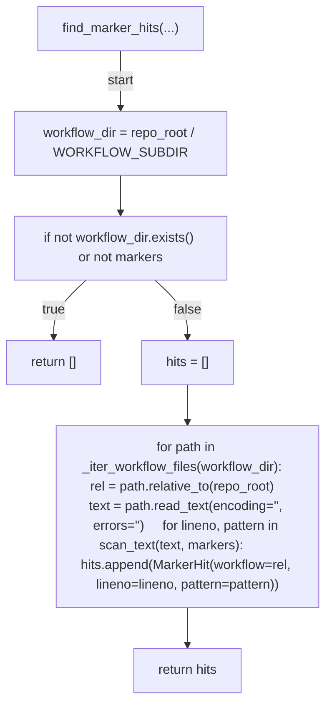

## find_violations(...)

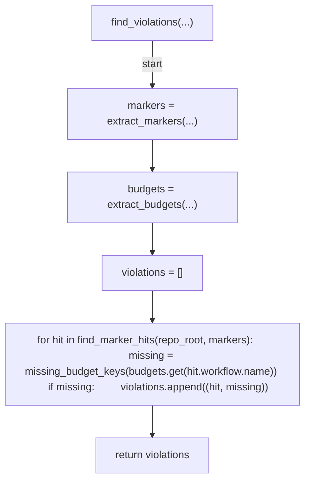

## _cmd_verify(...)

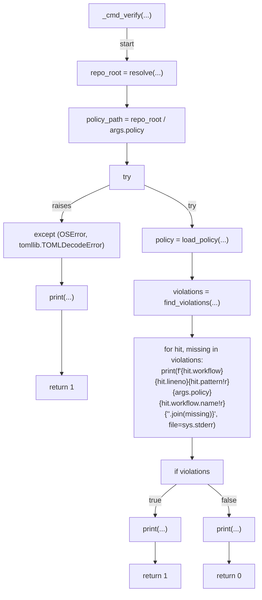

## main(...)

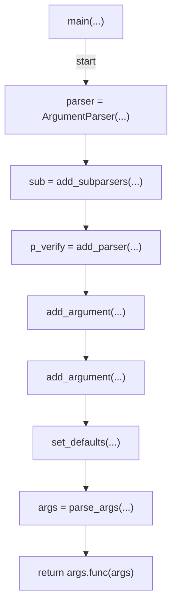
