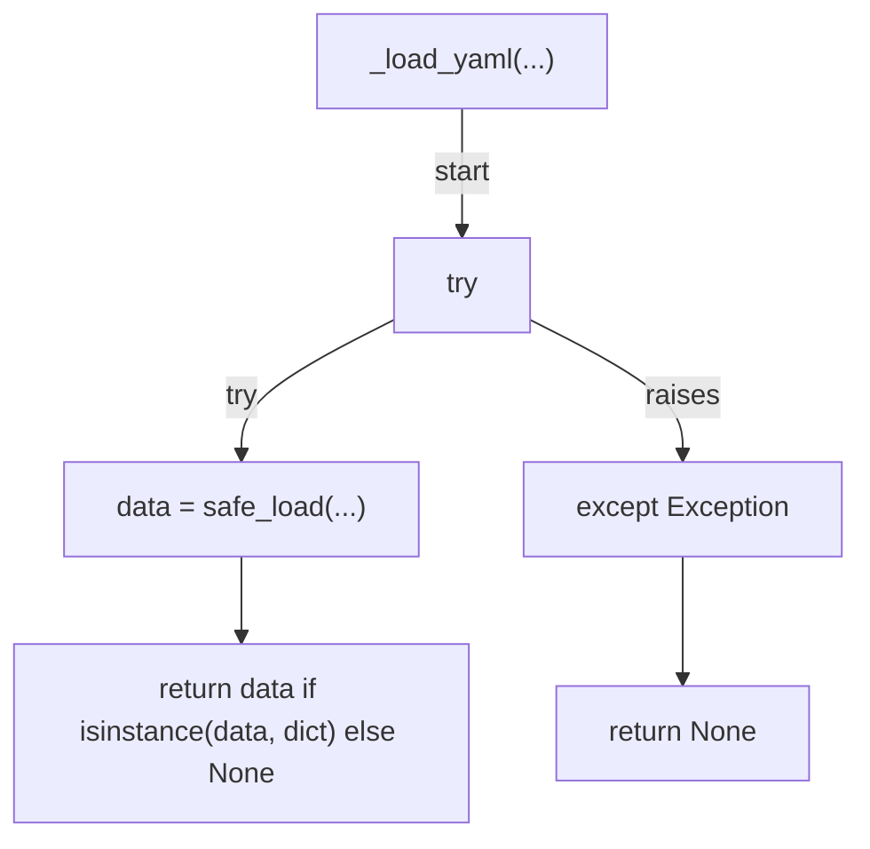
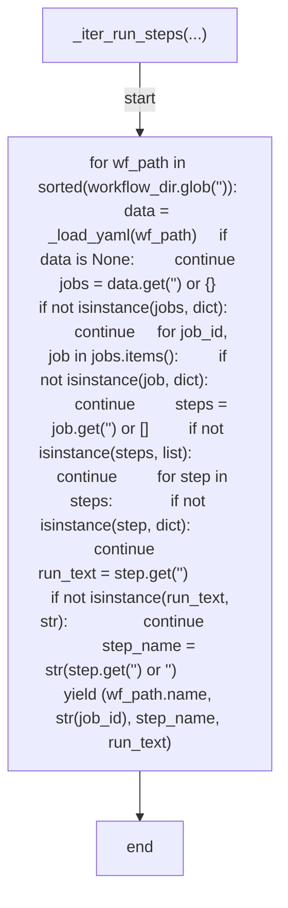
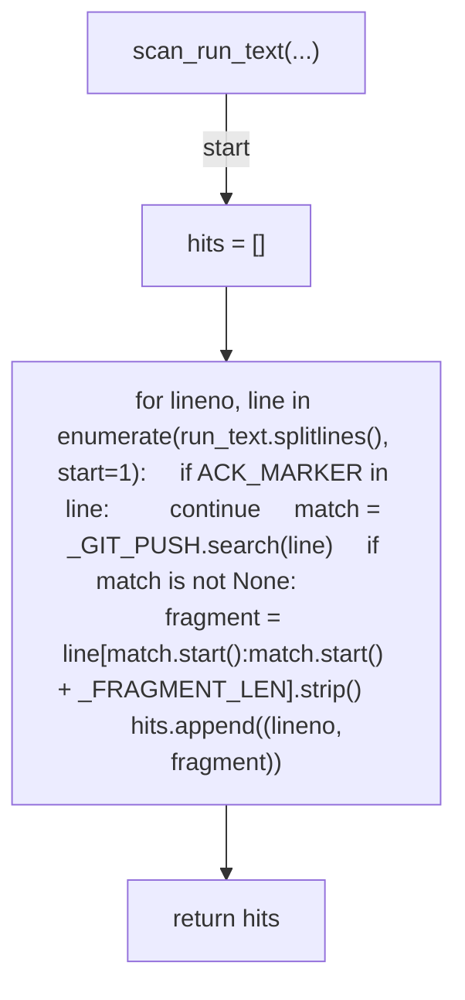
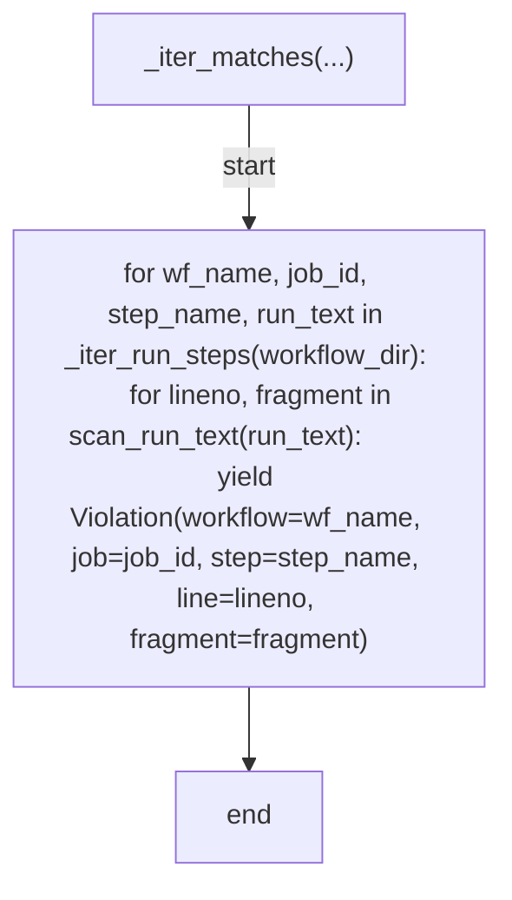
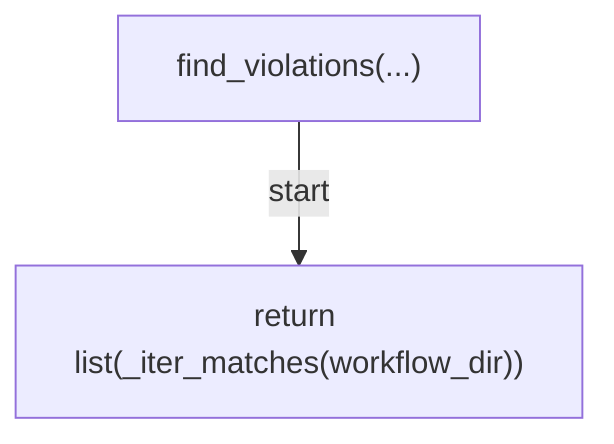
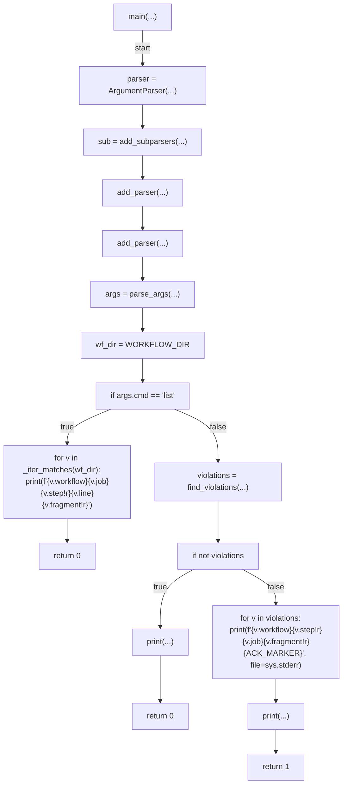

# AST graph: scripts/scan_workflow_unsigned_commit.py

This file is generated from `scripts/scan_workflow_unsigned_commit.py` by `python3 scripts/script_ast_graph.py all-doc`. Do not edit it by hand: content under `docs/generated/scripts/` is owned by the post-merge automation (refs #1540); update the source script instead.

## _load_yaml(...)

## _iter_run_steps(...)

## scan_run_text(...)

## _iter_matches(...)

## find_violations(...)

## main(...)

