# AST graph: scripts/script_ast_graph.py

This file is generated from `scripts/script_ast_graph.py` by `python3 scripts/script_ast_graph.py all-doc`. Do not edit it by hand: content under `docs/generated/scripts/` is owned by the post-merge automation (refs #1540) -- update the source script instead.

## iter_script_paths(...)

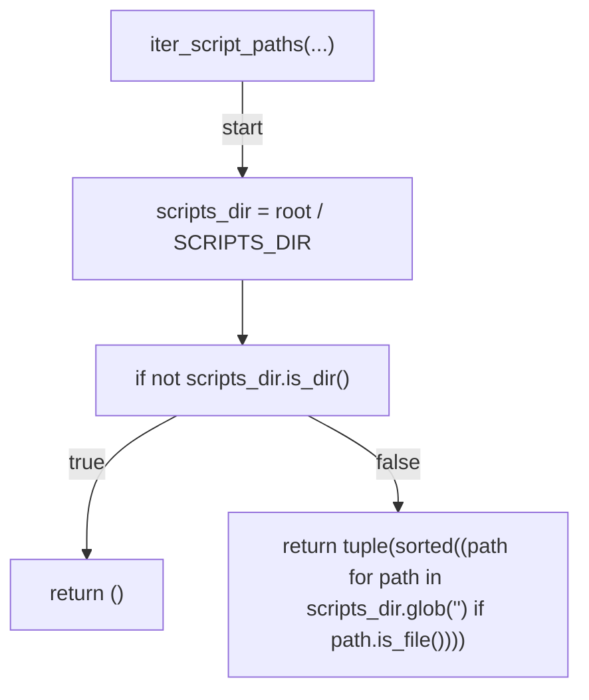

## _mermaid_text(...)

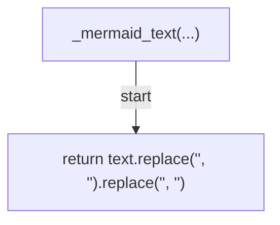

## _safe_label_node(...)

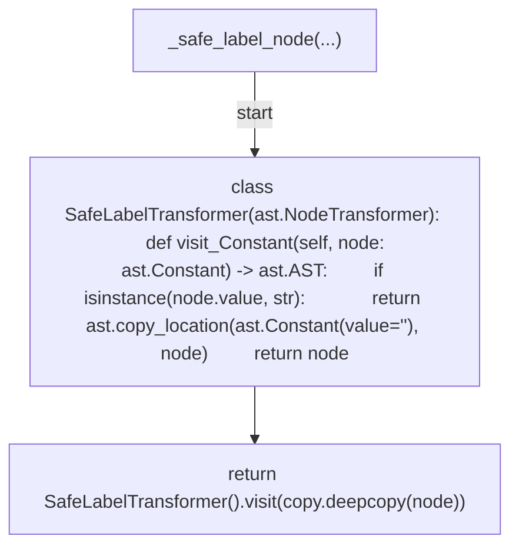

## _ast_text(...)

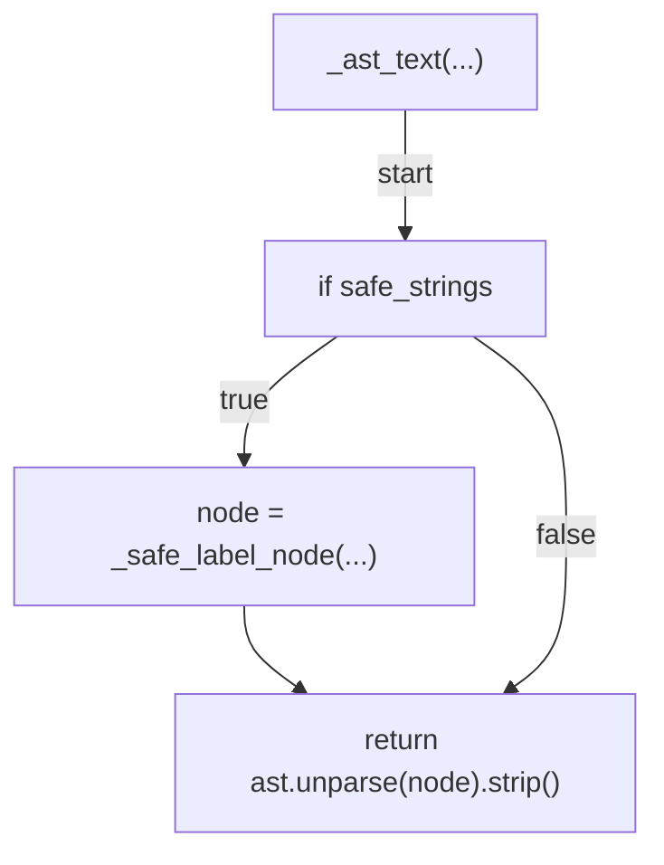

## _called_name(...)

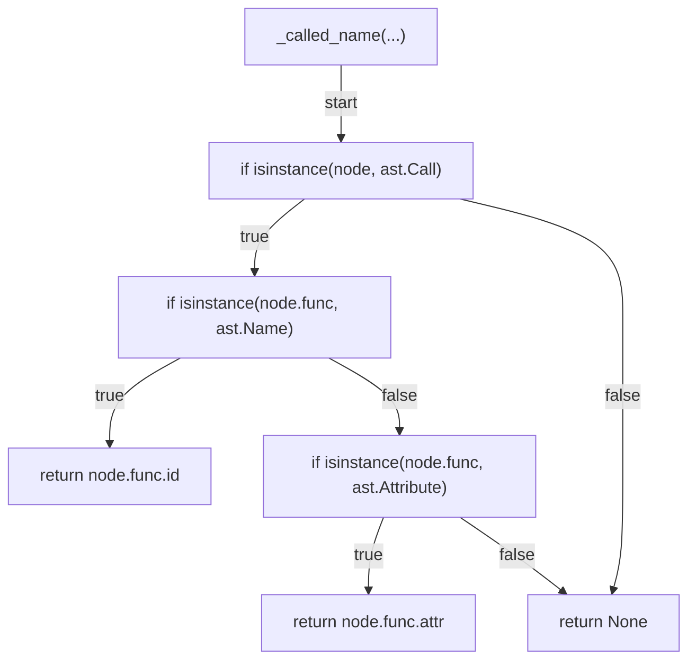

## _stmt_label(...)

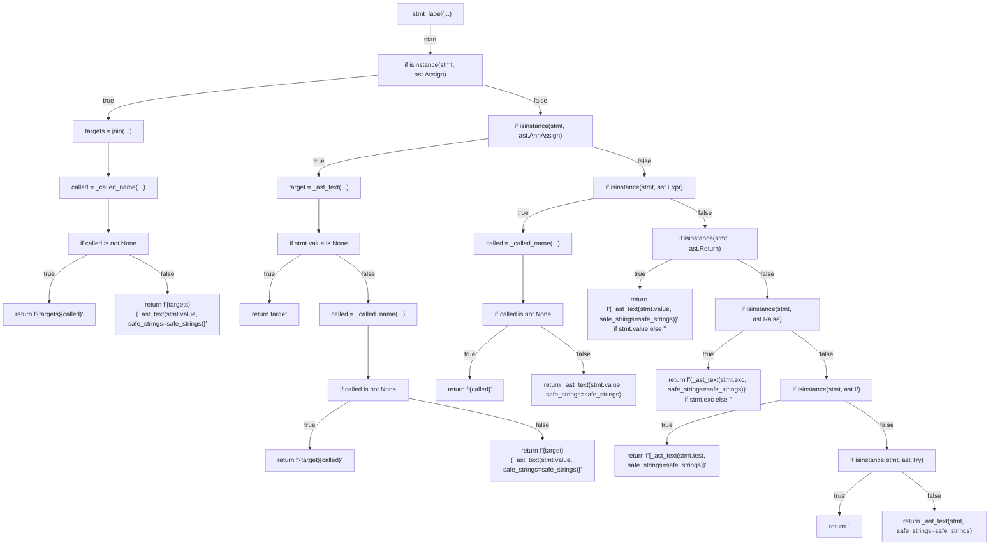

## _module_from_source(...)

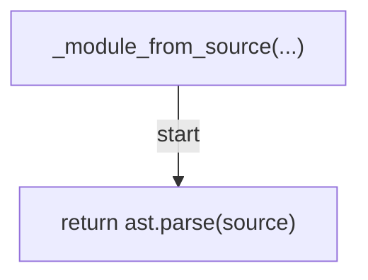

## _top_level_functions(...)

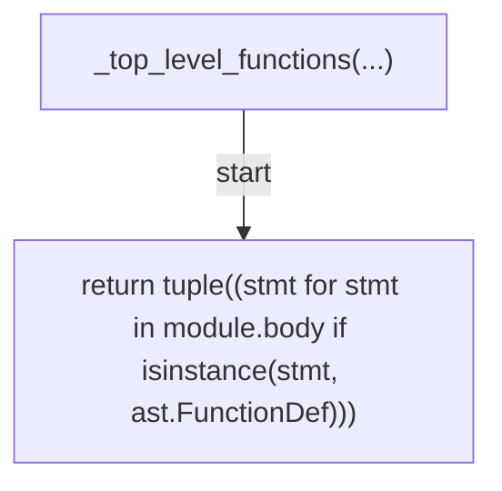

## build_function_graph_from_source(...)

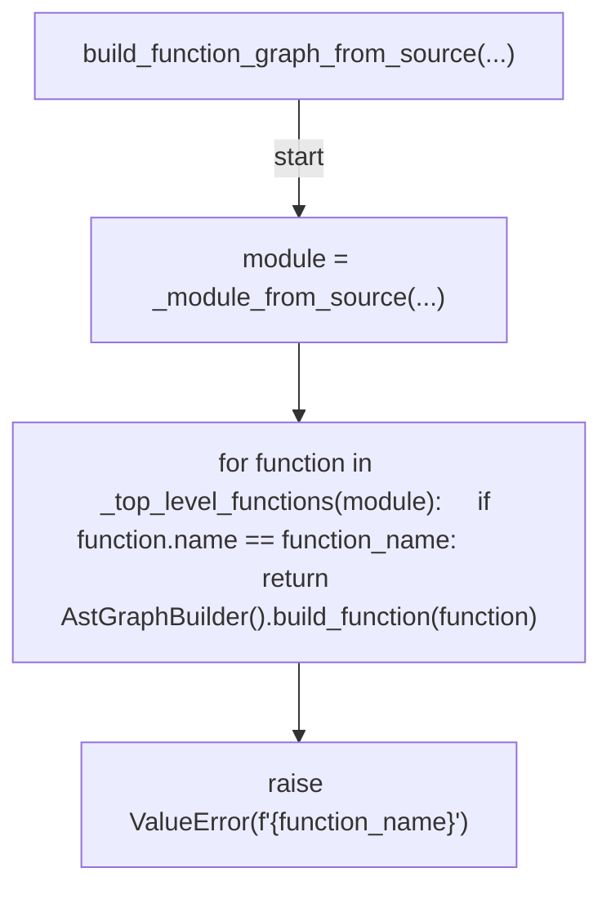

## build_function_graph(...)

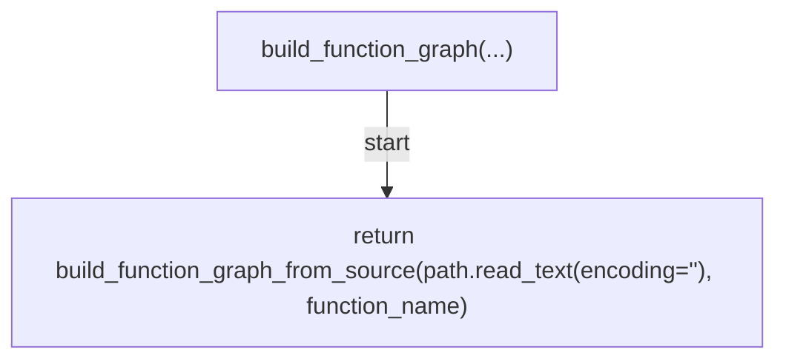

## build_script_graphs(...)

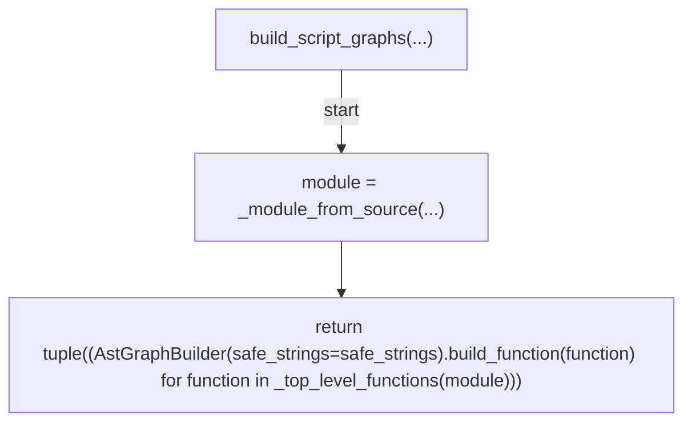

## render_mermaid(...)

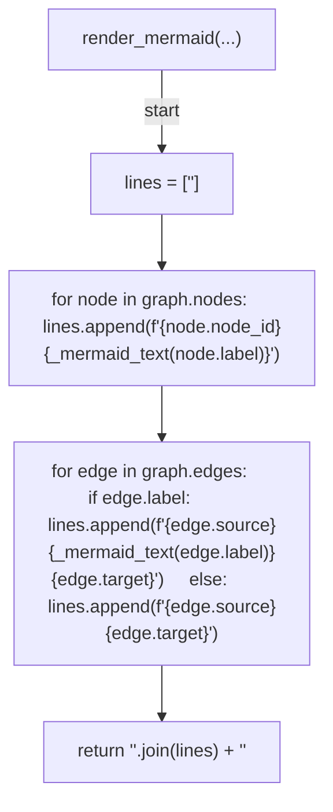

## _safe_generated_doc_label(...)

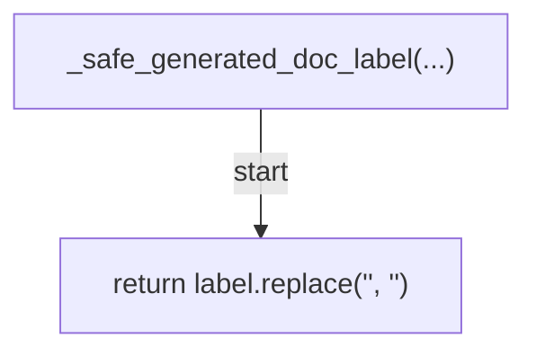

## _safe_generated_doc_graph(...)

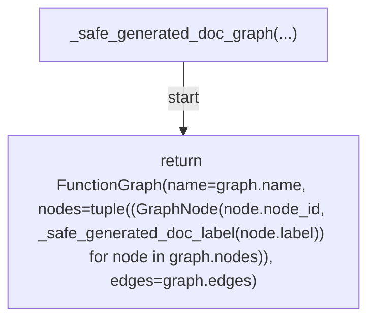

## render_script_ast_markdown(...)

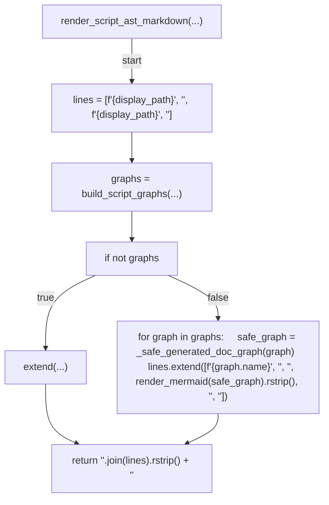

## doc_filename_for(...)

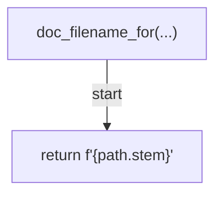

## write_all_script_docs(...)

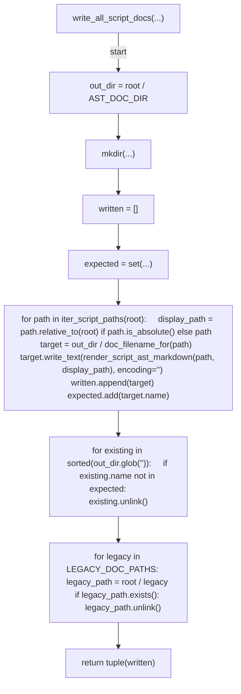

## _cmd_auto_retro_decision_tree(...)

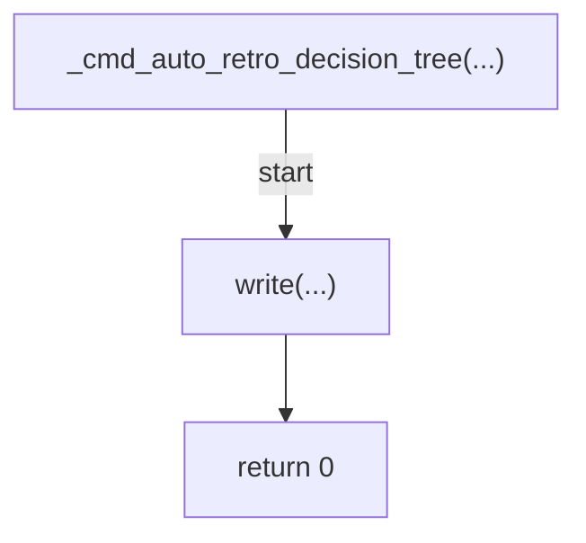

## _cmd_all_doc(...)

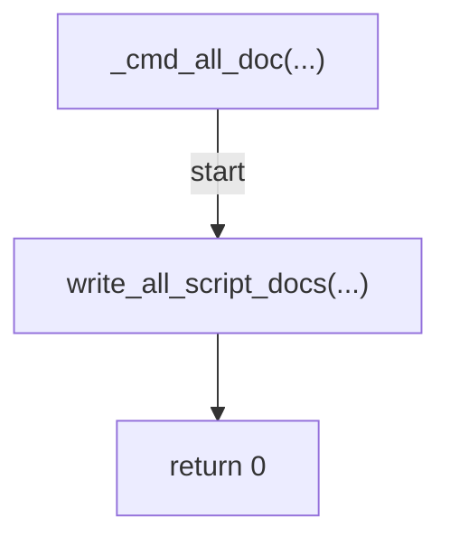

## main(...)

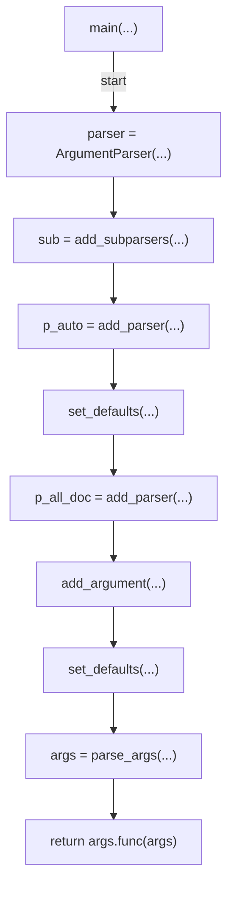
