# AST graph: scripts/script_dependency_graph.py

This file is generated from `scripts/script_dependency_graph.py` by `python3 scripts/script_ast_graph.py all-doc`. Do not edit it by hand: content under `docs/generated/scripts/` is owned by the post-merge automation (refs #1540); update the source script instead.

## iter_script_paths(...)

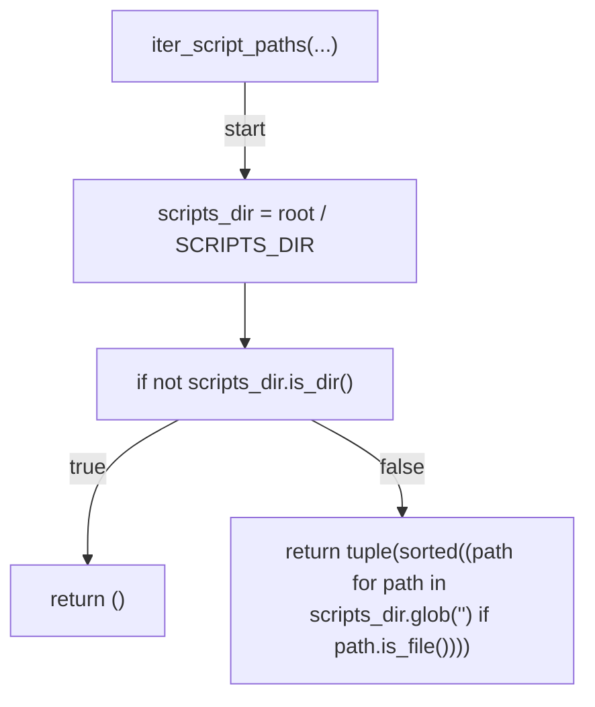

## script_stems(...)

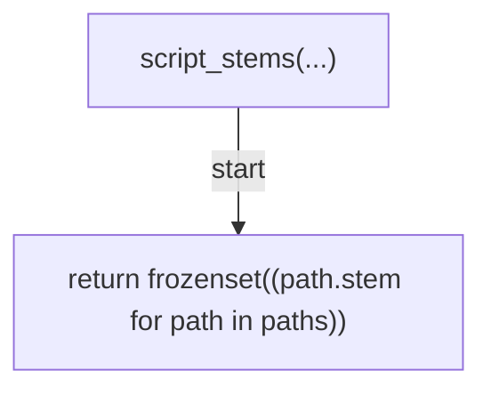

## _imported_top_levels(...)

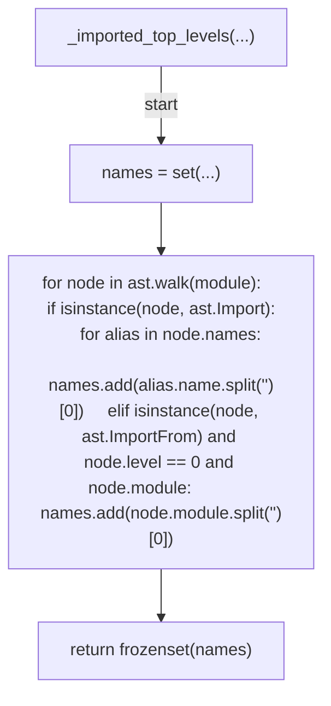

## extract_sibling_imports(...)

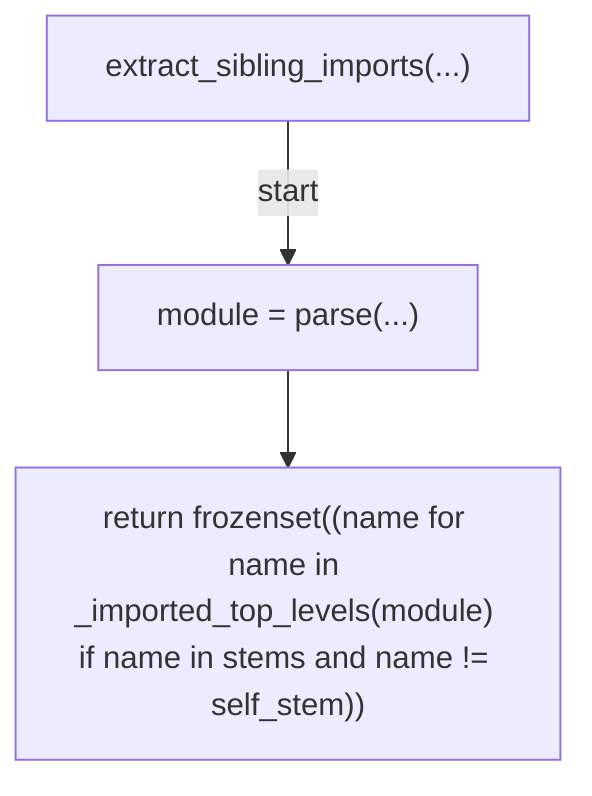

## dependency_edges(...)

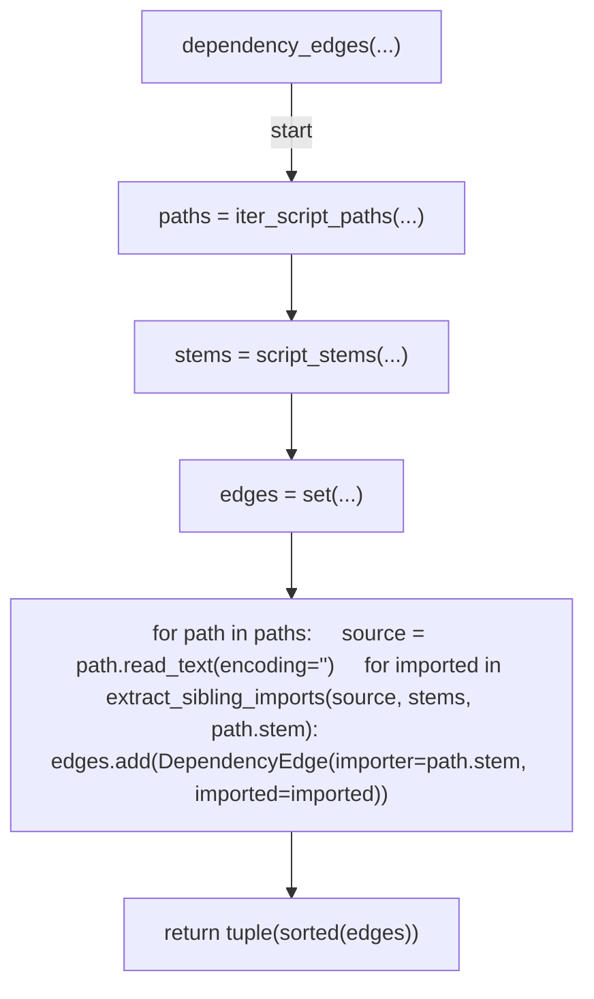

## _fan_in(...)

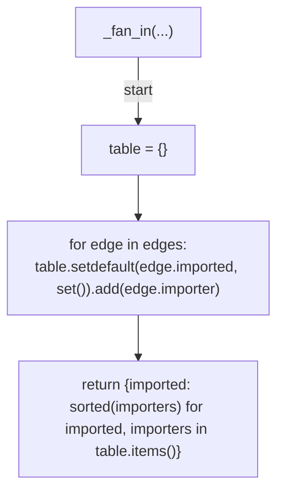

## _participating(...)

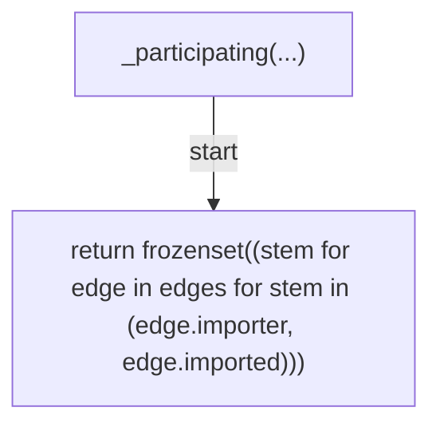

## render_dependency_markdown(...)

```mermaid
flowchart TD
    N001["render_dependency_markdown(...)"]
    N002["lines = ['<str>', '<str>', '<str>', '<str>']"]
    N003["fan_in = _fan_in(...)"]
    N004["extend(...)"]
    N005["if not fan_in"]
    N006["extend(...)"]
    N007["extend(...)"]
    N008["for imported in sorted(fan_in, key=lambda name: (-len(fan_in[name]), name)):     importers = fan_in[imported]     importer_cells = '<str>'.join((f'<str>{name}<str>' for name in importers))     lines.append(f'<str>{imported}<str>{len(importers)}<str>{importer_cells}<str>')"]
    N009["append(...)"]
    N010["participating = _participating(...)"]
    N011["isolated = sorted(...)"]
    N012["extend(...)"]
    N013["if not isolated"]
    N014["extend(...)"]
    N015["append(...)"]
    N016["append(...)"]
    N017["append(...)"]
    N018["append(...)"]
    N019["extend(...)"]
    N020["if not edges"]
    N021["extend(...)"]
    N022["mermaid = ['<str>']"]
    N023["for edge in edges:     mermaid.append(f'<str>{edge.importer}<str>{edge.imported}')"]
    N024["extend(...)"]
    N025["return '<str>'.join(lines).rstrip() + '<str>'"]
    N001 -->|"start"| N002
    N002 --> N003
    N003 --> N004
    N004 --> N005
    N005 -->|"true"| N006
    N005 -->|"false"| N007
    N007 --> N008
    N008 --> N009
    N006 --> N010
    N009 --> N010
    N010 --> N011
    N011 --> N012
    N012 --> N013
    N013 -->|"true"| N014
    N013 -->|"false"| N015
    N015 --> N016
    N016 --> N017
    N017 --> N018
    N014 --> N019
    N018 --> N019
    N019 --> N020
    N020 -->|"true"| N021
    N020 -->|"false"| N022
    N022 --> N023
    N023 --> N024
    N021 --> N025
    N024 --> N025
```

## build_document(...)

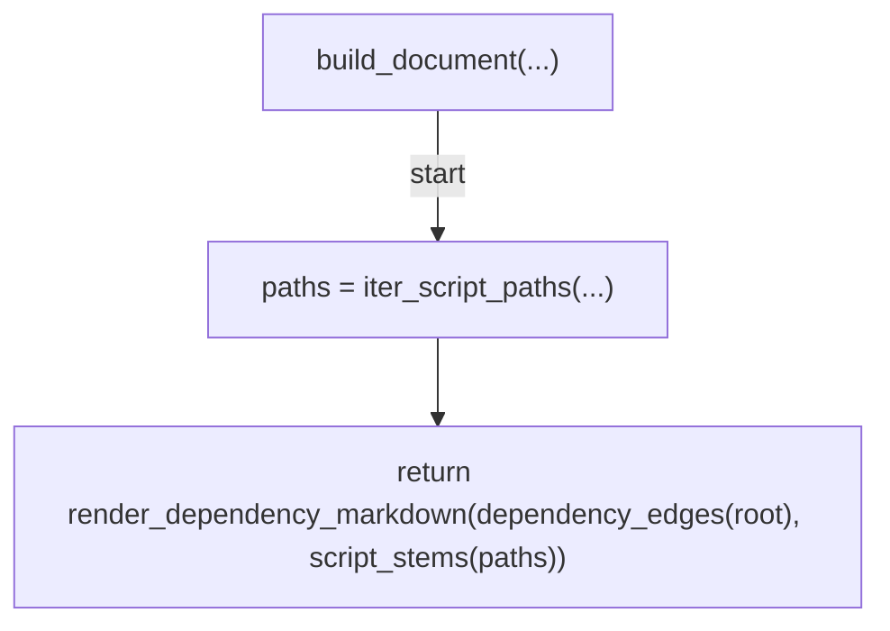

## write_dependency_doc(...)

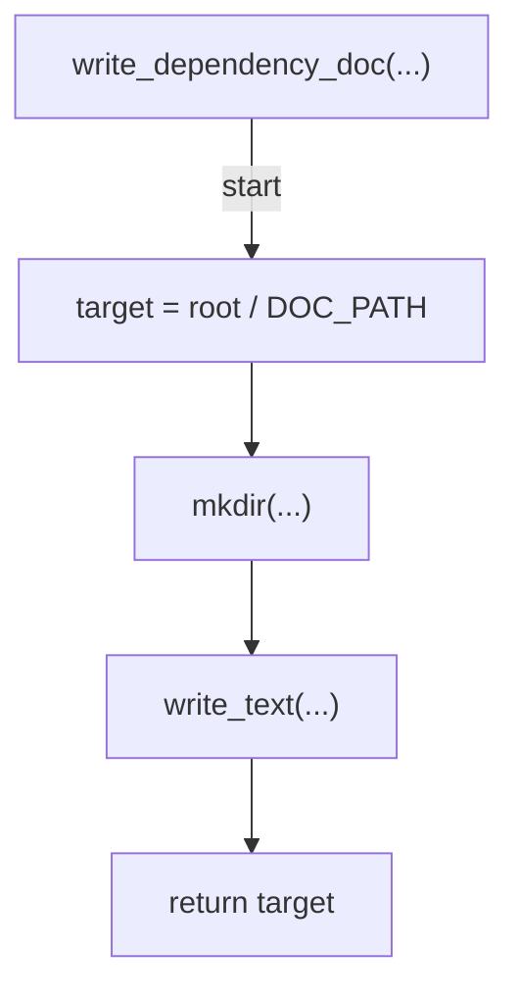

## _cmd_all_doc(...)

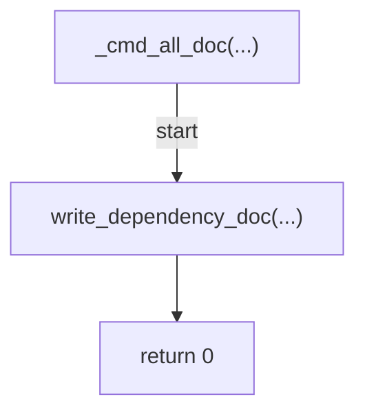

## _cmd_preview(...)

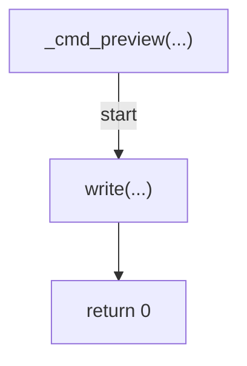

## main(...)

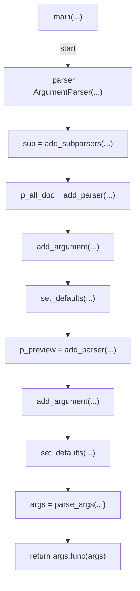
