# AST graph: scripts/script_trigger_map.py

This file is generated from `scripts/script_trigger_map.py` by `python3 scripts/script_ast_graph.py all-doc`. Do not edit it by hand: content under `docs/generated/scripts/` is owned by the post-merge automation (refs #1540) -- update the source script instead.

## script_filenames(...)

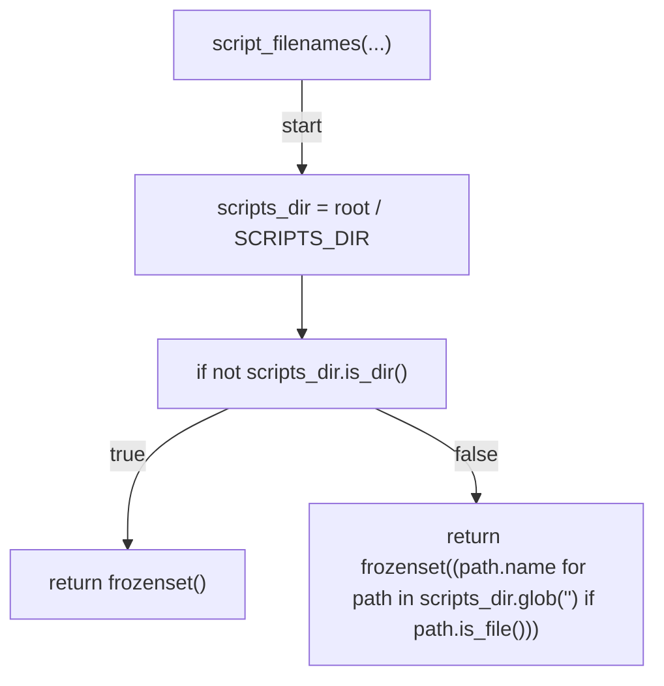

## _workflow_refs(...)

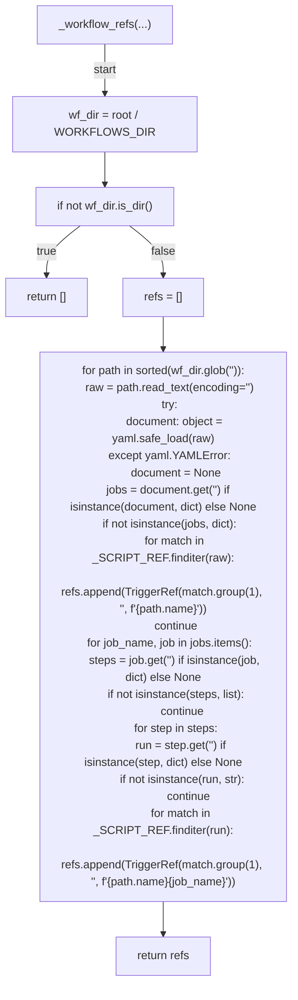

## _precommit_refs(...)

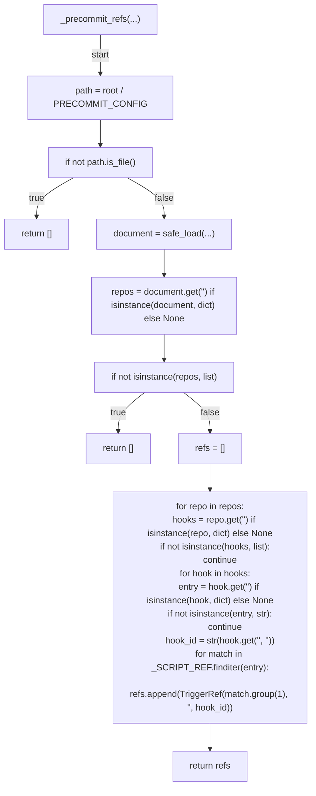

## _str_constants(...)

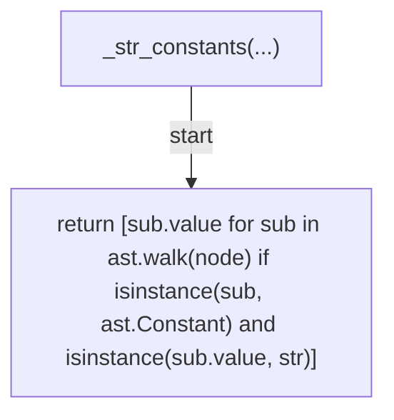

## _step_name(...)

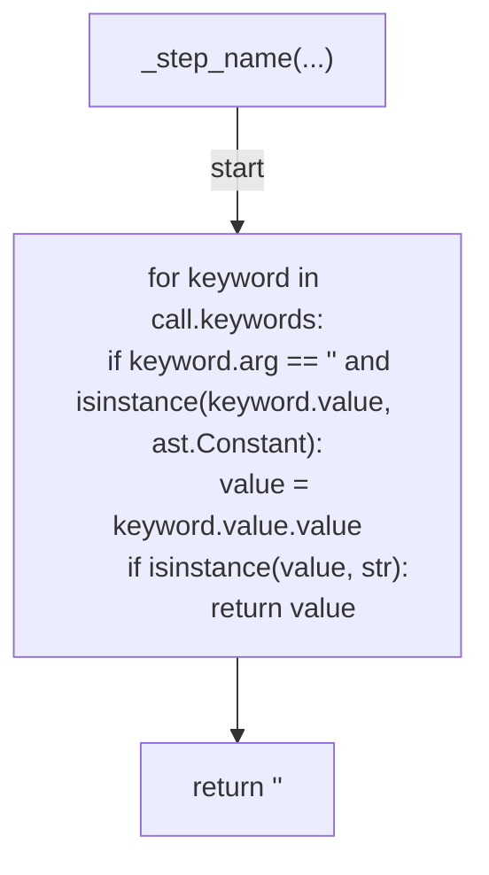

## _preflight_refs(...)

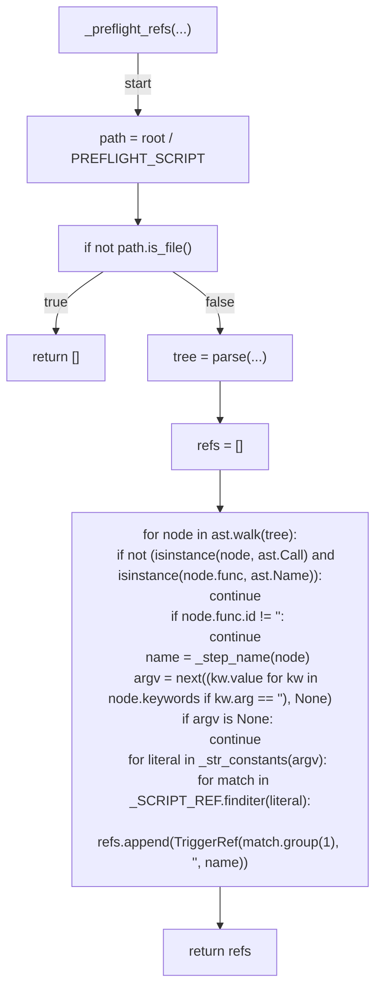

## _agent_hook_refs(...)

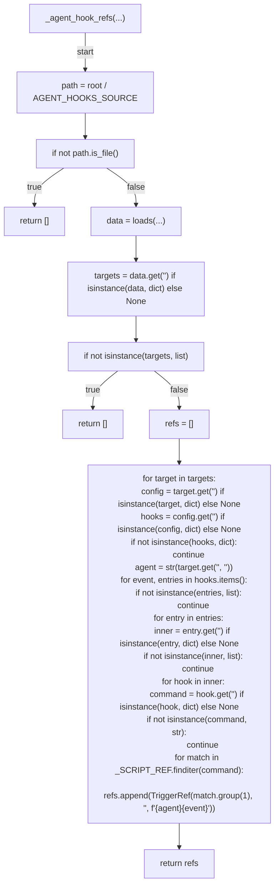

## collect_refs(...)

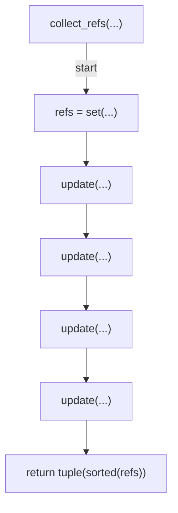

## unreferenced_scripts(...)

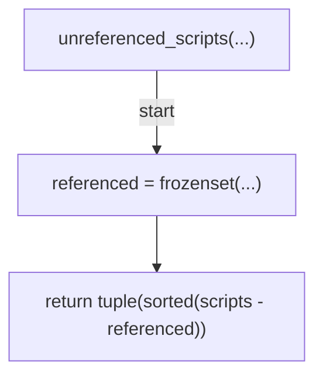

## render_trigger_markdown(...)

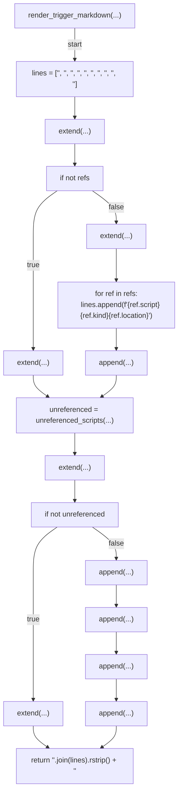

## build_document(...)

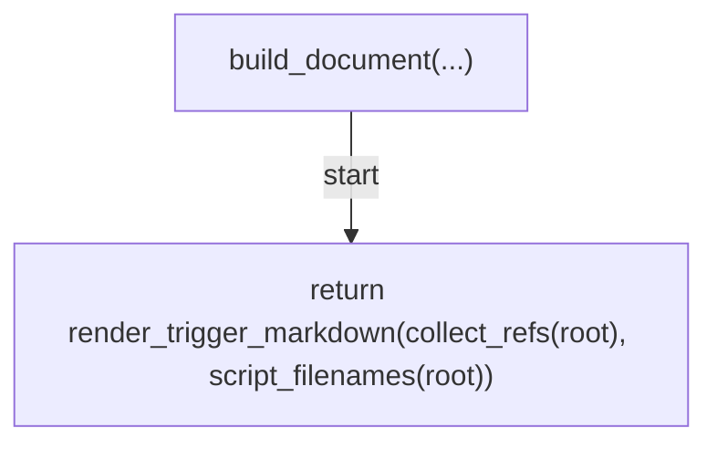

## write_trigger_doc(...)

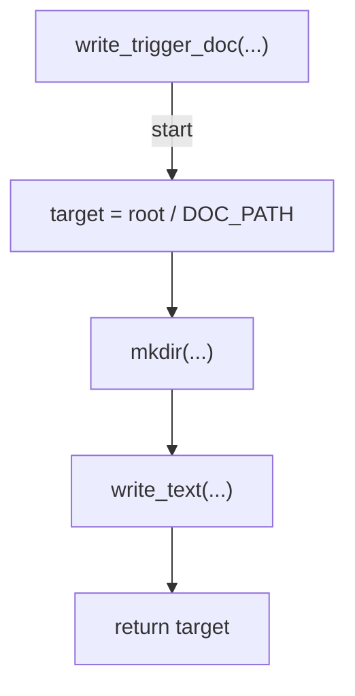

## _cmd_all_doc(...)

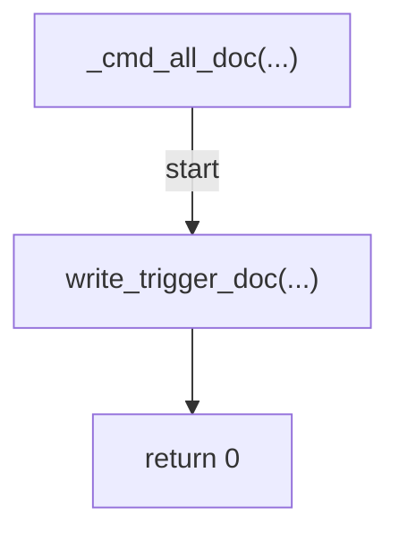

## _cmd_preview(...)

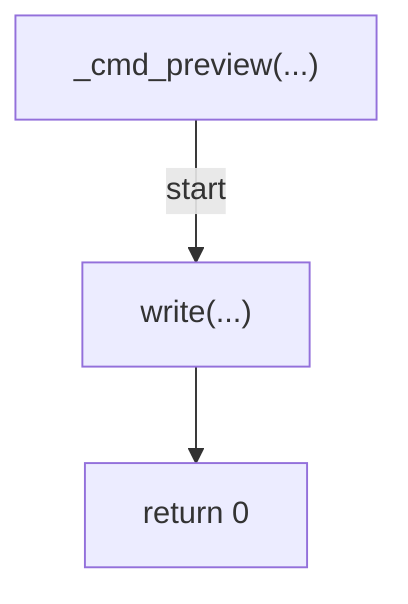

## main(...)

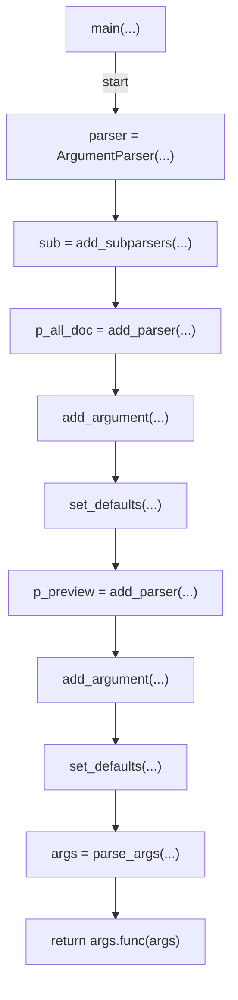
