# AST graph: scripts/security_drift_report.py

This file is generated from `scripts/security_drift_report.py` by `python3 scripts/script_ast_graph.py all-doc`. Do not edit it by hand: content under `docs/generated/scripts/` is owned by the post-merge automation (refs #1540); update the source script instead.

## parse_dry_run(...)

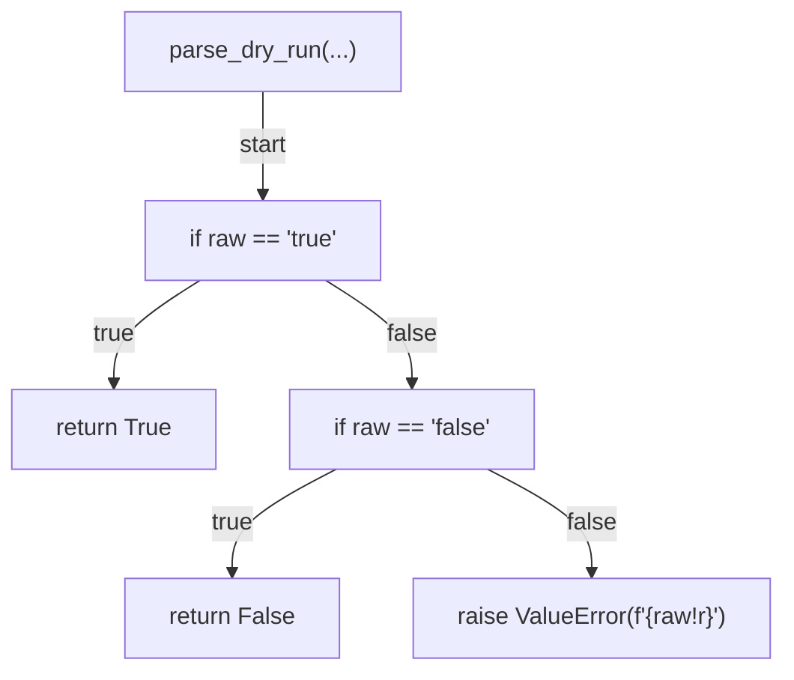
```mermaid
flowchart TD
    N001["parse_dry_run(...)"]
    N002["if raw == 'true'"]
    N003["return True"]
    N004["if raw == 'false'"]
    N005["return False"]
    N006["raise ValueError(f'<str>{raw!r}')"]
    N001 -->|"start"| N002
    N002 -->|"true"| N003
    N002 -->|"false"| N004
    N004 -->|"true"| N005
    N004 -->|"false"| N006
```

## parse_int_flag(...)

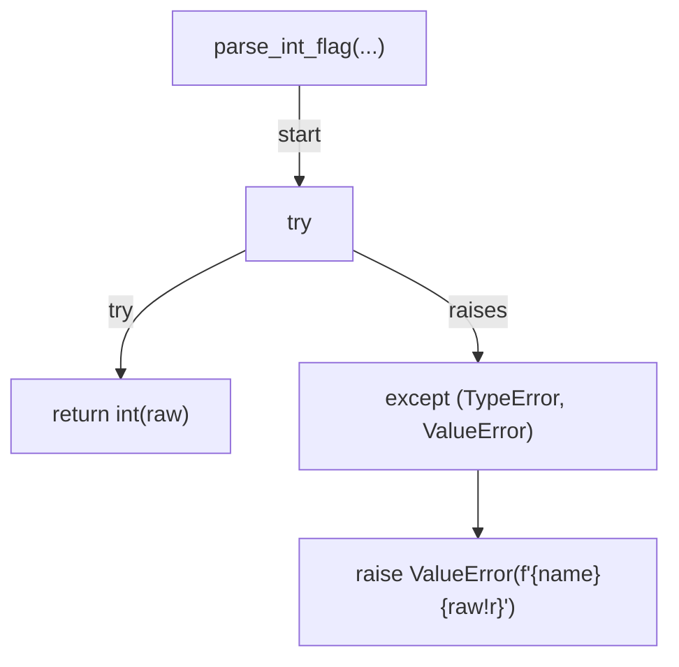
```mermaid
flowchart TD
    N001["parse_int_flag(...)"]
    N002["try"]
    N003["return int(raw)"]
    N004["except (TypeError, ValueError)"]
    N005["raise ValueError(f'{name}<str>{raw!r}')"]
    N001 -->|"start"| N002
    N002 -->|"try"| N003
    N002 -->|"raises"| N004
    N004 --> N005
```

## parse_detect_output(...)

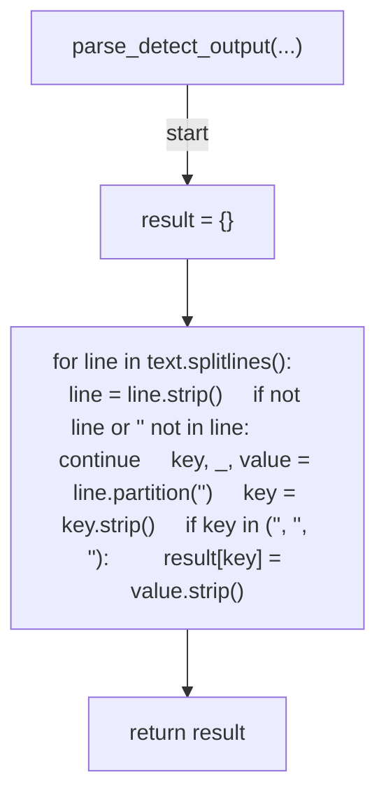
```mermaid
flowchart TD
    N001["parse_detect_output(...)"]
    N002["result = {}"]
    N003["for line in text.splitlines():     line = line.strip()     if not line or '<str>' not in line:         continue     key, _, value = line.partition('<str>')     key = key.strip()     if key in ('<str>', '<str>', '<str>'):         result[key] = value.strip()"]
    N004["return result"]
    N001 -->|"start"| N002
    N002 --> N003
    N003 --> N004
```

## labels_plan_has_drift(...)

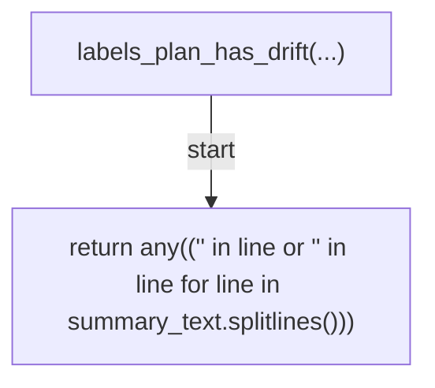
```mermaid
flowchart TD
    N001["labels_plan_has_drift(...)"]
    N002["return any(('<str>' in line or '<str>' in line for line in summary_text.splitlines()))"]
    N001 -->|"start"| N002
```

## uv_stale_has_warning(...)

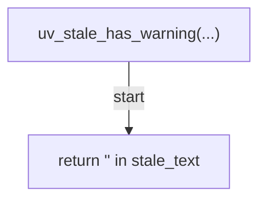
```mermaid
flowchart TD
    N001["uv_stale_has_warning(...)"]
    N002["return '<str>' in stale_text"]
    N001 -->|"start"| N002
```

## classify_rulesets(...)

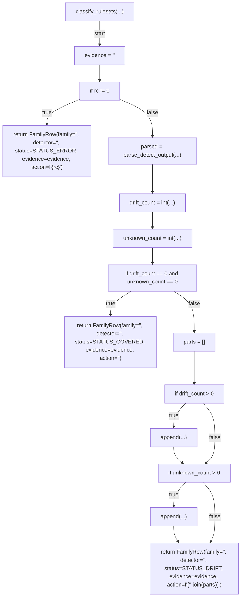
```mermaid
flowchart TD
    N001["classify_rulesets(...)"]
    N002["evidence = '<str>'"]
    N003["if rc != 0"]
    N004["return FamilyRow(family='<str>', detector='<str>', status=STATUS_ERROR, evidence=evidence, action=f'<str>{rc}<str>')"]
    N005["parsed = parse_detect_output(...)"]
    N006["drift_count = int(...)"]
    N007["unknown_count = int(...)"]
    N008["if drift_count == 0 and unknown_count == 0"]
    N009["return FamilyRow(family='<str>', detector='<str>', status=STATUS_COVERED, evidence=evidence, action='<str>')"]
    N010["parts = []"]
    N011["if drift_count > 0"]
    N012["append(...)"]
    N013["if unknown_count > 0"]
    N014["append(...)"]
    N015["return FamilyRow(family='<str>', detector='<str>', status=STATUS_DRIFT, evidence=evidence, action=f'{'<str>'.join(parts)}<str>')"]
    N001 -->|"start"| N002
    N002 --> N003
    N003 -->|"true"| N004
    N003 -->|"false"| N005
    N005 --> N006
    N006 --> N007
    N007 --> N008
    N008 -->|"true"| N009
    N008 -->|"false"| N010
    N010 --> N011
    N011 -->|"true"| N012
    N012 --> N013
    N011 -->|"false"| N013
    N013 -->|"true"| N014
    N014 --> N015
    N013 -->|"false"| N015
```

## classify_labels(...)

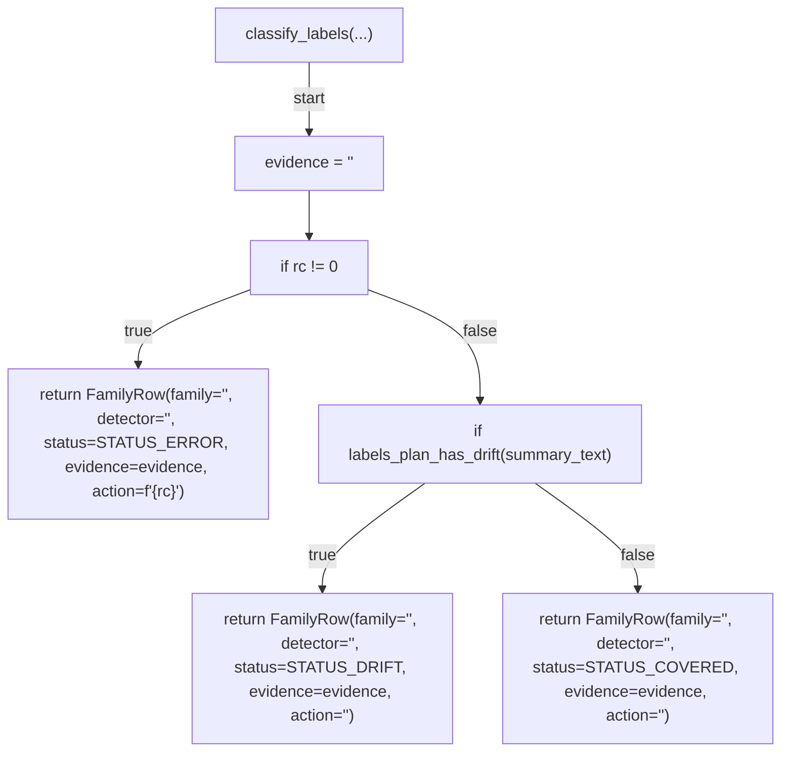
```mermaid
flowchart TD
    N001["classify_labels(...)"]
    N002["evidence = '<str>'"]
    N003["if rc != 0"]
    N004["return FamilyRow(family='<str>', detector='<str>', status=STATUS_ERROR, evidence=evidence, action=f'<str>{rc}<str>')"]
    N005["if labels_plan_has_drift(summary_text)"]
    N006["return FamilyRow(family='<str>', detector='<str>', status=STATUS_DRIFT, evidence=evidence, action='<str>')"]
    N007["return FamilyRow(family='<str>', detector='<str>', status=STATUS_COVERED, evidence=evidence, action='<str>')"]
    N001 -->|"start"| N002
    N002 --> N003
    N003 -->|"true"| N004
    N003 -->|"false"| N005
    N005 -->|"true"| N006
    N005 -->|"false"| N007
```

## classify_apm(...)

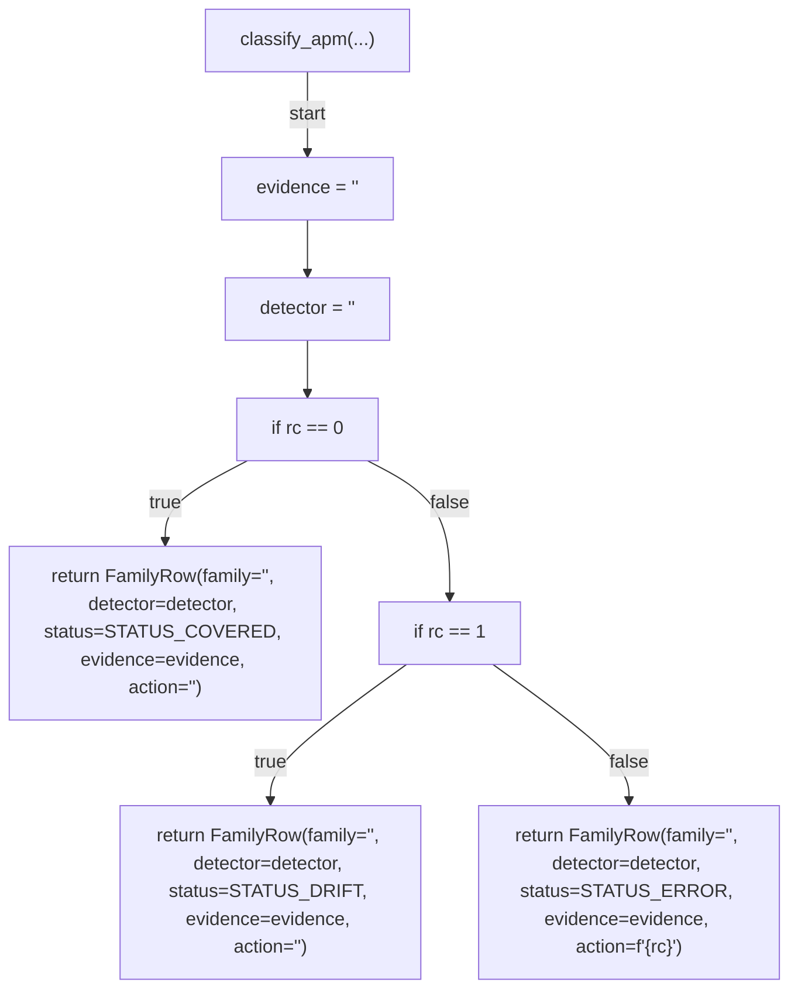
```mermaid
flowchart TD
    N001["classify_apm(...)"]
    N002["evidence = '<str>'"]
    N003["detector = '<str>'"]
    N004["if rc == 0"]
    N005["return FamilyRow(family='<str>', detector=detector, status=STATUS_COVERED, evidence=evidence, action='<str>')"]
    N006["if rc == 1"]
    N007["return FamilyRow(family='<str>', detector=detector, status=STATUS_DRIFT, evidence=evidence, action='<str>')"]
    N008["return FamilyRow(family='<str>', detector=detector, status=STATUS_ERROR, evidence=evidence, action=f'<str>{rc}<str>')"]
    N001 -->|"start"| N002
    N002 --> N003
    N003 --> N004
    N004 -->|"true"| N005
    N004 -->|"false"| N006
    N006 -->|"true"| N007
    N006 -->|"false"| N008
```

## classify_uv_pin_literal(...)

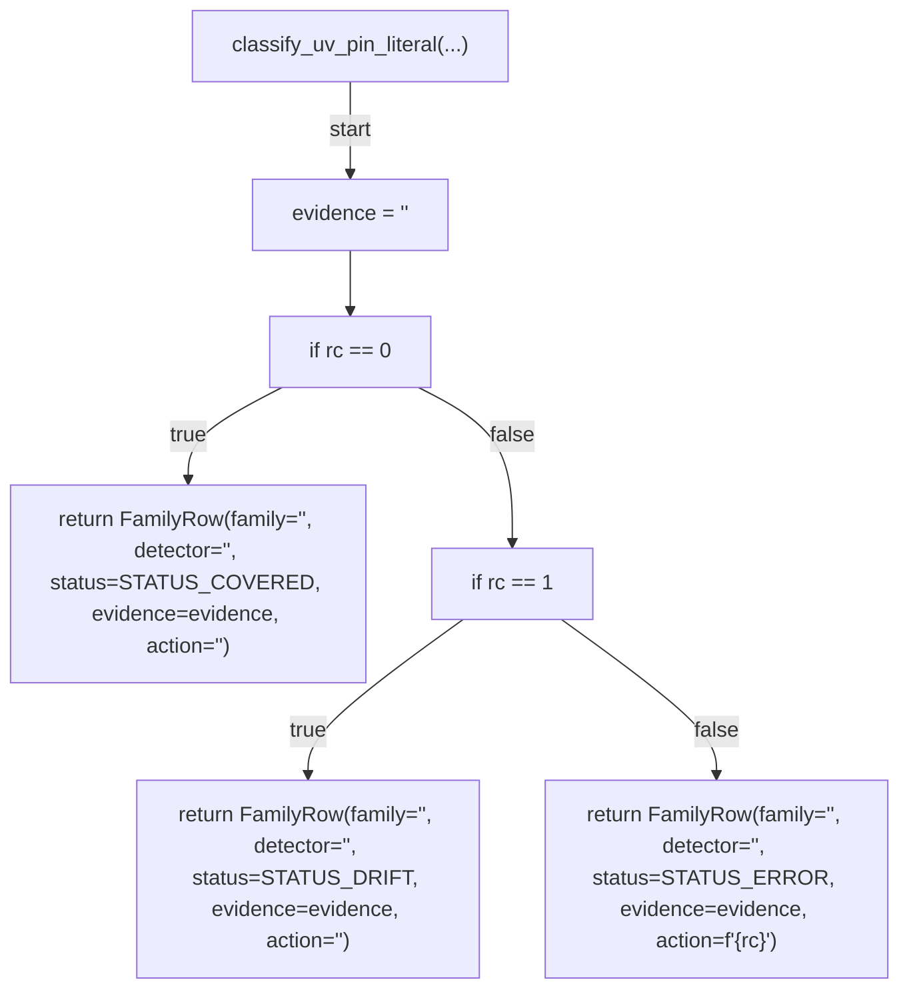
```mermaid
flowchart TD
    N001["classify_uv_pin_literal(...)"]
    N002["evidence = '<str>'"]
    N003["if rc == 0"]
    N004["return FamilyRow(family='<str>', detector='<str>', status=STATUS_COVERED, evidence=evidence, action='<str>')"]
    N005["if rc == 1"]
    N006["return FamilyRow(family='<str>', detector='<str>', status=STATUS_DRIFT, evidence=evidence, action='<str>')"]
    N007["return FamilyRow(family='<str>', detector='<str>', status=STATUS_ERROR, evidence=evidence, action=f'<str>{rc}<str>')"]
    N001 -->|"start"| N002
    N002 --> N003
    N003 -->|"true"| N004
    N003 -->|"false"| N005
    N005 -->|"true"| N006
    N005 -->|"false"| N007
```

## classify_workflow_permissions(...)

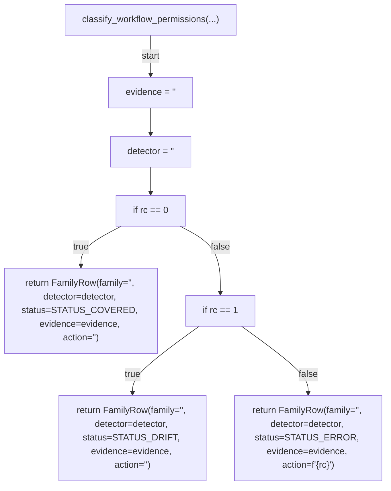
```mermaid
flowchart TD
    N001["classify_workflow_permissions(...)"]
    N002["evidence = '<str>'"]
    N003["detector = '<str>'"]
    N004["if rc == 0"]
    N005["return FamilyRow(family='<str>', detector=detector, status=STATUS_COVERED, evidence=evidence, action='<str>')"]
    N006["if rc == 1"]
    N007["return FamilyRow(family='<str>', detector=detector, status=STATUS_DRIFT, evidence=evidence, action='<str>')"]
    N008["return FamilyRow(family='<str>', detector=detector, status=STATUS_ERROR, evidence=evidence, action=f'<str>{rc}<str>')"]
    N001 -->|"start"| N002
    N002 --> N003
    N003 --> N004
    N004 -->|"true"| N005
    N004 -->|"false"| N006
    N006 -->|"true"| N007
    N006 -->|"false"| N008
```

## classify_owasp_asi(...)

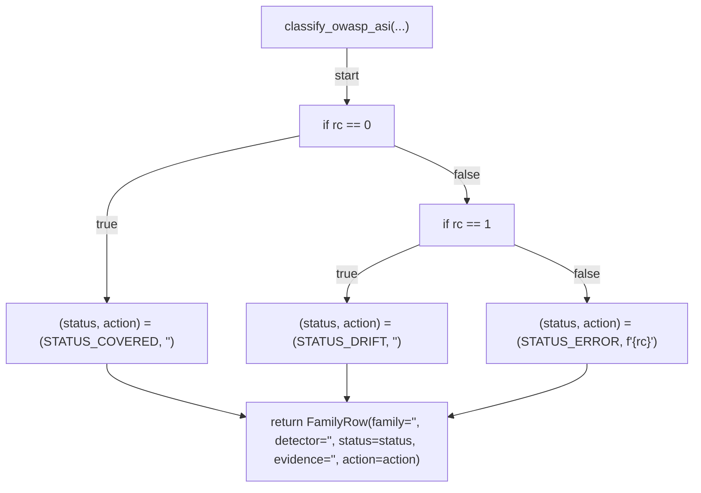
```mermaid
flowchart TD
    N001["classify_owasp_asi(...)"]
    N002["if rc == 0"]
    N003["(status, action) = (STATUS_COVERED, '<str>')"]
    N004["if rc == 1"]
    N005["(status, action) = (STATUS_DRIFT, '<str>')"]
    N006["(status, action) = (STATUS_ERROR, f'<str>{rc}<str>')"]
    N007["return FamilyRow(family='<str>', detector='<str>', status=status, evidence='<str>', action=action)"]
    N001 -->|"start"| N002
    N002 -->|"true"| N003
    N002 -->|"false"| N004
    N004 -->|"true"| N005
    N004 -->|"false"| N006
    N003 --> N007
    N005 --> N007
    N006 --> N007
```

## classify_uv_pin_staleness(...)

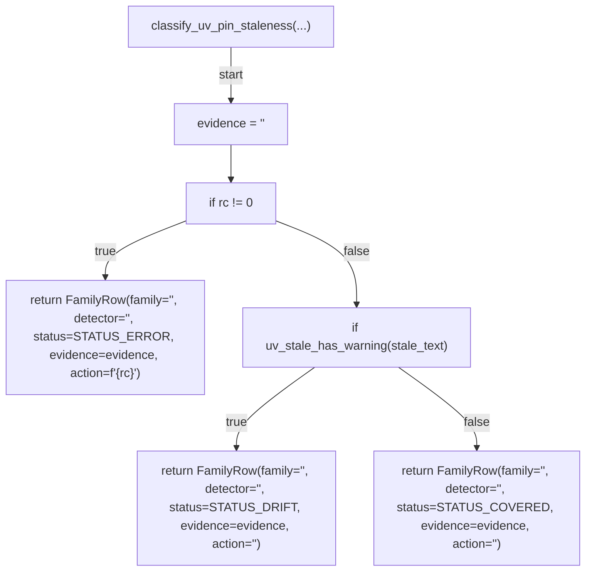
```mermaid
flowchart TD
    N001["classify_uv_pin_staleness(...)"]
    N002["evidence = '<str>'"]
    N003["if rc != 0"]
    N004["return FamilyRow(family='<str>', detector='<str>', status=STATUS_ERROR, evidence=evidence, action=f'<str>{rc}<str>')"]
    N005["if uv_stale_has_warning(stale_text)"]
    N006["return FamilyRow(family='<str>', detector='<str>', status=STATUS_DRIFT, evidence=evidence, action='<str>')"]
    N007["return FamilyRow(family='<str>', detector='<str>', status=STATUS_COVERED, evidence=evidence, action='<str>')"]
    N001 -->|"start"| N002
    N002 --> N003
    N003 -->|"true"| N004
    N003 -->|"false"| N005
    N005 -->|"true"| N006
    N005 -->|"false"| N007
```

## pr_gate_only_row(...)

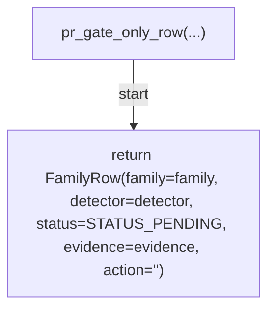
```mermaid
flowchart TD
    N001["pr_gate_only_row(...)"]
    N002["return FamilyRow(family=family, detector=detector, status=STATUS_PENDING, evidence=evidence, action='<str>')"]
    N001 -->|"start"| N002
```

## out_of_scope_row(...)

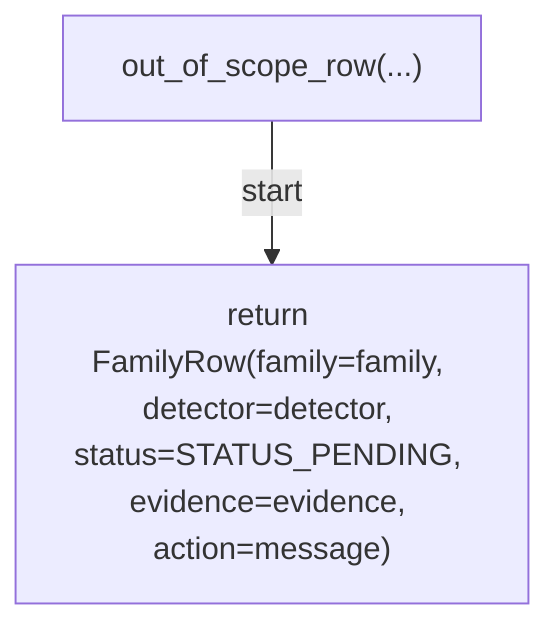
```mermaid
flowchart TD
    N001["out_of_scope_row(...)"]
    N002["return FamilyRow(family=family, detector=detector, status=STATUS_PENDING, evidence=evidence, action=message)"]
    N001 -->|"start"| N002
```

## _escape_cell(...)

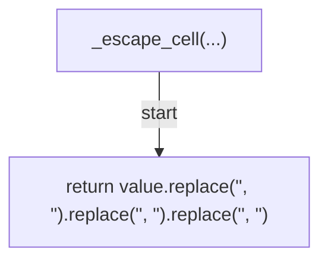
```mermaid
flowchart TD
    N001["_escape_cell(...)"]
    N002["return value.replace('<str>', '<str>').replace('<str>', '<str>').replace('<str>', '<str>')"]
    N001 -->|"start"| N002
```

## _render_table(...)

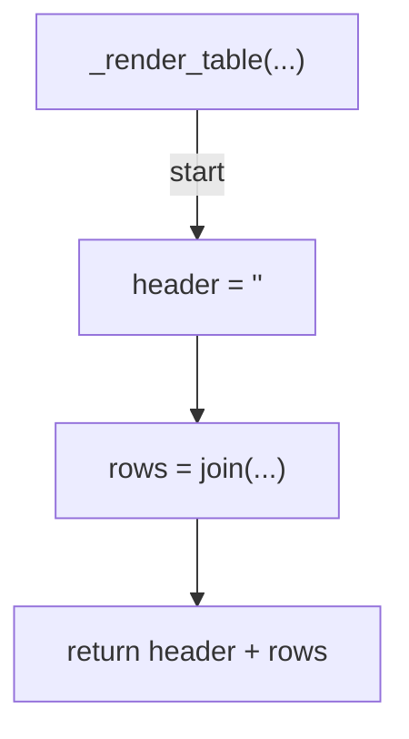
```mermaid
flowchart TD
    N001["_render_table(...)"]
    N002["header = '<str>'"]
    N003["rows = join(...)"]
    N004["return header + rows"]
    N001 -->|"start"| N002
    N002 --> N003
    N003 --> N004
```

## build_report(...)

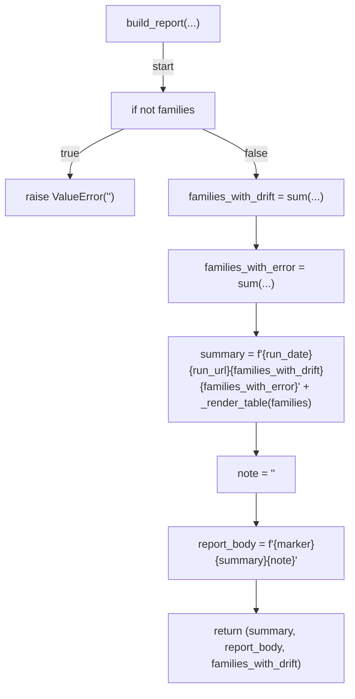
```mermaid
flowchart TD
    N001["build_report(...)"]
    N002["if not families"]
    N003["raise ValueError('<str>')"]
    N004["families_with_drift = sum(...)"]
    N005["families_with_error = sum(...)"]
    N006["summary = f'<str>{run_date}<str>{run_url}<str>{families_with_drift}<str>{families_with_error}<str>' + _render_table(families)"]
    N007["note = '<str>'"]
    N008["report_body = f'{marker}<str>{summary}<str>{note}'"]
    N009["return (summary, report_body, families_with_drift)"]
    N001 -->|"start"| N002
    N002 -->|"true"| N003
    N002 -->|"false"| N004
    N004 --> N005
    N005 --> N006
    N006 --> N007
    N007 --> N008
    N008 --> N009
```

## target_families_with_drift(...)

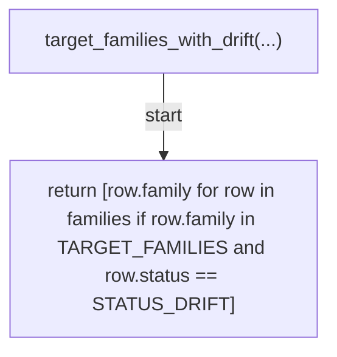
```mermaid
flowchart TD
    N001["target_families_with_drift(...)"]
    N002["return [row.family for row in families if row.family in TARGET_FAMILIES and row.status == STATUS_DRIFT]"]
    N001 -->|"start"| N002
```

## target_families_covered(...)

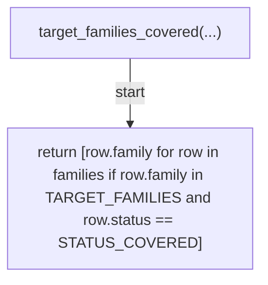
```mermaid
flowchart TD
    N001["target_families_covered(...)"]
    N002["return [row.family for row in families if row.family in TARGET_FAMILIES and row.status == STATUS_COVERED]"]
    N001 -->|"start"| N002
```

## find_existing_comment(...)

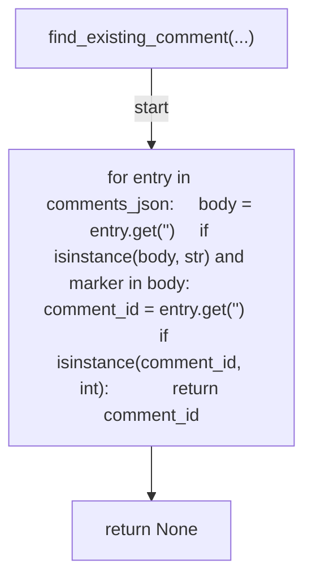
```mermaid
flowchart TD
    N001["find_existing_comment(...)"]
    N002["for entry in comments_json:     body = entry.get('<str>')     if isinstance(body, str) and marker in body:         comment_id = entry.get('<str>')         if isinstance(comment_id, int):             return comment_id"]
    N003["return None"]
    N001 -->|"start"| N002
    N002 --> N003
```

## _utc_today(...)

```mermaid
flowchart TD
    N001["_utc_today(...)"]
    N002["return _dt.datetime.now(_dt.UTC).strftime('<str>')"]
    N001 -->|"start"| N002
```

## _read_text(...)

```mermaid
flowchart TD
    N001["_read_text(...)"]
    N002["try"]
    N003["return path.read_text(encoding='<str>')"]
    N004["except FileNotFoundError"]
    N005["return '<str>'"]
    N001 -->|"start"| N002
    N002 -->|"try"| N003
    N002 -->|"raises"| N004
    N004 --> N005
```

## _write_text(...)

```mermaid
flowchart TD
    N001["_write_text(...)"]
    N002["mkdir(...)"]
    N003["write_text(...)"]
    N004["end"]
    N001 -->|"start"| N002
    N002 --> N003
    N003 --> N004
```

## _append_text(...)

```mermaid
flowchart TD
    N001["_append_text(...)"]
    N002["mkdir(...)"]
    N003["with path.open('<str>', encoding='<str>') as handle:     handle.write(content)"]
    N004["end"]
    N001 -->|"start"| N002
    N002 --> N003
    N003 --> N004
```

## _assemble_families(...)

```mermaid
flowchart TD
    N001["_assemble_families(...)"]
    N002["ruleset_text = _read_text(...)"]
    N003["labels_text = _read_text(...)"]
    N004["uv_stale_text = _read_text(...)"]
    N005["return [classify_rulesets(rc=parse_int_flag(args.ruleset_detect_rc, '<str>'), detect_output=ruleset_text), classify_labels(rc=parse_int_flag(args.labels_plan_rc, '<str>'), summary_text=labels_text), classify_apm(rc=parse_int_flag(args.apm_diff_rc, '<str>')), classify_uv_pin_literal(rc=parse_int_flag(args.uv_drift_rc, '<str>')), classify_workflow_permissions(rc=parse_int_flag(args.workflow_permissions_drift_rc, '<str>')), classify_uv_pin_staleness(rc=parse_int_flag(args.uv_stale_rc, '<str>'), stale_text=uv_stale_text), classify_owasp_asi(rc=parse_int_flag(args.owasp_asi_verify_rc, '<str>')), pr_gate_only_row(family='<str>', detector='<str>', evidence='<str>'), pr_gate_only_row(family='<str>', detector='<str>', evidence='<str>'), pr_gate_only_row(family='<str>', detector='<str>', evidence='<str>'), out_of_scope_row(family='<str>', detector='<str>', evidence='<str>', message='<str>')]"]
    N001 -->|"start"| N002
    N002 --> N003
    N003 --> N004
    N004 --> N005
```

## _cmd_aggregate(...)

```mermaid
flowchart TD
    N001["_cmd_aggregate(...)"]
    N002["run_date = args.run_date or _utc_today()"]
    N003["families = _assemble_families(...)"]
    N004["(summary, report_body, families_with_drift) = build_report(...)"]
    N005["drift_families = target_families_with_drift(...)"]
    N006["covered_families = target_families_covered(...)"]
    N007["_append_text(...)"]
    N008["_write_text(...)"]
    N009["_append_text(...)"]
    N010["return 0"]
    N001 -->|"start"| N002
    N002 --> N003
    N003 --> N004
    N004 --> N005
    N005 --> N006
    N006 --> N007
    N007 --> N008
    N008 --> N009
    N009 --> N010
```

## _cmd_file_family_issues(...)

```mermaid
flowchart TD
    N001["_cmd_file_family_issues(...)"]
    N002["dry_run = parse_dry_run(...)"]
    N003["run_date = args.run_date or _utc_today()"]
    N004["drifting = [name.strip() for name in args.families.split('<str>') if name.strip()]"]
    N005["resolved = [name.strip() for name in args.resolved_families.split('<str>') if name.strip()]"]
    N006["unknown = [name for name in (*drifting, *resolved) if name not in TARGET_FAMILIES]"]
    N007["if unknown"]
    N008["raise ValueError(f'<str>{unknown}<str>{sorted(TARGET_FAMILIES)}')"]
    N009["return reconcile_family_issues(apply=args.apply_call, repo=args.repo, run_url=args.run_url, run_date=run_date, drifting=drifting, resolved=resolved, dry_run=dry_run)"]
    N001 -->|"start"| N002
    N002 --> N003
    N003 --> N004
    N004 --> N005
    N005 --> N006
    N006 --> N007
    N007 -->|"true"| N008
    N007 -->|"false"| N009
```

## _cmd_post_comment(...)

```mermaid
flowchart TD
    N001["_cmd_post_comment(...)"]
    N002["dry_run = parse_dry_run(...)"]
    N003["body = _read_text(...)"]
    N004["if not body.strip()"]
    N005["print(...)"]
    N006["return 1"]
    N007["if args.marker not in body"]
    N008["print(...)"]
    N009["return 1"]
    N010["if dry_run"]
    N011["print(...)"]
    N012["return 0"]
    N013["token = get(...)"]
    N014["if not token"]
    N015["print(...)"]
    N016["return 1"]
    N017["apply = args.apply_call"]
    N018["(code, response) = apply(...)"]
    N019["if not 200 <= code < 300"]
    N020["print(...)"]
    N021["return 1"]
    N022["import json as _json"]
    N023["try"]
    N024["comments = loads(...)"]
    N025["except _json.JSONDecodeError"]
    N026["print(...)"]
    N027["return 1"]
    N028["if not isinstance(comments, list)"]
    N029["print(...)"]
    N030["return 1"]
    N031["comment_id = find_existing_comment(...)"]
    N032["if comment_id is None"]
    N033["(code, response) = apply(...)"]
    N034["if not 200 <= code < 300"]
    N035["print(...)"]
    N036["return 1"]
    N037["print(...)"]
    N038["return 0"]
    N039["(code, response) = apply(...)"]
    N040["if not 200 <= code < 300"]
    N041["print(...)"]
    N042["return 1"]
    N043["print(...)"]
    N044["return 0"]
    N001 -->|"start"| N002
    N002 --> N003
    N003 --> N004
    N004 -->|"true"| N005
    N005 --> N006
    N004 -->|"false"| N007
    N007 -->|"true"| N008
    N008 --> N009
    N007 -->|"false"| N010
    N010 -->|"true"| N011
    N011 --> N012
    N010 -->|"false"| N013
    N013 --> N014
    N014 -->|"true"| N015
    N015 --> N016
    N014 -->|"false"| N017
    N017 --> N018
    N018 --> N019
    N019 -->|"true"| N020
    N020 --> N021
    N019 -->|"false"| N022
    N022 --> N023
    N023 -->|"try"| N024
    N023 -->|"raises"| N025
    N025 --> N026
    N026 --> N027
    N024 --> N028
    N028 -->|"true"| N029
    N029 --> N030
    N028 -->|"false"| N031
    N031 --> N032
    N032 -->|"true"| N033
    N033 --> N034
    N034 -->|"true"| N035
    N035 --> N036
    N034 -->|"false"| N037
    N037 --> N038
    N032 -->|"false"| N039
    N039 --> N040
    N040 -->|"true"| N041
    N041 --> N042
    N040 -->|"false"| N043
    N043 --> N044
```

## _build_parser(...)

```mermaid
flowchart TD
    N001["_build_parser(...)"]
    N002["parser = ArgumentParser(...)"]
    N003["sub = add_subparsers(...)"]
    N004["p_agg = add_parser(...)"]
    N005["add_argument(...)"]
    N006["add_argument(...)"]
    N007["add_argument(...)"]
    N008["add_argument(...)"]
    N009["add_argument(...)"]
    N010["add_argument(...)"]
    N011["add_argument(...)"]
    N012["add_argument(...)"]
    N013["add_argument(...)"]
    N014["add_argument(...)"]
    N015["add_argument(...)"]
    N016["add_argument(...)"]
    N017["add_argument(...)"]
    N018["add_argument(...)"]
    N019["add_argument(...)"]
    N020["add_argument(...)"]
    N021["set_defaults(...)"]
    N022["p_post = add_parser(...)"]
    N023["add_argument(...)"]
    N024["add_argument(...)"]
    N025["add_argument(...)"]
    N026["add_argument(...)"]
    N027["add_argument(...)"]
    N028["set_defaults(...)"]
    N029["p_file = add_parser(...)"]
    N030["add_argument(...)"]
    N031["add_argument(...)"]
    N032["add_argument(...)"]
    N033["add_argument(...)"]
    N034["add_argument(...)"]
    N035["add_argument(...)"]
    N036["set_defaults(...)"]
    N037["return parser"]
    N001 -->|"start"| N002
    N002 --> N003
    N003 --> N004
    N004 --> N005
    N005 --> N006
    N006 --> N007
    N007 --> N008
    N008 --> N009
    N009 --> N010
    N010 --> N011
    N011 --> N012
    N012 --> N013
    N013 --> N014
    N014 --> N015
    N015 --> N016
    N016 --> N017
    N017 --> N018
    N018 --> N019
    N019 --> N020
    N020 --> N021
    N021 --> N022
    N022 --> N023
    N023 --> N024
    N024 --> N025
    N025 --> N026
    N026 --> N027
    N027 --> N028
    N028 --> N029
    N029 --> N030
    N030 --> N031
    N031 --> N032
    N032 --> N033
    N033 --> N034
    N034 --> N035
    N035 --> N036
    N036 --> N037
```

## main(...)

```mermaid
flowchart TD
    N001["main(...)"]
    N002["parser = _build_parser(...)"]
    N003["args = parse_args(...)"]
    N004["try"]
    N005["return args.func(args)"]
    N006["except (OSError, ValueError)"]
    N007["print(...)"]
    N008["return 1"]
    N001 -->|"start"| N002
    N002 --> N003
    N003 --> N004
    N004 -->|"try"| N005
    N004 -->|"raises"| N006
    N006 --> N007
    N007 --> N008
```
