# AST graph: scripts/session_cost_structure.py

This file is generated from `scripts/session_cost_structure.py` by `python3 scripts/script_ast_graph.py all-doc`. Do not edit it by hand: content under `docs/generated/scripts/` is owned by the post-merge automation (refs #1540) -- update the source script instead.

## _coerce_int(...)

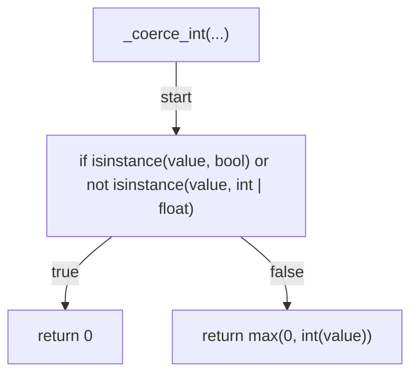

## _message_usage(...)

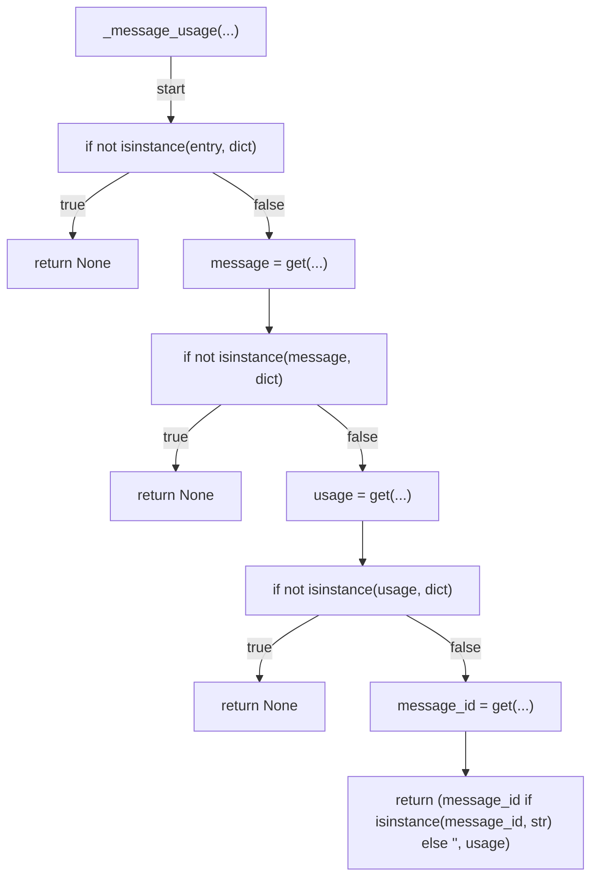

## aggregate_usages(...)

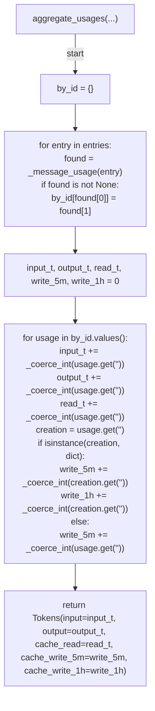

## compute_costs(...)

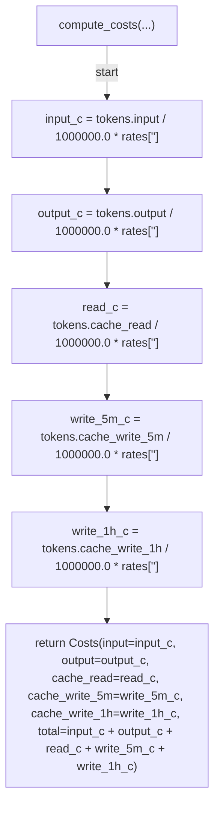

## load_transcript(...)

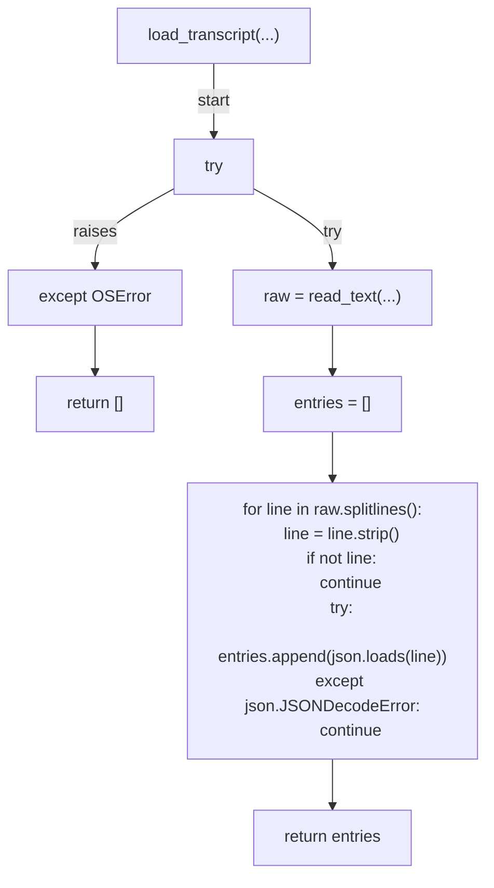

## _slug_for(...)

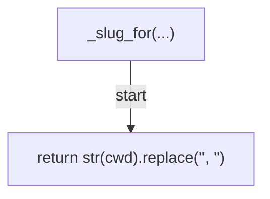

## discover_transcript(...)

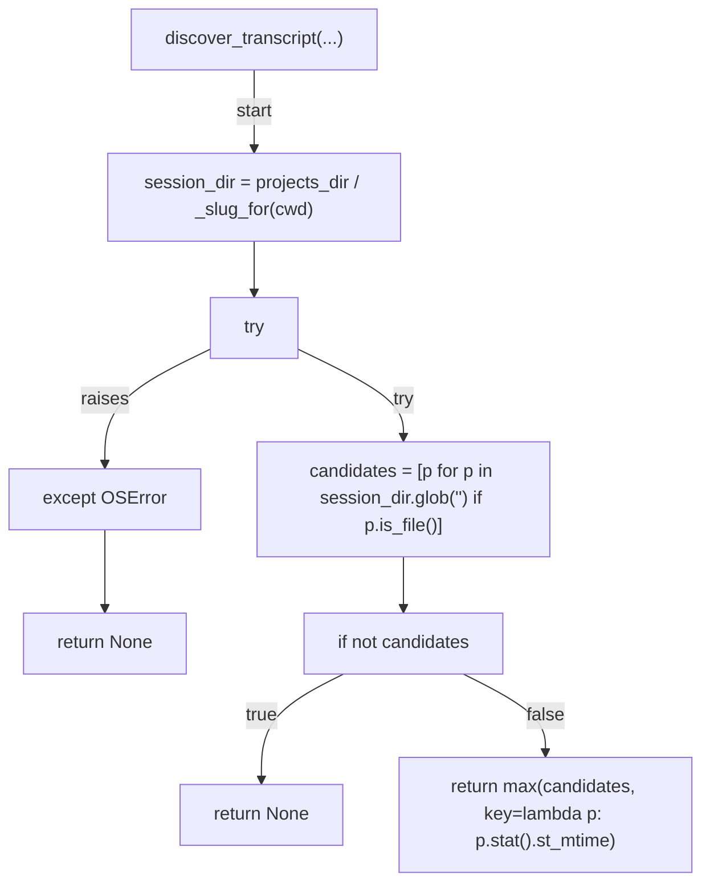

## _run_ccusage_total(...)

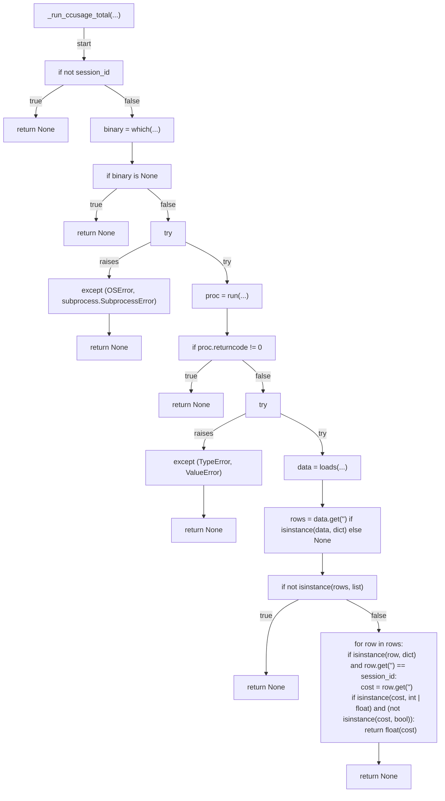

## agreement_pct(...)

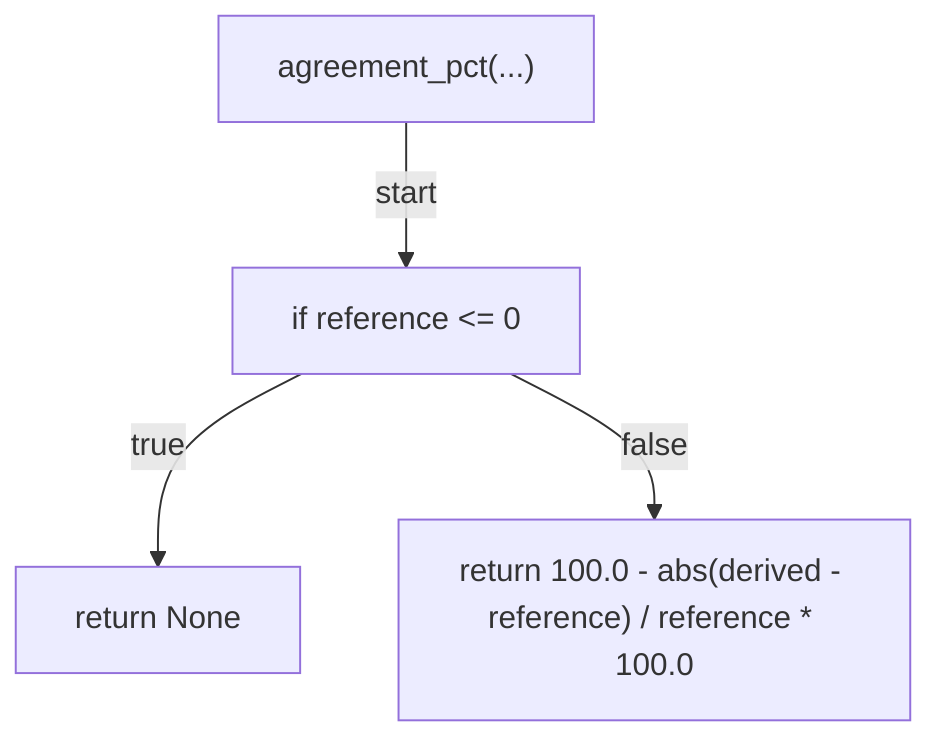

## render_report(...)

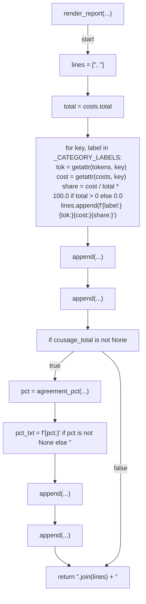

## _build_rates(...)

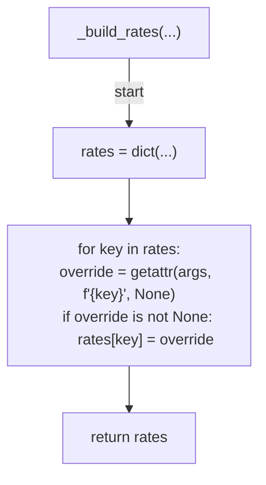

## _parse_args(...)

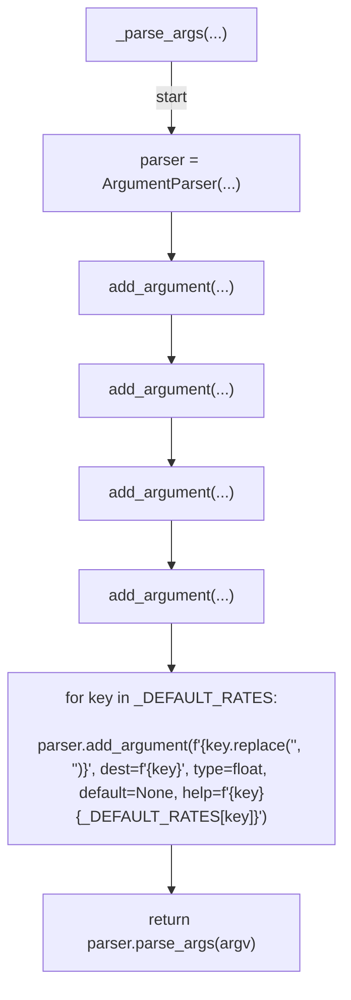

## main(...)

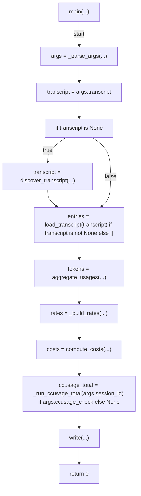
