# AST graph: scripts/session_resource_report.py

This file is generated from `scripts/session_resource_report.py` by `python3 scripts/script_ast_graph.py all-doc`. Do not edit it by hand: content under `docs/generated/scripts/` is owned by the post-merge automation (refs #1540); update the source script instead.

## _coerce_number(...)

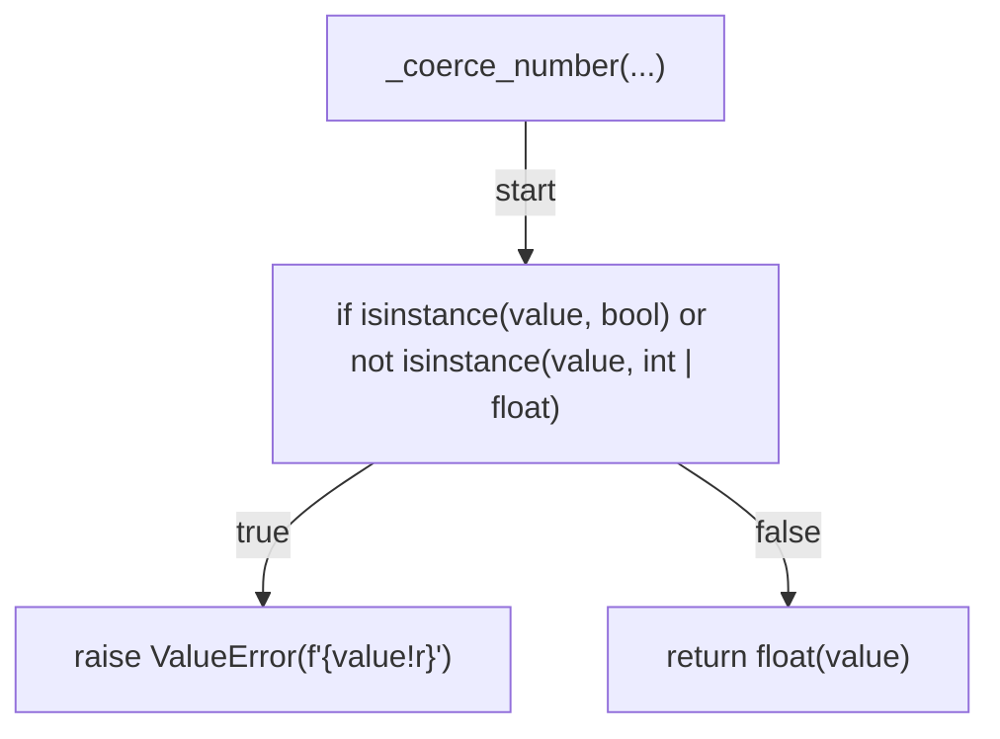
```mermaid
flowchart TD
    N001["_coerce_number(...)"]
    N002["if isinstance(value, bool) or not isinstance(value, int | float)"]
    N003["raise ValueError(f'<str>{value!r}')"]
    N004["return float(value)"]
    N001 -->|"start"| N002
    N002 -->|"true"| N003
    N002 -->|"false"| N004
```

## compute_elapsed(...)

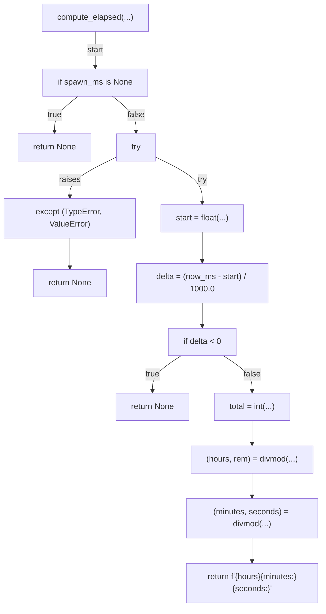
```mermaid
flowchart TD
    N001["compute_elapsed(...)"]
    N002["if spawn_ms is None"]
    N003["return None"]
    N004["try"]
    N005["start = float(...)"]
    N006["except (TypeError, ValueError)"]
    N007["return None"]
    N008["delta = (now_ms - start) / 1000.0"]
    N009["if delta < 0"]
    N010["return None"]
    N011["total = int(...)"]
    N012["(hours, rem) = divmod(...)"]
    N013["(minutes, seconds) = divmod(...)"]
    N014["return f'{hours}<str>{minutes:<str>}<str>{seconds:<str>}'"]
    N001 -->|"start"| N002
    N002 -->|"true"| N003
    N002 -->|"false"| N004
    N004 -->|"try"| N005
    N004 -->|"raises"| N006
    N006 --> N007
    N005 --> N008
    N008 --> N009
    N009 -->|"true"| N010
    N009 -->|"false"| N011
    N011 --> N012
    N012 --> N013
    N013 --> N014
```

## parse_usage(...)

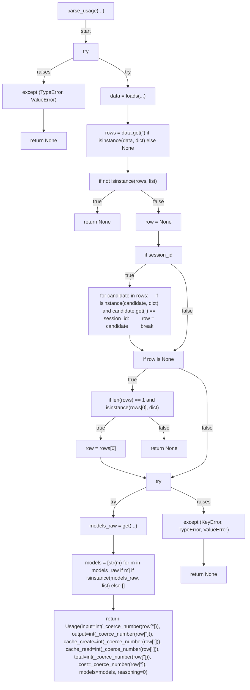
```mermaid
flowchart TD
    N001["parse_usage(...)"]
    N002["try"]
    N003["data = loads(...)"]
    N004["except (TypeError, ValueError)"]
    N005["return None"]
    N006["rows = data.get('<str>') if isinstance(data, dict) else None"]
    N007["if not isinstance(rows, list)"]
    N008["return None"]
    N009["row = None"]
    N010["if session_id"]
    N011["for candidate in rows:     if isinstance(candidate, dict) and candidate.get('<str>') == session_id:         row = candidate         break"]
    N012["if row is None"]
    N013["if len(rows) == 1 and isinstance(rows[0], dict)"]
    N014["row = rows[0]"]
    N015["return None"]
    N016["try"]
    N017["models_raw = get(...)"]
    N018["models = [str(m) for m in models_raw if m] if isinstance(models_raw, list) else []"]
    N019["return Usage(input=int(_coerce_number(row['<str>'])), output=int(_coerce_number(row['<str>'])), cache_create=int(_coerce_number(row['<str>'])), cache_read=int(_coerce_number(row['<str>'])), total=int(_coerce_number(row['<str>'])), cost=_coerce_number(row['<str>']), models=models, reasoning=0)"]
    N020["except (KeyError, TypeError, ValueError)"]
    N021["return None"]
    N001 -->|"start"| N002
    N002 -->|"try"| N003
    N002 -->|"raises"| N004
    N004 --> N005
    N003 --> N006
    N006 --> N007
    N007 -->|"true"| N008
    N007 -->|"false"| N009
    N009 --> N010
    N010 -->|"true"| N011
    N011 --> N012
    N010 -->|"false"| N012
    N012 -->|"true"| N013
    N013 -->|"true"| N014
    N013 -->|"false"| N015
    N014 --> N016
    N012 -->|"false"| N016
    N016 -->|"try"| N017
    N017 --> N018
    N018 --> N019
    N016 -->|"raises"| N020
    N020 --> N021
```

## _coerce_stored_usage(...)

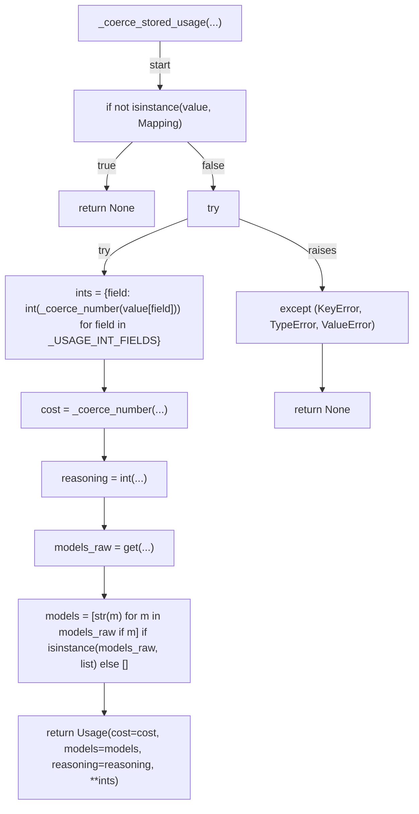
```mermaid
flowchart TD
    N001["_coerce_stored_usage(...)"]
    N002["if not isinstance(value, Mapping)"]
    N003["return None"]
    N004["try"]
    N005["ints = {field: int(_coerce_number(value[field])) for field in _USAGE_INT_FIELDS}"]
    N006["cost = _coerce_number(...)"]
    N007["reasoning = int(...)"]
    N008["except (KeyError, TypeError, ValueError)"]
    N009["return None"]
    N010["models_raw = get(...)"]
    N011["models = [str(m) for m in models_raw if m] if isinstance(models_raw, list) else []"]
    N012["return Usage(cost=cost, models=models, reasoning=reasoning, **ints)"]
    N001 -->|"start"| N002
    N002 -->|"true"| N003
    N002 -->|"false"| N004
    N004 -->|"try"| N005
    N005 --> N006
    N006 --> N007
    N004 -->|"raises"| N008
    N008 --> N009
    N007 --> N010
    N010 --> N011
    N011 --> N012
```

## delta_usage(...)

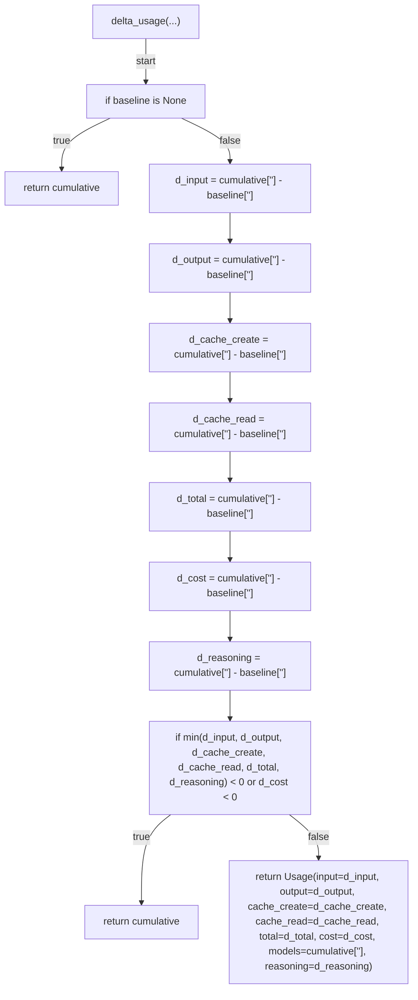
```mermaid
flowchart TD
    N001["delta_usage(...)"]
    N002["if baseline is None"]
    N003["return cumulative"]
    N004["d_input = cumulative['<str>'] - baseline['<str>']"]
    N005["d_output = cumulative['<str>'] - baseline['<str>']"]
    N006["d_cache_create = cumulative['<str>'] - baseline['<str>']"]
    N007["d_cache_read = cumulative['<str>'] - baseline['<str>']"]
    N008["d_total = cumulative['<str>'] - baseline['<str>']"]
    N009["d_cost = cumulative['<str>'] - baseline['<str>']"]
    N010["d_reasoning = cumulative['<str>'] - baseline['<str>']"]
    N011["if min(d_input, d_output, d_cache_create, d_cache_read, d_total, d_reasoning) < 0 or d_cost < 0"]
    N012["return cumulative"]
    N013["return Usage(input=d_input, output=d_output, cache_create=d_cache_create, cache_read=d_cache_read, total=d_total, cost=d_cost, models=cumulative['<str>'], reasoning=d_reasoning)"]
    N001 -->|"start"| N002
    N002 -->|"true"| N003
    N002 -->|"false"| N004
    N004 --> N005
    N005 --> N006
    N006 --> N007
    N007 --> N008
    N008 --> N009
    N009 --> N010
    N010 --> N011
    N011 -->|"true"| N012
    N011 -->|"false"| N013
```

## redact_model(...)

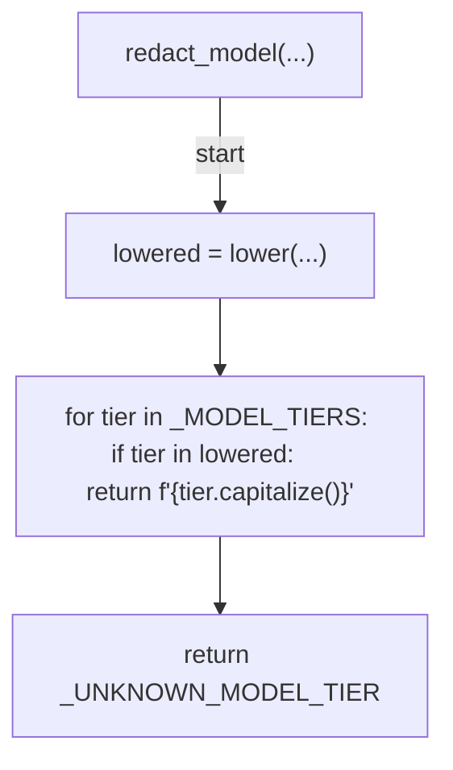
```mermaid
flowchart TD
    N001["redact_model(...)"]
    N002["lowered = lower(...)"]
    N003["for tier in _MODEL_TIERS:     if tier in lowered:         return f'{tier.capitalize()}<str>'"]
    N004["return _UNKNOWN_MODEL_TIER"]
    N001 -->|"start"| N002
    N002 --> N003
    N003 --> N004
```

## redact_models(...)

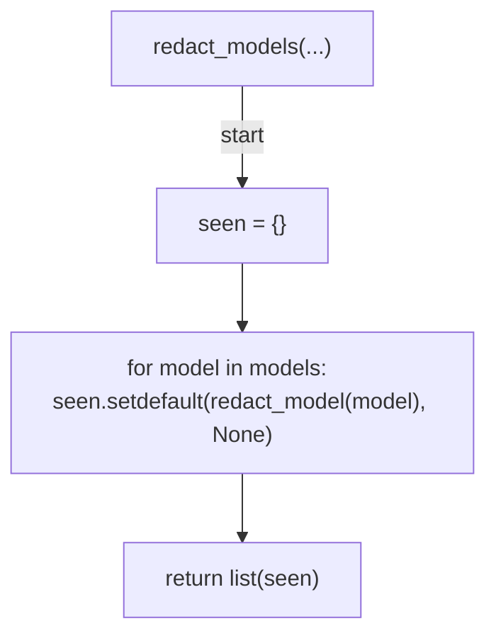
```mermaid
flowchart TD
    N001["redact_models(...)"]
    N002["seen = {}"]
    N003["for model in models:     seen.setdefault(redact_model(model), None)"]
    N004["return list(seen)"]
    N001 -->|"start"| N002
    N002 --> N003
    N003 --> N004
```

## render_section(...)

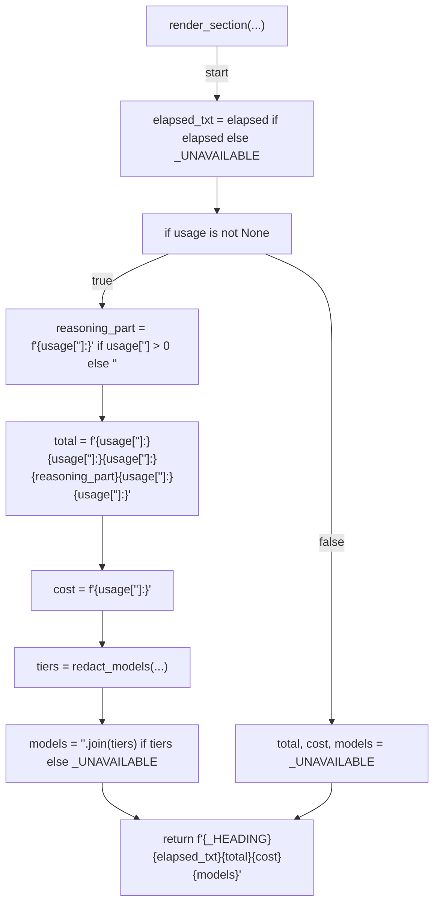
```mermaid
flowchart TD
    N001["render_section(...)"]
    N002["elapsed_txt = elapsed if elapsed else _UNAVAILABLE"]
    N003["if usage is not None"]
    N004["reasoning_part = f'<str>{usage['<str>']:<str>}' if usage['<str>'] > 0 else '<str>'"]
    N005["total = f'{usage['<str>']:<str>}<str>{usage['<str>']:<str>}<str>{usage['<str>']:<str>}{reasoning_part}<str>{usage['<str>']:<str>}<str>{usage['<str>']:<str>}<str>'"]
    N006["cost = f'<str>{usage['<str>']:<str>}'"]
    N007["tiers = redact_models(...)"]
    N008["models = '<str>'.join(tiers) if tiers else _UNAVAILABLE"]
    N009["total, cost, models = _UNAVAILABLE"]
    N010["return f'<str>{_HEADING}<str>{elapsed_txt}<str>{total}<str>{cost}<str>{models}<str>'"]
    N001 -->|"start"| N002
    N002 --> N003
    N003 -->|"true"| N004
    N004 --> N005
    N005 --> N006
    N006 --> N007
    N007 --> N008
    N003 -->|"false"| N009
    N008 --> N010
    N009 --> N010
```

## _run_ccusage(...)

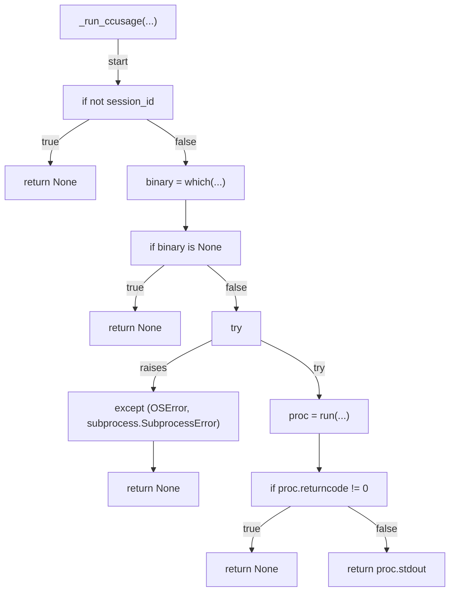
```mermaid
flowchart TD
    N001["_run_ccusage(...)"]
    N002["if not session_id"]
    N003["return None"]
    N004["binary = which(...)"]
    N005["if binary is None"]
    N006["return None"]
    N007["try"]
    N008["proc = run(...)"]
    N009["except (OSError, subprocess.SubprocessError)"]
    N010["return None"]
    N011["if proc.returncode != 0"]
    N012["return None"]
    N013["return proc.stdout"]
    N001 -->|"start"| N002
    N002 -->|"true"| N003
    N002 -->|"false"| N004
    N004 --> N005
    N005 -->|"true"| N006
    N005 -->|"false"| N007
    N007 -->|"try"| N008
    N007 -->|"raises"| N009
    N009 --> N010
    N008 --> N011
    N011 -->|"true"| N012
    N011 -->|"false"| N013
```

## _is_codex(...)

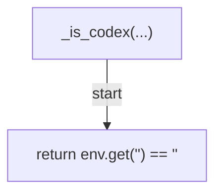
```mermaid
flowchart TD
    N001["_is_codex(...)"]
    N002["return env.get('<str>') == '<str>'"]
    N001 -->|"start"| N002
```

## _run_ccusage_codex(...)

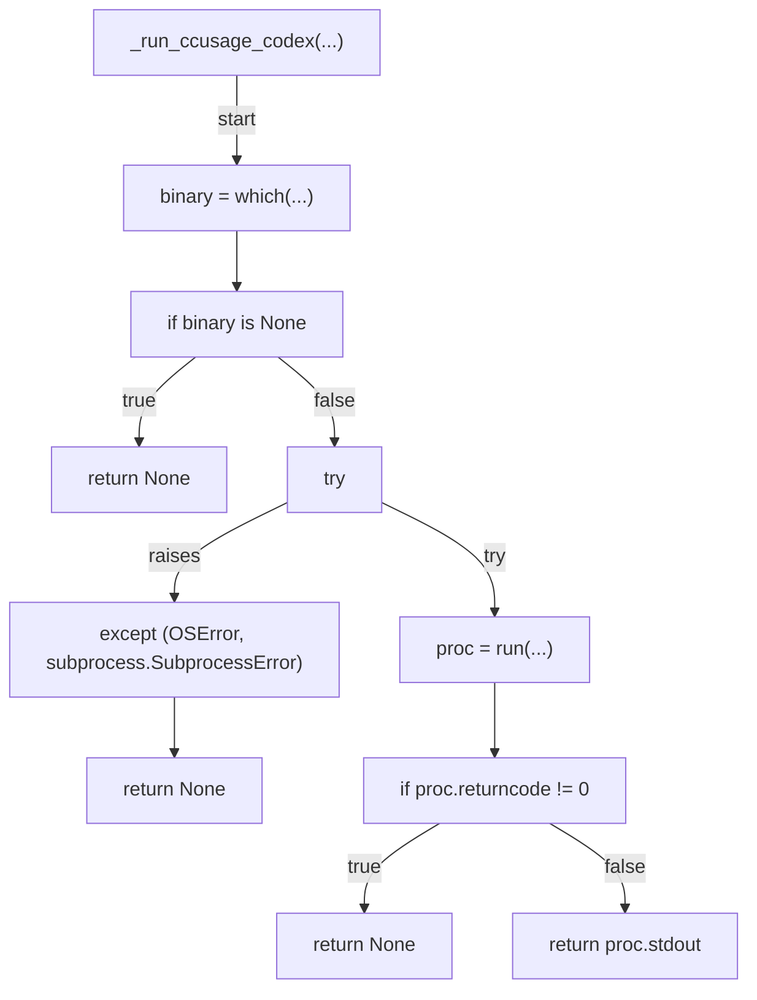
```mermaid
flowchart TD
    N001["_run_ccusage_codex(...)"]
    N002["binary = which(...)"]
    N003["if binary is None"]
    N004["return None"]
    N005["try"]
    N006["proc = run(...)"]
    N007["except (OSError, subprocess.SubprocessError)"]
    N008["return None"]
    N009["if proc.returncode != 0"]
    N010["return None"]
    N011["return proc.stdout"]
    N001 -->|"start"| N002
    N002 --> N003
    N003 -->|"true"| N004
    N003 -->|"false"| N005
    N005 -->|"try"| N006
    N005 -->|"raises"| N007
    N007 --> N008
    N006 --> N009
    N009 -->|"true"| N010
    N009 -->|"false"| N011
```

## parse_usage_codex(...)

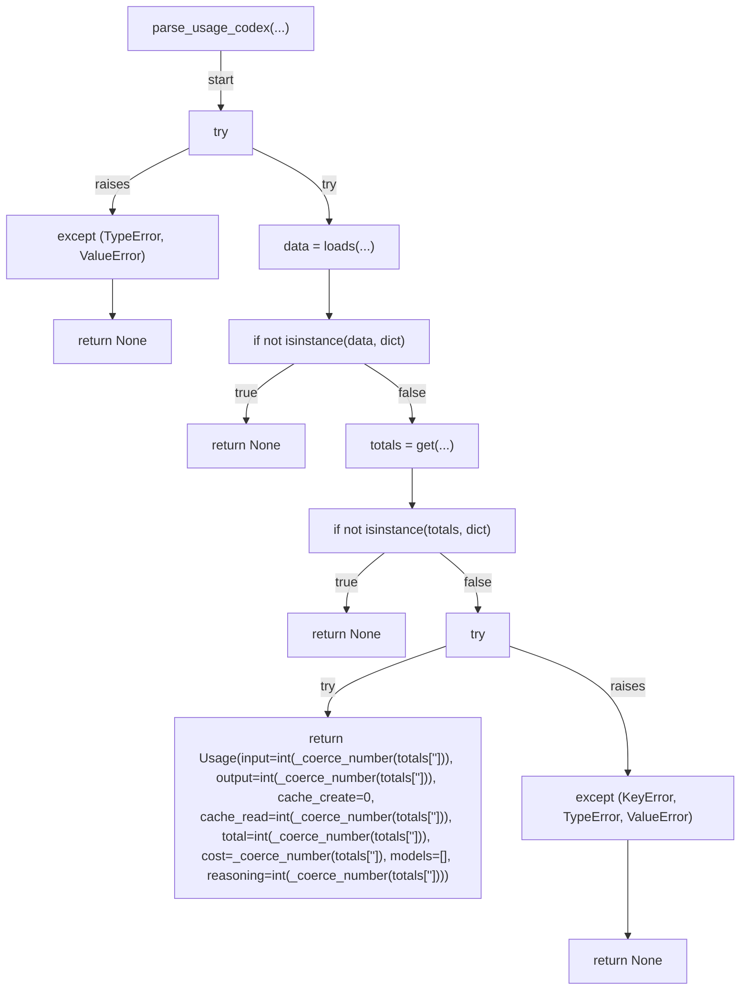
```mermaid
flowchart TD
    N001["parse_usage_codex(...)"]
    N002["try"]
    N003["data = loads(...)"]
    N004["except (TypeError, ValueError)"]
    N005["return None"]
    N006["if not isinstance(data, dict)"]
    N007["return None"]
    N008["totals = get(...)"]
    N009["if not isinstance(totals, dict)"]
    N010["return None"]
    N011["try"]
    N012["return Usage(input=int(_coerce_number(totals['<str>'])), output=int(_coerce_number(totals['<str>'])), cache_create=0, cache_read=int(_coerce_number(totals['<str>'])), total=int(_coerce_number(totals['<str>'])), cost=_coerce_number(totals['<str>']), models=[], reasoning=int(_coerce_number(totals['<str>'])))"]
    N013["except (KeyError, TypeError, ValueError)"]
    N014["return None"]
    N001 -->|"start"| N002
    N002 -->|"try"| N003
    N002 -->|"raises"| N004
    N004 --> N005
    N003 --> N006
    N006 -->|"true"| N007
    N006 -->|"false"| N008
    N008 --> N009
    N009 -->|"true"| N010
    N009 -->|"false"| N011
    N011 -->|"try"| N012
    N011 -->|"raises"| N013
    N013 --> N014
```

## _codex_rollout_session_id(...)

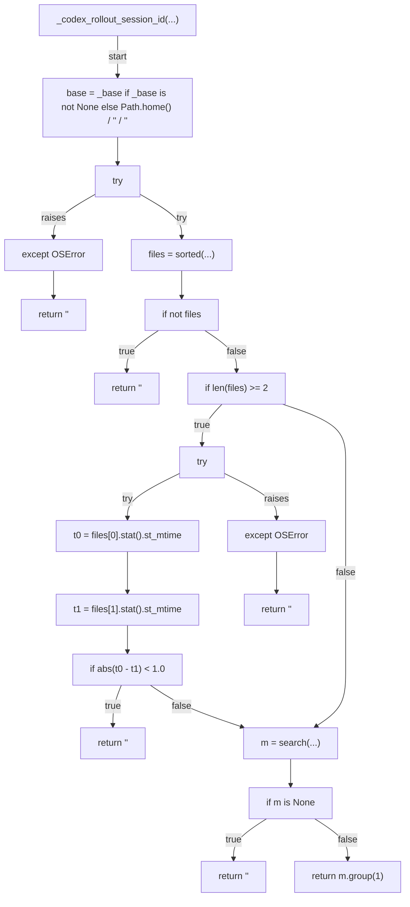
```mermaid
flowchart TD
    N001["_codex_rollout_session_id(...)"]
    N002["base = _base if _base is not None else Path.home() / '<str>' / '<str>'"]
    N003["try"]
    N004["files = sorted(...)"]
    N005["except OSError"]
    N006["return '<str>'"]
    N007["if not files"]
    N008["return '<str>'"]
    N009["if len(files) >= 2"]
    N010["try"]
    N011["t0 = files[0].stat().st_mtime"]
    N012["t1 = files[1].stat().st_mtime"]
    N013["except OSError"]
    N014["return '<str>'"]
    N015["if abs(t0 - t1) < 1.0"]
    N016["return '<str>'"]
    N017["m = search(...)"]
    N018["if m is None"]
    N019["return '<str>'"]
    N020["return m.group(1)"]
    N001 -->|"start"| N002
    N002 --> N003
    N003 -->|"try"| N004
    N003 -->|"raises"| N005
    N005 --> N006
    N004 --> N007
    N007 -->|"true"| N008
    N007 -->|"false"| N009
    N009 -->|"true"| N010
    N010 -->|"try"| N011
    N011 --> N012
    N010 -->|"raises"| N013
    N013 --> N014
    N012 --> N015
    N015 -->|"true"| N016
    N015 -->|"false"| N017
    N009 -->|"false"| N017
    N017 --> N018
    N018 -->|"true"| N019
    N018 -->|"false"| N020
```

## _checkpoint_path(...)

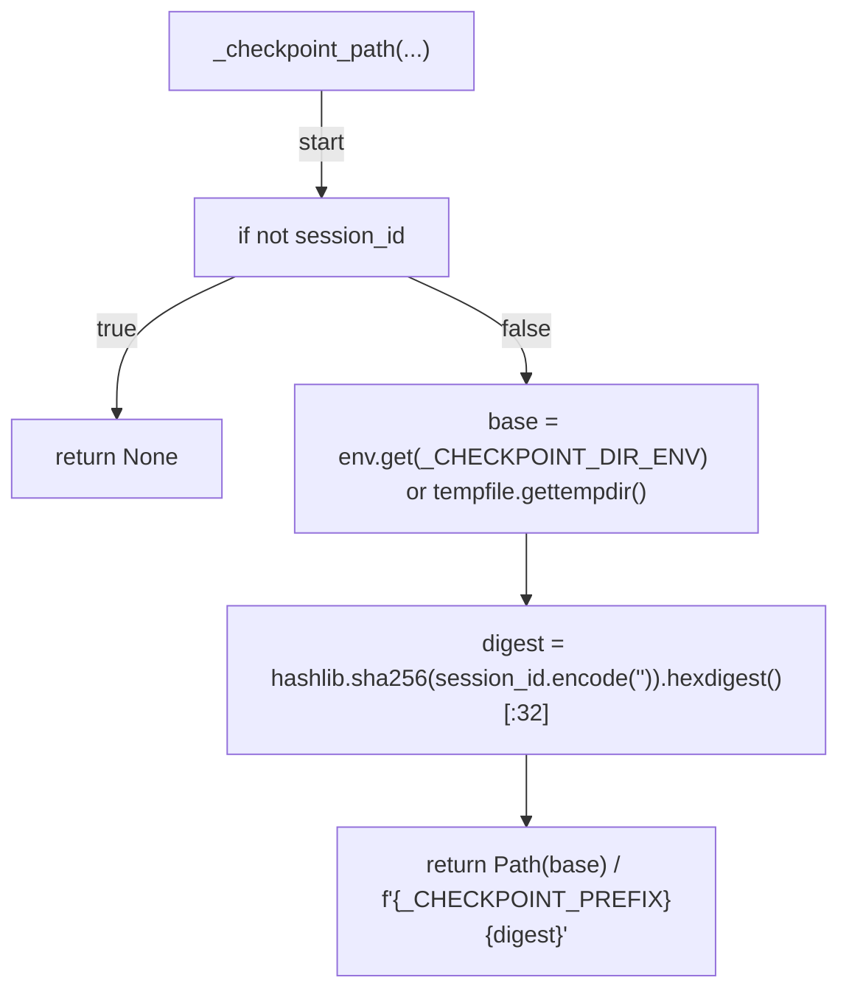
```mermaid
flowchart TD
    N001["_checkpoint_path(...)"]
    N002["if not session_id"]
    N003["return None"]
    N004["base = env.get(_CHECKPOINT_DIR_ENV) or tempfile.gettempdir()"]
    N005["digest = hashlib.sha256(session_id.encode('<str>')).hexdigest()[:32]"]
    N006["return Path(base) / f'{_CHECKPOINT_PREFIX}{digest}<str>'"]
    N001 -->|"start"| N002
    N002 -->|"true"| N003
    N002 -->|"false"| N004
    N004 --> N005
    N005 --> N006
```

## load_checkpoint(...)

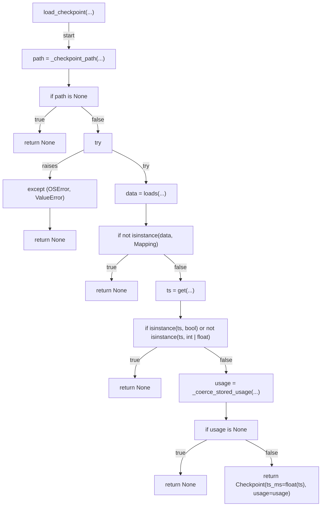
```mermaid
flowchart TD
    N001["load_checkpoint(...)"]
    N002["path = _checkpoint_path(...)"]
    N003["if path is None"]
    N004["return None"]
    N005["try"]
    N006["data = loads(...)"]
    N007["except (OSError, ValueError)"]
    N008["return None"]
    N009["if not isinstance(data, Mapping)"]
    N010["return None"]
    N011["ts = get(...)"]
    N012["if isinstance(ts, bool) or not isinstance(ts, int | float)"]
    N013["return None"]
    N014["usage = _coerce_stored_usage(...)"]
    N015["if usage is None"]
    N016["return None"]
    N017["return Checkpoint(ts_ms=float(ts), usage=usage)"]
    N001 -->|"start"| N002
    N002 --> N003
    N003 -->|"true"| N004
    N003 -->|"false"| N005
    N005 -->|"try"| N006
    N005 -->|"raises"| N007
    N007 --> N008
    N006 --> N009
    N009 -->|"true"| N010
    N009 -->|"false"| N011
    N011 --> N012
    N012 -->|"true"| N013
    N012 -->|"false"| N014
    N014 --> N015
    N015 -->|"true"| N016
    N015 -->|"false"| N017
```

## save_checkpoint(...)

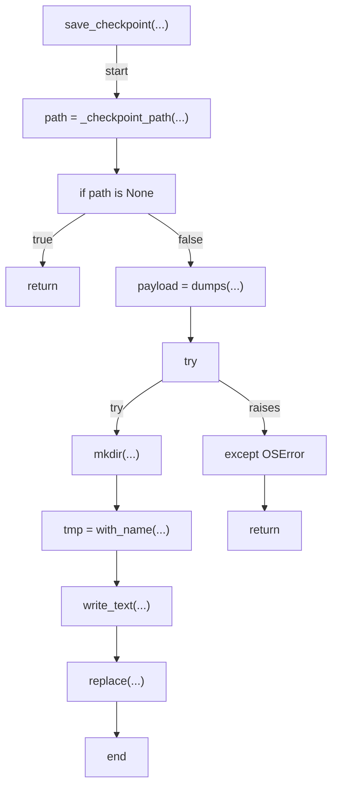
```mermaid
flowchart TD
    N001["save_checkpoint(...)"]
    N002["path = _checkpoint_path(...)"]
    N003["if path is None"]
    N004["return"]
    N005["payload = dumps(...)"]
    N006["try"]
    N007["mkdir(...)"]
    N008["tmp = with_name(...)"]
    N009["write_text(...)"]
    N010["replace(...)"]
    N011["except OSError"]
    N012["return"]
    N013["end"]
    N001 -->|"start"| N002
    N002 --> N003
    N003 -->|"true"| N004
    N003 -->|"false"| N005
    N005 --> N006
    N006 -->|"try"| N007
    N007 --> N008
    N008 --> N009
    N009 --> N010
    N006 -->|"raises"| N011
    N011 --> N012
    N010 --> N013
```

## gather(...)

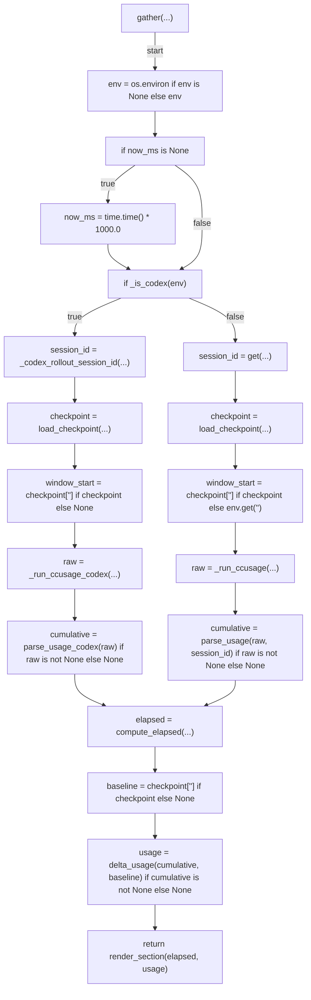
```mermaid
flowchart TD
    N001["gather(...)"]
    N002["env = os.environ if env is None else env"]
    N003["if now_ms is None"]
    N004["now_ms = time.time() * 1000.0"]
    N005["if _is_codex(env)"]
    N006["session_id = _codex_rollout_session_id(...)"]
    N007["checkpoint = load_checkpoint(...)"]
    N008["window_start = checkpoint['<str>'] if checkpoint else None"]
    N009["raw = _run_ccusage_codex(...)"]
    N010["cumulative = parse_usage_codex(raw) if raw is not None else None"]
    N011["session_id = get(...)"]
    N012["checkpoint = load_checkpoint(...)"]
    N013["window_start = checkpoint['<str>'] if checkpoint else env.get('<str>')"]
    N014["raw = _run_ccusage(...)"]
    N015["cumulative = parse_usage(raw, session_id) if raw is not None else None"]
    N016["elapsed = compute_elapsed(...)"]
    N017["baseline = checkpoint['<str>'] if checkpoint else None"]
    N018["usage = delta_usage(cumulative, baseline) if cumulative is not None else None"]
    N019["return render_section(elapsed, usage)"]
    N001 -->|"start"| N002
    N002 --> N003
    N003 -->|"true"| N004
    N004 --> N005
    N003 -->|"false"| N005
    N005 -->|"true"| N006
    N006 --> N007
    N007 --> N008
    N008 --> N009
    N009 --> N010
    N005 -->|"false"| N011
    N011 --> N012
    N012 --> N013
    N013 --> N014
    N014 --> N015
    N010 --> N016
    N015 --> N016
    N016 --> N017
    N017 --> N018
    N018 --> N019
```

## write_checkpoint(...)

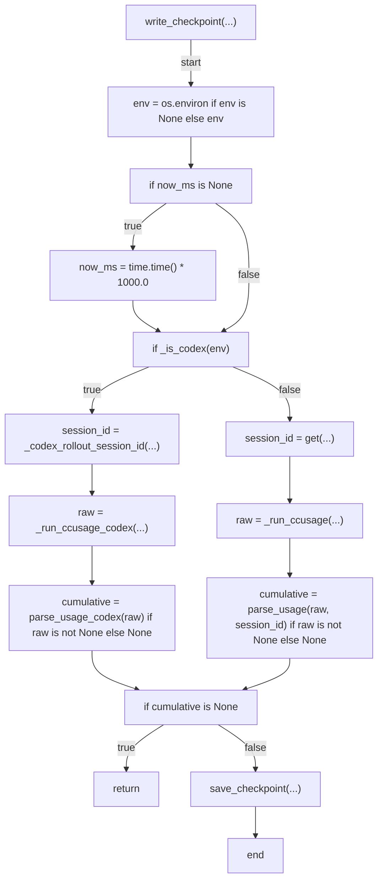
```mermaid
flowchart TD
    N001["write_checkpoint(...)"]
    N002["env = os.environ if env is None else env"]
    N003["if now_ms is None"]
    N004["now_ms = time.time() * 1000.0"]
    N005["if _is_codex(env)"]
    N006["session_id = _codex_rollout_session_id(...)"]
    N007["raw = _run_ccusage_codex(...)"]
    N008["cumulative = parse_usage_codex(raw) if raw is not None else None"]
    N009["session_id = get(...)"]
    N010["raw = _run_ccusage(...)"]
    N011["cumulative = parse_usage(raw, session_id) if raw is not None else None"]
    N012["if cumulative is None"]
    N013["return"]
    N014["save_checkpoint(...)"]
    N015["end"]
    N001 -->|"start"| N002
    N002 --> N003
    N003 -->|"true"| N004
    N004 --> N005
    N003 -->|"false"| N005
    N005 -->|"true"| N006
    N006 --> N007
    N007 --> N008
    N005 -->|"false"| N009
    N009 --> N010
    N010 --> N011
    N008 --> N012
    N011 --> N012
    N012 -->|"true"| N013
    N012 -->|"false"| N014
    N014 --> N015
```

## main(...)

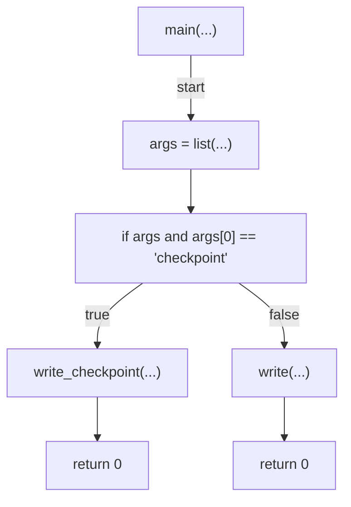
```mermaid
flowchart TD
    N001["main(...)"]
    N002["args = list(...)"]
    N003["if args and args[0] == 'checkpoint'"]
    N004["write_checkpoint(...)"]
    N005["return 0"]
    N006["write(...)"]
    N007["return 0"]
    N001 -->|"start"| N002
    N002 --> N003
    N003 -->|"true"| N004
    N004 --> N005
    N003 -->|"false"| N006
    N006 --> N007
```
