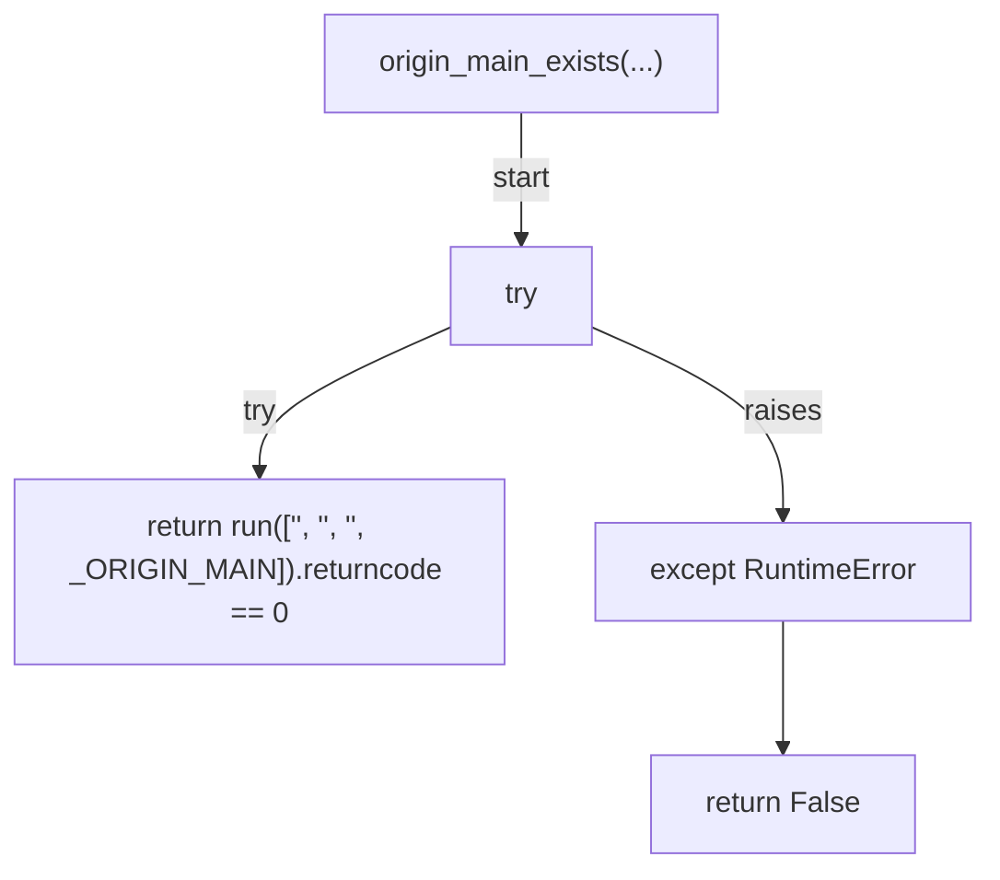
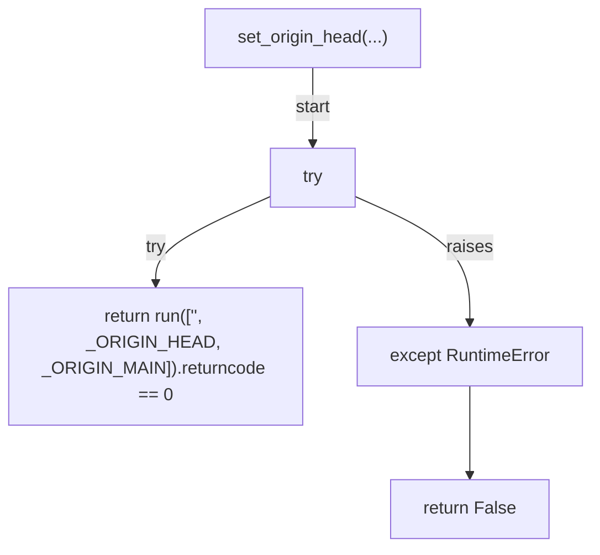
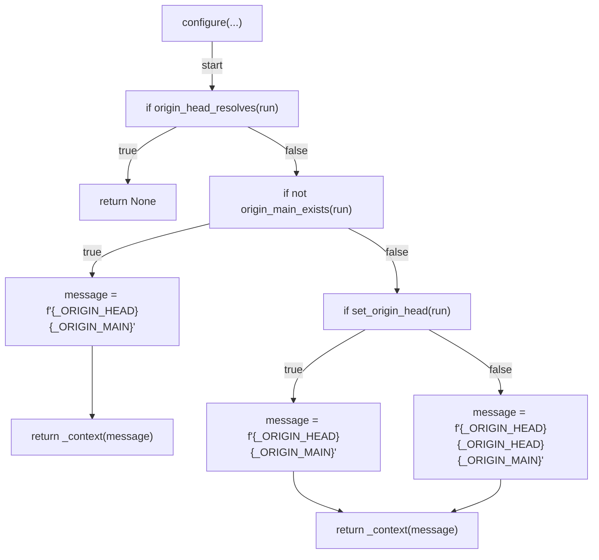
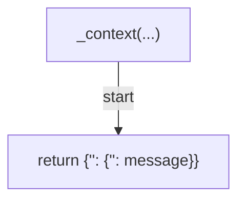
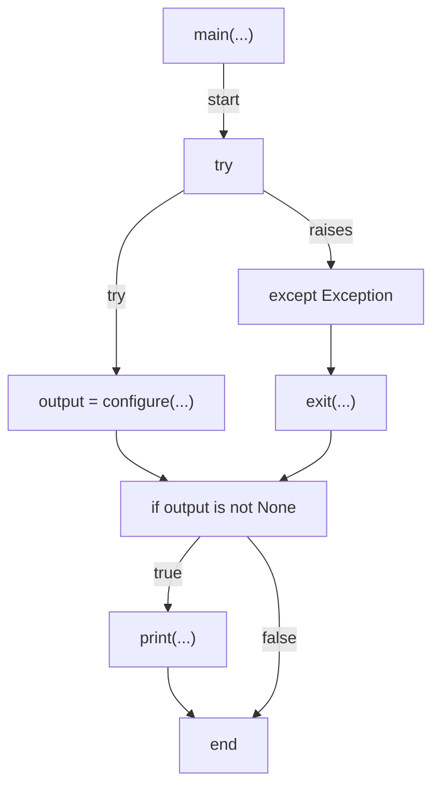

# AST graph: scripts/session_set_origin_head.py

This file is generated from `scripts/session_set_origin_head.py` by `python3 scripts/script_ast_graph.py all-doc`. Do not edit it by hand: content under `docs/generated/scripts/` is owned by the post-merge automation (refs #1540); update the source script instead.

## origin_head_resolves(...)

## origin_main_exists(...)

## set_origin_head(...)

## configure(...)

## _context(...)

## main(...)

