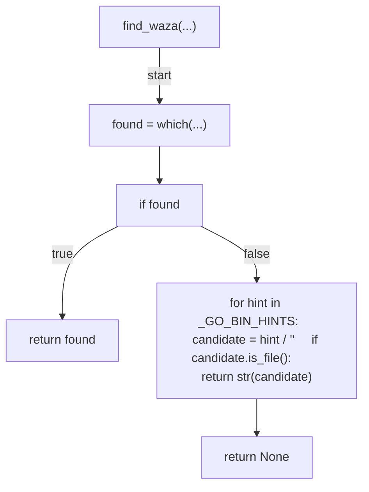
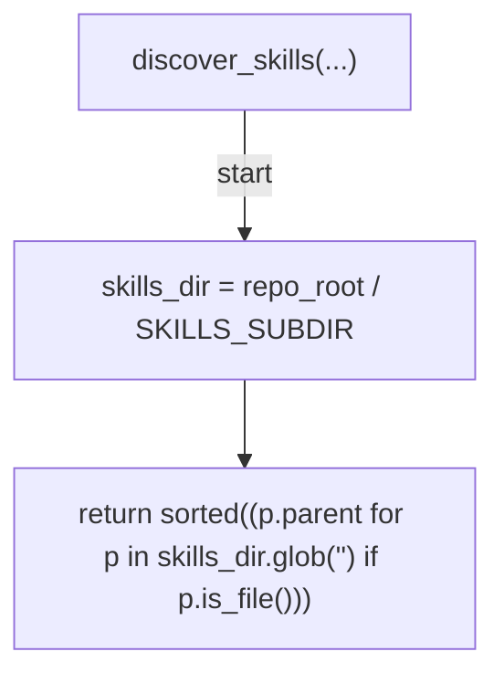
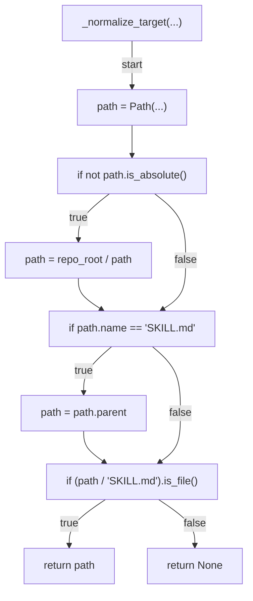
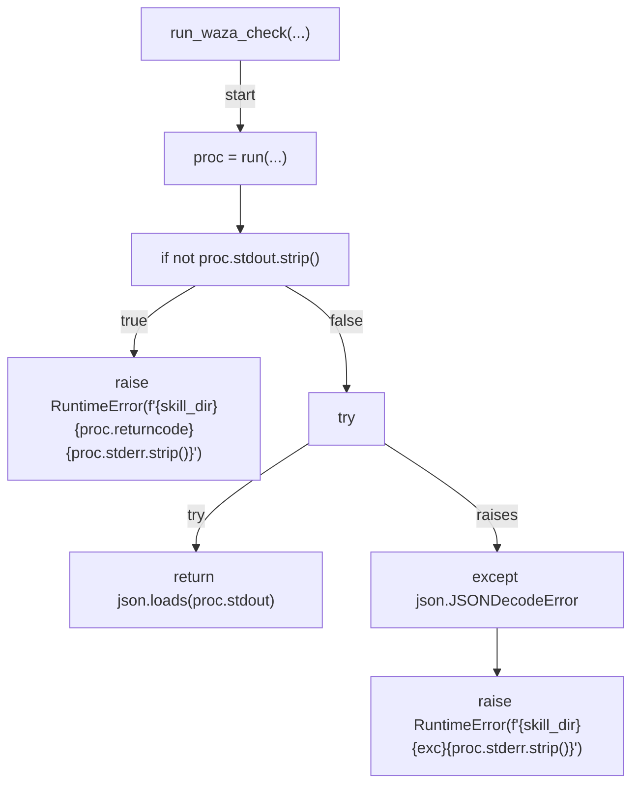
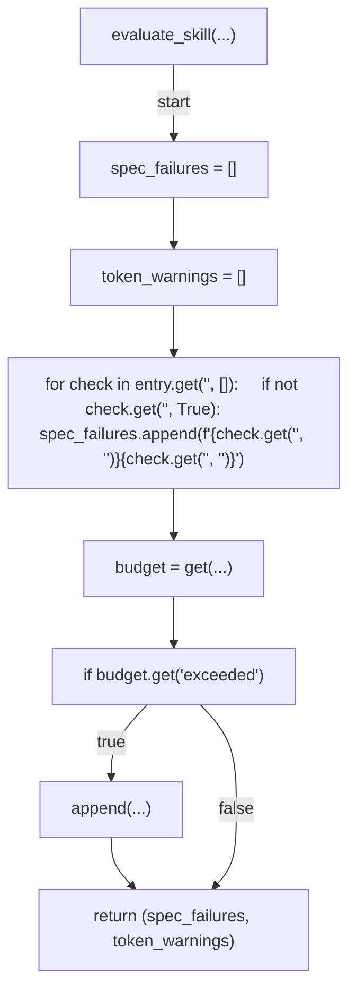
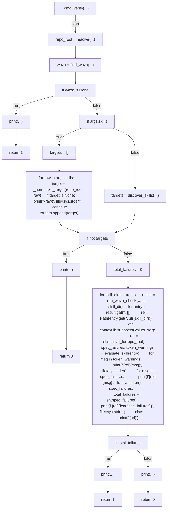
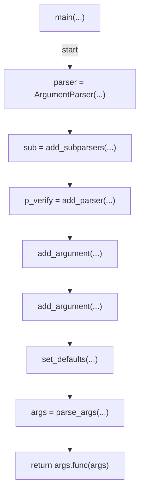

# AST graph: scripts/skill_quality_gate.py

This file is generated from `scripts/skill_quality_gate.py` by `python3 scripts/script_ast_graph.py all-doc`. Do not edit it by hand: content under `docs/generated/scripts/` is owned by the post-merge automation (refs #1540) -- update the source script instead.

## find_waza(...)

## discover_skills(...)

## _normalize_target(...)

## run_waza_check(...)

## evaluate_skill(...)

## _cmd_verify(...)

## main(...)

