# AST graph: scripts/stop_new_session_handoff_prompt.py

This file is generated from `scripts/stop_new_session_handoff_prompt.py` by `python3 scripts/script_ast_graph.py all-doc`. Do not edit it by hand: content under `docs/generated/scripts/` is owned by the post-merge automation (refs #1540) -- update the source script instead.

## _content_blocks(...)

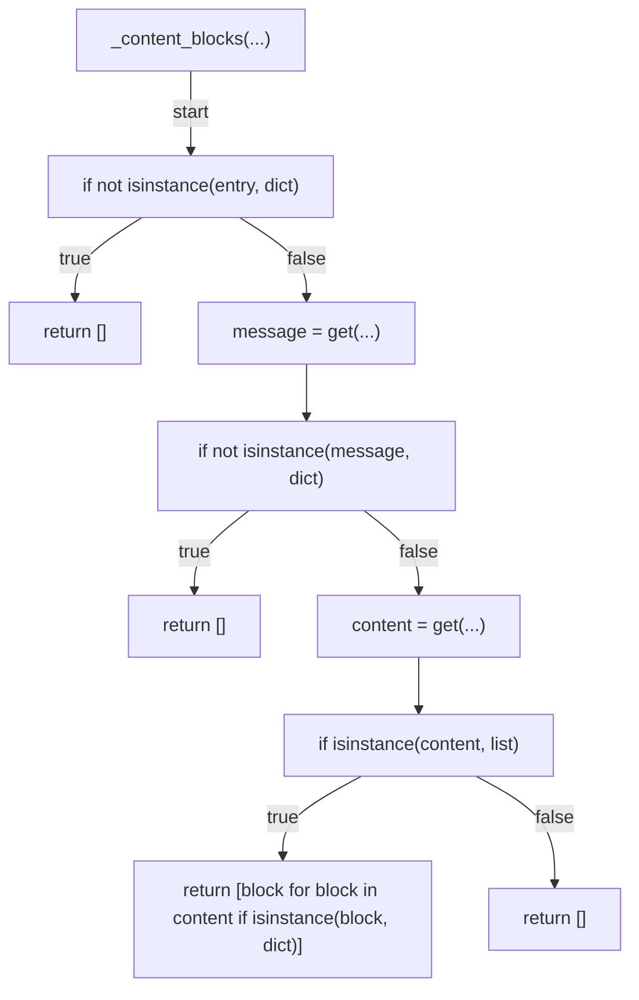

## _entry_role(...)

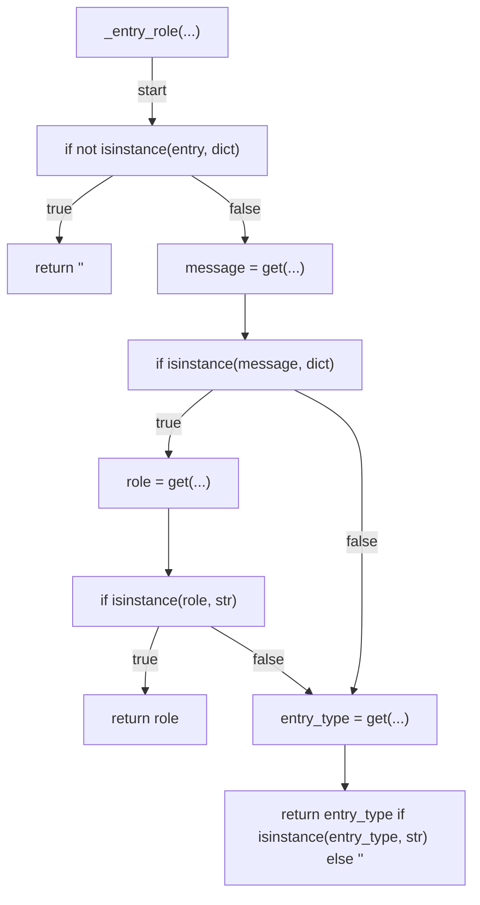

## final_assistant_turn(...)

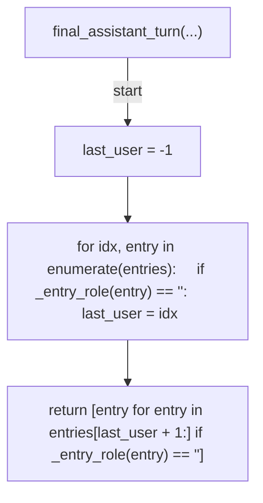

## turn_text(...)

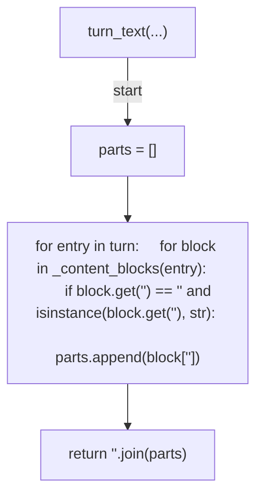

## _strip_survey_vocab(...)

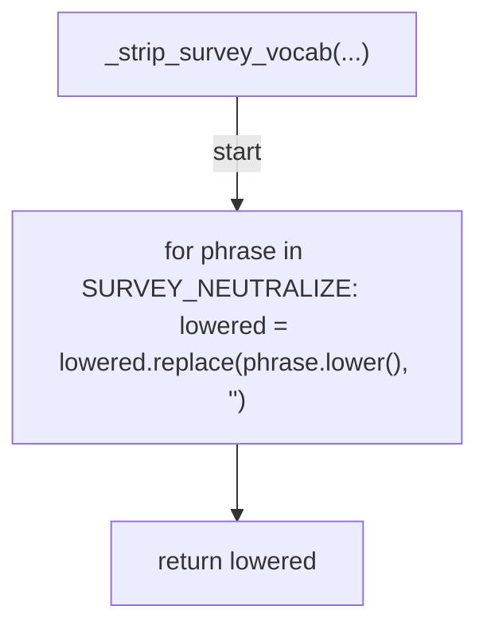

## signals_handoff(...)

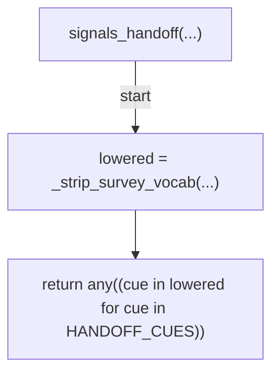

## signals_terminal_wait(...)

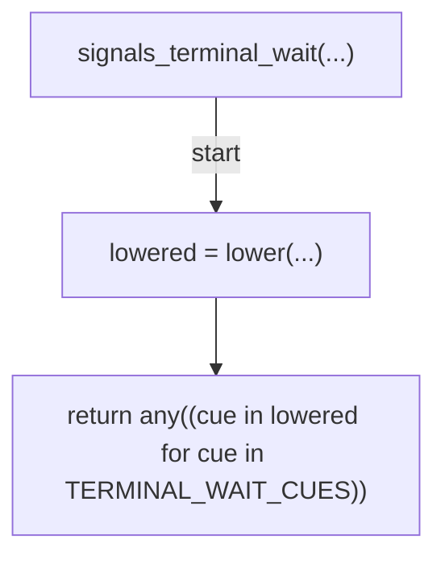

## already_provided(...)

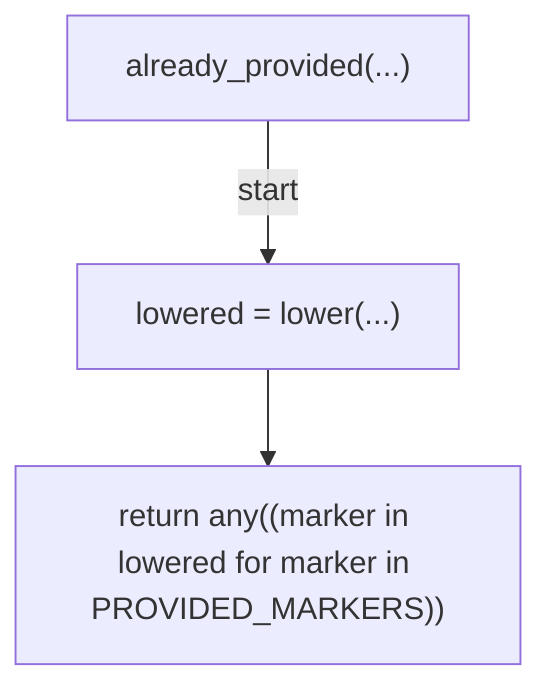

## evaluate(...)

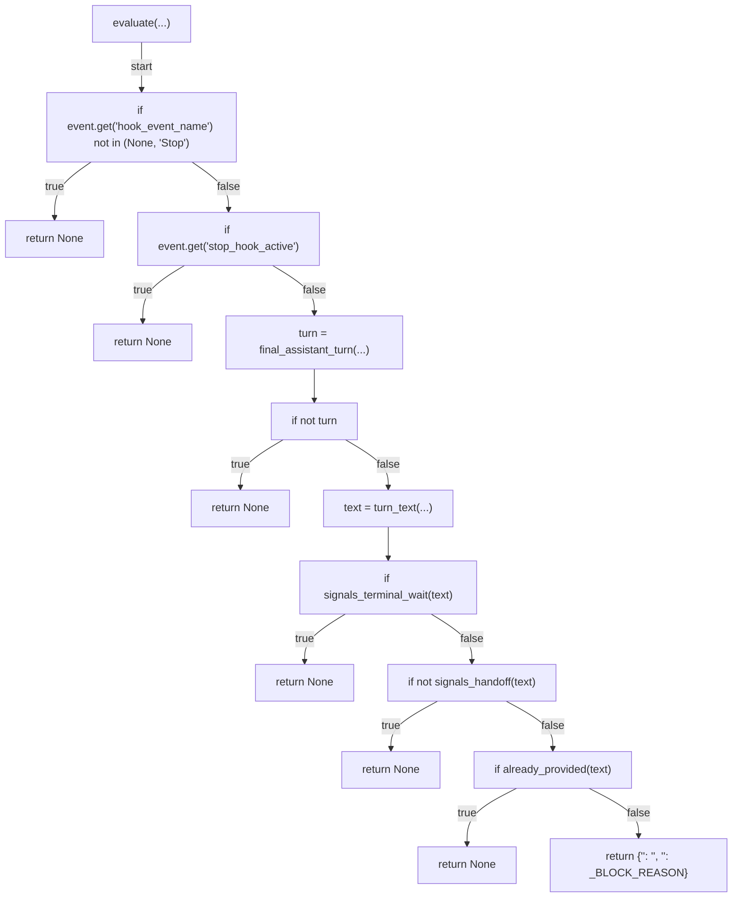

## load_transcript(...)

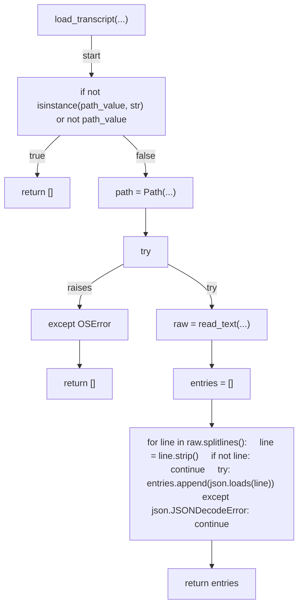

## main(...)

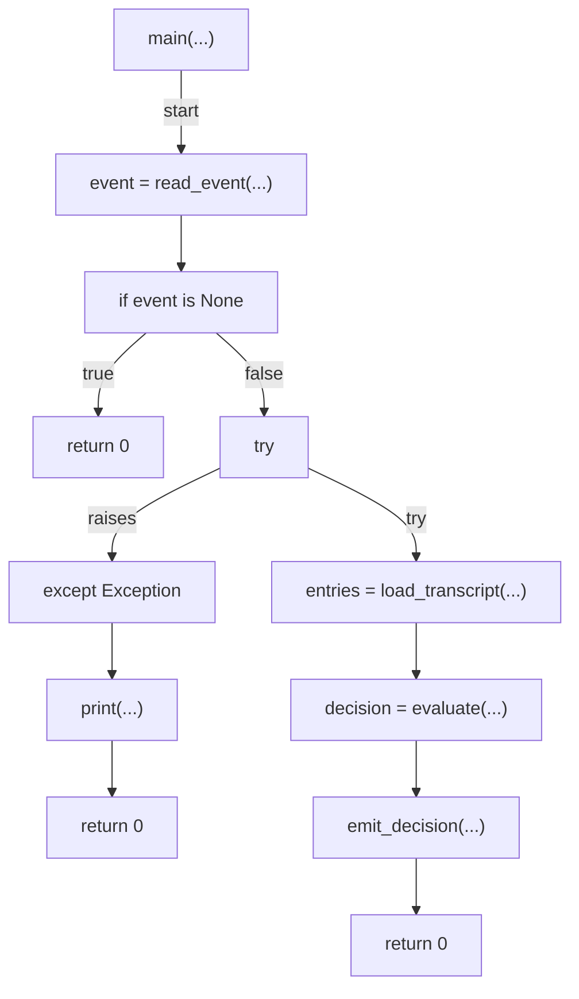
