# AST graph: scripts/threat_intel_triage.py

This file is generated from `scripts/threat_intel_triage.py` by `python3 scripts/script_ast_graph.py all-doc`. Do not edit it by hand: content under `docs/generated/scripts/` is owned by the post-merge automation (refs #1540) -- update the source script instead.

## parse_labels(...)

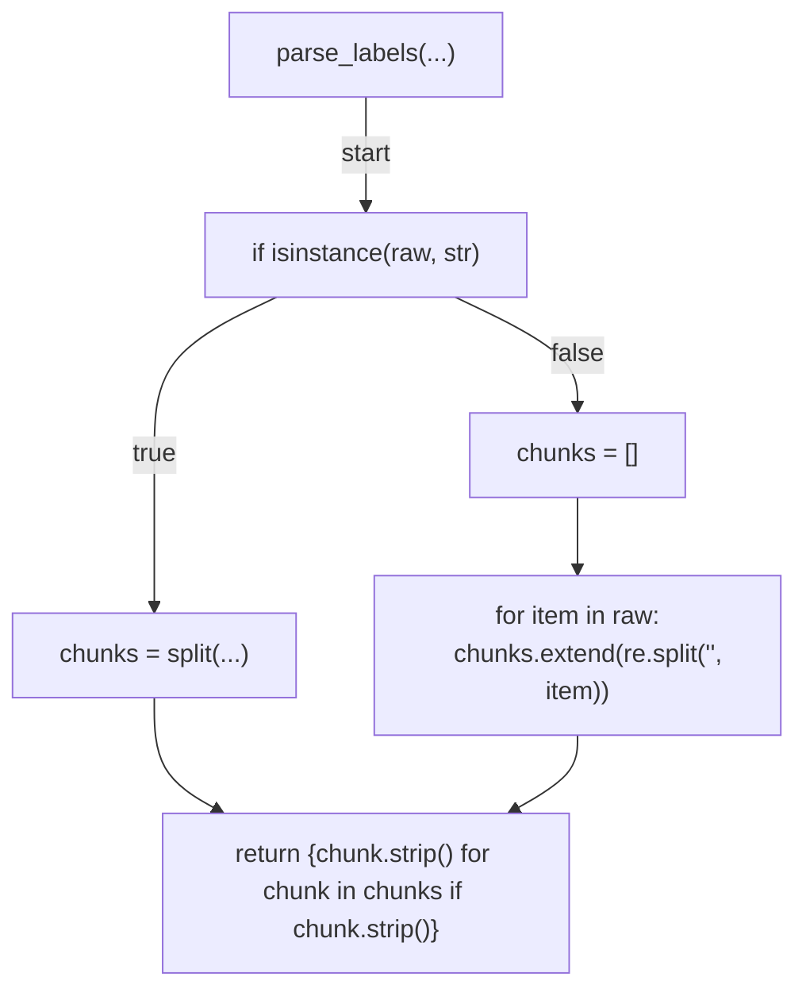

## discover_dependencies(...)

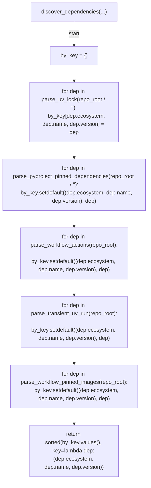

## parse_uv_lock(...)

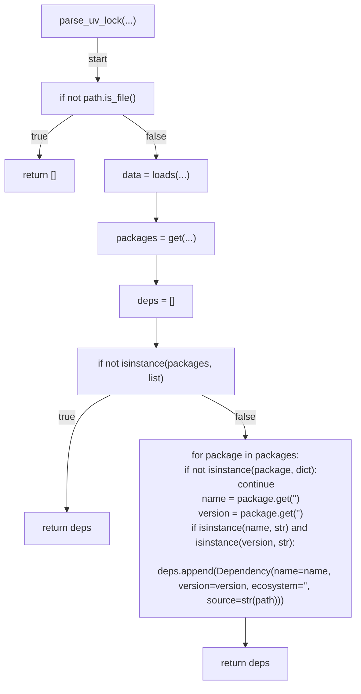

## parse_pyproject_pinned_dependencies(...)

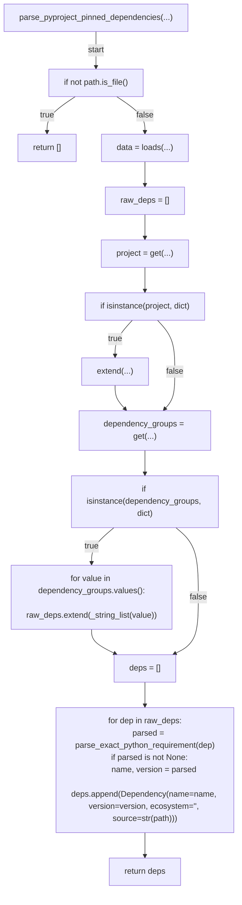

## parse_exact_python_requirement(...)

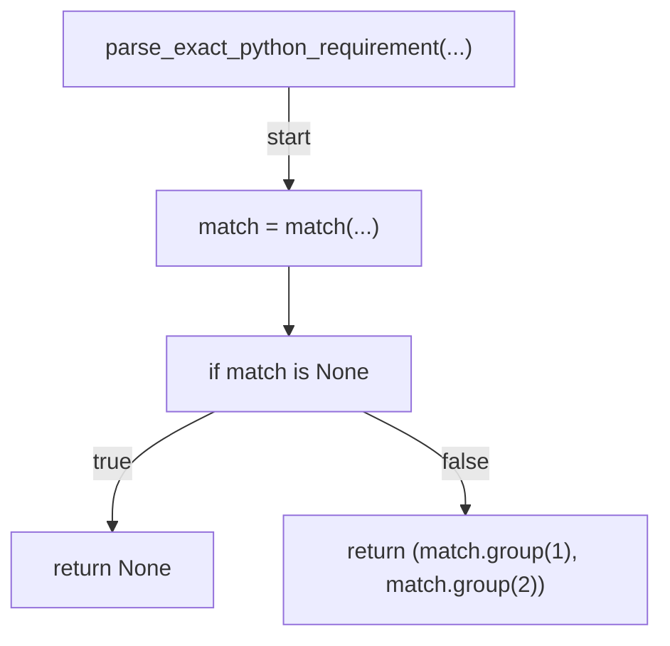

## parse_workflow_actions(...)

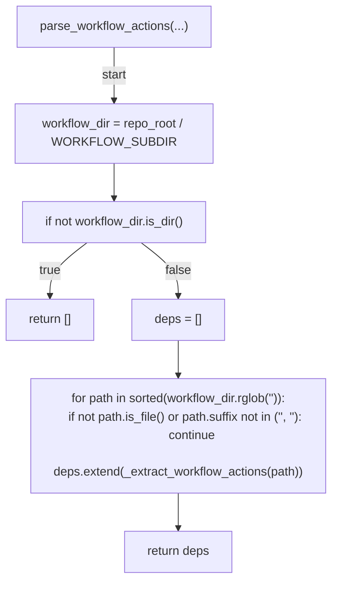

## _extract_workflow_actions(...)

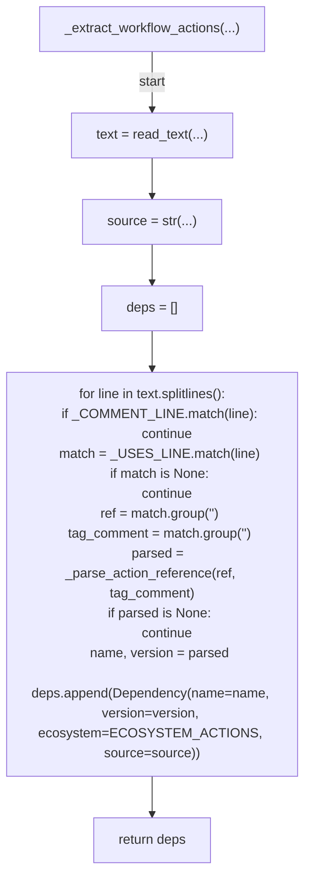

## parse_workflow_pinned_images(...)

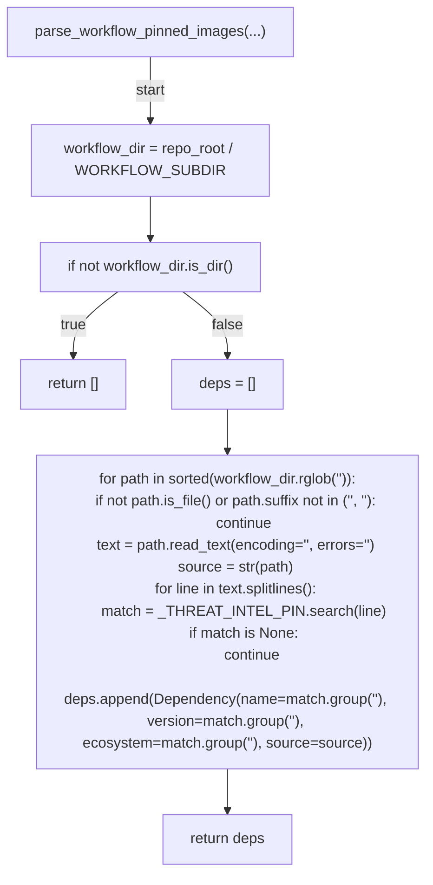

## _parse_action_reference(...)

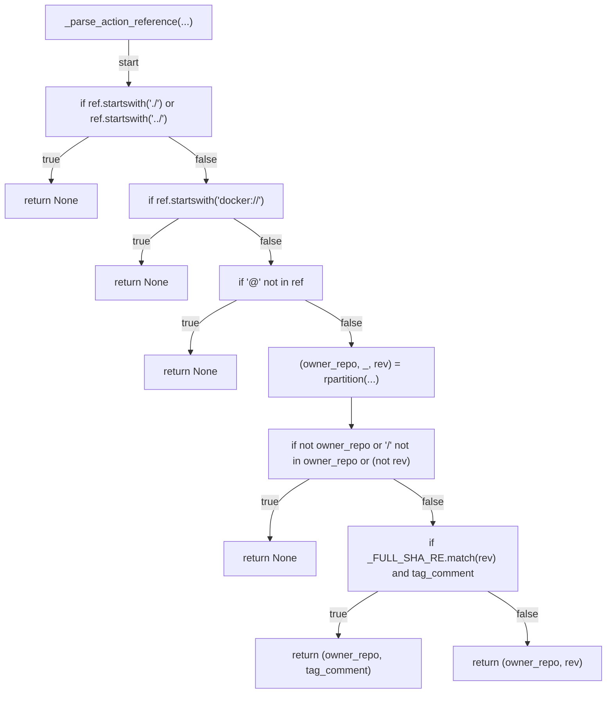

## parse_transient_uv_run(...)

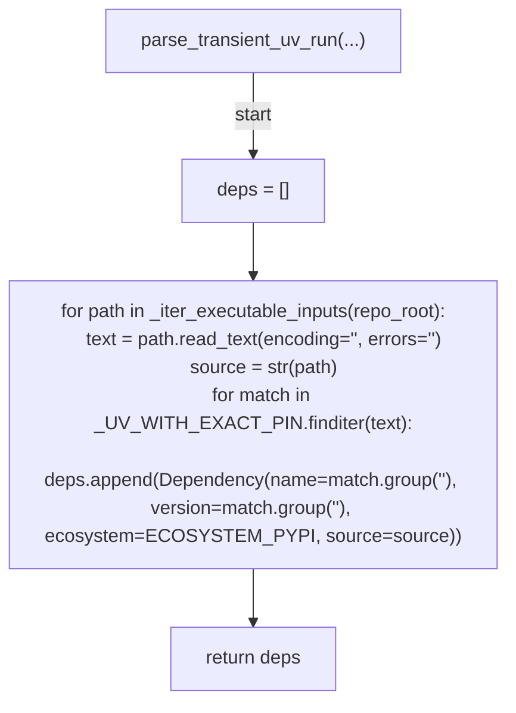

## _iter_executable_inputs(...)

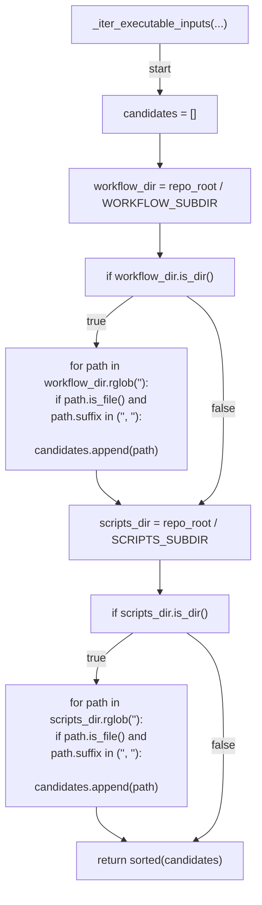

## _record_outage(...)

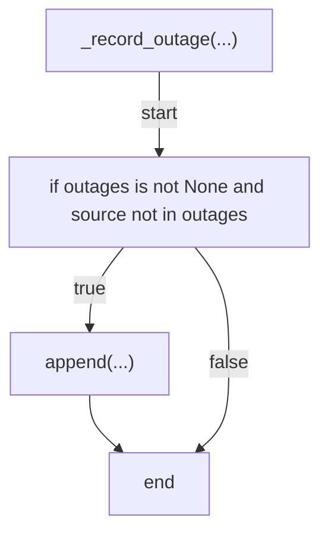

## fetch_external_findings(...)

```mermaid
flowchart TD
    N001["fetch_external_findings(...)"]
    N002["if not dependencies"]
    N003["return []"]
    N004["if osv_file is not None"]
    N005["osv_batch = load_json(...)"]
    N006["malformed = validate_osv_coordinates(...)"]
    N007["if malformed"]
    N008["coords = join(...)"]
    N009["raise ValueError(f'<str>{coords}')"]
    N010["osv_batch = query_osv_batch(...)"]
    N011["kev_catalog = load_json(kev_file) if kev_file is not None else fetch_cisa_kev()"]
    N012["kev_cves = parse_kev_cves(...)"]
    N013["vuln_ids_by_dep = parse_osv_batch_results(...)"]
    N014["vuln_details = fetch_osv_details(...)"]
    N015["osv_findings = []"]
    N016["for dep, vuln_ids in vuln_ids_by_dep:
    for vuln_id in vuln_ids:
        details = vuln_details.get(vuln_id, {})
        aliases = tuple((str(alias) for alias in details.get('<str>', []) if isinstance(alias, str)))
        cve_ids = {vuln_id, *aliases}
        known_exploited = bool(cve_ids & kev_cves)
        advisory_type = GHSA_MALWARE_TYPE if vuln_id.startswith(MAL_ID_PREFIX) else None
        osv_findings.append(Finding(dependency=dep, vuln_id=vuln_id, aliases=aliases, source=SOURCE_OSV, known_exploited=known_exploited, advisory_type=advisory_type))"]
    N017["ghsa_findings = []"]
    N018["if ghsa_file is not None or ghsa_live"]
    N019["ghsa_findings = fetch_ghsa_advisories(...)"]
    N020["ossf_findings = []"]
    N021["if malpkg_file is not None or malpkg_live"]
    N022["ossf_findings = fetch_ossf_malicious_packages(...)"]
    N023["merged = merge_findings(...)"]
    N024["if epss_file is not None or epss_live"]
    N025["epss_scores = fetch_epss_scores(...)"]
    N026["merged = [_attach_epss(finding, epss_scores) for finding in merged]"]
    N027["if nvd_file is not None or nvd_live"]
    N028["nvd_map = fetch_nvd_metadata(...)"]
    N029["merged = attach_nvd_to_findings(...)"]
    N030["return sorted(merged, key=lambda f: (f.dependency.name, f.vuln_id))"]
    N001 -->|"start"| N002
    N002 -->|"true"| N003
    N002 -->|"false"| N004
    N004 -->|"true"| N005
    N004 -->|"false"| N006
    N006 --> N007
    N007 -->|"true"| N008
    N008 --> N009
    N007 -->|"false"| N010
    N005 --> N011
    N010 --> N011
    N011 --> N012
    N012 --> N013
    N013 --> N014
    N014 --> N015
    N015 --> N016
    N016 --> N017
    N017 --> N018
    N018 -->|"true"| N019
    N019 --> N020
    N018 -->|"false"| N020
    N020 --> N021
    N021 -->|"true"| N022
    N022 --> N023
    N021 -->|"false"| N023
    N023 --> N024
    N024 -->|"true"| N025
    N025 --> N026
    N026 --> N027
    N024 -->|"false"| N027
    N027 -->|"true"| N028
    N028 --> N029
    N029 --> N030
    N027 -->|"false"| N030
```

## _ecosystem_base(...)

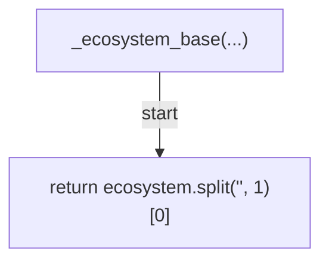

## _coord_field_malformed(...)

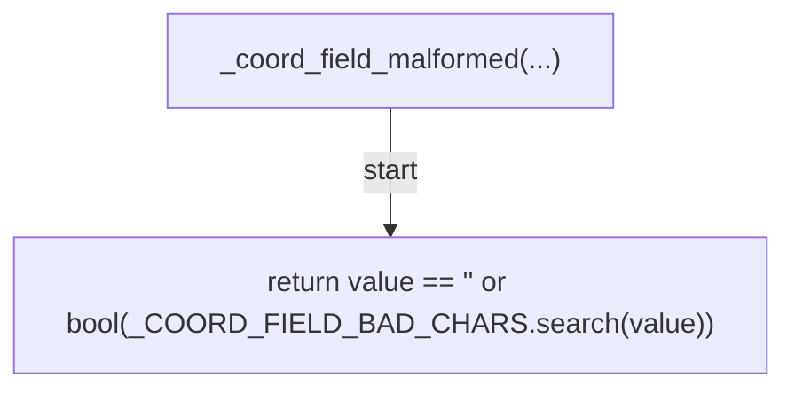

## validate_osv_coordinates(...)

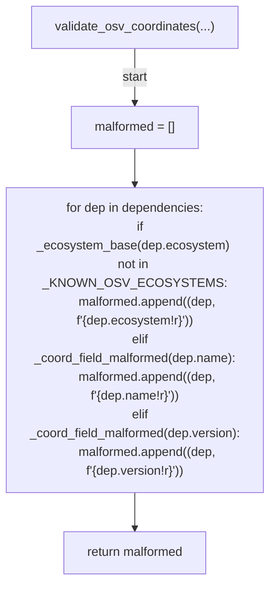

## query_osv_batch(...)

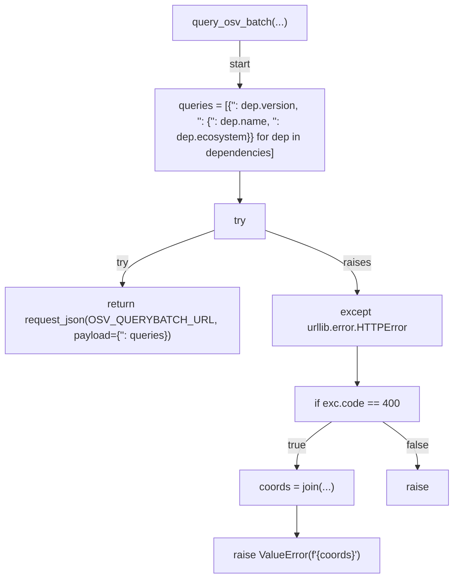

## fetch_cisa_kev(...)

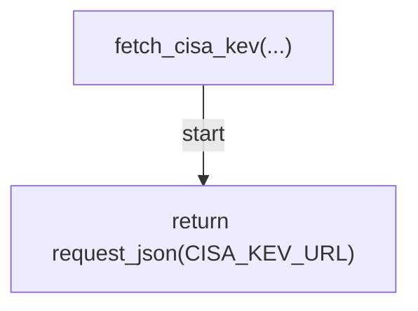

## fetch_osv_details(...)

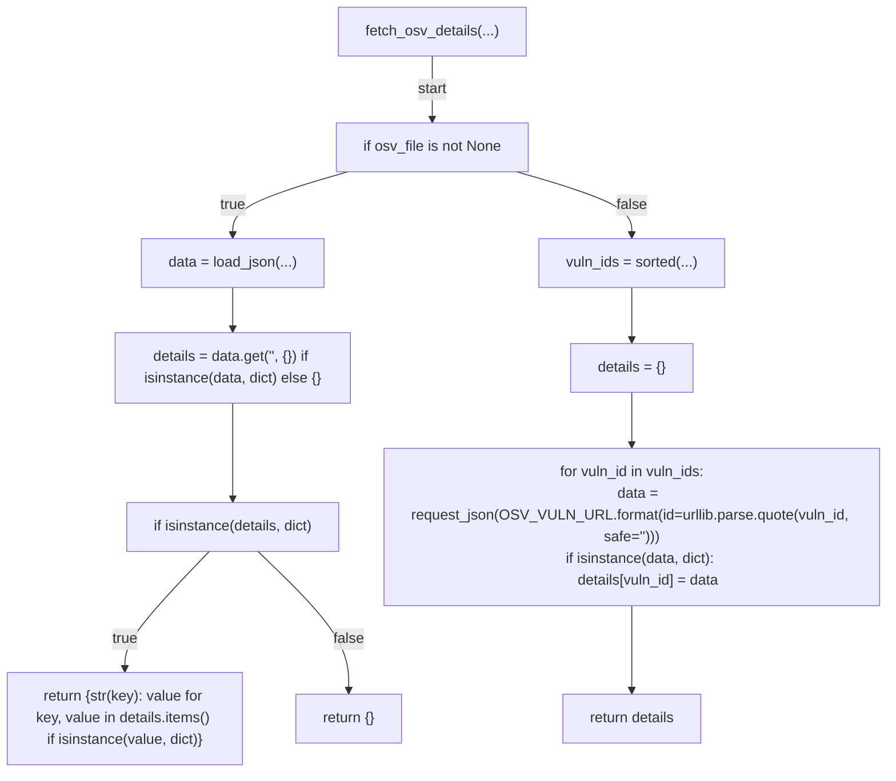

## parse_osv_batch_results(...)

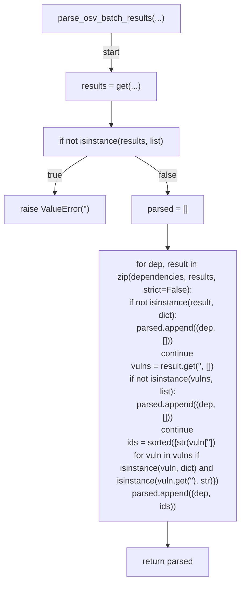

## parse_kev_cves(...)

```mermaid
flowchart TD
    N001["parse_kev_cves(...)"]
    N002["vulnerabilities = get(...)"]
    N003["if not isinstance(vulnerabilities, list)"]
    N004["raise ValueError('<str>')"]
    N005["cves = set(...)"]
    N006["for vulnerability in vulnerabilities:
    if not isinstance(vulnerability, dict):
        continue
    cve_id = vulnerability.get('<str>')
    if isinstance(cve_id, str):
        cves.add(cve_id)"]
    N007["return cves"]
    N001 -->|"start"| N002
    N002 --> N003
    N003 -->|"true"| N004
    N003 -->|"false"| N005
    N005 --> N006
    N006 --> N007
```

## fetch_epss_scores(...)

```mermaid
flowchart TD
    N001["fetch_epss_scores(...)"]
    N002["if not cves"]
    N003["return {}"]
    N004["if epss_file is not None"]
    N005["try"]
    N006["data = load_json(...)"]
    N007["except (OSError, ValueError, json.JSONDecodeError)"]
    N008["return {}"]
    N009["return _parse_epss_payload(data)"]
    N010["if not epss_live"]
    N011["return {}"]
    N012["query = urlencode(...)"]
    N013["try"]
    N014["data = request_json(...)"]
    N015["except (OSError, ValueError, json.JSONDecodeError)"]
    N016["_record_outage(...)"]
    N017["return {}"]
    N018["return _parse_epss_payload(data)"]
    N001 -->|"start"| N002
    N002 -->|"true"| N003
    N002 -->|"false"| N004
    N004 -->|"true"| N005
    N005 -->|"try"| N006
    N005 -->|"raises"| N007
    N007 --> N008
    N006 --> N009
    N004 -->|"false"| N010
    N010 -->|"true"| N011
    N010 -->|"false"| N012
    N012 --> N013
    N013 -->|"try"| N014
    N013 -->|"raises"| N015
    N015 --> N016
    N016 --> N017
    N014 --> N018
```

## _parse_epss_payload(...)

```mermaid
flowchart TD
    N001["_parse_epss_payload(...)"]
    N002["rows = get(...)"]
    N003["if not isinstance(rows, list)"]
    N004["return {}"]
    N005["scores = {}"]
    N006["for row in rows:
    if not isinstance(row, dict):
        continue
    cve = row.get('<str>')
    score = _coerce_epss_float(row.get('<str>'))
    percentile = _coerce_epss_float(row.get('<str>'))
    if isinstance(cve, str) and score is not None and (percentile is not None):
        scores[cve.upper()] = (score, percentile)"]
    N007["return scores"]
    N001 -->|"start"| N002
    N002 --> N003
    N003 -->|"true"| N004
    N003 -->|"false"| N005
    N005 --> N006
    N006 --> N007
```

## _coerce_epss_float(...)

```mermaid
flowchart TD
    N001["_coerce_epss_float(...)"]
    N002["if isinstance(value, int | float)"]
    N003["return float(value)"]
    N004["if isinstance(value, str)"]
    N005["try"]
    N006["return float(value)"]
    N007["except ValueError"]
    N008["return None"]
    N009["return None"]
    N001 -->|"start"| N002
    N002 -->|"true"| N003
    N002 -->|"false"| N004
    N004 -->|"true"| N005
    N005 -->|"try"| N006
    N005 -->|"raises"| N007
    N007 --> N008
    N004 -->|"false"| N009
```

## _collect_cve_ids(...)

```mermaid
flowchart TD
    N001["_collect_cve_ids(...)"]
    N002["seen = set(...)"]
    N003["for finding in findings:
    for candidate in (finding.vuln_id, *finding.aliases):
        if isinstance(candidate, str) and _CVE_PATTERN.match(candidate):
            seen.add(candidate.upper())"]
    N004["return sorted(seen)"]
    N001 -->|"start"| N002
    N002 --> N003
    N003 --> N004
```

## _attach_epss(...)

```mermaid
flowchart TD
    N001["_attach_epss(...)"]
    N002["if not scores"]
    N003["return finding"]
    N004["for candidate in (finding.vuln_id, *finding.aliases):
    if not isinstance(candidate, str):
        continue
    match = scores.get(candidate.upper())
    if match is not None:
        score, percentile = match
        return finding._replace(epss_score=score, epss_percentile=percentile)"]
    N005["return finding"]
    N001 -->|"start"| N002
    N002 -->|"true"| N003
    N002 -->|"false"| N004
    N004 --> N005
```

## fetch_ghsa_advisories(...)

```mermaid
flowchart TD
    N001["fetch_ghsa_advisories(...)"]
    N002["if not dependencies"]
    N003["return []"]
    N004["kev = kev_cves if kev_cves is not None else set()"]
    N005["advisories = []"]
    N006["if ghsa_file is not None"]
    N007["advisories = load_ghsa_advisories(...)"]
    N008["for dep in dependencies:
    ghsa_eco = _GHSA_ECOSYSTEM_MAP.get(dep.ecosystem)
    if ghsa_eco is None:
        continue
    query = urllib.parse.urlencode({'<str>': f'{dep.name}<str>{dep.version}', '<str>': ghsa_eco, '<str>': '<str>'})
    data = request_json_any(f'{GHSA_ADVISORIES_URL}<str>{query}', token=token)
    if isinstance(data, list):
        advisories.extend((item for item in data if isinstance(item, dict)))"]
    N009["findings = []"]
    N010["for advisory in advisories:
    vuln_id = _ghsa_primary_id(advisory)
    if not vuln_id:
        continue
    aliases = _ghsa_aliases(advisory, vuln_id)
    advisory_type = _ghsa_type(advisory)
    identifiers = {vuln_id, *aliases}
    known_exploited = bool(identifiers & kev)
    for dep in dependencies:
        if not _ghsa_affects_dependency(advisory, dep):
            continue
        findings.append(Finding(dependency=dep, vuln_id=vuln_id, aliases=aliases, source=SOURCE_GHSA, known_exploited=known_exploited, advisory_type=advisory_type))"]
    N011["return findings"]
    N001 -->|"start"| N002
    N002 -->|"true"| N003
    N002 -->|"false"| N004
    N004 --> N005
    N005 --> N006
    N006 -->|"true"| N007
    N006 -->|"false"| N008
    N007 --> N009
    N008 --> N009
    N009 --> N010
    N010 --> N011
```

## load_ghsa_advisories(...)

```mermaid
flowchart TD
    N001["load_ghsa_advisories(...)"]
    N002["data = load_json(...)"]
    N003["advisories = get(...)"]
    N004["if not isinstance(advisories, list)"]
    N005["raise ValueError(f'{path}<str>')"]
    N006["return [item for item in advisories if isinstance(item, dict)]"]
    N001 -->|"start"| N002
    N002 --> N003
    N003 --> N004
    N004 -->|"true"| N005
    N004 -->|"false"| N006
```

## _ghsa_primary_id(...)

```mermaid
flowchart TD
    N001["_ghsa_primary_id(...)"]
    N002["raw = get(...)"]
    N003["return str(raw) if isinstance(raw, str) else '<str>'"]
    N001 -->|"start"| N002
    N002 --> N003
```

## _ghsa_aliases(...)

```mermaid
flowchart TD
    N001["_ghsa_aliases(...)"]
    N002["aliases = []"]
    N003["cve = get(...)"]
    N004["if isinstance(cve, str) and cve"]
    N005["append(...)"]
    N006["identifiers = get(...)"]
    N007["if isinstance(identifiers, list)"]
    N008["for item in identifiers:
    if not isinstance(item, dict):
        continue
    value = item.get('<str>')
    if isinstance(value, str) and value and (value != primary) and (value not in aliases):
        aliases.append(value)"]
    N009["return tuple(aliases)"]
    N001 -->|"start"| N002
    N002 --> N003
    N003 --> N004
    N004 -->|"true"| N005
    N005 --> N006
    N004 -->|"false"| N006
    N006 --> N007
    N007 -->|"true"| N008
    N008 --> N009
    N007 -->|"false"| N009
```

## _ghsa_type(...)

```mermaid
flowchart TD
    N001["_ghsa_type(...)"]
    N002["raw = get(...)"]
    N003["return str(raw) if isinstance(raw, str) else None"]
    N001 -->|"start"| N002
    N002 --> N003
```

## _ghsa_affects_dependency(...)

```mermaid
flowchart TD
    N001["_ghsa_affects_dependency(...)"]
    N002["ghsa_eco = get(...)"]
    N003["if ghsa_eco is None"]
    N004["return False"]
    N005["vulnerabilities = get(...)"]
    N006["if not isinstance(vulnerabilities, list)"]
    N007["return False"]
    N008["for vuln in vulnerabilities:
    if not isinstance(vuln, dict):
        continue
    package = vuln.get('<str>')
    if not isinstance(package, dict):
        continue
    if package.get('<str>') != ghsa_eco:
        continue
    name = package.get('<str>')
    if isinstance(name, str) and name.lower() == dep.name.lower():
        return True"]
    N009["return False"]
    N001 -->|"start"| N002
    N002 --> N003
    N003 -->|"true"| N004
    N003 -->|"false"| N005
    N005 --> N006
    N006 -->|"true"| N007
    N006 -->|"false"| N008
    N008 --> N009
```

## fetch_ossf_malicious_packages(...)

```mermaid
flowchart TD
    N001["fetch_ossf_malicious_packages(...)"]
    N002["if not dependencies"]
    N003["return []"]
    N004["if malpkg_file is None and (not malpkg_live)"]
    N005["return []"]
    N006["kev = kev_cves if kev_cves is not None else set()"]
    N007["records"]
    N008["if malpkg_file is not None"]
    N009["records = load_ossf_malicious_records(...)"]
    N010["records = []"]
    N011["for dep in dependencies:
    records.extend(query_osv_malicious_for_dependency(dep))"]
    N012["findings = []"]
    N013["for record in records:
    vuln_id = record.get('<str>')
    if not isinstance(vuln_id, str) or not vuln_id.startswith(MAL_ID_PREFIX):
        continue
    raw_aliases = record.get('<str>', [])
    aliases = tuple((str(alias) for alias in (raw_aliases if isinstance(raw_aliases, list) else []) if isinstance(alias, str)))
    identifiers = {vuln_id, *aliases}
    known_exploited = bool(identifiers & kev)
    for dep in _ossf_affected_dependencies(record, dependencies):
        findings.append(Finding(dependency=dep, vuln_id=vuln_id, aliases=aliases, source=SOURCE_OSSF_MAL, known_exploited=known_exploited, advisory_type=GHSA_MALWARE_TYPE))"]
    N014["return findings"]
    N001 -->|"start"| N002
    N002 -->|"true"| N003
    N002 -->|"false"| N004
    N004 -->|"true"| N005
    N004 -->|"false"| N006
    N006 --> N007
    N007 --> N008
    N008 -->|"true"| N009
    N008 -->|"false"| N010
    N010 --> N011
    N009 --> N012
    N011 --> N012
    N012 --> N013
    N013 --> N014
```

## load_ossf_malicious_records(...)

```mermaid
flowchart TD
    N001["load_ossf_malicious_records(...)"]
    N002["data = load_json(...)"]
    N003["records = get(...)"]
    N004["if not isinstance(records, list)"]
    N005["raise ValueError(f'{path}<str>')"]
    N006["return [item for item in records if isinstance(item, dict)]"]
    N001 -->|"start"| N002
    N002 --> N003
    N003 --> N004
    N004 -->|"true"| N005
    N004 -->|"false"| N006
```

## query_osv_malicious_for_dependency(...)

```mermaid
flowchart TD
    N001["query_osv_malicious_for_dependency(...)"]
    N002["payload = {'<str>': {'<str>': dep.name, '<str>': dep.ecosystem}}"]
    N003["response = request_json(...)"]
    N004["vulns = get(...)"]
    N005["if not isinstance(vulns, list)"]
    N006["return []"]
    N007["return [vuln for vuln in vulns if isinstance(vuln, dict) and isinstance(vuln.get('<str>'), str) and vuln['<str>'].startswith(MAL_ID_PREFIX)]"]
    N001 -->|"start"| N002
    N002 --> N003
    N003 --> N004
    N004 --> N005
    N005 -->|"true"| N006
    N005 -->|"false"| N007
```

## _ossf_affected_dependencies(...)

```mermaid
flowchart TD
    N001["_ossf_affected_dependencies(...)"]
    N002["affected = get(...)"]
    N003["if not isinstance(affected, list)"]
    N004["return []"]
    N005["matched = []"]
    N006["for entry in affected:
    if not isinstance(entry, dict):
        continue
    package = entry.get('<str>')
    if not isinstance(package, dict):
        continue
    eco = package.get('<str>')
    name = package.get('<str>')
    if not isinstance(eco, str) or not isinstance(name, str):
        continue
    for dep in dependencies:
        if dep.ecosystem == eco and dep.name.lower() == name.lower() and (dep not in matched):
            matched.append(dep)"]
    N007["return matched"]
    N001 -->|"start"| N002
    N002 --> N003
    N003 -->|"true"| N004
    N003 -->|"false"| N005
    N005 --> N006
    N006 --> N007
```

## merge_findings(...)

```mermaid
flowchart TD
    N001["merge_findings(...)"]
    N002["by_key = {}"]
    N003["for finding in findings:
    dep = finding.dependency
    key = (dep.ecosystem, dep.name, dep.version, finding.vuln_id)
    existing = by_key.get(key)
    if existing is None:
        by_key[key] = finding
        continue
    sources = [s.strip() for s in existing.source.split('<str>') if s.strip()]
    for chunk in finding.source.split('<str>'):
        src = chunk.strip()
        if src and src not in sources:
            sources.append(src)
    merged_aliases = list(existing.aliases)
    for alias in finding.aliases:
        if alias not in merged_aliases:
            merged_aliases.append(alias)
    by_key[key] = Finding(dependency=existing.dependency, vuln_id=existing.vuln_id, aliases=tuple(merged_aliases), source='<str>'.join(sources), known_exploited=existing.known_exploited or finding.known_exploited, advisory_type=existing.advisory_type or finding.advisory_type, epss_score=existing.epss_score if existing.epss_score is not None else finding.epss_score, epss_percentile=existing.epss_percentile if existing.epss_percentile is not None else finding.epss_percentile)"]
    N004["return list(by_key.values())"]
    N001 -->|"start"| N002
    N002 --> N003
    N003 --> N004
```

## fetch_nvd_metadata(...)

```mermaid
flowchart TD
    N001["fetch_nvd_metadata(...)"]
    N002["if not cve_ids"]
    N003["return {}"]
    N004["enrichment = {}"]
    N005["if nvd_file is not None"]
    N006["try"]
    N007["payload = load_json(...)"]
    N008["except (OSError, ValueError, json.JSONDecodeError)"]
    N009["return {}"]
    N010["raw_map = get(...)"]
    N011["if not isinstance(raw_map, dict)"]
    N012["return {}"]
    N013["upper_raw = {key.upper(): value for key, value in raw_map.items() if isinstance(key, str)}"]
    N014["for cve_id in cve_ids:
    cve_payload = upper_raw.get(cve_id)
    if not isinstance(cve_payload, dict):
        continue
    parsed = parse_nvd_cve(cve_payload, cve_id)
    if parsed is not None:
        enrichment[cve_id] = parsed"]
    N015["return enrichment"]
    N016["for cve_id in cve_ids:
    try:
        query = urllib.parse.urlencode({'<str>': cve_id})
        data = request_json(f'{NVD_CVE_URL}<str>{query}')
    except (OSError, ValueError, json.JSONDecodeError):
        _record_outage(outages, SOURCE_NVD)
        continue
    vulnerabilities = data.get('<str>') if isinstance(data, dict) else None
    if not isinstance(vulnerabilities, list) or not vulnerabilities:
        continue
    first = vulnerabilities[0]
    if not isinstance(first, dict):
        continue
    cve_payload = first.get('<str>')
    if not isinstance(cve_payload, dict):
        continue
    parsed = parse_nvd_cve(cve_payload, cve_id)
    if parsed is not None:
        enrichment[cve_id] = parsed"]
    N017["return enrichment"]
    N001 -->|"start"| N002
    N002 -->|"true"| N003
    N002 -->|"false"| N004
    N004 --> N005
    N005 -->|"true"| N006
    N006 -->|"try"| N007
    N006 -->|"raises"| N008
    N008 --> N009
    N007 --> N010
    N010 --> N011
    N011 -->|"true"| N012
    N011 -->|"false"| N013
    N013 --> N014
    N014 --> N015
    N005 -->|"false"| N016
    N016 --> N017
```

## parse_nvd_cve(...)

```mermaid
flowchart TD
    N001["parse_nvd_cve(...)"]
    N002["(cvss_severity, cvss_score, cvss_version) = _extract_nvd_cvss(...)"]
    N003["cwe_ids = _extract_nvd_cwes(...)"]
    N004["references = _extract_nvd_references(...)"]
    N005["if cvss_severity is None and cvss_score is None and (not cwe_ids) and (not references)"]
    N006["return None"]
    N007["return NvdEnrichment(cve_id=cve_id, cvss_severity=cvss_severity, cvss_score=cvss_score, cvss_version=cvss_version, cwe_ids=cwe_ids, references=references, source_url=f'{NVD_DETAIL_URL_PREFIX}{cve_id}')"]
    N001 -->|"start"| N002
    N002 --> N003
    N003 --> N004
    N004 --> N005
    N005 -->|"true"| N006
    N005 -->|"false"| N007
```

## _extract_nvd_cvss(...)

```mermaid
flowchart TD
    N001["_extract_nvd_cvss(...)"]
    N002["metrics = payload.get('<str>') if isinstance(payload, dict) else None"]
    N003["if not isinstance(metrics, dict)"]
    N004["return (None, None, None)"]
    N005["for key, label in (('<str>', '<str>'), ('<str>', '<str>'), ('<str>', '<str>')):
    entries = metrics.get(key)
    if not isinstance(entries, list) or not entries:
        continue
    first = entries[0]
    if not isinstance(first, dict):
        continue
    cvss_data = first.get('<str>')
    if not isinstance(cvss_data, dict):
        continue
    severity_raw = cvss_data.get('<str>')
    if not isinstance(severity_raw, str):
        severity_raw = first.get('<str>') if isinstance(first.get('<str>'), str) else None
    score_raw = cvss_data.get('<str>')
    score: float | None = None
    if isinstance(score_raw, int | float):
        score = float(score_raw)
    if severity_raw is None and score is None:
        continue
    return (severity_raw, score, label)"]
    N006["return (None, None, None)"]
    N001 -->|"start"| N002
    N002 --> N003
    N003 -->|"true"| N004
    N003 -->|"false"| N005
    N005 --> N006
```

## _extract_nvd_cwes(...)

```mermaid
flowchart TD
    N001["_extract_nvd_cwes(...)"]
    N002["weaknesses = payload.get('<str>') if isinstance(payload, dict) else None"]
    N003["if not isinstance(weaknesses, list)"]
    N004["return ()"]
    N005["cwes = []"]
    N006["for weakness in weaknesses:
    if not isinstance(weakness, dict):
        continue
    descriptions = weakness.get('<str>')
    if not isinstance(descriptions, list):
        continue
    for desc in descriptions:
        if not isinstance(desc, dict):
            continue
        value = desc.get('<str>')
        if isinstance(value, str) and value.startswith('<str>') and (value not in cwes):
            cwes.append(value)"]
    N007["return tuple(cwes)"]
    N001 -->|"start"| N002
    N002 --> N003
    N003 -->|"true"| N004
    N003 -->|"false"| N005
    N005 --> N006
    N006 --> N007
```

## _extract_nvd_references(...)

```mermaid
flowchart TD
    N001["_extract_nvd_references(...)"]
    N002["references = payload.get('<str>') if isinstance(payload, dict) else None"]
    N003["if not isinstance(references, list)"]
    N004["return ()"]
    N005["urls = []"]
    N006["for ref in references:
    if not isinstance(ref, dict):
        continue
    url = ref.get('<str>')
    if isinstance(url, str) and url not in urls:
        urls.append(url)
    if len(urls) >= _NVD_MAX_REFERENCES:
        break"]
    N007["return tuple(urls)"]
    N001 -->|"start"| N002
    N002 --> N003
    N003 -->|"true"| N004
    N003 -->|"false"| N005
    N005 --> N006
    N006 --> N007
```

## attach_nvd_to_findings(...)

```mermaid
flowchart TD
    N001["attach_nvd_to_findings(...)"]
    N002["if not nvd_map"]
    N003["return findings"]
    N004["enriched = []"]
    N005["for finding in findings:
    matches: list[NvdEnrichment] = []
    for candidate in (finding.vuln_id, *finding.aliases):
        if not isinstance(candidate, str) or not _CVE_PATTERN.match(candidate):
            continue
        hit = nvd_map.get(candidate.upper())
        if hit is not None and hit not in matches:
            matches.append(hit)
    if matches:
        enriched.append(finding._replace(nvd_metadata=tuple(matches)))
    else:
        enriched.append(finding)"]
    N006["return enriched"]
    N001 -->|"start"| N002
    N002 -->|"true"| N003
    N002 -->|"false"| N004
    N004 --> N005
    N005 --> N006
```

## load_suppressions(...)

```mermaid
flowchart TD
    N001["load_suppressions(...)"]
    N002["data = load_json(...)"]
    N003["raw = get(...)"]
    N004["if not isinstance(raw, list)"]
    N005["raise ValueError(f'{path}<str>')"]
    N006["suppressions = []"]
    N007["required = ('<str>', '<str>', '<str>', '<str>', '<str>')"]
    N008["for index, entry in enumerate(raw):
    if not isinstance(entry, dict):
        raise ValueError(f'{path}<str>{index}<str>')
    values: dict[str, str] = {}
    for field in required:
        value = entry.get(field)
        if not isinstance(value, str) or not value.strip():
            raise ValueError(f'{path}<str>{index}<str>{field}<str>')
        values[field] = value.strip()
    try:
        review_by = date.fromisoformat(values['<str>'])
    except ValueError as exc:
        raise ValueError(f'{path}<str>{index}<str>{values['<str>']!r}') from exc
    suppressions.append(Suppression(ecosystem=values['<str>'], name=values['<str>'], vuln_id=values['<str>'], reason=values['<str>'], review_by=review_by))"]
    N009["return suppressions"]
    N001 -->|"start"| N002
    N002 --> N003
    N003 --> N004
    N004 -->|"true"| N005
    N004 -->|"false"| N006
    N006 --> N007
    N007 --> N008
    N008 --> N009
```

## _finding_is_response_class(...)

```mermaid
flowchart TD
    N001["_finding_is_response_class(...)"]
    N002["return finding.known_exploited or finding.advisory_type == GHSA_MALWARE_TYPE"]
    N001 -->|"start"| N002
```

## _matching_suppression(...)

```mermaid
flowchart TD
    N001["_matching_suppression(...)"]
    N002["for supp in suppressions:
    if supp.ecosystem != finding.dependency.ecosystem:
        continue
    if supp.name.lower() != finding.dependency.name.lower():
        continue
    if supp.vuln_id in {finding.vuln_id, *finding.aliases}:
        return supp"]
    N003["return None"]
    N001 -->|"start"| N002
    N002 --> N003
```

## _suppression_label(...)

```mermaid
flowchart TD
    N001["_suppression_label(...)"]
    N002["return f'{supp.ecosystem}<str>{supp.name}<str>{supp.vuln_id}<str>{supp.review_by.isoformat()}<str>'"]
    N001 -->|"start"| N002
```

## classify_findings(...)

```mermaid
flowchart TD
    N001["classify_findings(...)"]
    N002["today = today or date.today()"]
    N003["active = []"]
    N004["suppressed_count = 0"]
    N005["expired_resurfaced = []"]
    N006["for finding in findings:
    supp = _matching_suppression(finding, suppressions)
    if supp is None or _finding_is_response_class(finding):
        active.append(finding)
        continue
    if supp.review_by <= today:
        expired_resurfaced.append(_suppression_label(supp))
        active.append(finding)
        continue
    suppressed_count += 1"]
    N007["intel_needed = bool(...)"]
    N008["response_needed = any(...)"]
    N009["(recommended_labels, remove_labels) = classify_label_changes(...)"]
    N010["return {'<str>': intel_needed, '<str>': response_needed, '<str>': recommended_labels, '<str>': remove_labels, '<str>': len(findings), '<str>': len(active), '<str>': suppressed_count, '<str>': expired_resurfaced, '<str>': sum((1 for finding in findings if finding.known_exploited)), '<str>': [finding_to_dict(finding) for finding in findings]}"]
    N001 -->|"start"| N002
    N002 --> N003
    N003 --> N004
    N004 --> N005
    N005 --> N006
    N006 --> N007
    N007 --> N008
    N008 --> N009
    N009 --> N010
```

## finding_to_dict(...)

```mermaid
flowchart TD
    N001["finding_to_dict(...)"]
    N002["return {'<str>': {'<str>': finding.dependency.name, '<str>': finding.dependency.version, '<str>': finding.dependency.ecosystem, '<str>': finding.dependency.source}, '<str>': finding.vuln_id, '<str>': list(finding.aliases), '<str>': finding.source, '<str>': finding.known_exploited, '<str>': finding.advisory_type, '<str>': finding.epss_score, '<str>': finding.epss_percentile, '<str>': [nvd_enrichment_to_dict(item) for item in finding.nvd_metadata]}"]
    N001 -->|"start"| N002
```

## nvd_enrichment_to_dict(...)

```mermaid
flowchart TD
    N001["nvd_enrichment_to_dict(...)"]
    N002["return {'<str>': enrichment.cve_id, '<str>': enrichment.cvss_severity, '<str>': enrichment.cvss_score, '<str>': enrichment.cvss_version, '<str>': list(enrichment.cwe_ids), '<str>': list(enrichment.references), '<str>': enrichment.source_url}"]
    N001 -->|"start"| N002
```

## find_indicators(...)

```mermaid
flowchart TD
    N001["find_indicators(...)"]
    N002["return sorted({indicator.name for indicator in indicators if indicator.pattern.search(text)})"]
    N001 -->|"start"| N002
```

## classify(...)

```mermaid
flowchart TD
    N001["classify(...)"]
    N002["text = f'{title}<str>{body}'"]
    N003["intel_matches = find_indicators(...)"]
    N004["response_matches = find_indicators(...)"]
    N005["security_labeled = SECURITY_LABEL in labels"]
    N006["intel_needed = security_labeled or bool(intel_matches) or bool(response_matches)"]
    N007["response_needed = security_labeled or bool(response_matches)"]
    N008["(recommended_labels, remove_labels) = classify_label_changes(...)"]
    N009["return {'<str>': intel_needed, '<str>': response_needed, '<str>': recommended_labels, '<str>': remove_labels, '<str>': intel_matches, '<str>': response_matches, '<str>': security_labeled}"]
    N001 -->|"start"| N002
    N002 --> N003
    N003 --> N004
    N004 --> N005
    N005 --> N006
    N006 --> N007
    N007 --> N008
    N008 --> N009
```

## classify_label_changes(...)

```mermaid
flowchart TD
    N001["classify_label_changes(...)"]
    N002["wanted_labels = []"]
    N003["if intel_needed"]
    N004["append(...)"]
    N005["if response_needed"]
    N006["append(...)"]
    N007["existing_threat_labels = labels & THREAT_LABELS"]
    N008["recommended_labels = [label for label in wanted_labels if label not in existing_threat_labels]"]
    N009["remove_labels = sorted(...)"]
    N010["return (recommended_labels, remove_labels)"]
    N001 -->|"start"| N002
    N002 --> N003
    N003 -->|"true"| N004
    N004 --> N005
    N003 -->|"false"| N005
    N005 -->|"true"| N006
    N006 --> N007
    N005 -->|"false"| N007
    N007 --> N008
    N008 --> N009
    N009 --> N010
```

## _cmd_classify(...)

```mermaid
flowchart TD
    N001["_cmd_classify(...)"]
    N002["body = args.body or '<str>'"]
    N003["if args.body_file"]
    N004["body = read_text(...)"]
    N005["labels = parse_labels(...)"]
    N006["result = classify(...)"]
    N007["if args.github_output"]
    N008["_write_github_output(...)"]
    N009["if args.format == 'json'"]
    N010["print(...)"]
    N011["return 0"]
    N012["print(...)"]
    N013["print(...)"]
    N014["print(...)"]
    N015["print(...)"]
    N016["print(...)"]
    N017["print(...)"]
    N018["return 0"]
    N001 -->|"start"| N002
    N002 --> N003
    N003 -->|"true"| N004
    N004 --> N005
    N003 -->|"false"| N005
    N005 --> N006
    N006 --> N007
    N007 -->|"true"| N008
    N008 --> N009
    N007 -->|"false"| N009
    N009 -->|"true"| N010
    N010 --> N011
    N009 -->|"false"| N012
    N012 --> N013
    N013 --> N014
    N014 --> N015
    N015 --> N016
    N016 --> N017
    N017 --> N018
```

## _cmd_verify(...)

```mermaid
flowchart TD
    N001["_cmd_verify(...)"]
    N002["repo_root = Path(...)"]
    N003["dependencies = discover_dependencies(...)"]
    N004["malformed = validate_osv_coordinates(...)"]
    N005["if not malformed"]
    N006["return 0"]
    N007["for dep, reason in malformed:
    print(f'<str>{dep.ecosystem}<str>{dep.name}<str>{dep.version}<str>{dep.source}<str>{reason}', file=sys.stderr)"]
    N008["return 1"]
    N001 -->|"start"| N002
    N002 --> N003
    N003 --> N004
    N004 --> N005
    N005 -->|"true"| N006
    N005 -->|"false"| N007
    N007 --> N008
```

## _cmd_scan(...)

```mermaid
flowchart TD
    N001["_cmd_scan(...)"]
    N002["repo_root = Path(...)"]
    N003["labels = parse_labels(...)"]
    N004["dependencies = discover_dependencies(...)"]
    N005["suppressions = _resolve_suppressions(...)"]
    N006["outages = []"]
    N007["findings = fetch_external_findings(...)"]
    N008["result = classify_findings(...)"]
    N009["if args.summary_file"]
    N010["write_summary(...)"]
    N011["if args.comment_file"]
    N012["comment_path = Path(...)"]
    N013["mkdir(...)"]
    N014["write_text(...)"]
    N015["if args.github_output"]
    N016["_write_github_output(...)"]
    N017["exit_code = 1 if args.fail_on_intel and result['<str>'] else 0"]
    N018["if exit_code"]
    N019["print(...)"]
    N020["if args.format == 'json'"]
    N021["print(...)"]
    N022["return exit_code"]
    N023["print(...)"]
    N024["print(...)"]
    N025["print(...)"]
    N026["print(...)"]
    N027["print(...)"]
    N028["print(...)"]
    N029["print(...)"]
    N030["return exit_code"]
    N001 -->|"start"| N002
    N002 --> N003
    N003 --> N004
    N004 --> N005
    N005 --> N006
    N006 --> N007
    N007 --> N008
    N008 --> N009
    N009 -->|"true"| N010
    N010 --> N011
    N009 -->|"false"| N011
    N011 -->|"true"| N012
    N012 --> N013
    N013 --> N014
    N014 --> N015
    N011 -->|"false"| N015
    N015 -->|"true"| N016
    N016 --> N017
    N015 -->|"false"| N017
    N017 --> N018
    N018 -->|"true"| N019
    N019 --> N020
    N018 -->|"false"| N020
    N020 -->|"true"| N021
    N021 --> N022
    N020 -->|"false"| N023
    N023 --> N024
    N024 --> N025
    N025 --> N026
    N026 --> N027
    N027 --> N028
    N028 --> N029
    N029 --> N030
```

## _resolve_suppressions(...)

```mermaid
flowchart TD
    N001["_resolve_suppressions(...)"]
    N002["if suppressions_file is not None"]
    N003["return load_suppressions(suppressions_file)"]
    N004["default_path = repo_root / SUPPRESSIONS_RELPATH"]
    N005["if default_path.is_file()"]
    N006["return load_suppressions(default_path)"]
    N007["return []"]
    N001 -->|"start"| N002
    N002 -->|"true"| N003
    N002 -->|"false"| N004
    N004 --> N005
    N005 -->|"true"| N006
    N005 -->|"false"| N007
```

## render_summary_markdown(...)

```mermaid
flowchart TD
    N001["render_summary_markdown(...)"]
    N002["handle = StringIO(...)"]
    N003["_write_summary_body(...)"]
    N004["return handle.getvalue()"]
    N001 -->|"start"| N002
    N002 --> N003
    N003 --> N004
```

## write_summary(...)

```mermaid
flowchart TD
    N001["write_summary(...)"]
    N002["mkdir(...)"]
    N003["with path.open('<str>', encoding='<str>') as handle:
    handle.write(render_summary_markdown(dependencies, findings, result, outages=outages))"]
    N004["end"]
    N001 -->|"start"| N002
    N002 --> N003
    N003 --> N004
```

## _write_summary_body(...)

```mermaid
flowchart TD
    N001["_write_summary_body(...)"]
    N002["sources_line = _summary_sources_line(...)"]
    N003["has_nvd = any(...)"]
    N004["write(...)"]
    N005["if outages"]
    N006["write(...)"]
    N007["write(...)"]
    N008["write(...)"]
    N009["write(...)"]
    N010["write(...)"]
    N011["write(...)"]
    N012["suppressed_count = int(...)"]
    N013["if suppressed_count"]
    N014["write(...)"]
    N015["write(...)"]
    N016["expired = result.get('<str>') or []"]
    N017["if isinstance(expired, list) and expired"]
    N018["write(...)"]
    N019["if not findings"]
    N020["write(...)"]
    N021["return"]
    N022["if has_nvd"]
    N023["write(...)"]
    N024["write(...)"]
    N025["write(...)"]
    N026["write(...)"]
    N027["for finding in findings:
    row = f'<str>{finding.dependency.name}<str>{finding.dependency.version}<str>{finding.vuln_id}<str>{finding.source}<str>{_bool(finding.known_exploited)}<str>{_format_epss_cell(finding)}<str>'
    if has_nvd:
        row += f'<str>{_nvd_cvss_cell(finding)}<str>{_nvd_cwe_cell(finding)}<str>'
    handle.write(row + '<str>')"]
    N028["if has_nvd"]
    N029["write(...)"]
    N030["write(...)"]
    N031["for finding in findings:
    for enrichment in finding.nvd_metadata:
        _write_nvd_detail(handle, finding, enrichment)"]
    N032["end"]
    N001 -->|"start"| N002
    N002 --> N003
    N003 --> N004
    N004 --> N005
    N005 -->|"true"| N006
    N006 --> N007
    N005 -->|"false"| N007
    N007 --> N008
    N008 --> N009
    N009 --> N010
    N010 --> N011
    N011 --> N012
    N012 --> N013
    N013 -->|"true"| N014
    N014 --> N015
    N013 -->|"false"| N015
    N015 --> N016
    N016 --> N017
    N017 -->|"true"| N018
    N018 --> N019
    N017 -->|"false"| N019
    N019 -->|"true"| N020
    N020 --> N021
    N019 -->|"false"| N022
    N022 -->|"true"| N023
    N023 --> N024
    N022 -->|"false"| N025
    N025 --> N026
    N024 --> N027
    N026 --> N027
    N027 --> N028
    N028 -->|"true"| N029
    N029 --> N030
    N030 --> N031
    N031 --> N032
    N028 -->|"false"| N032
```

## _nvd_cvss_cell(...)

```mermaid
flowchart TD
    N001["_nvd_cvss_cell(...)"]
    N002["if not finding.nvd_metadata"]
    N003["return '<str>'"]
    N004["parts = []"]
    N005["for item in finding.nvd_metadata:
    severity = item.cvss_severity or '<str>'
    score = f'{item.cvss_score:<str>}' if item.cvss_score is not None else '<str>'
    version = item.cvss_version or '<str>'
    parts.append(f'<str>{version}<str>{severity}<str>{score}')"]
    N006["return '<str>'.join(parts)"]
    N001 -->|"start"| N002
    N002 -->|"true"| N003
    N002 -->|"false"| N004
    N004 --> N005
    N005 --> N006
```

## _nvd_cwe_cell(...)

```mermaid
flowchart TD
    N001["_nvd_cwe_cell(...)"]
    N002["if not finding.nvd_metadata"]
    N003["return '<str>'"]
    N004["seen = []"]
    N005["for item in finding.nvd_metadata:
    for cwe in item.cwe_ids:
        if cwe not in seen:
            seen.append(cwe)"]
    N006["return '<str>'.join(seen)"]
    N001 -->|"start"| N002
    N002 -->|"true"| N003
    N002 -->|"false"| N004
    N004 --> N005
    N005 --> N006
```

## _write_nvd_detail(...)

```mermaid
flowchart TD
    N001["_write_nvd_detail(...)"]
    N002["write(...)"]
    N003["if enrichment.cvss_severity or enrichment.cvss_score is not None"]
    N004["severity = enrichment.cvss_severity or '<str>'"]
    N005["score = f'{enrichment.cvss_score:<str>}' if enrichment.cvss_score is not None else '<str>'"]
    N006["version = enrichment.cvss_version or '<str>'"]
    N007["write(...)"]
    N008["if enrichment.cwe_ids"]
    N009["write(...)"]
    N010["if enrichment.references"]
    N011["write(...)"]
    N012["for url in enrichment.references:
    handle.write(f'<str>{url}<str>')"]
    N013["end"]
    N001 -->|"start"| N002
    N002 --> N003
    N003 -->|"true"| N004
    N004 --> N005
    N005 --> N006
    N006 --> N007
    N007 --> N008
    N003 -->|"false"| N008
    N008 -->|"true"| N009
    N009 --> N010
    N008 -->|"false"| N010
    N010 -->|"true"| N011
    N011 --> N012
    N012 --> N013
    N010 -->|"false"| N013
```

## _format_epss_cell(...)

```mermaid
flowchart TD
    N001["_format_epss_cell(...)"]
    N002["if finding.epss_score is None or finding.epss_percentile is None"]
    N003["return '<str>'"]
    N004["return f'{finding.epss_score:<str>}<str>{finding.epss_percentile * 100:<str>}<str>'"]
    N001 -->|"start"| N002
    N002 -->|"true"| N003
    N002 -->|"false"| N004
```

## _summary_sources_line(...)

```mermaid
flowchart TD
    N001["_summary_sources_line(...)"]
    N002["seen = []"]
    N003["for finding in findings:
    for chunk in finding.source.split('<str>'):
        src = chunk.strip()
        if src and src not in seen:
            seen.append(src)"]
    N004["preferred = [SOURCE_OSV, SOURCE_GHSA, SOURCE_OSSF_MAL]"]
    N005["ordered = [src for src in preferred if src in seen]"]
    N006["extend(...)"]
    N007["if not ordered"]
    N008["ordered = [SOURCE_OSV, SOURCE_GHSA, SOURCE_OSSF_MAL]"]
    N009["append(...)"]
    N010["if any((finding.epss_score is not None for finding in findings))"]
    N011["append(...)"]
    N012["return '<str>'.join(ordered)"]
    N001 -->|"start"| N002
    N002 --> N003
    N003 --> N004
    N004 --> N005
    N005 --> N006
    N006 --> N007
    N007 -->|"true"| N008
    N008 --> N009
    N007 -->|"false"| N009
    N009 --> N010
    N010 -->|"true"| N011
    N011 --> N012
    N010 -->|"false"| N012
```

## _write_github_output(...)

```mermaid
flowchart TD
    N001["_write_github_output(...)"]
    N002["with path.open('<str>', encoding='<str>') as handle:
    handle.write(f'<str>{_bool(result['<str>'])}<str>')
    handle.write(f'<str>{_bool(result['<str>'])}<str>')
    handle.write(f'<str>{'<str>'.join(result['<str>'])}<str>')
    handle.write(f'<str>{'<str>'.join(result['<str>'])}<str>')"]
    N003["end"]
    N001 -->|"start"| N002
    N002 --> N003
```

## _bool(...)

```mermaid
flowchart TD
    N001["_bool(...)"]
    N002["return '<str>' if bool(value) else '<str>'"]
    N001 -->|"start"| N002
```

## _string_list(...)

```mermaid
flowchart TD
    N001["_string_list(...)"]
    N002["if not isinstance(value, list)"]
    N003["return []"]
    N004["return [item for item in value if isinstance(item, str)]"]
    N001 -->|"start"| N002
    N002 -->|"true"| N003
    N002 -->|"false"| N004
```

## load_json(...)

```mermaid
flowchart TD
    N001["load_json(...)"]
    N002["data = loads(...)"]
    N003["if not isinstance(data, dict)"]
    N004["raise ValueError(f'{path}<str>')"]
    N005["return data"]
    N001 -->|"start"| N002
    N002 --> N003
    N003 -->|"true"| N004
    N003 -->|"false"| N005
```

## request_json(...)

```mermaid
flowchart TD
    N001["request_json(...)"]
    N002["parsed = request_json_any(...)"]
    N003["if not isinstance(parsed, dict)"]
    N004["raise ValueError(f'{url}<str>')"]
    N005["return parsed"]
    N001 -->|"start"| N002
    N002 --> N003
    N003 -->|"true"| N004
    N003 -->|"false"| N005
```

## request_json_any(...)

```mermaid
flowchart TD
    N001["request_json_any(...)"]
    N002["data = None"]
    N003["headers = {'<str>': '<str>'}"]
    N004["if payload is not None"]
    N005["data = encode(...)"]
    N006["headers['<str>'] = '<str>'"]
    N007["if token"]
    N008["headers['<str>'] = f'<str>{token}'"]
    N009["request = Request(...)"]
    N010["with urllib.request.urlopen(request, timeout=30) as response:
    return json.loads(response.read().decode('<str>'))"]
    N011["end"]
    N001 -->|"start"| N002
    N002 --> N003
    N003 --> N004
    N004 -->|"true"| N005
    N005 --> N006
    N006 --> N007
    N004 -->|"false"| N007
    N007 -->|"true"| N008
    N008 --> N009
    N007 -->|"false"| N009
    N009 --> N010
    N010 --> N011
```

## _apply_labels(...)

```mermaid
flowchart TD
    N001["_apply_labels(...)"]
    N002["base_url = f'<str>{repo}<str>{number}<str>'"]
    N003["auth_header = f'<str>{token}'"]
    N004["if add_labels"]
    N005["data = encode(...)"]
    N006["req = Request(...)"]
    N007["add_header(...)"]
    N008["add_header(...)"]
    N009["add_header(...)"]
    N010["add_header(...)"]
    N011["try"]
    N012["with opener(req) as resp:
    code = int(resp.status)"]
    N013["except urllib.error.HTTPError"]
    N014["code = int(...)"]
    N015["if not 200 <= code < 300"]
    N016["print(...)"]
    N017["return 1"]
    N018["for label in remove_labels:
    url = f'{base_url}<str>{urllib.parse.quote(label, safe='<str>')}'
    req = urllib.request.Request(url, method='<str>')
    req.add_header('<str>', auth_header)
    req.add_header('<str>', '<str>')
    req.add_header('<str>', _GITHUB_API_VERSION)
    try:
        with opener(req) as resp:
            code = int(resp.status)
    except urllib.error.HTTPError as exc:
        code = int(exc.code)
    if code == 404:
        continue
    if not 200 <= code < 300:
        print(f'<str>{label!r}<str>{code}', file=sys.stderr)
        return 1"]
    N019["return 0"]
    N001 -->|"start"| N002
    N002 --> N003
    N003 --> N004
    N004 -->|"true"| N005
    N005 --> N006
    N006 --> N007
    N007 --> N008
    N008 --> N009
    N009 --> N010
    N010 --> N011
    N011 -->|"try"| N012
    N011 -->|"raises"| N013
    N013 --> N014
    N012 --> N015
    N014 --> N015
    N015 -->|"true"| N016
    N016 --> N017
    N015 -->|"false"| N018
    N004 -->|"false"| N018
    N018 --> N019
```

## _resolve_issue_target(...)

```mermaid
flowchart TD
    N001["_resolve_issue_target(...)"]
    N002["token = get(...)"]
    N003["repo = get(...)"]
    N004["number_str = get(...)"]
    N005["if not token"]
    N006["print(...)"]
    N007["return None"]
    N008["if not repo"]
    N009["print(...)"]
    N010["return None"]
    N011["if not number_str"]
    N012["print(...)"]
    N013["return None"]
    N014["try"]
    N015["number = int(...)"]
    N016["except ValueError"]
    N017["print(...)"]
    N018["return None"]
    N019["return (token, repo, number)"]
    N001 -->|"start"| N002
    N002 --> N003
    N003 --> N004
    N004 --> N005
    N005 -->|"true"| N006
    N006 --> N007
    N005 -->|"false"| N008
    N008 -->|"true"| N009
    N009 --> N010
    N008 -->|"false"| N011
    N011 -->|"true"| N012
    N012 --> N013
    N011 -->|"false"| N014
    N014 -->|"try"| N015
    N014 -->|"raises"| N016
    N016 --> N017
    N017 --> N018
    N015 --> N019
```

## _cmd_apply_labels(...)

```mermaid
flowchart TD
    N001["_cmd_apply_labels(...)"]
    N002["target = _resolve_issue_target(...)"]
    N003["if target is None"]
    N004["return 1"]
    N005["(token, repo, number) = target"]
    N006["add_labels = [lbl.strip() for lbl in (args.add_labels or '<str>').split('<str>') if lbl.strip()]"]
    N007["remove_labels = [lbl.strip() for lbl in (args.remove_labels or '<str>').split('<str>') if lbl.strip()]"]
    N008["return _apply_labels(add_labels=add_labels, remove_labels=remove_labels, repo=repo, number=number, token=token)"]
    N001 -->|"start"| N002
    N002 --> N003
    N003 -->|"true"| N004
    N003 -->|"false"| N005
    N005 --> N006
    N006 --> N007
    N007 --> N008
```

## _github_comment_request(...)

```mermaid
flowchart TD
    N001["_github_comment_request(...)"]
    N002["data = json.dumps(payload, separators=('<str>', '<str>')).encode('<str>') if payload is not None else None"]
    N003["req = Request(...)"]
    N004["add_header(...)"]
    N005["add_header(...)"]
    N006["add_header(...)"]
    N007["if payload is not None"]
    N008["add_header(...)"]
    N009["return req"]
    N001 -->|"start"| N002
    N002 --> N003
    N003 --> N004
    N004 --> N005
    N005 --> N006
    N006 --> N007
    N007 -->|"true"| N008
    N008 --> N009
    N007 -->|"false"| N009
```

## _find_triage_comment_id(...)

```mermaid
flowchart TD
    N001["_find_triage_comment_id(...)"]
    N002["url = f'<str>{repo}<str>{number}<str>'"]
    N003["req = _github_comment_request(...)"]
    N004["with opener(req) as resp:
    raw = resp.read().decode('<str>')"]
    N005["comments = json.loads(raw) if raw.strip() else []"]
    N006["if not isinstance(comments, list)"]
    N007["return None"]
    N008["for comment in comments:
    if not isinstance(comment, dict):
        continue
    body = comment.get('<str>') or '<str>'
    if isinstance(body, str) and body.startswith(marker):
        cid = comment.get('<str>')
        if isinstance(cid, int):
            return cid"]
    N009["return None"]
    N001 -->|"start"| N002
    N002 --> N003
    N003 --> N004
    N004 --> N005
    N005 --> N006
    N006 -->|"true"| N007
    N006 -->|"false"| N008
    N008 --> N009
```

## _upsert_comment(...)

```mermaid
flowchart TD
    N001["_upsert_comment(...)"]
    N002["existing = _find_triage_comment_id(...)"]
    N003["if existing is None and (not create)"]
    N004["return 0"]
    N005["if existing is not None"]
    N006["url = f'<str>{repo}<str>{existing}'"]
    N007["req = _github_comment_request(...)"]
    N008["url = f'<str>{repo}<str>{number}<str>'"]
    N009["req = _github_comment_request(...)"]
    N010["try"]
    N011["with opener(req) as resp:
    code = int(resp.status)"]
    N012["except urllib.error.HTTPError"]
    N013["code = int(...)"]
    N014["if not 200 <= code < 300"]
    N015["print(...)"]
    N016["return 1"]
    N017["return 0"]
    N001 -->|"start"| N002
    N002 --> N003
    N003 -->|"true"| N004
    N003 -->|"false"| N005
    N005 -->|"true"| N006
    N006 --> N007
    N005 -->|"false"| N008
    N008 --> N009
    N007 --> N010
    N009 --> N010
    N010 -->|"try"| N011
    N010 -->|"raises"| N012
    N012 --> N013
    N011 --> N014
    N013 --> N014
    N014 -->|"true"| N015
    N015 --> N016
    N014 -->|"false"| N017
```

## _cmd_comment(...)

```mermaid
flowchart TD
    N001["_cmd_comment(...)"]
    N002["target = _resolve_issue_target(...)"]
    N003["if target is None"]
    N004["return 1"]
    N005["(token, repo, number) = target"]
    N006["marker = args.marker or _TRIAGE_COMMENT_MARKER"]
    N007["rendered = read_text(...)"]
    N008["body = f'{marker}<str>{rendered}'"]
    N009["return _upsert_comment(body=body, repo=repo, number=number, token=token, marker=marker, create=not args.update_only)"]
    N001 -->|"start"| N002
    N002 --> N003
    N003 -->|"true"| N004
    N003 -->|"false"| N005
    N005 --> N006
    N006 --> N007
    N007 --> N008
    N008 --> N009
```

## main(...)

```mermaid
flowchart TD
    N001["main(...)"]
    N002["parser = ArgumentParser(...)"]
    N003["sub = add_subparsers(...)"]
    N004["p_classify = add_parser(...)"]
    N005["add_argument(...)"]
    N006["add_argument(...)"]
    N007["add_argument(...)"]
    N008["add_argument(...)"]
    N009["add_argument(...)"]
    N010["add_argument(...)"]
    N011["set_defaults(...)"]
    N012["p_scan = add_parser(...)"]
    N013["add_argument(...)"]
    N014["add_argument(...)"]
    N015["add_argument(...)"]
    N016["add_argument(...)"]
    N017["add_argument(...)"]
    N018["add_argument(...)"]
    N019["add_argument(...)"]
    N020["add_argument(...)"]
    N021["add_argument(...)"]
    N022["add_argument(...)"]
    N023["add_argument(...)"]
    N024["add_argument(...)"]
    N025["add_argument(...)"]
    N026["add_argument(...)"]
    N027["add_argument(...)"]
    N028["add_argument(...)"]
    N029["add_argument(...)"]
    N030["add_argument(...)"]
    N031["set_defaults(...)"]
    N032["p_apply = add_parser(...)"]
    N033["add_argument(...)"]
    N034["add_argument(...)"]
    N035["set_defaults(...)"]
    N036["p_comment = add_parser(...)"]
    N037["add_argument(...)"]
    N038["add_argument(...)"]
    N039["add_argument(...)"]
    N040["set_defaults(...)"]
    N041["p_verify = add_parser(...)"]
    N042["add_argument(...)"]
    N043["set_defaults(...)"]
    N044["args = parse_args(...)"]
    N045["try"]
    N046["return args.func(args)"]
    N047["except (OSError, ValueError, json.JSONDecodeError)"]
    N048["print(...)"]
    N049["return 1"]
    N001 -->|"start"| N002
    N002 --> N003
    N003 --> N004
    N004 --> N005
    N005 --> N006
    N006 --> N007
    N007 --> N008
    N008 --> N009
    N009 --> N010
    N010 --> N011
    N011 --> N012
    N012 --> N013
    N013 --> N014
    N014 --> N015
    N015 --> N016
    N016 --> N017
    N017 --> N018
    N018 --> N019
    N019 --> N020
    N020 --> N021
    N021 --> N022
    N022 --> N023
    N023 --> N024
    N024 --> N025
    N025 --> N026
    N026 --> N027
    N027 --> N028
    N028 --> N029
    N029 --> N030
    N030 --> N031
    N031 --> N032
    N032 --> N033
    N033 --> N034
    N034 --> N035
    N035 --> N036
    N036 --> N037
    N037 --> N038
    N038 --> N039
    N039 --> N040
    N040 --> N041
    N041 --> N042
    N042 --> N043
    N043 --> N044
    N044 --> N045
    N045 -->|"try"| N046
    N045 -->|"raises"| N047
    N047 --> N048
    N048 --> N049
```
