# AST graph: scripts/title_policy.py

This file is generated from `scripts/title_policy.py` by `python3 scripts/script_ast_graph.py all-doc`. Do not edit it by hand: content under `docs/generated/scripts/` is owned by the post-merge automation (refs #1540) -- update the source script instead.

## _load_title_policy_config(...)

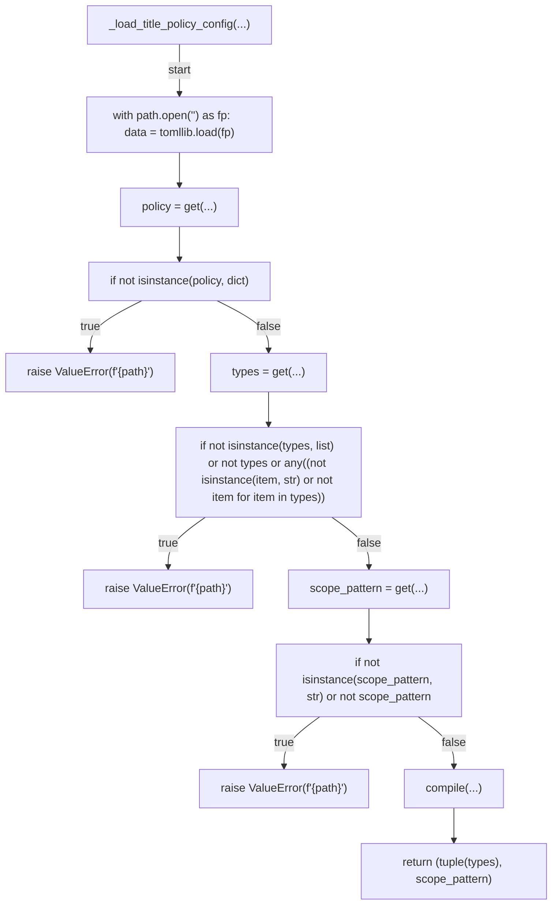

## is_ascii_title(...)

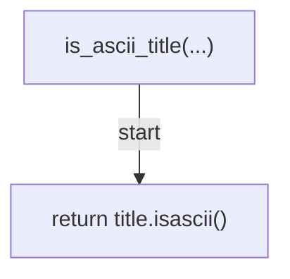

## follows_naming_convention(...)

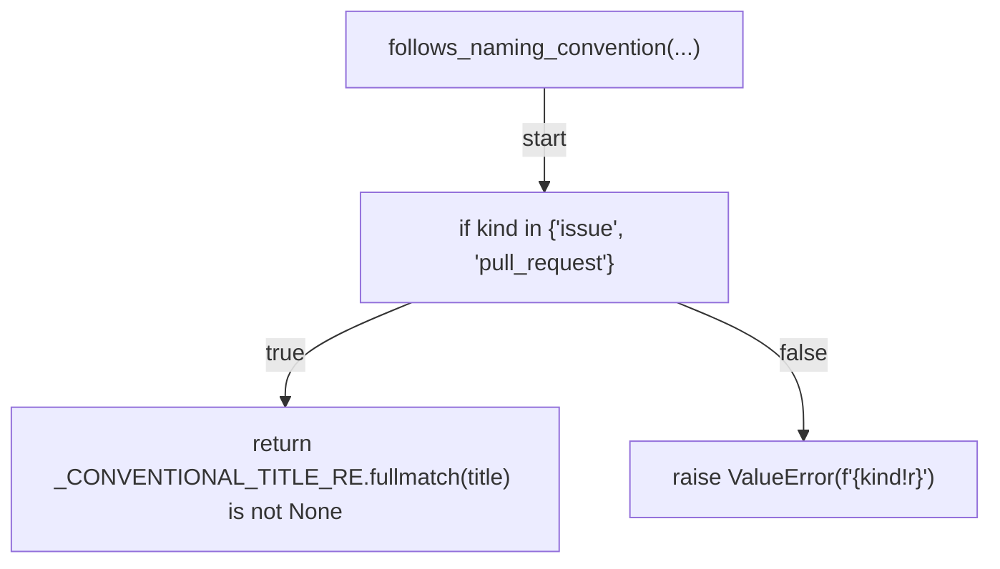

## parse_title_parts(...)

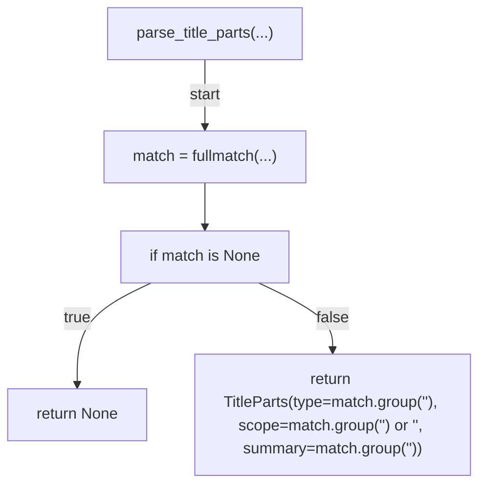

## pr_title_has_issue_ref(...)

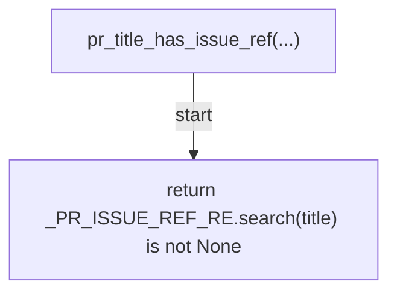

## pr_title_issue_refs(...)

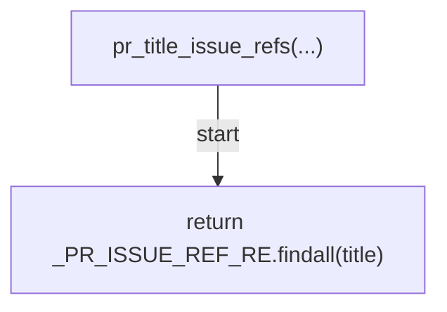

## pr_title_strip_issue_refs(...)

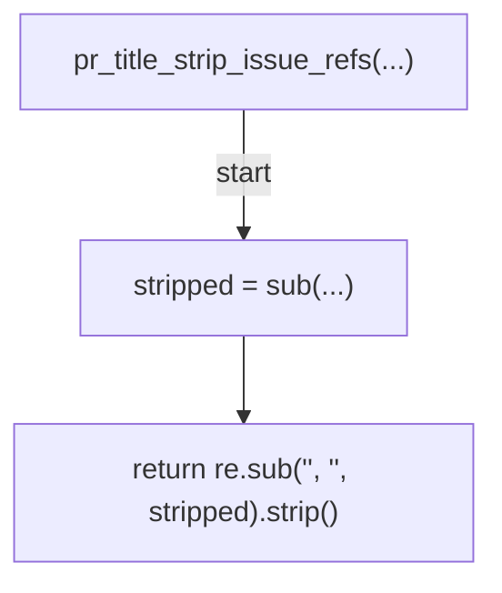

## pr_title_ref_is_exempt(...)

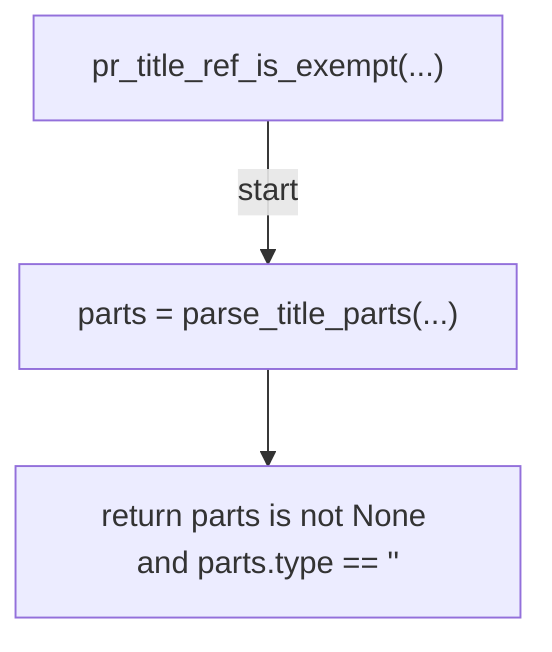

## allowed_types_csv(...)

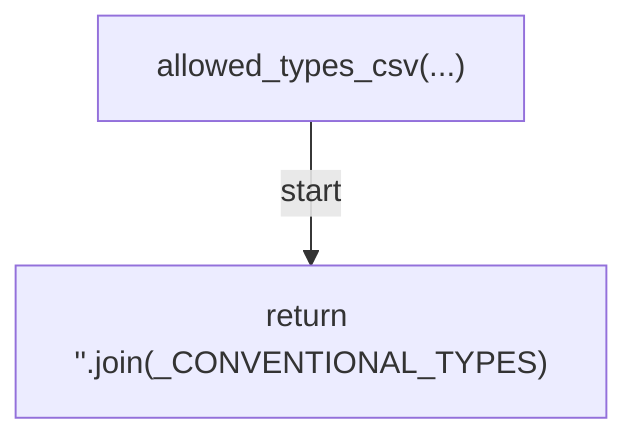

## type_fit_findings(...)

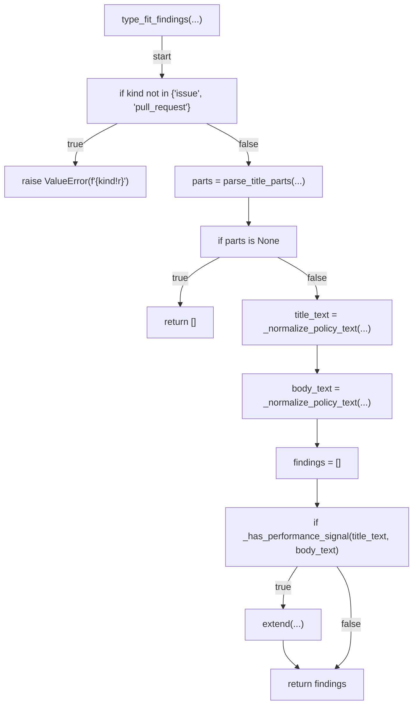

## format_type_fit_finding(...)

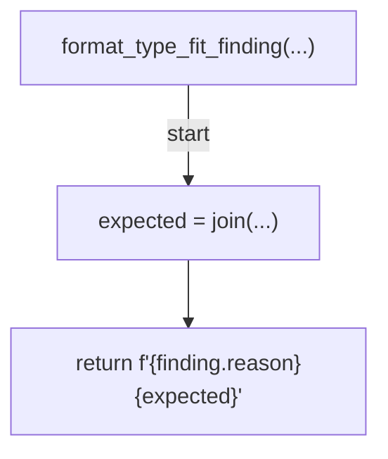

## naming_convention_hint(...)

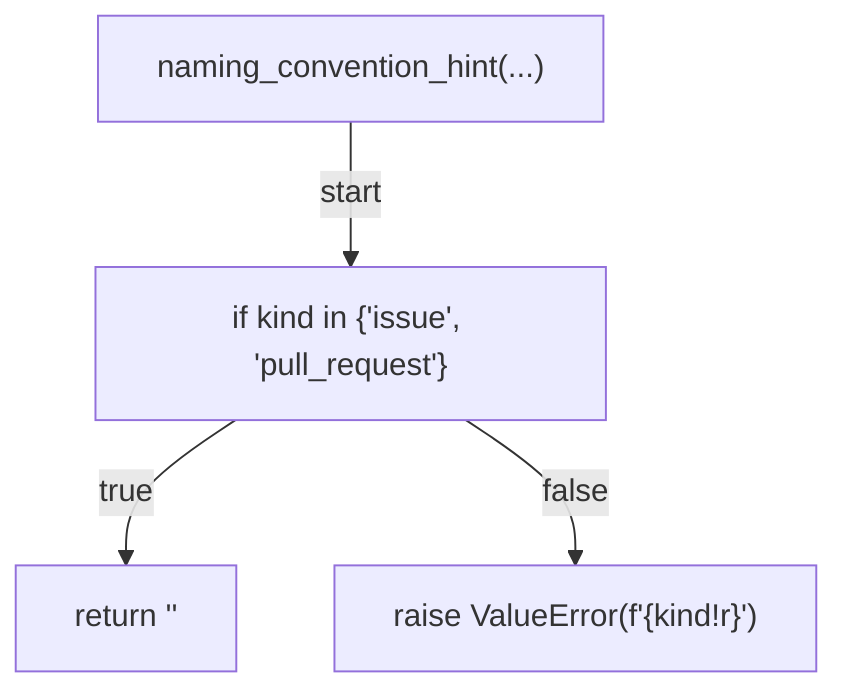

## describe_non_ascii(...)

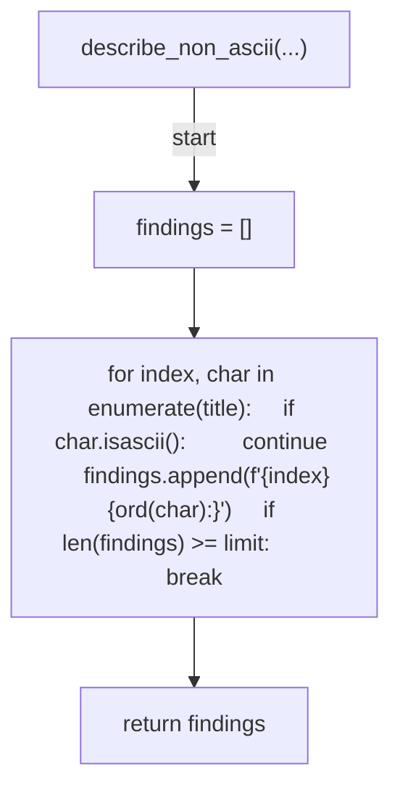

## verify_title(...)

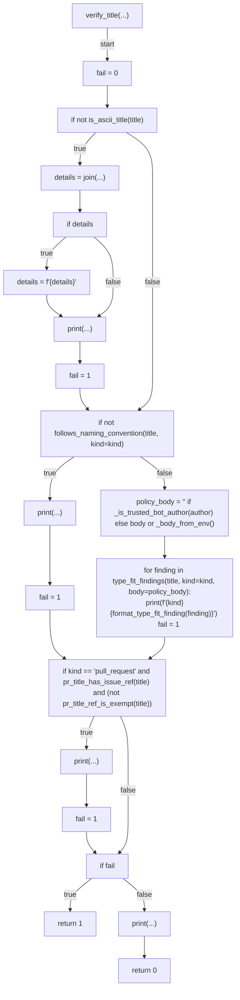

## _normalize_policy_text(...)

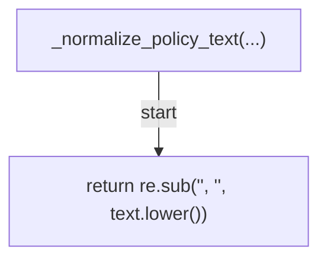

## _strip_resource_consumption_section(...)

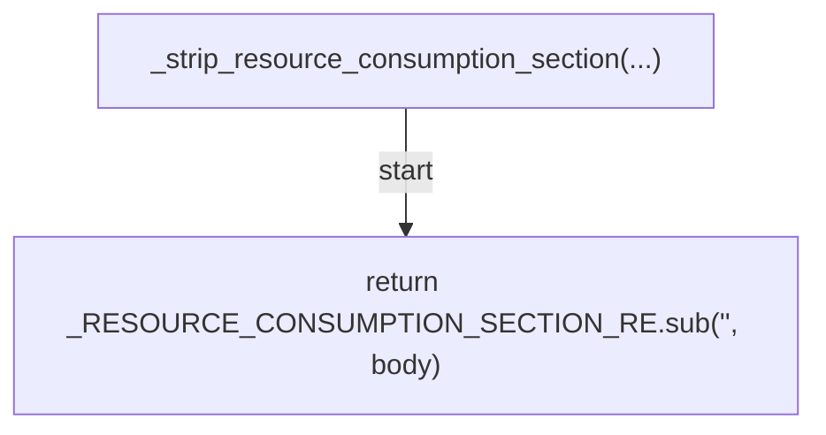

## _words(...)

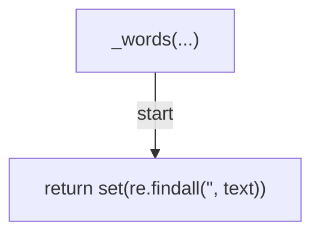

## _has_performance_signal(...)

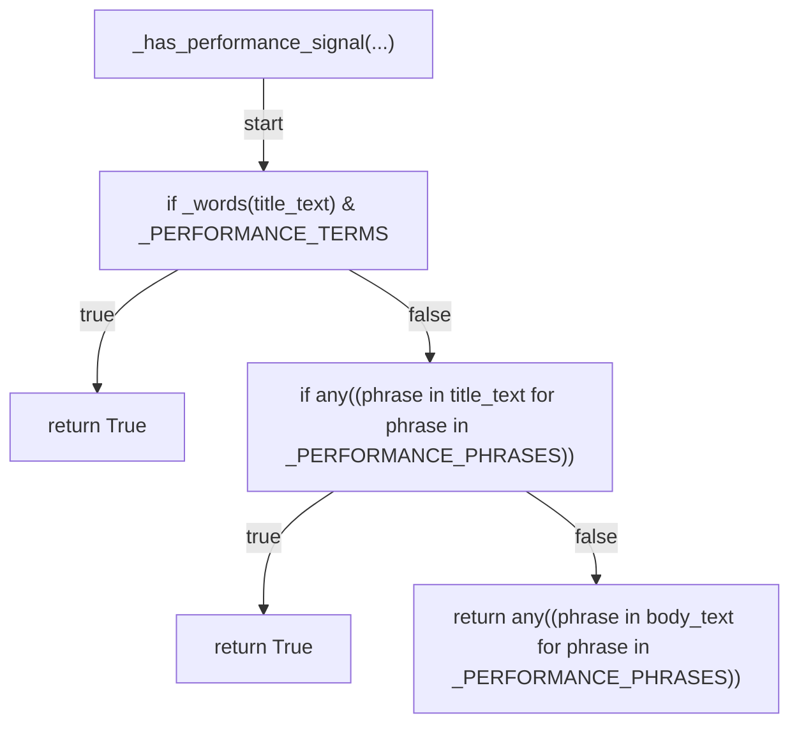

## _performance_type_findings(...)

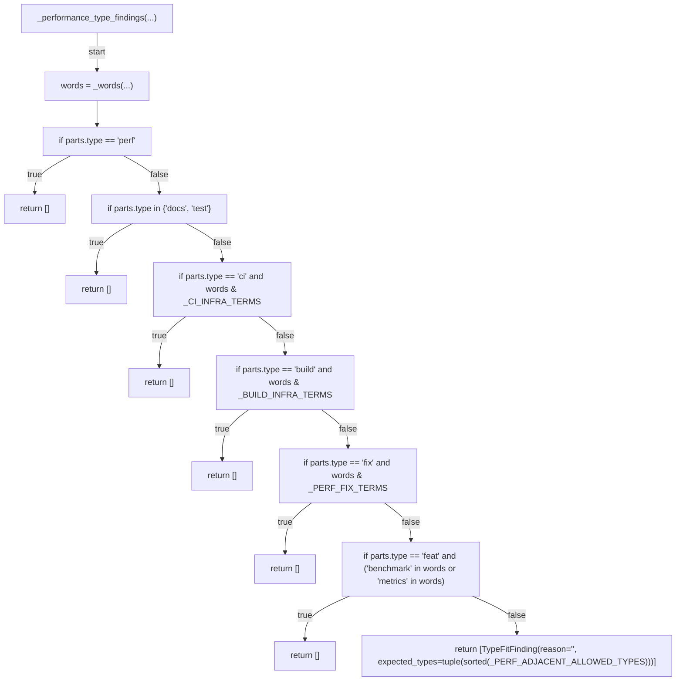

## _body_from_env(...)

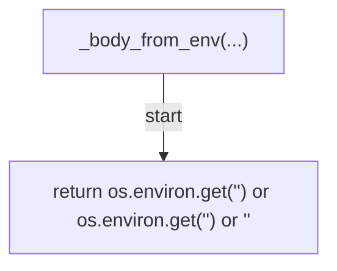

## _author_from_env(...)

```mermaid
flowchart TD
    N001["_author_from_env(...)"]
    N002["return os.environ.get('<str>') or '<str>'"]
    N001 -->|"start"| N002
```

## _is_trusted_bot_author(...)

```mermaid
flowchart TD
    N001["_is_trusted_bot_author(...)"]
    N002["return bool(author) and author in _TRUSTED_BOT_LOGINS"]
    N001 -->|"start"| N002
```

## _cmd_verify(...)

```mermaid
flowchart TD
    N001["_cmd_verify(...)"]
    N002["title = args.title"]
    N003["if title is None"]
    N004["title = get(...)"]
    N005["body = _read_body_arg(...)"]
    N006["author = args.author if args.author is not None else _author_from_env()"]
    N007["return verify_title(title, kind=args.kind, body=body or '<str>', author=author)"]
    N001 -->|"start"| N002
    N002 --> N003
    N003 -->|"true"| N004
    N004 --> N005
    N003 -->|"false"| N005
    N005 --> N006
    N006 --> N007
```

## _read_body_arg(...)

```mermaid
flowchart TD
    N001["_read_body_arg(...)"]
    N002["if args.body_file"]
    N003["return Path(args.body_file).read_text()"]
    N004["if args.body is not None"]
    N005["return args.body"]
    N006["return None"]
    N001 -->|"start"| N002
    N002 -->|"true"| N003
    N002 -->|"false"| N004
    N004 -->|"true"| N005
    N004 -->|"false"| N006
```

## main(...)

```mermaid
flowchart TD
    N001["main(...)"]
    N002["parser = ArgumentParser(...)"]
    N003["sub = add_subparsers(...)"]
    N004["p_verify = add_parser(...)"]
    N005["add_argument(...)"]
    N006["add_argument(...)"]
    N007["add_argument(...)"]
    N008["add_argument(...)"]
    N009["add_argument(...)"]
    N010["set_defaults(...)"]
    N011["args = parse_args(...)"]
    N012["return args.func(args)"]
    N001 -->|"start"| N002
    N002 --> N003
    N003 --> N004
    N004 --> N005
    N005 --> N006
    N006 --> N007
    N007 --> N008
    N008 --> N009
    N009 --> N010
    N010 --> N011
    N011 --> N012
```
