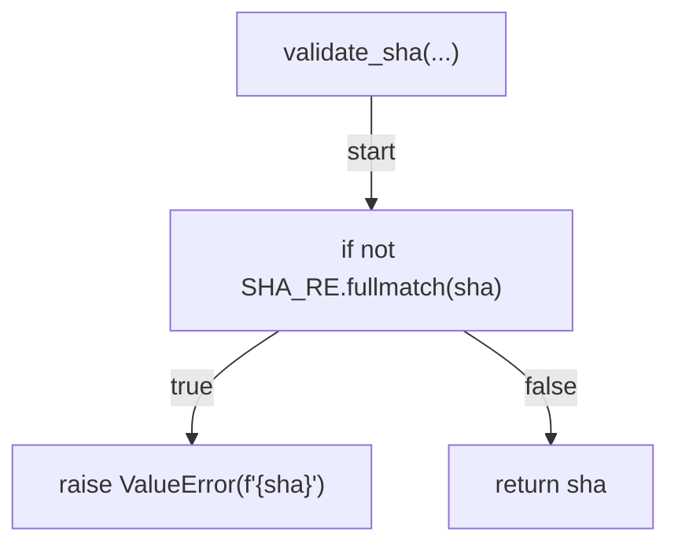
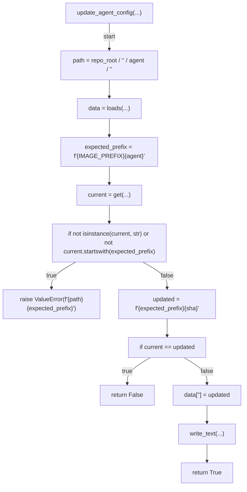
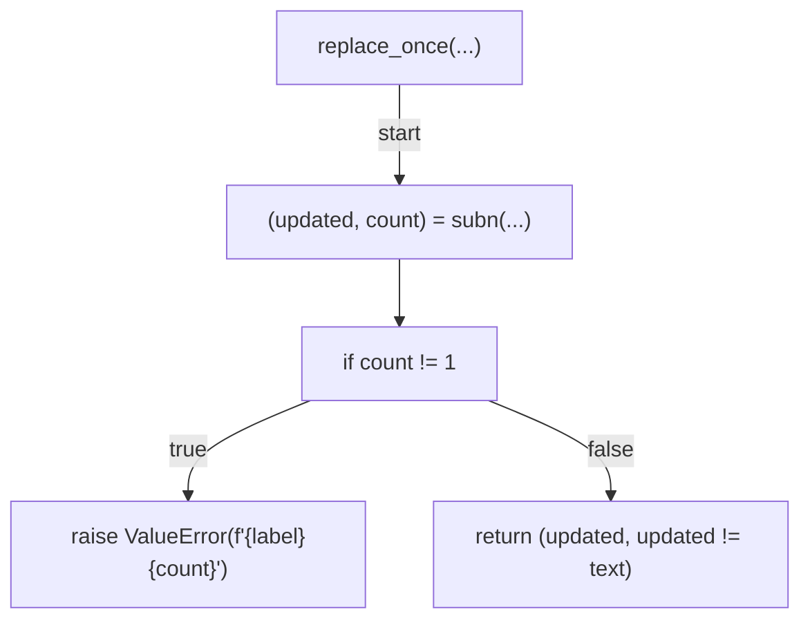
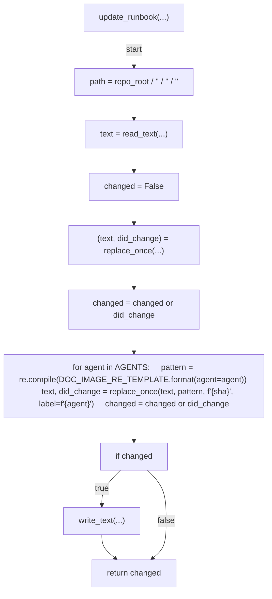
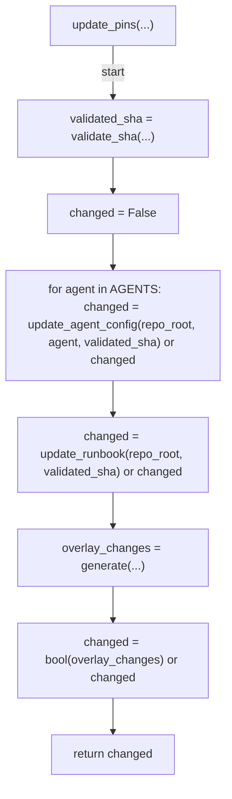
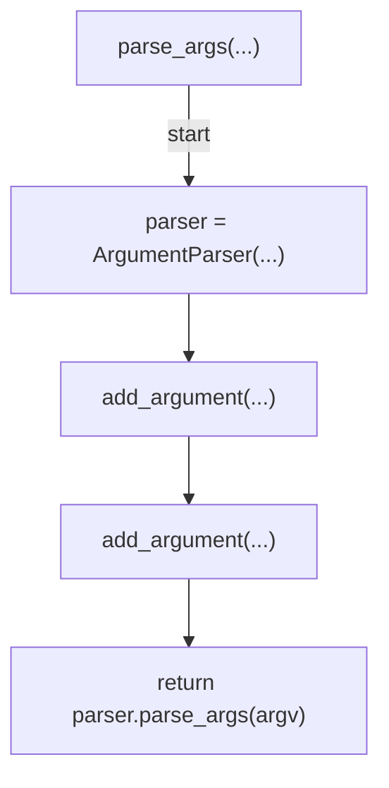
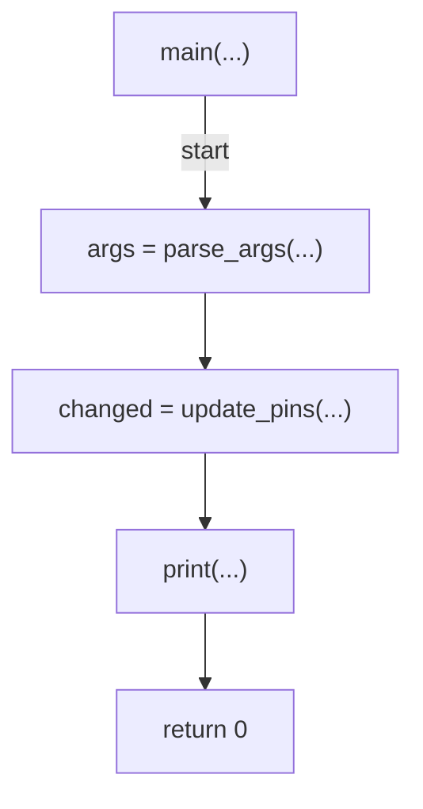

# AST graph: scripts/update_devcontainer_image_pins.py

This file is generated from `scripts/update_devcontainer_image_pins.py` by `python3 scripts/script_ast_graph.py all-doc`. Do not edit it by hand: content under `docs/generated/scripts/` is owned by the post-merge automation (refs #1540) -- update the source script instead.

## validate_sha(...)

## update_agent_config(...)

## replace_once(...)

## update_runbook(...)

## update_pins(...)

## parse_args(...)

## main(...)

