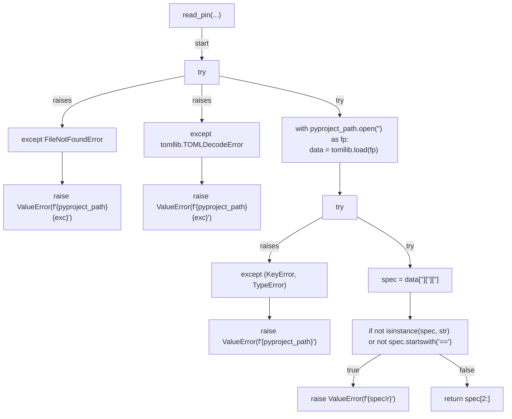
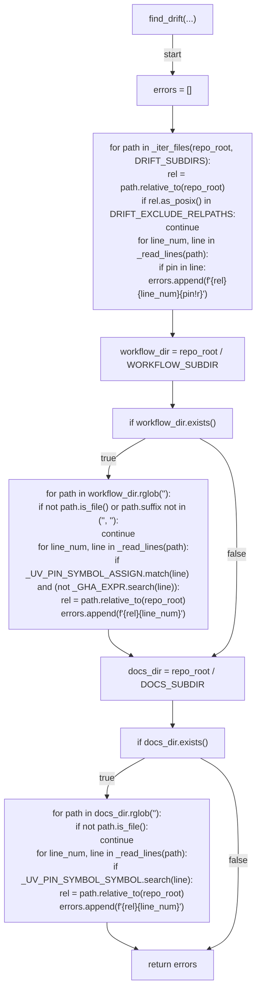
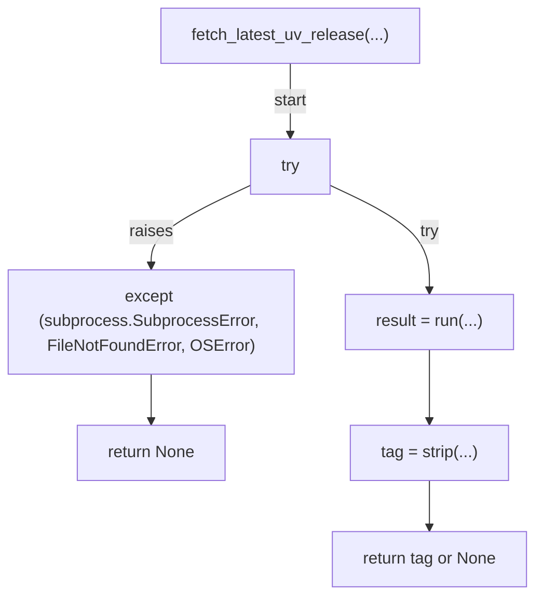
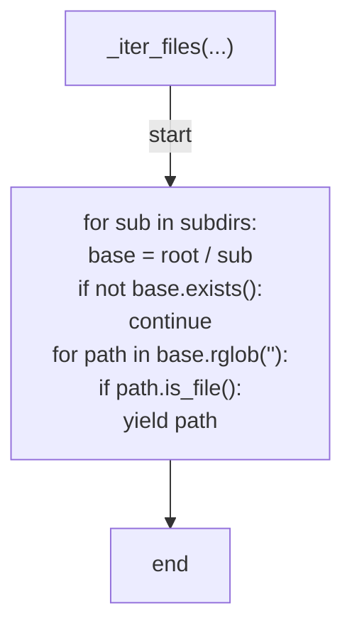
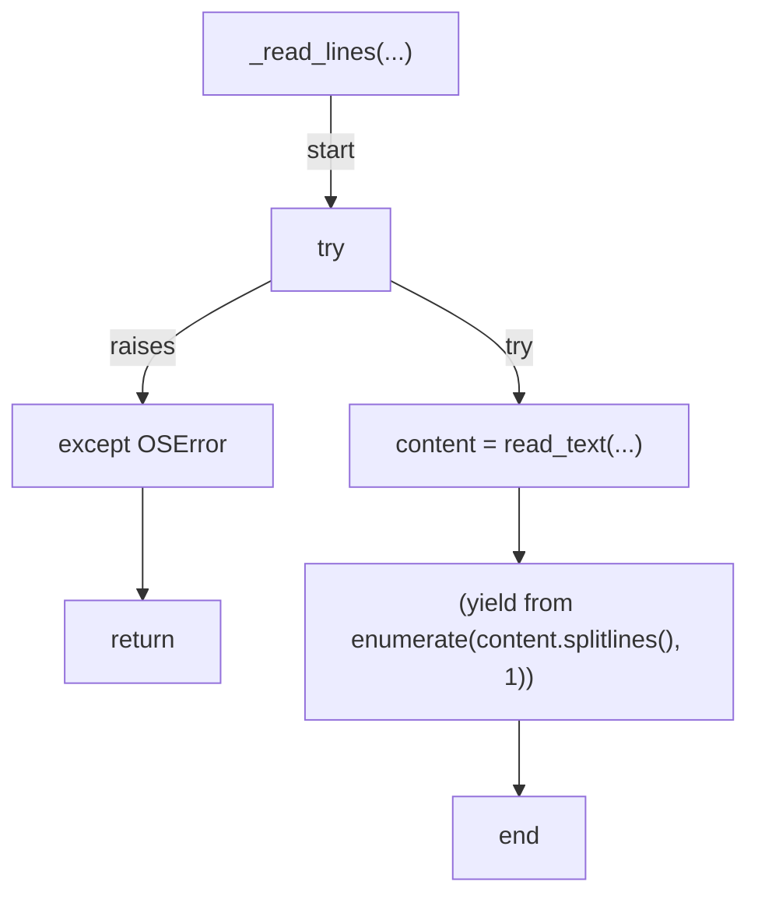
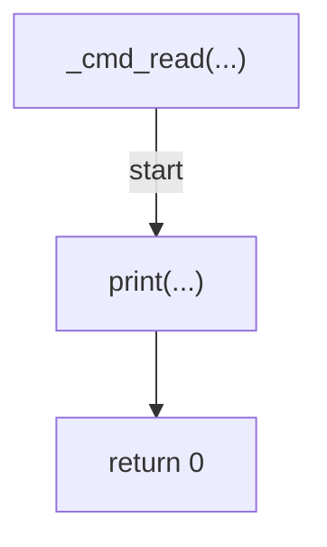
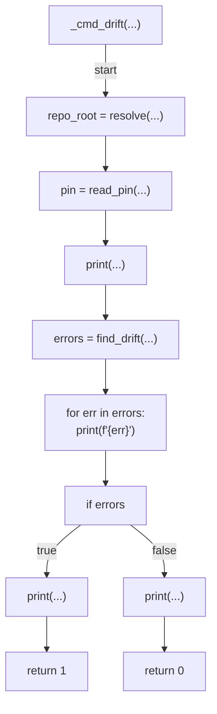
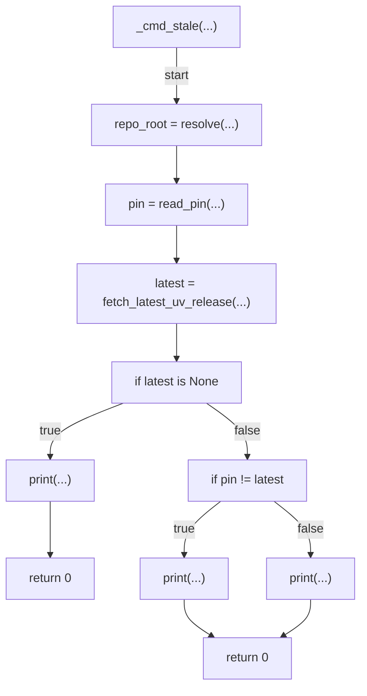
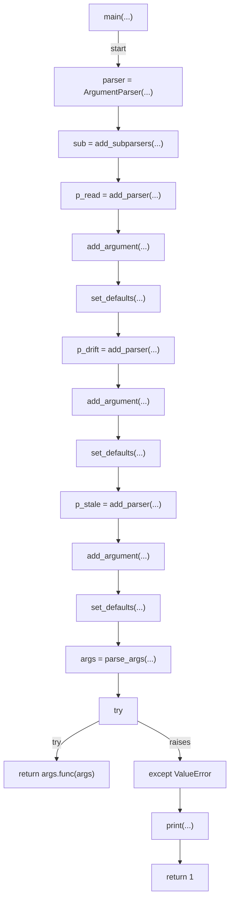

# AST graph: scripts/uv_pin.py

This file is generated from `scripts/uv_pin.py` by `python3 scripts/script_ast_graph.py all-doc`. Do not edit it by hand: content under `docs/generated/scripts/` is owned by the post-merge automation (refs #1540) -- update the source script instead.

## read_pin(...)

## find_drift(...)

## fetch_latest_uv_release(...)

## _iter_files(...)

## _read_lines(...)

## _cmd_read(...)

## _cmd_drift(...)

## _cmd_stale(...)

## main(...)

