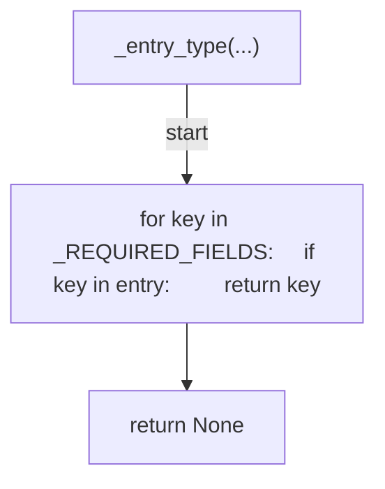
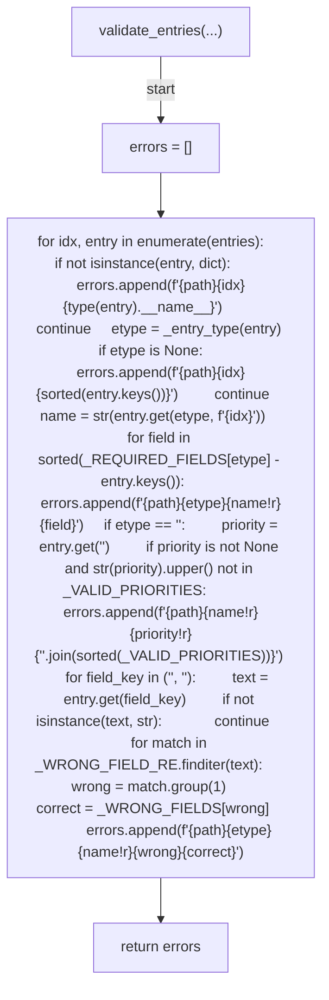
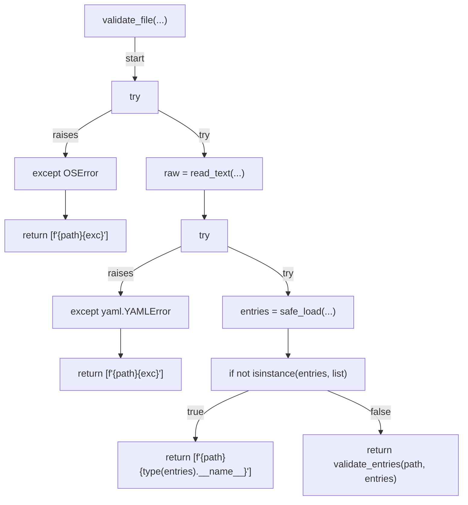
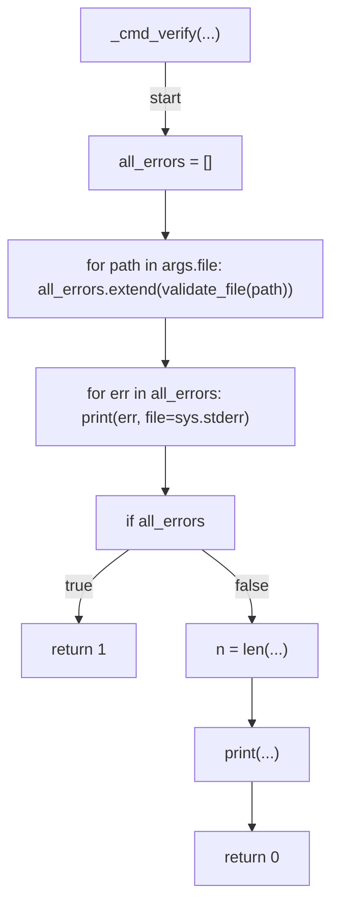
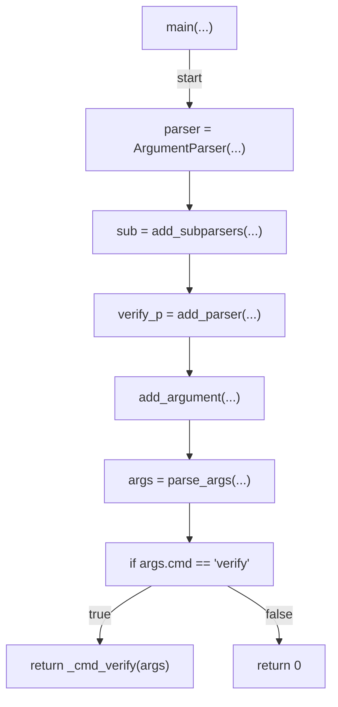

# AST graph: scripts/validate_falco_rules.py

This file is generated from `scripts/validate_falco_rules.py` by `python3 scripts/script_ast_graph.py all-doc`. Do not edit it by hand: content under `docs/generated/scripts/` is owned by the post-merge automation (refs #1540); update the source script instead.

## _entry_type(...)

## validate_entries(...)

## validate_file(...)

## _cmd_verify(...)

## main(...)

