# AST graph: scripts/verify_apm_checksums.py

This file is generated from `scripts/verify_apm_checksums.py` by `python3 scripts/script_ast_graph.py all-doc`. Do not edit it by hand: content under `docs/generated/scripts/` is owned by the post-merge automation (refs #1540) -- update the source script instead.

## _display(...)

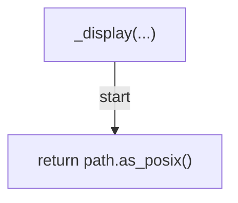

## _repo_path(...)

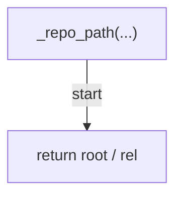

## _iter_apm_files(...)

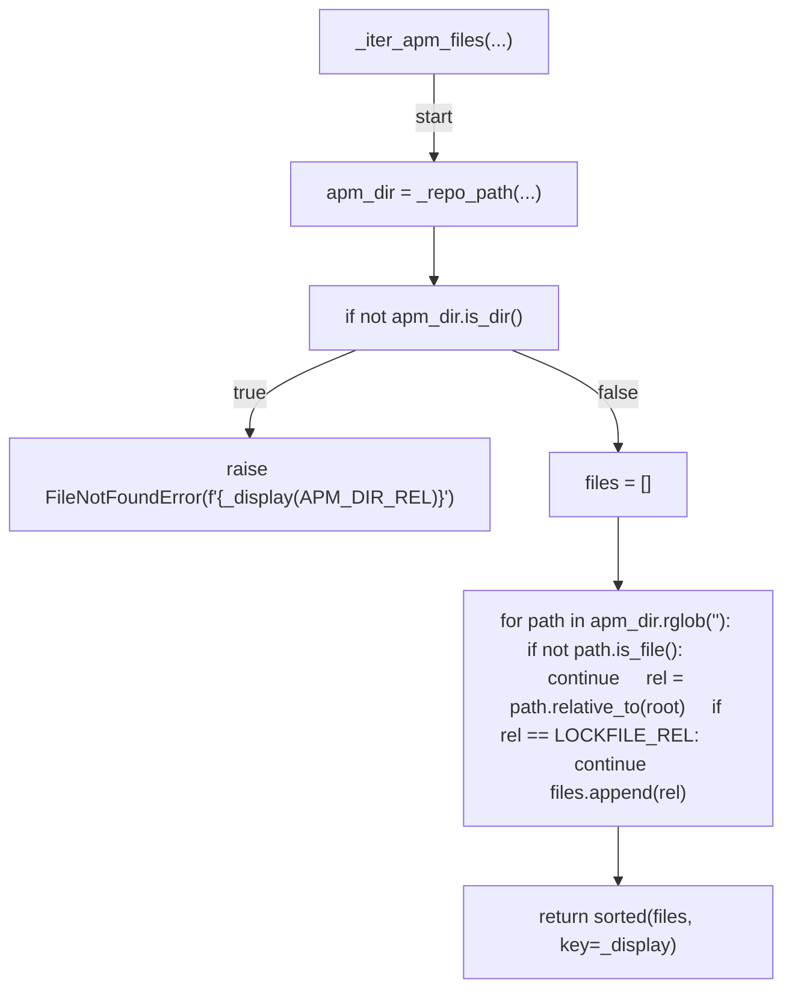

## _sha256(...)

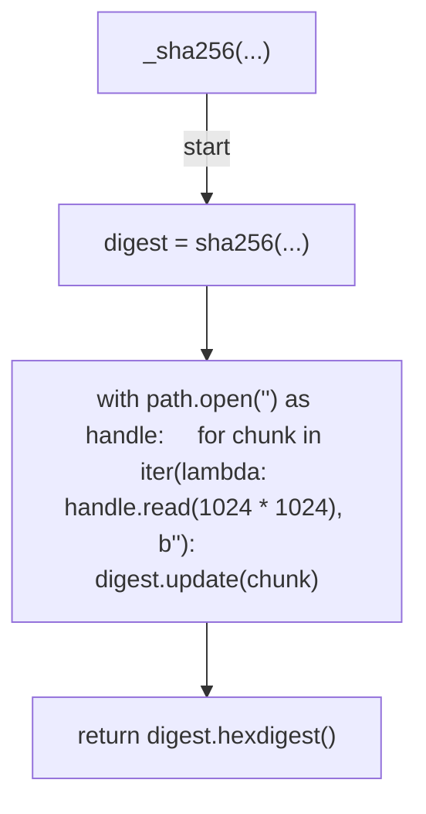

## build_checksums(...)

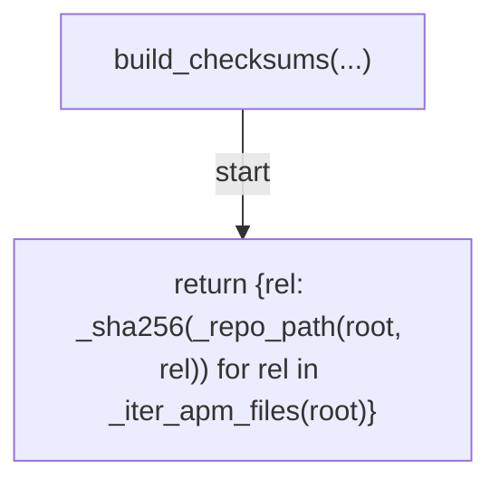

## format_checksums(...)

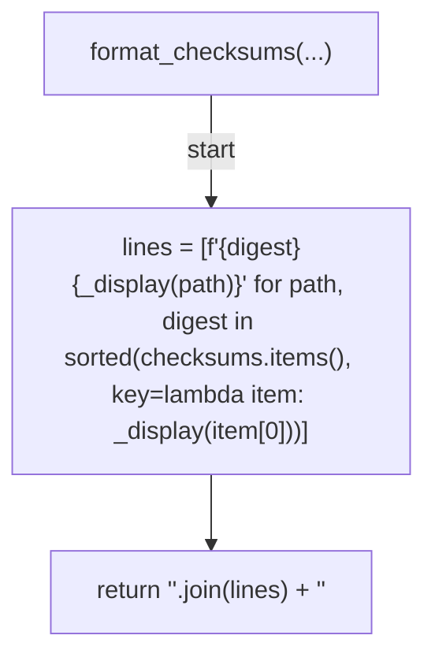

## parse_lockfile(...)

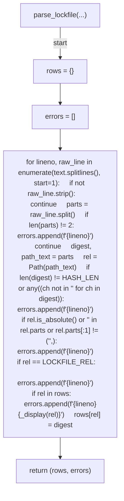

## _read_lockfile(...)

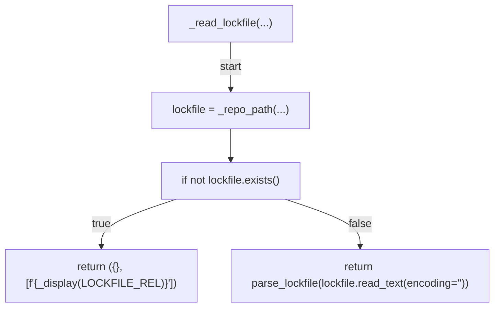

## verify(...)

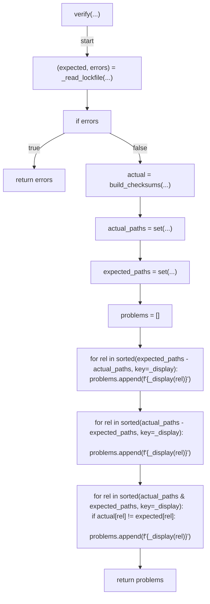

## update(...)

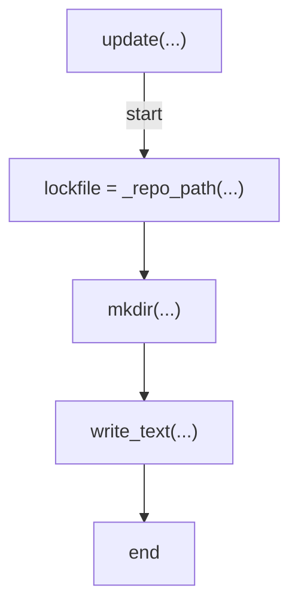

## _cmd_verify(...)

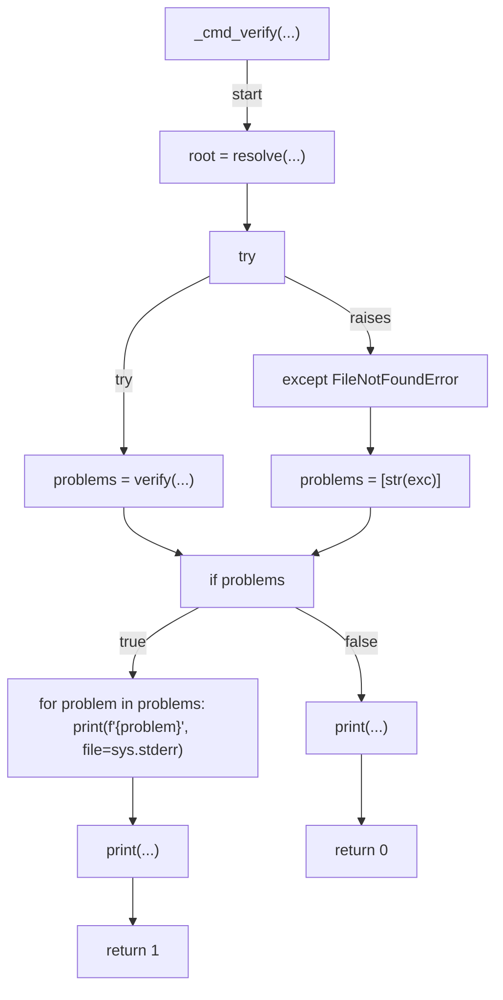

## _cmd_update(...)

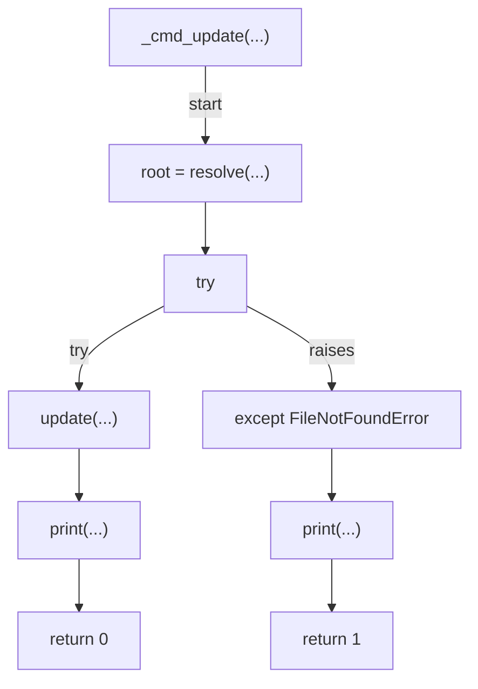

## main(...)

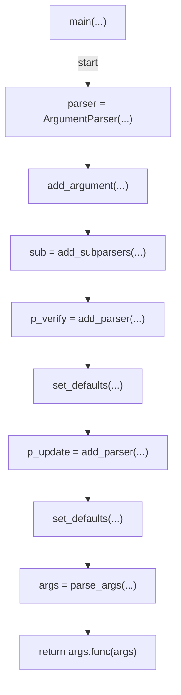
