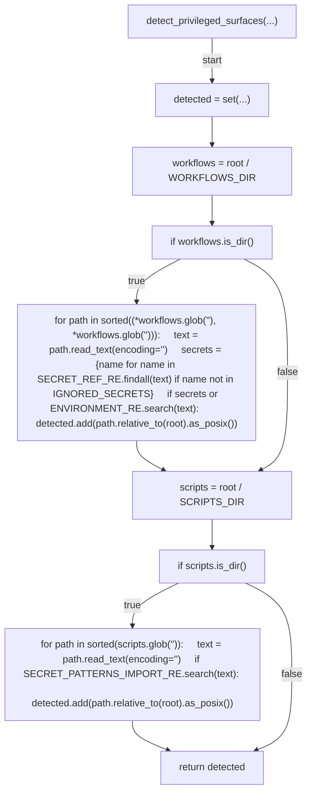
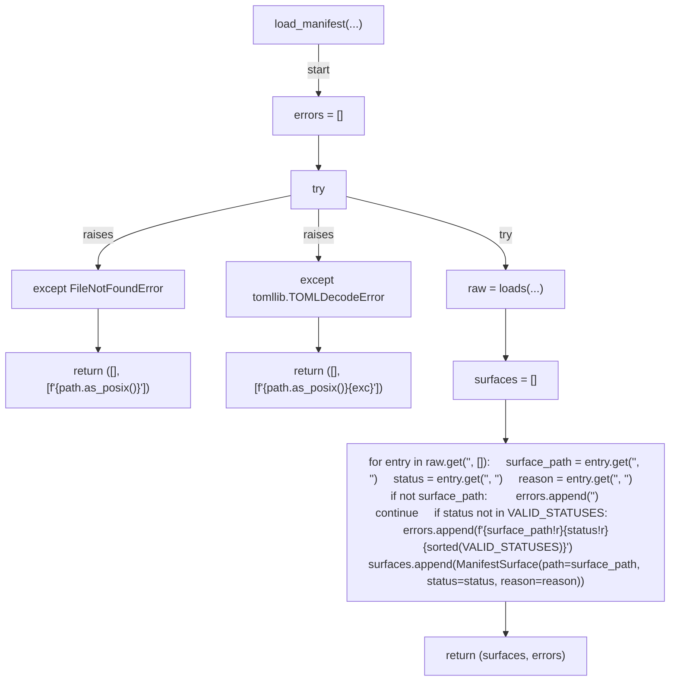
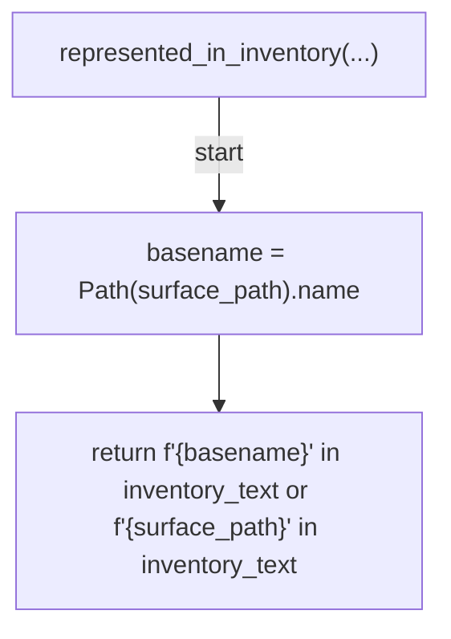
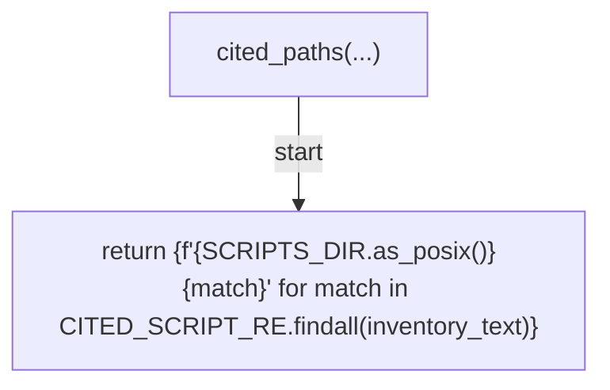
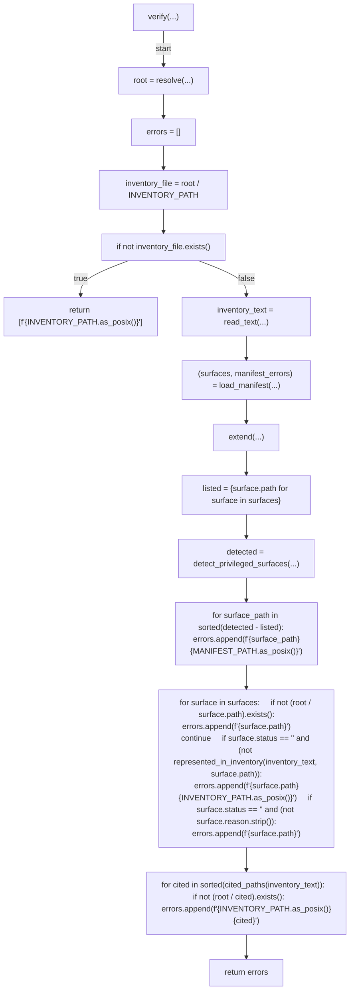
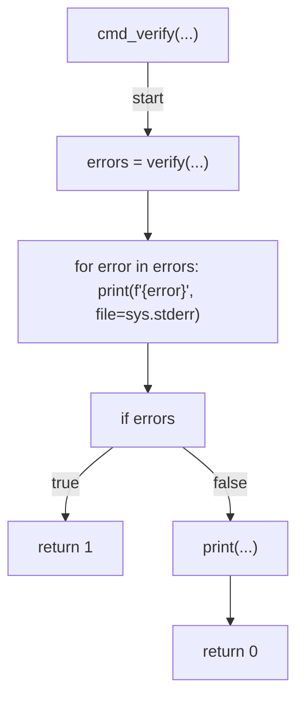
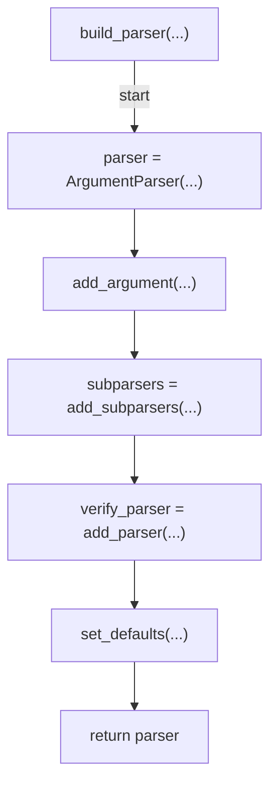
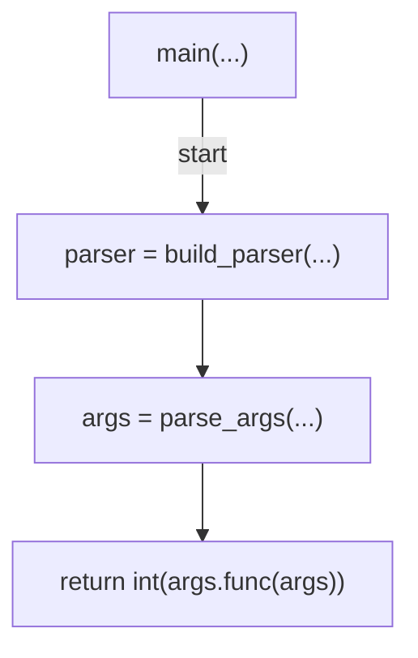

# AST graph: scripts/verify_control_inventory_currency.py

This file is generated from `scripts/verify_control_inventory_currency.py` by `python3 scripts/script_ast_graph.py all-doc`. Do not edit it by hand: content under `docs/generated/scripts/` is owned by the post-merge automation (refs #1540) -- update the source script instead.

## detect_privileged_surfaces(...)

## load_manifest(...)

## represented_in_inventory(...)

## cited_paths(...)

## verify(...)

## cmd_verify(...)

## build_parser(...)

## main(...)

