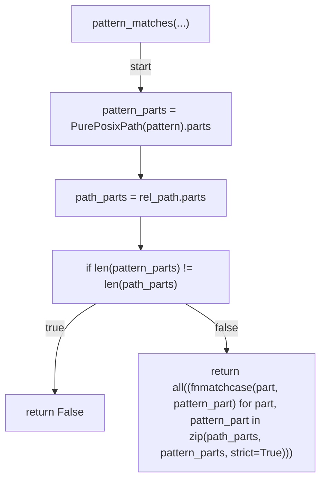
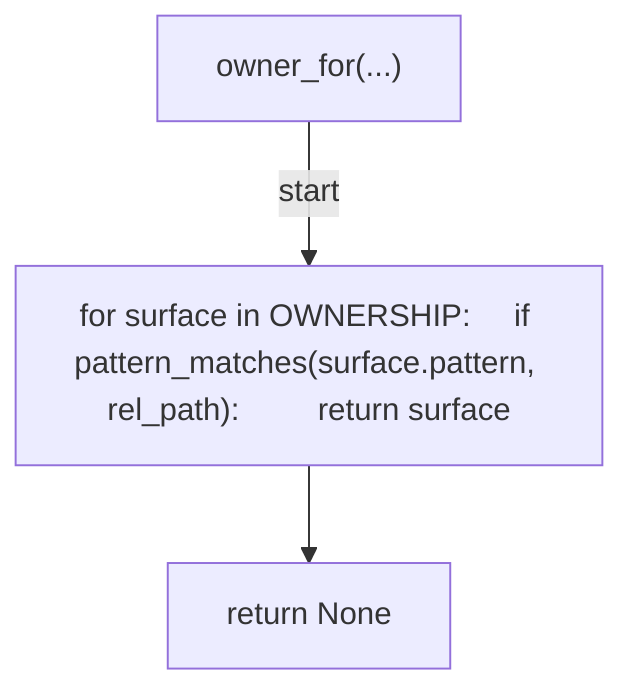
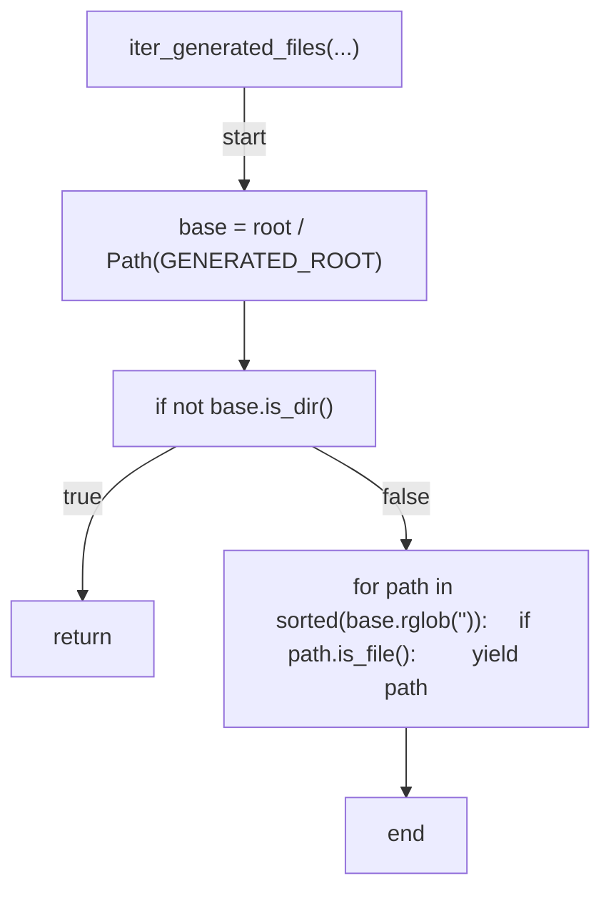
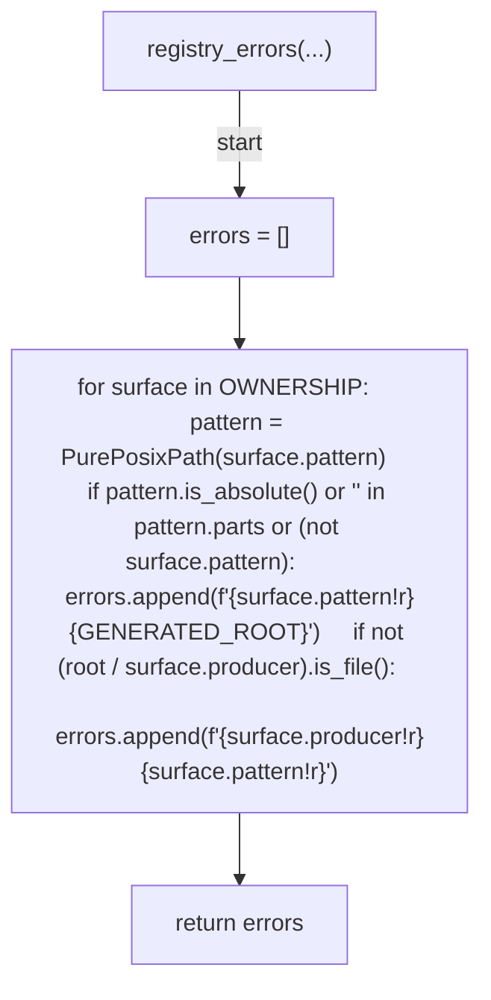
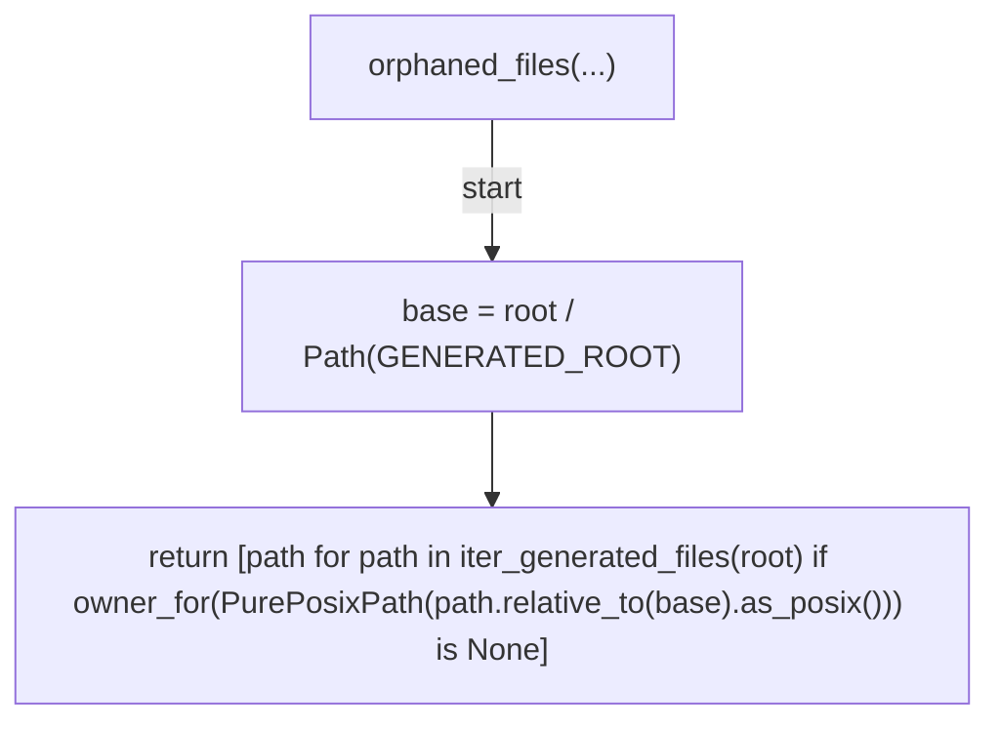
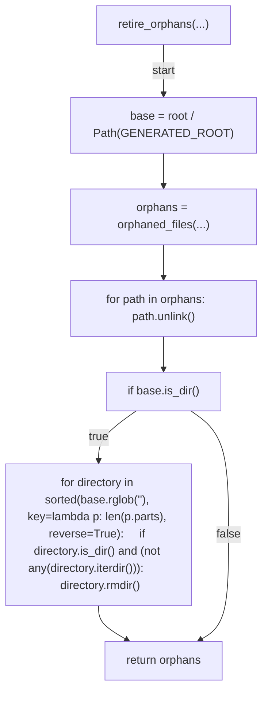
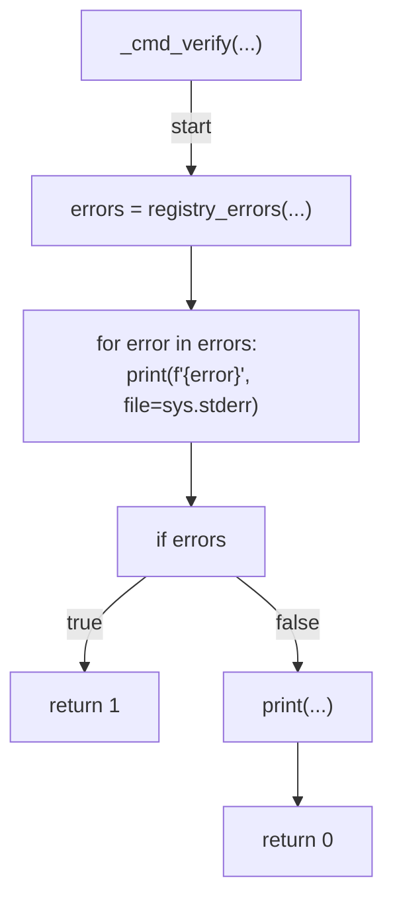
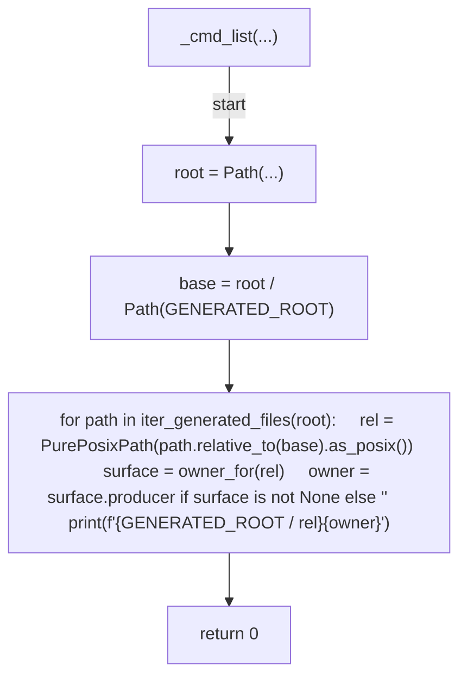
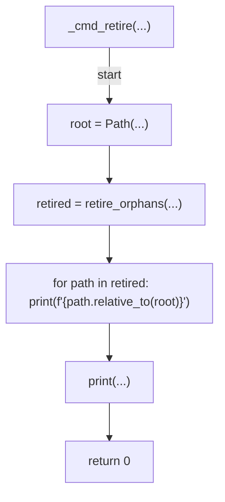
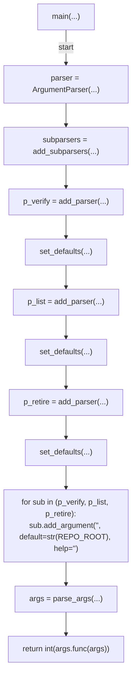

# AST graph: scripts/verify_generated_docs_ownership.py

This file is generated from `scripts/verify_generated_docs_ownership.py` by `python3 scripts/script_ast_graph.py all-doc`. Do not edit it by hand: content under `docs/generated/scripts/` is owned by the post-merge automation (refs #1540); update the source script instead.

## pattern_matches(...)

## owner_for(...)

## iter_generated_files(...)

## registry_errors(...)

## orphaned_files(...)

## retire_orphans(...)

## _cmd_verify(...)

## _cmd_list(...)

## _cmd_retire(...)

## main(...)

