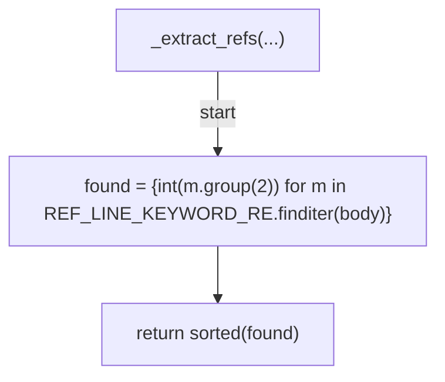
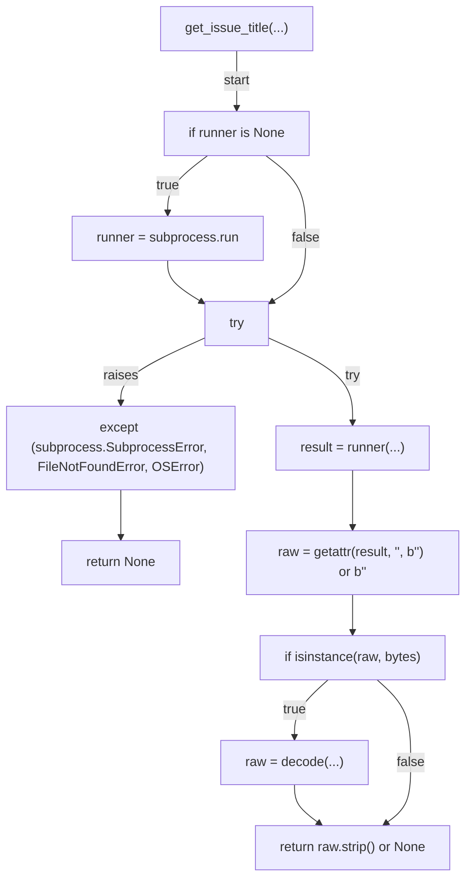
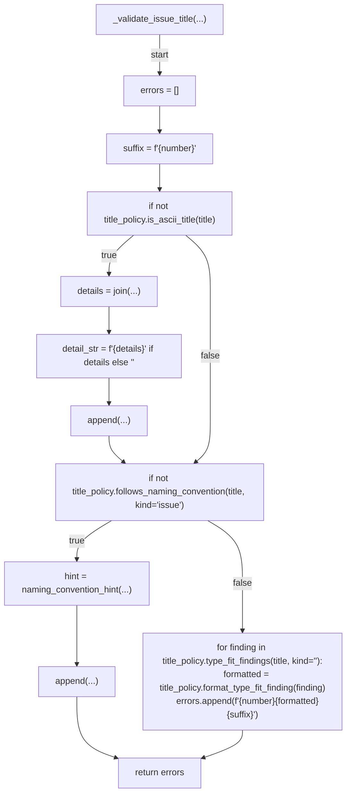
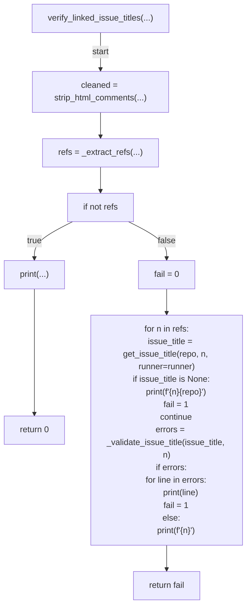
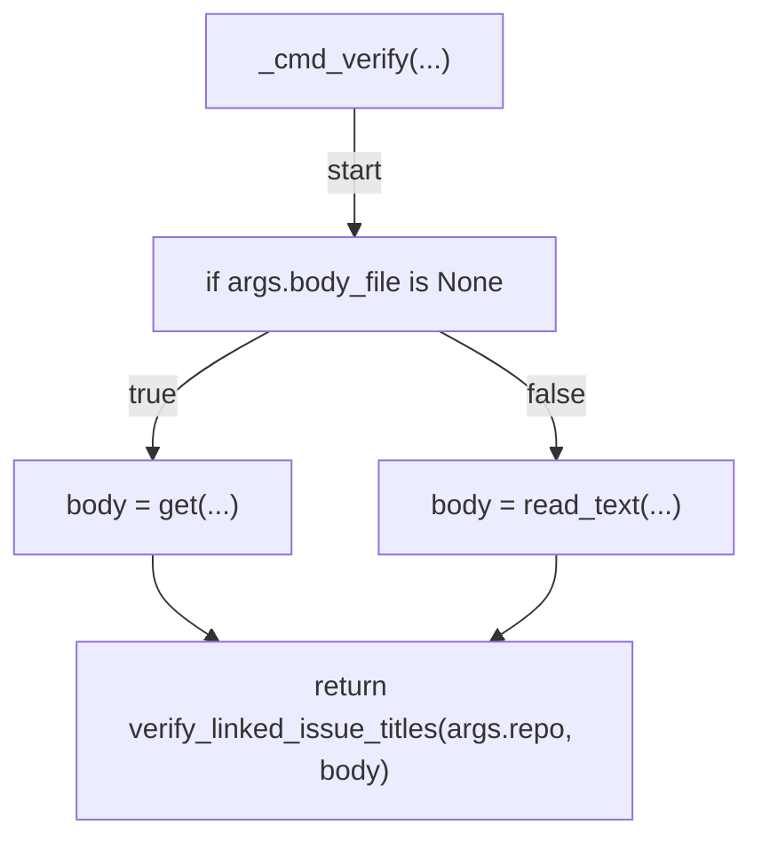
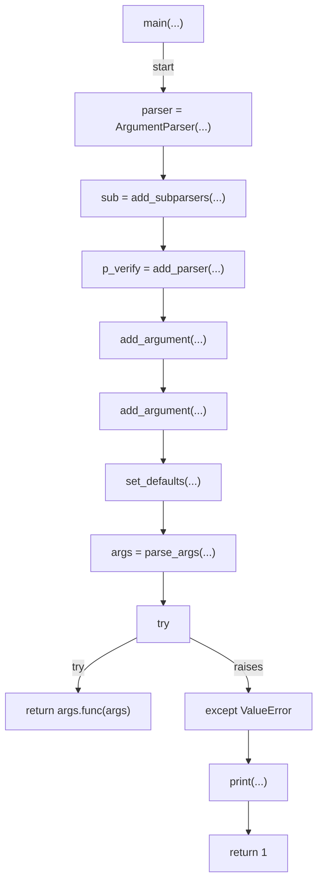

# AST graph: scripts/verify_linked_issue_titles.py

This file is generated from `scripts/verify_linked_issue_titles.py` by `python3 scripts/script_ast_graph.py all-doc`. Do not edit it by hand: content under `docs/generated/scripts/` is owned by the post-merge automation (refs #1540) -- update the source script instead.

## _extract_refs(...)

## get_issue_title(...)

## _validate_issue_title(...)

## verify_linked_issue_titles(...)

## _cmd_verify(...)

## main(...)

