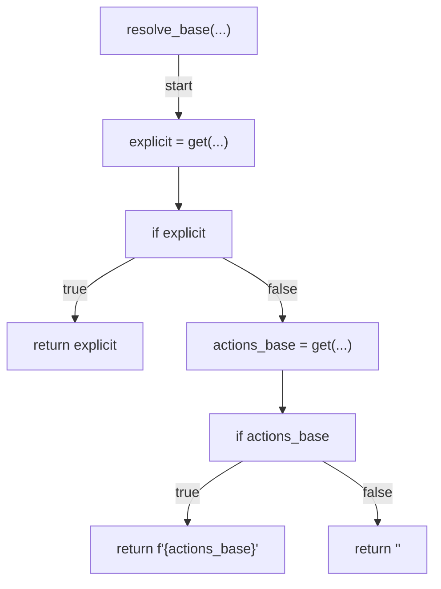
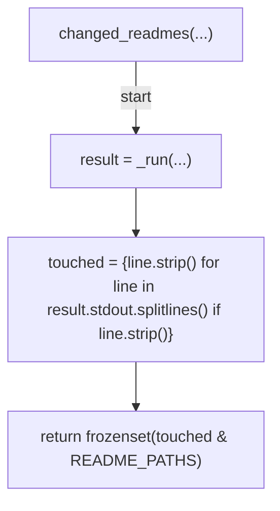
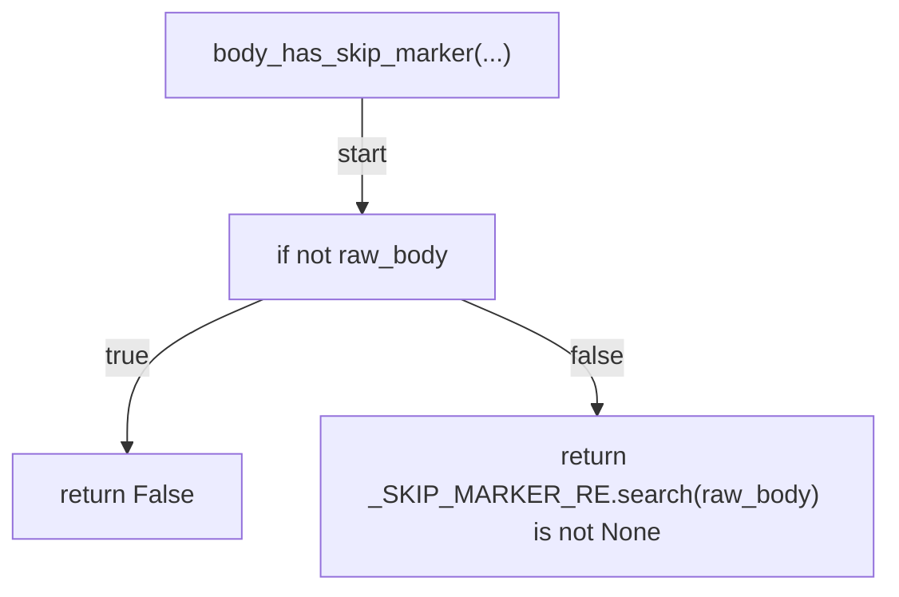
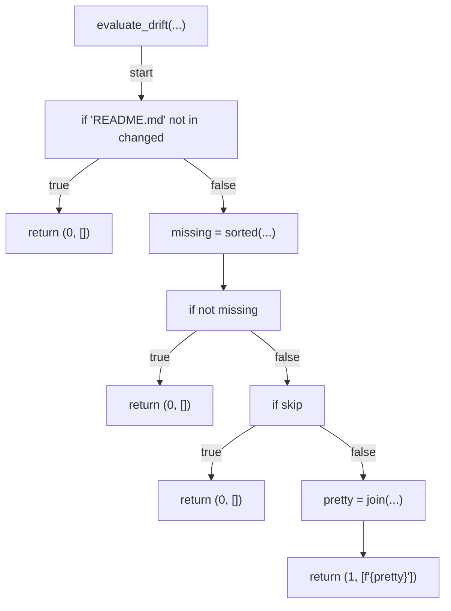
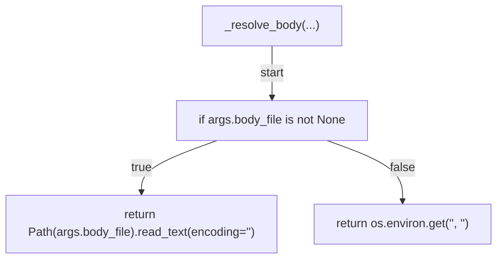
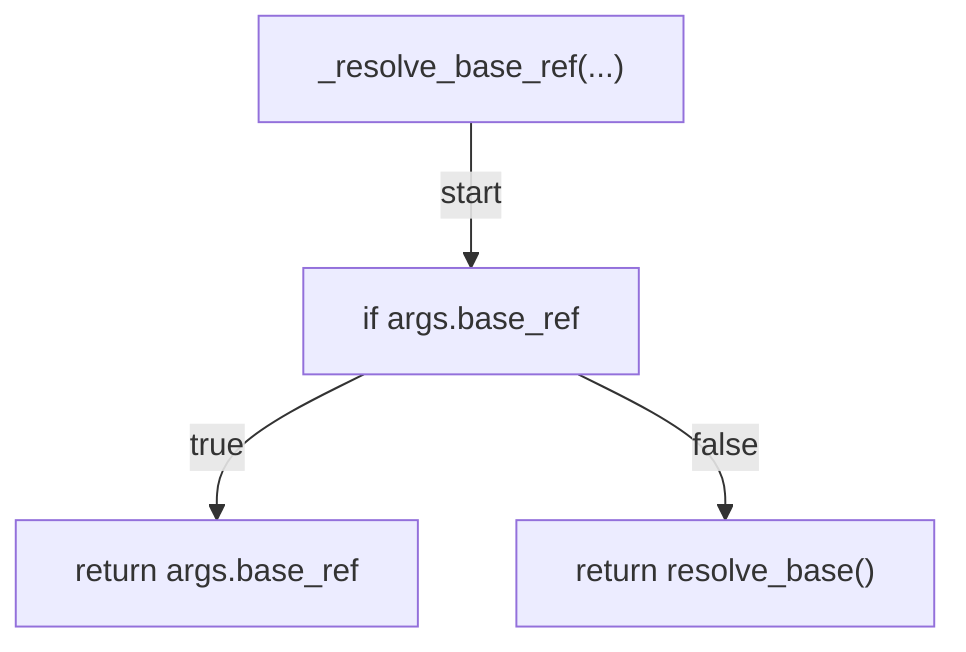
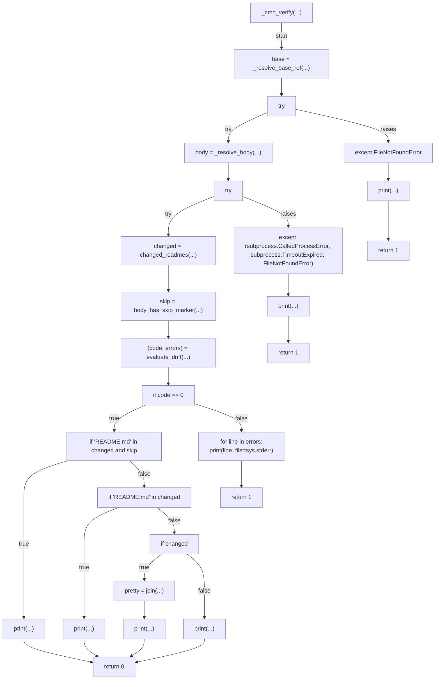
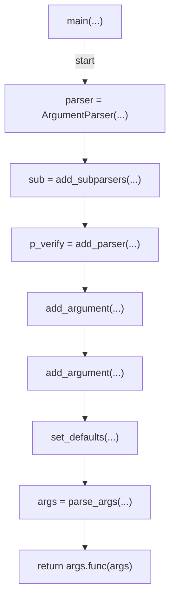
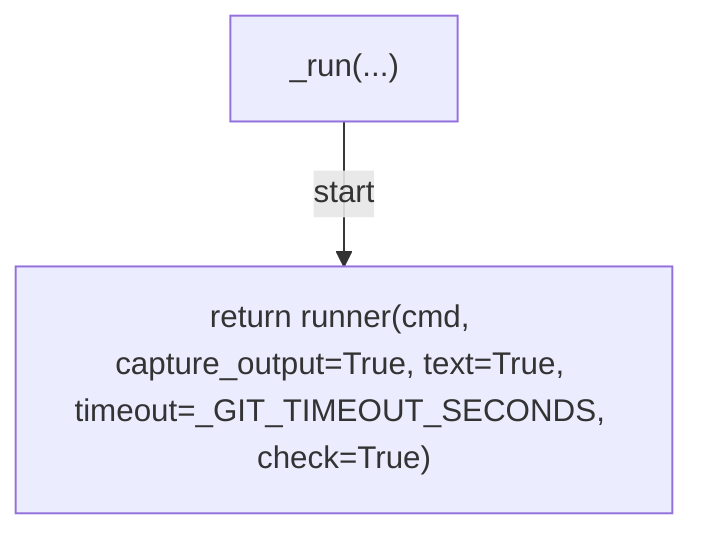

# AST graph: scripts/verify_readme_translation.py

This file is generated from `scripts/verify_readme_translation.py` by `python3 scripts/script_ast_graph.py all-doc`. Do not edit it by hand: content under `docs/generated/scripts/` is owned by the post-merge automation (refs #1540) -- update the source script instead.

## resolve_base(...)

## changed_readmes(...)

## body_has_skip_marker(...)

## evaluate_drift(...)

## _resolve_body(...)

## _resolve_base_ref(...)

## _cmd_verify(...)

## main(...)

## _run(...)

