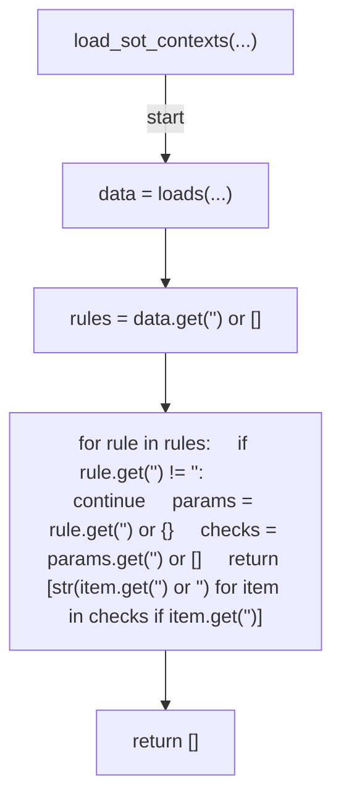
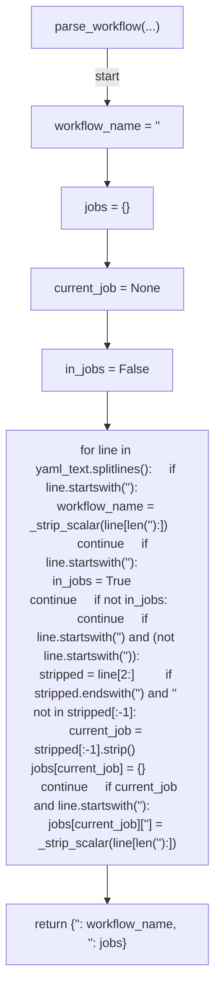
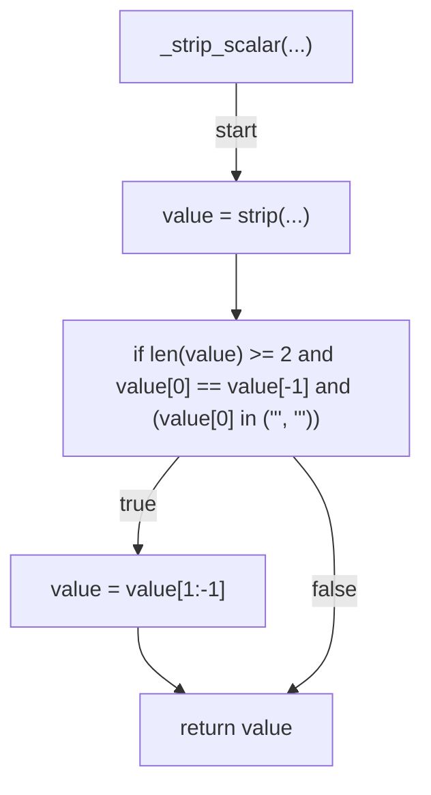
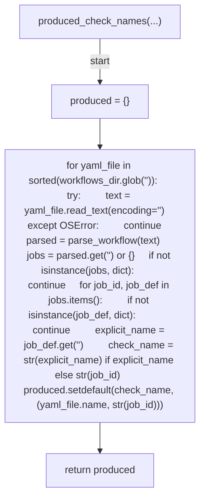
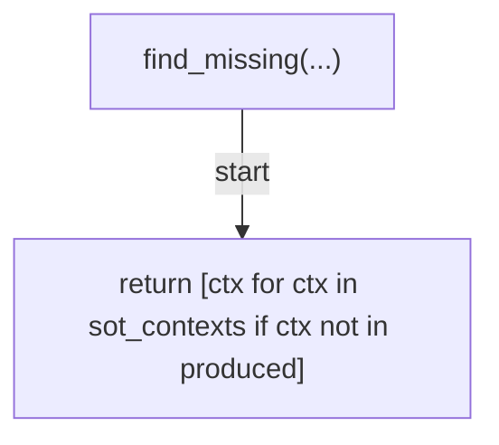
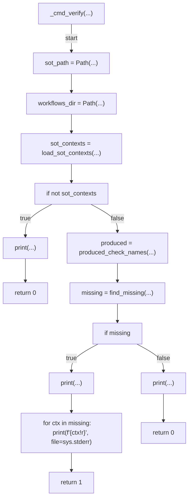
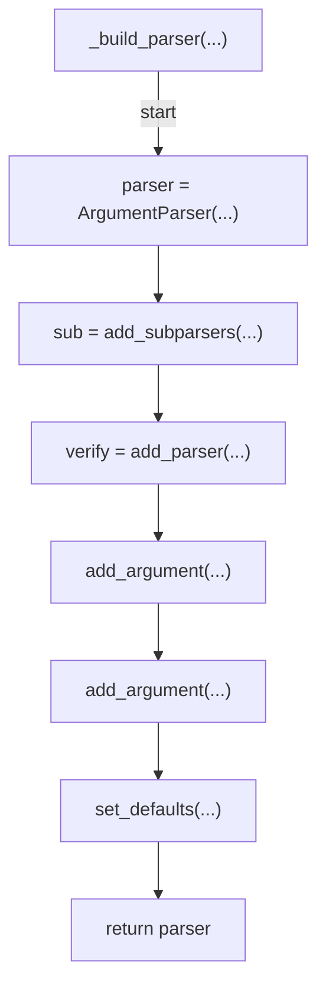
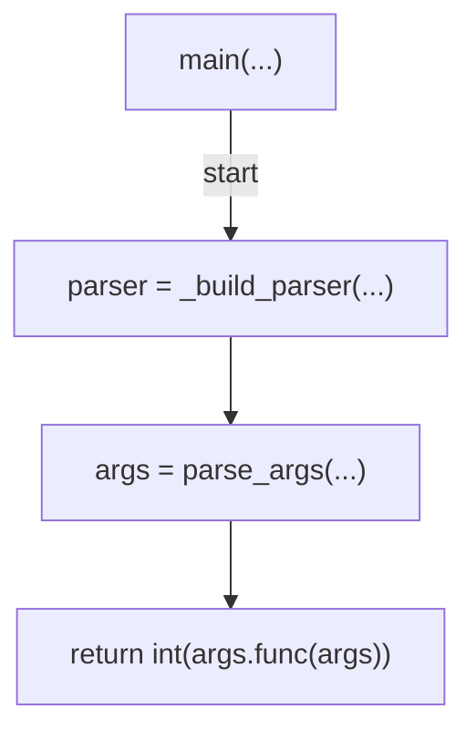

# AST graph: scripts/verify_required_check_contexts.py

This file is generated from `scripts/verify_required_check_contexts.py` by `python3 scripts/script_ast_graph.py all-doc`. Do not edit it by hand: content under `docs/generated/scripts/` is owned by the post-merge automation (refs #1540); update the source script instead.

## load_sot_contexts(...)

## parse_workflow(...)

## _strip_scalar(...)

## produced_check_names(...)

## find_missing(...)

## _cmd_verify(...)

## _build_parser(...)

## main(...)

