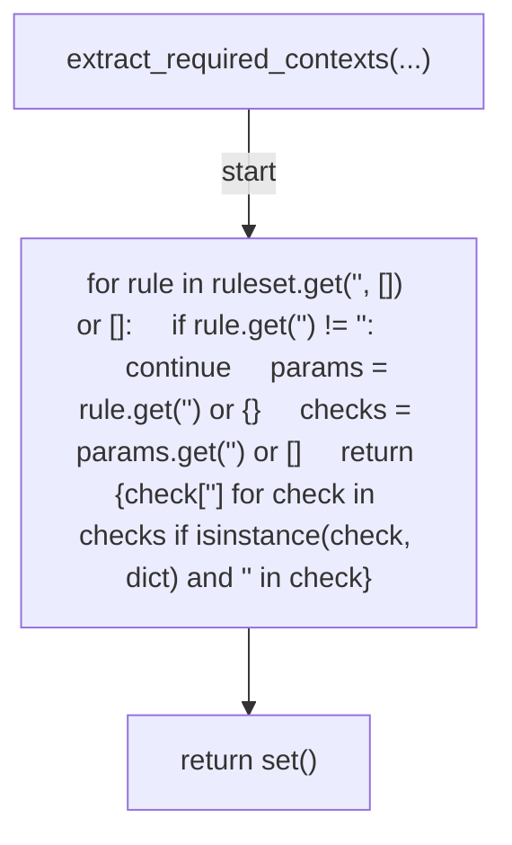
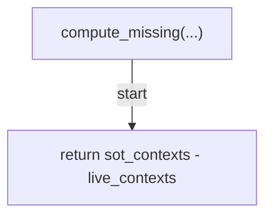
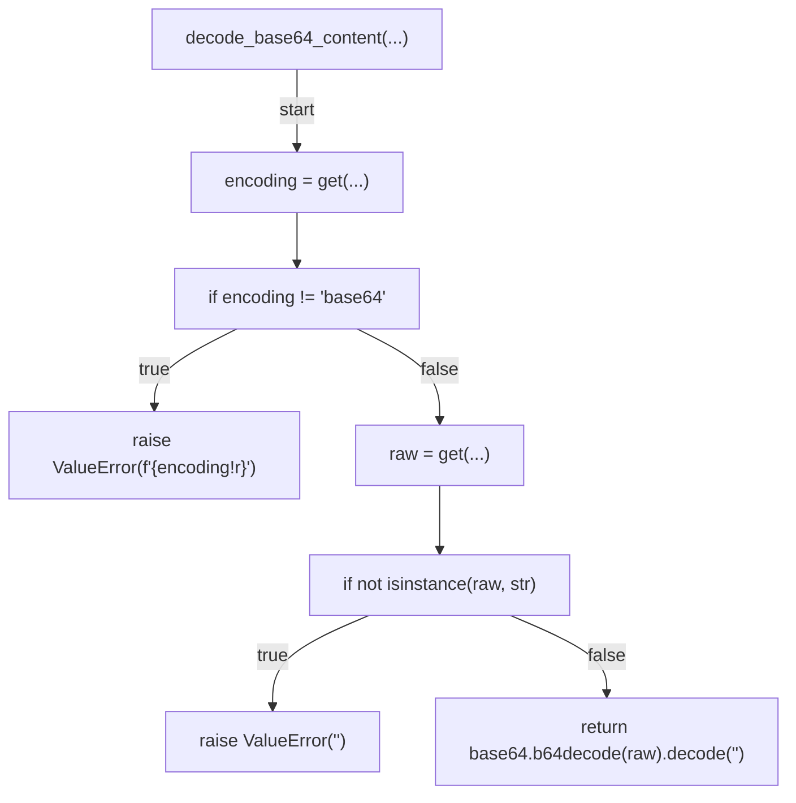
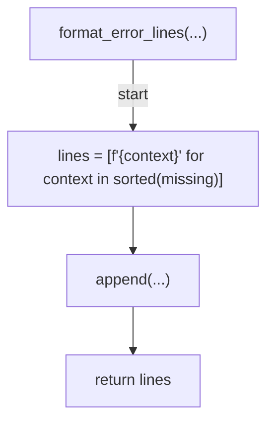
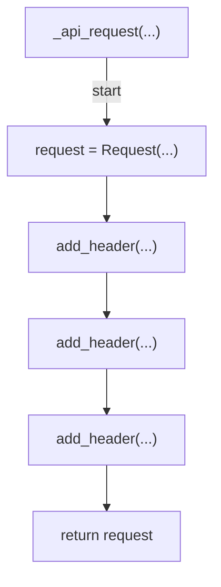
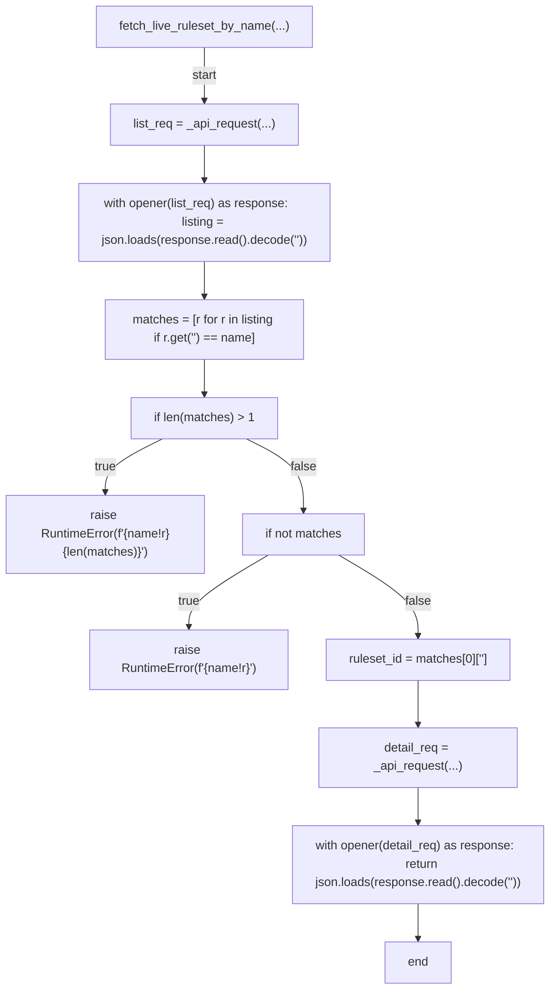
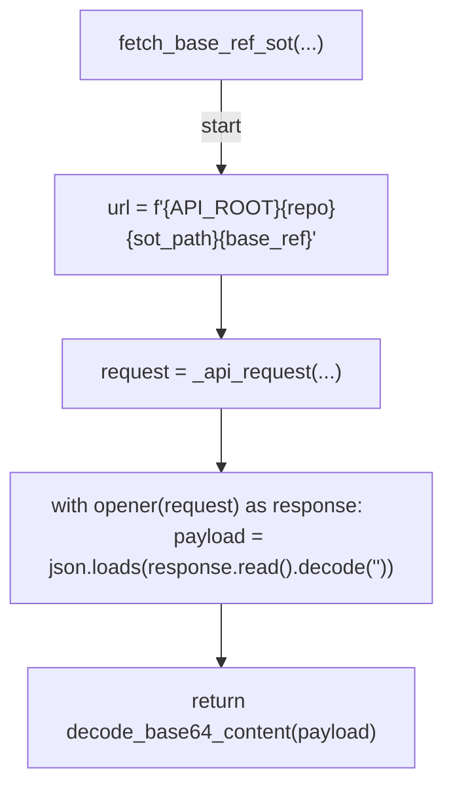
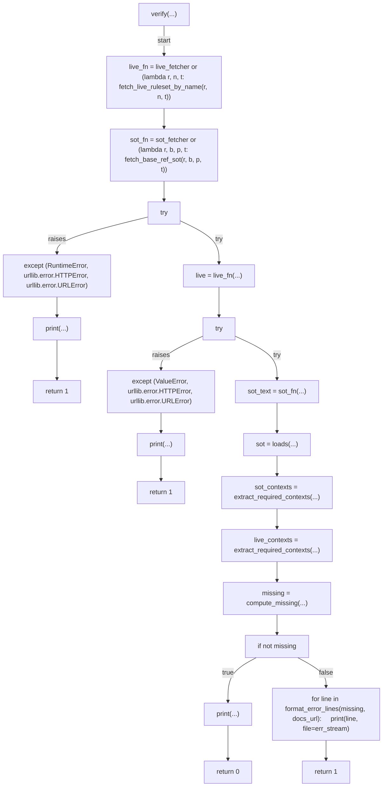
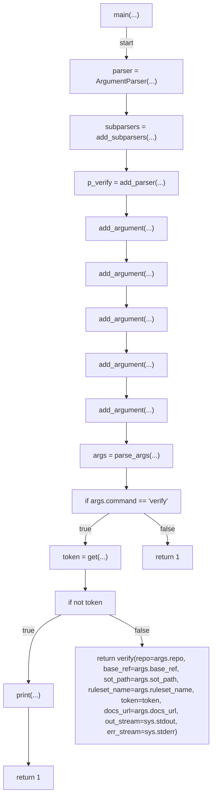

# AST graph: scripts/verify_ruleset_sync.py

This file is generated from `scripts/verify_ruleset_sync.py` by `python3 scripts/script_ast_graph.py all-doc`. Do not edit it by hand: content under `docs/generated/scripts/` is owned by the post-merge automation (refs #1540) -- update the source script instead.

## extract_required_contexts(...)

## compute_missing(...)

## decode_base64_content(...)

## format_error_lines(...)

## _api_request(...)

## fetch_live_ruleset_by_name(...)

## fetch_base_ref_sot(...)

## verify(...)

## main(...)

