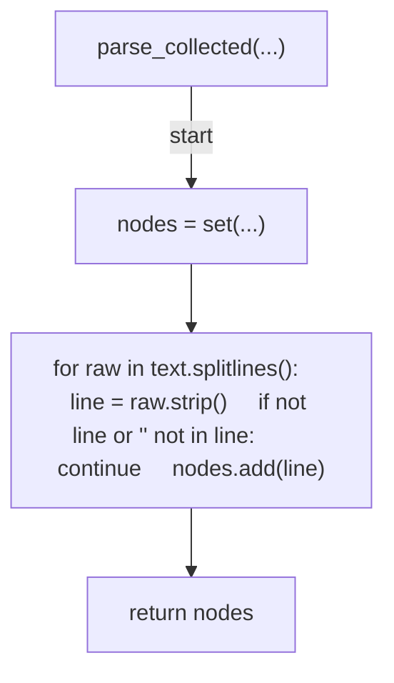
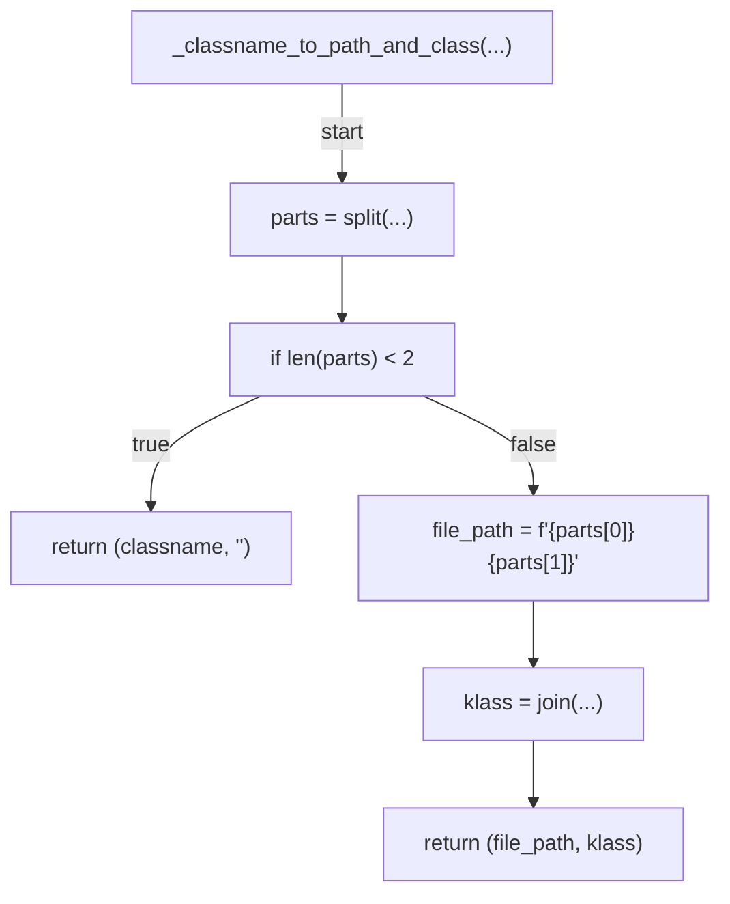
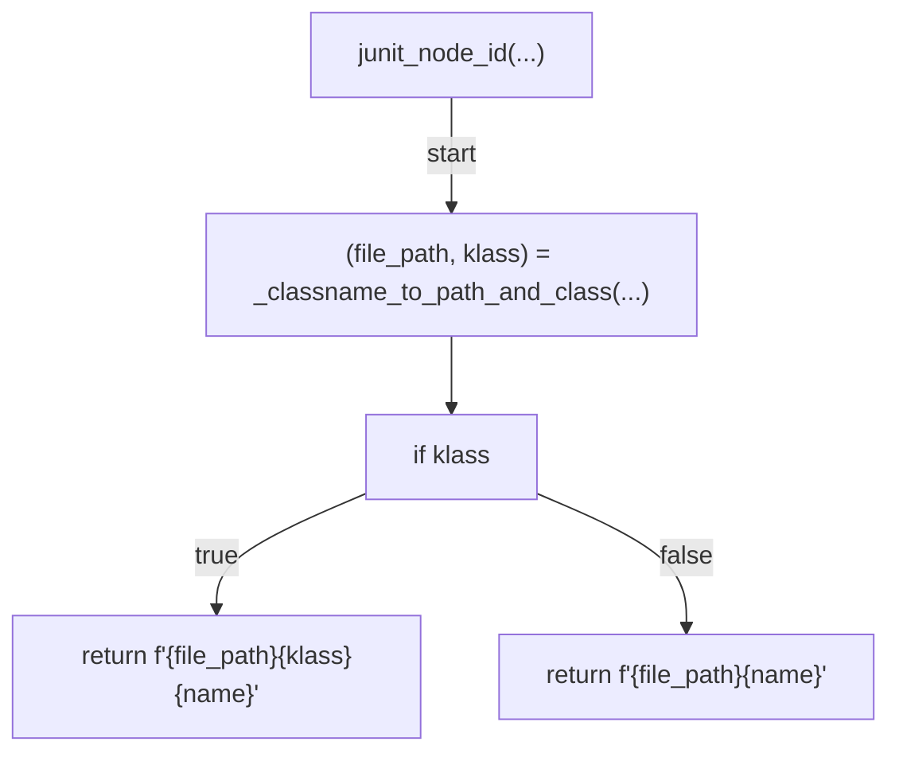
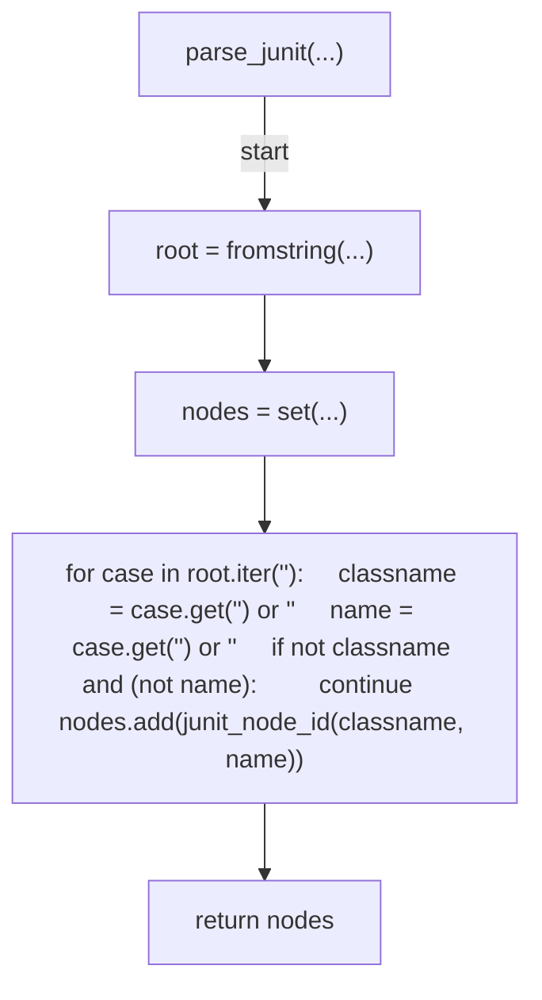
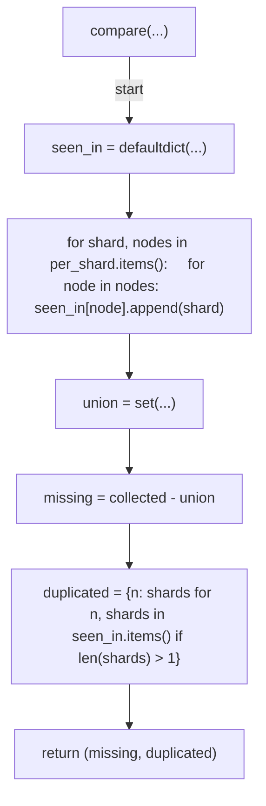
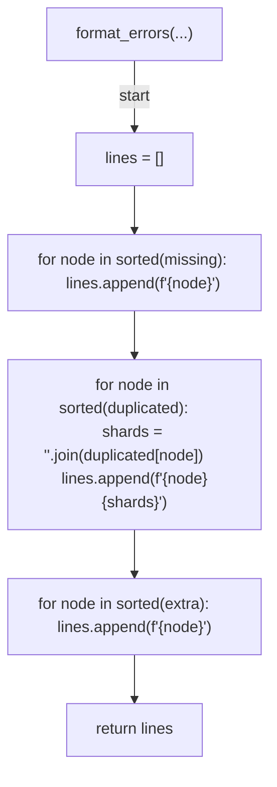
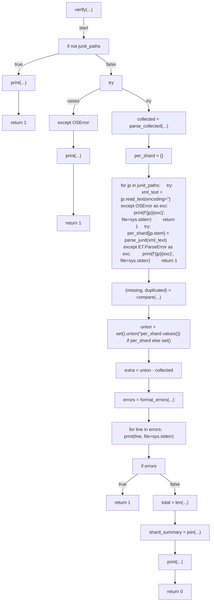
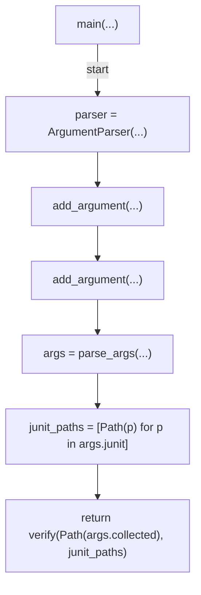

# AST graph: scripts/verify_shard_coverage.py

This file is generated from `scripts/verify_shard_coverage.py` by `python3 scripts/script_ast_graph.py all-doc`. Do not edit it by hand: content under `docs/generated/scripts/` is owned by the post-merge automation (refs #1540) -- update the source script instead.

## parse_collected(...)

## _classname_to_path_and_class(...)

## junit_node_id(...)

## parse_junit(...)

## compare(...)

## format_errors(...)

## verify(...)

## main(...)

