# AST graph: scripts/verify_source_version_bump.py

This file is generated from `scripts/verify_source_version_bump.py` by `python3 scripts/script_ast_graph.py all-doc`. Do not edit it by hand: content under `docs/generated/scripts/` is owned by the post-merge automation (refs #1540); update the source script instead.

## parse_version(...)

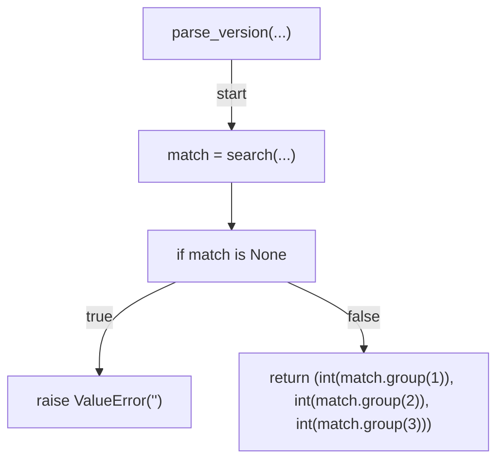

## format_version(...)

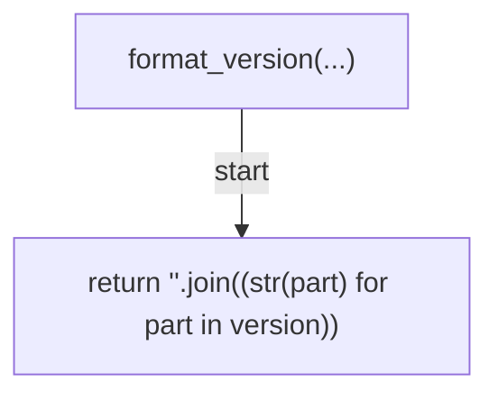

## is_universal_text_path(...)

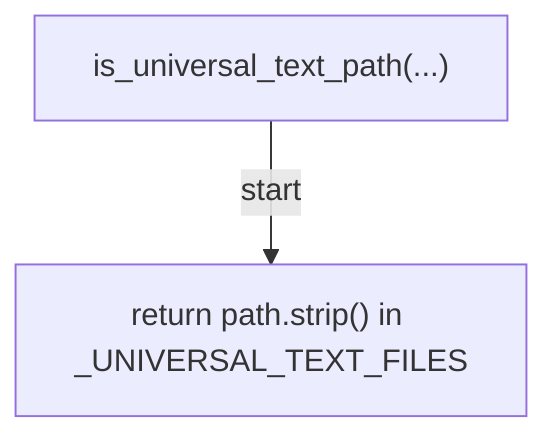

## touches_universal_text(...)

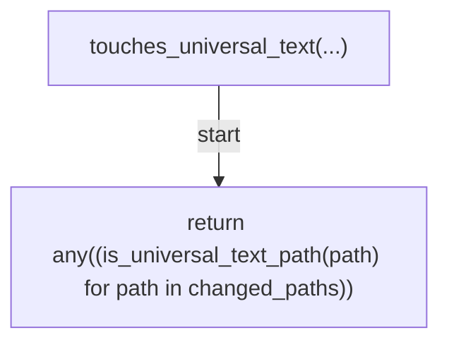

## bump_component(...)

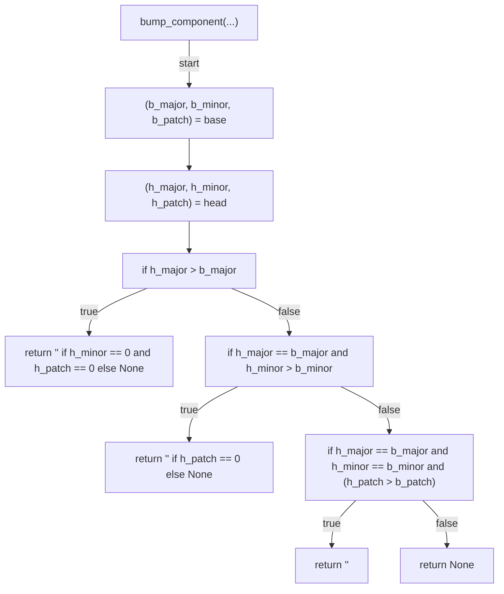

## extract_semver_labels(...)

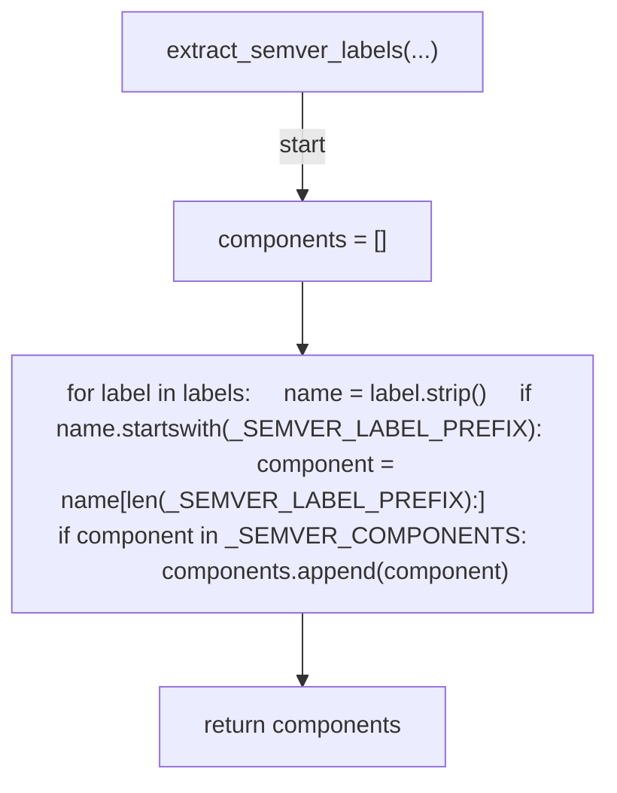

## evaluate(...)

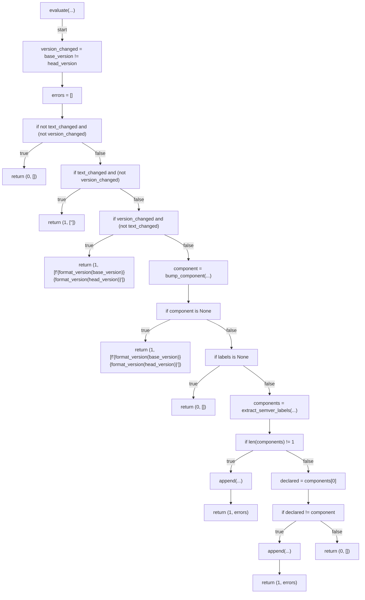

## resolve_base(...)

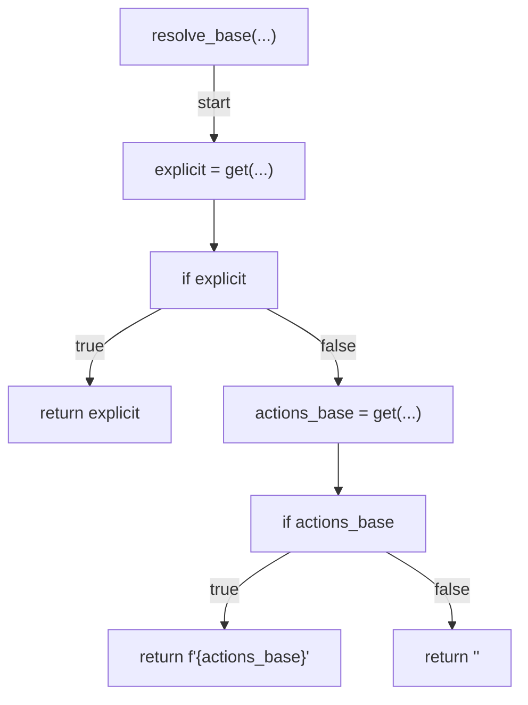

## changed_files(...)

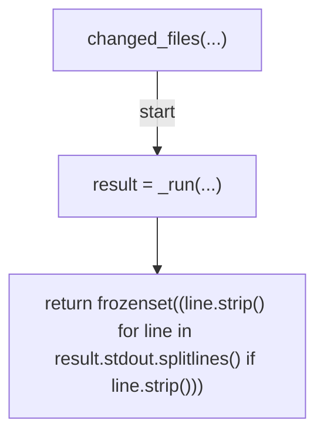

## read_version_at(...)

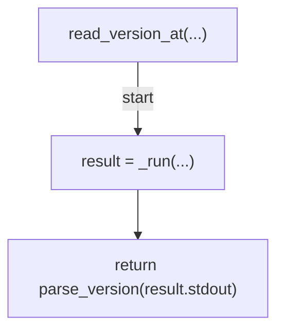

## _resolve_labels(...)

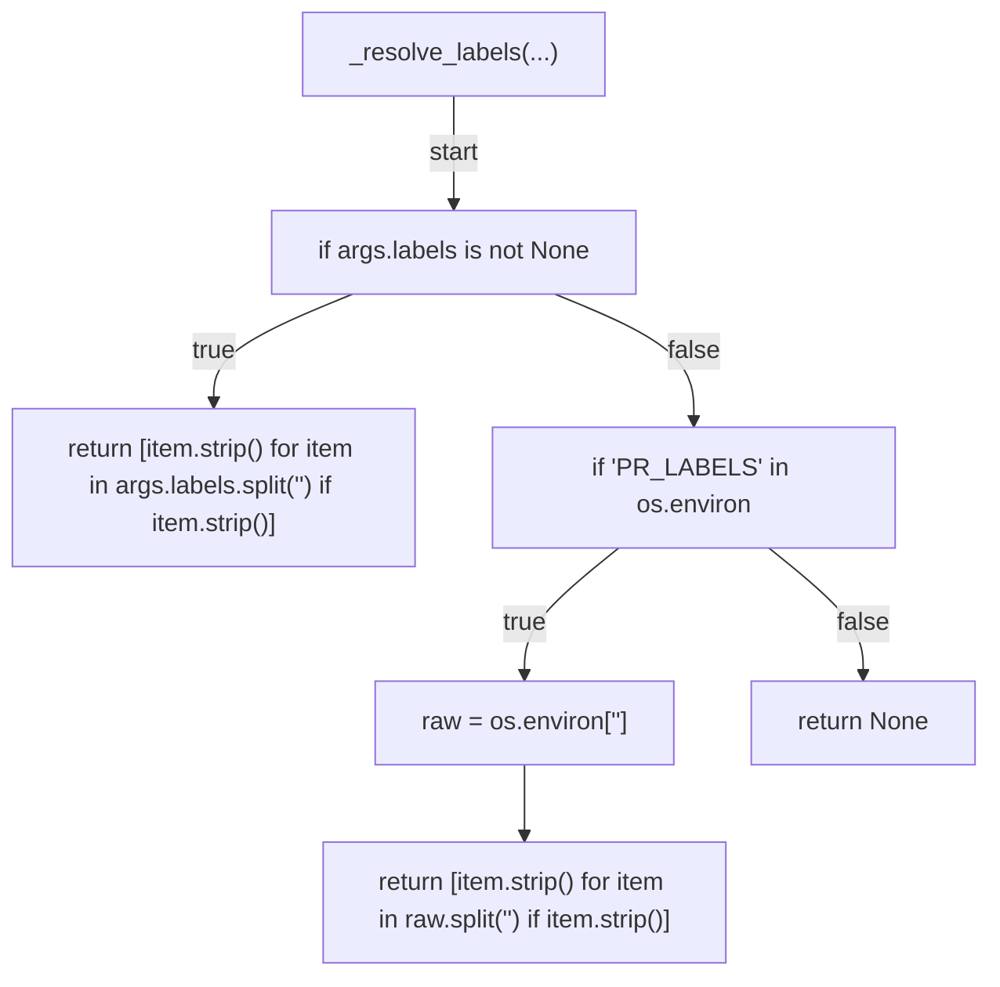

## _cmd_verify(...)

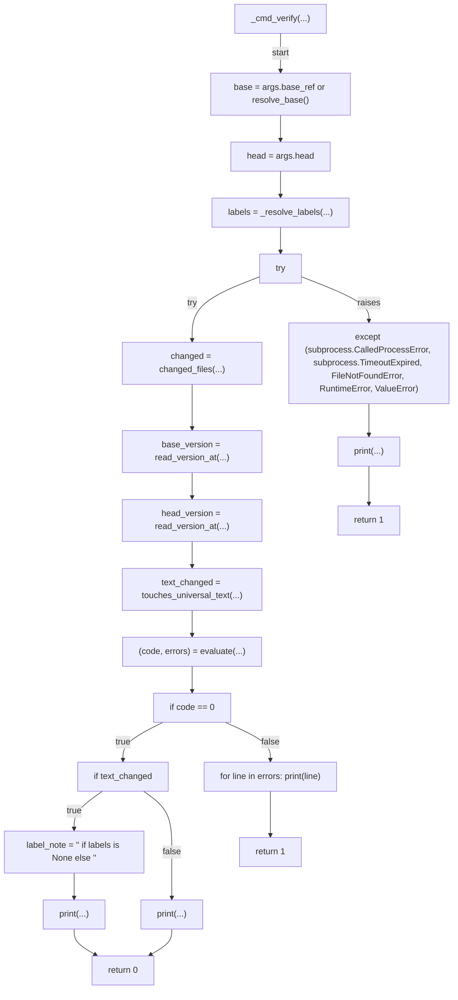

## main(...)

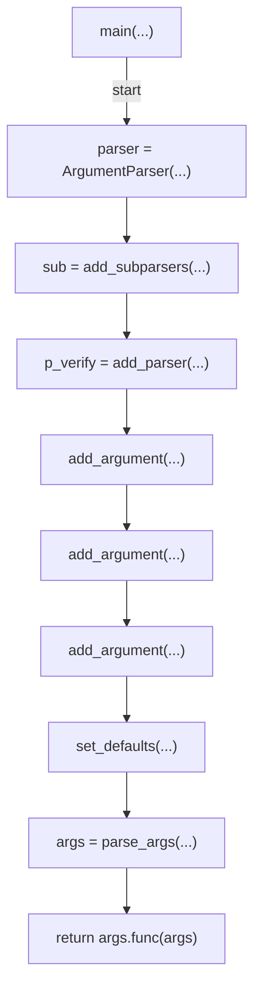

## _run(...)

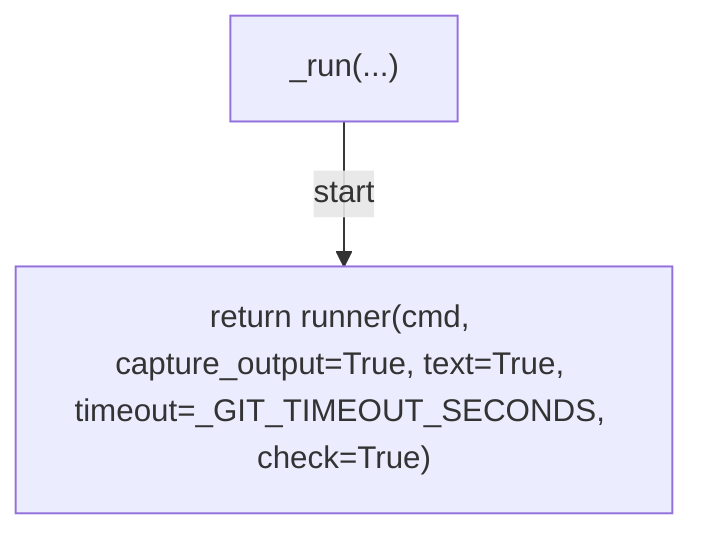
