# AST graph: scripts/verify_text_delta_section.py

This file is generated from `scripts/verify_text_delta_section.py` by `python3 scripts/script_ast_graph.py all-doc`. Do not edit it by hand: content under `docs/generated/scripts/` is owned by the post-merge automation (refs #1540); update the source script instead.

## is_instruction_path(...)

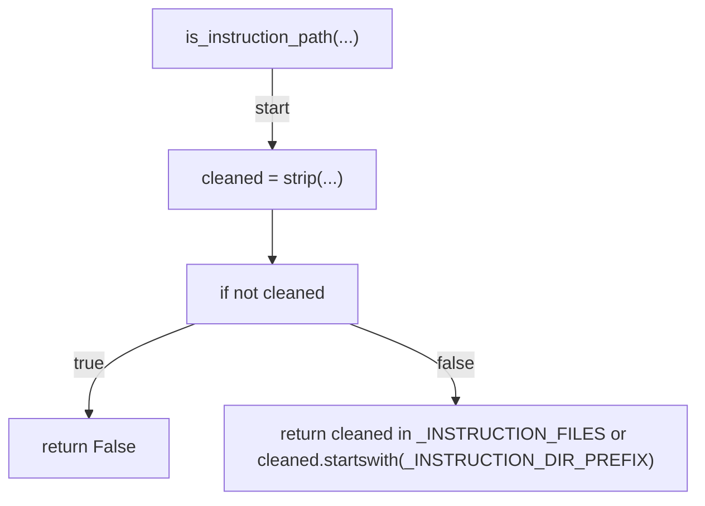

## resolve_base(...)

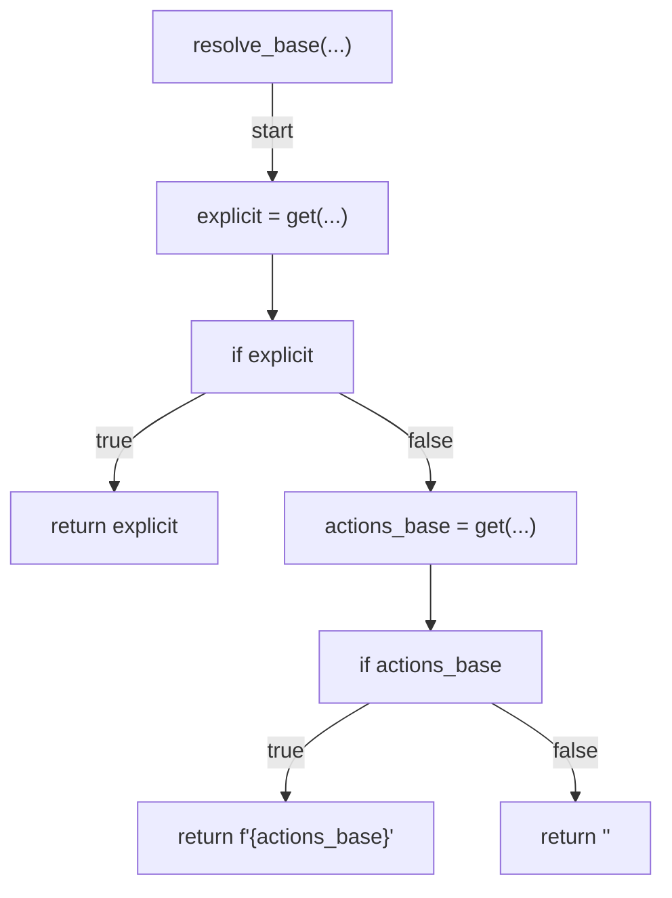

## changed_instruction_files(...)

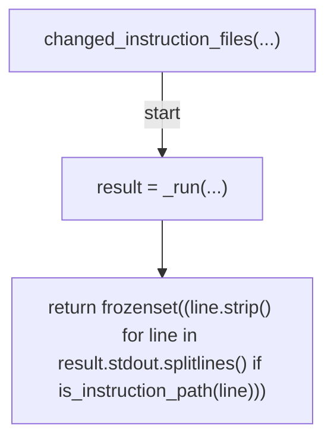

## section_errors(...)

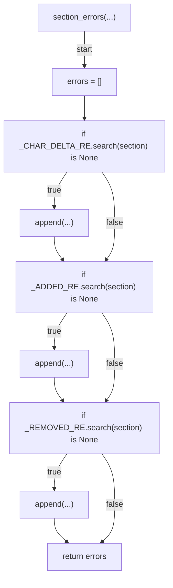

## evaluate(...)

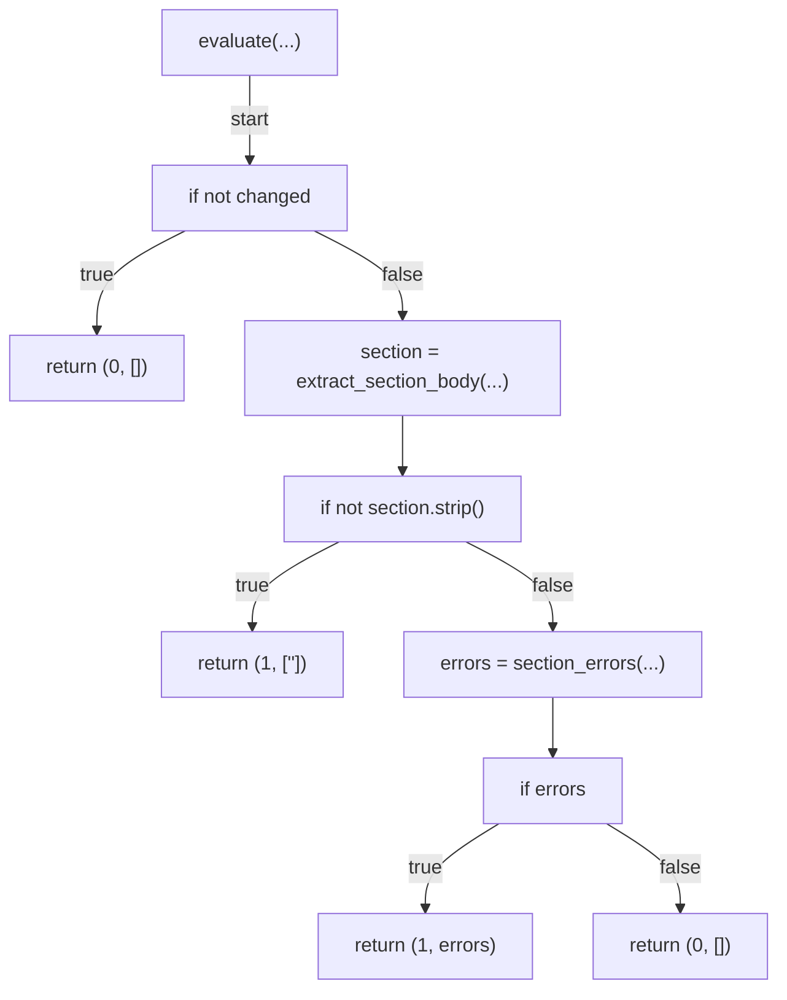

## _resolve_body(...)

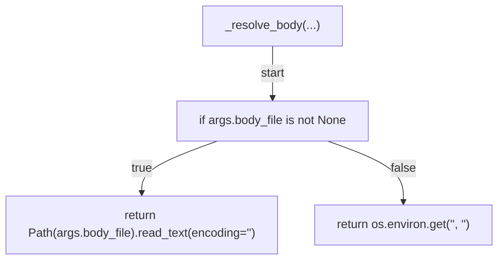

## _resolve_base_ref(...)

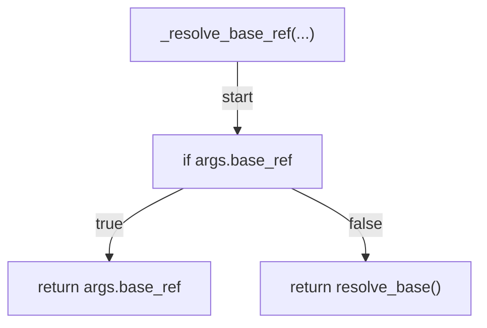

## _resolve_created_at(...)

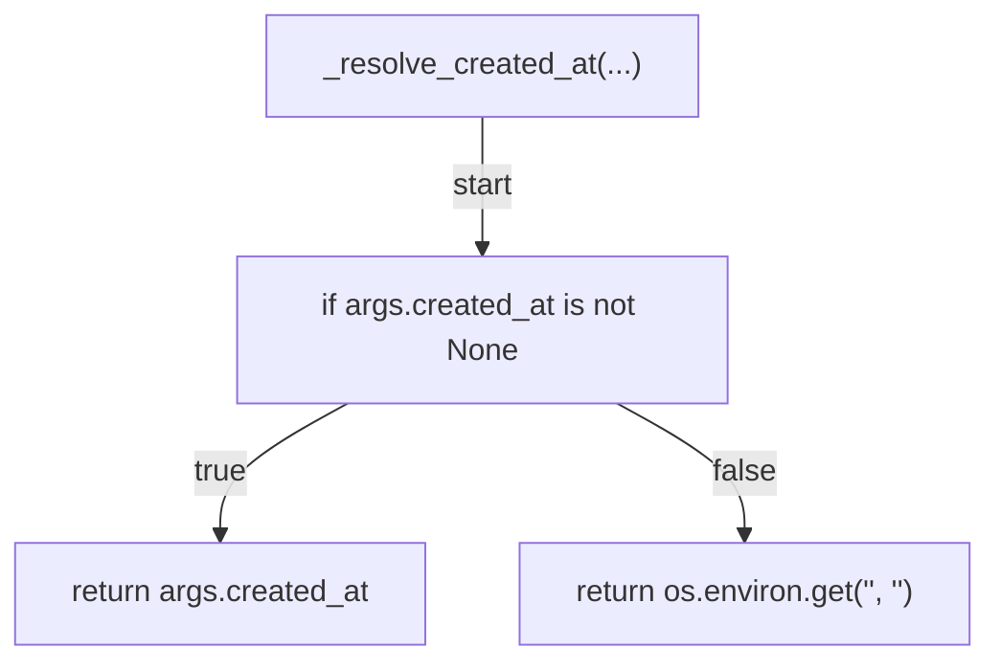

## _resolve_cutoff(...)

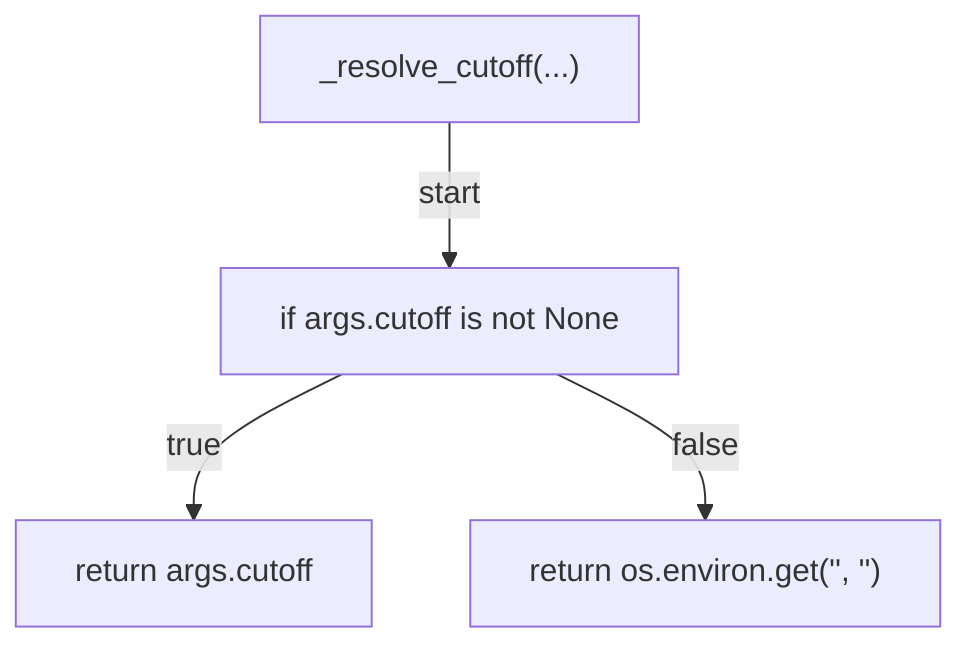

## _cmd_verify(...)

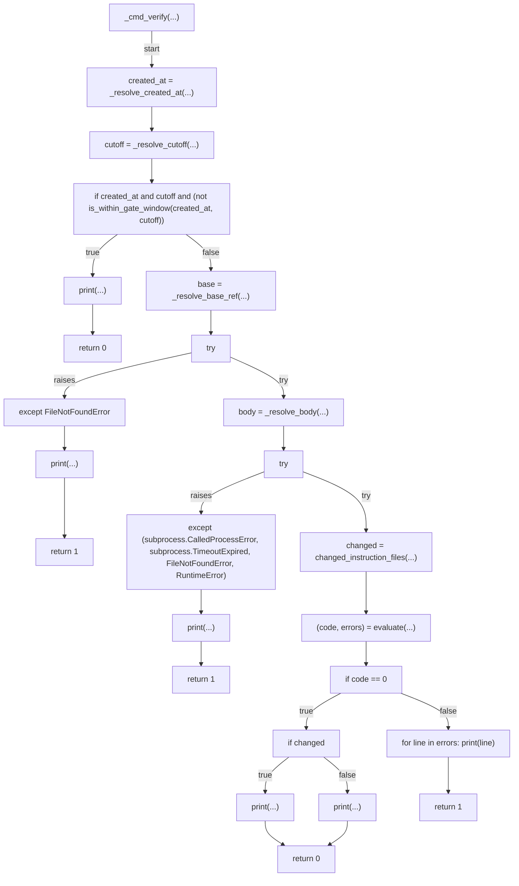

## main(...)

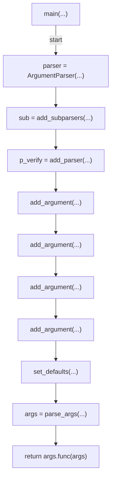

## _run(...)

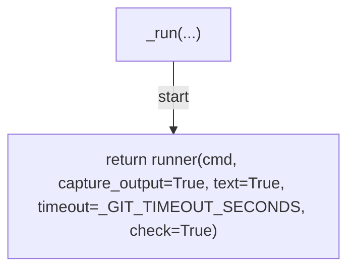
