# AST graph: scripts/workflow_diagram.py

This file is generated from `scripts/workflow_diagram.py` by `python3 scripts/script_ast_graph.py all-doc`. Do not edit it by hand: content under `docs/generated/scripts/` is owned by the post-merge automation (refs #1540); update the source script instead.

## _get_on_section(...)

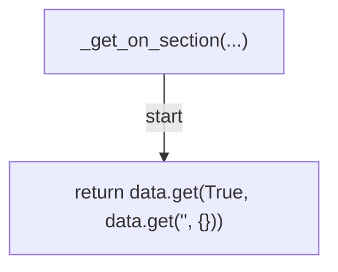

## _parse_triggers(...)

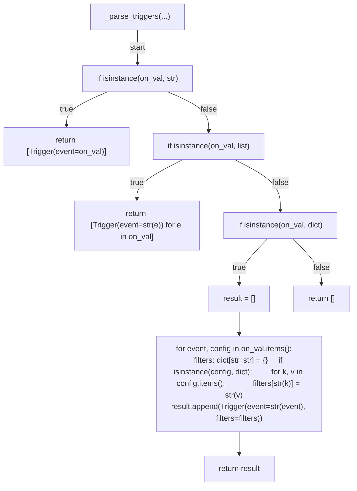

## _parse_jobs(...)

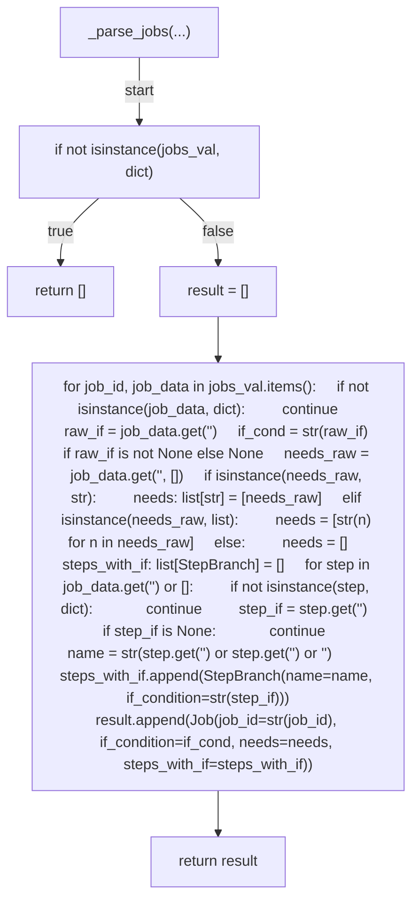

## parse_workflow(...)

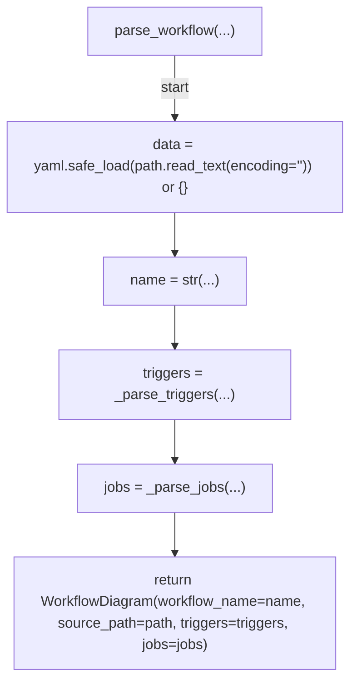

## _mermaid_escape(...)

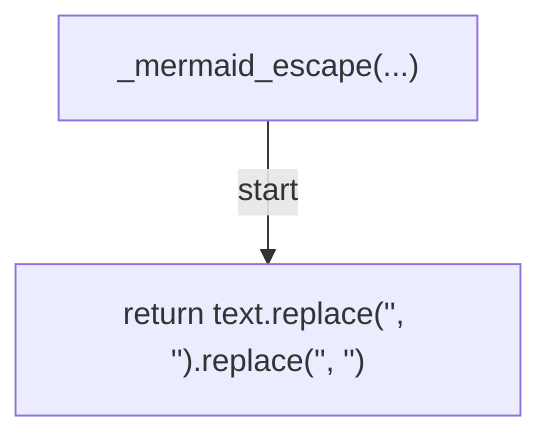

## _shorten(...)

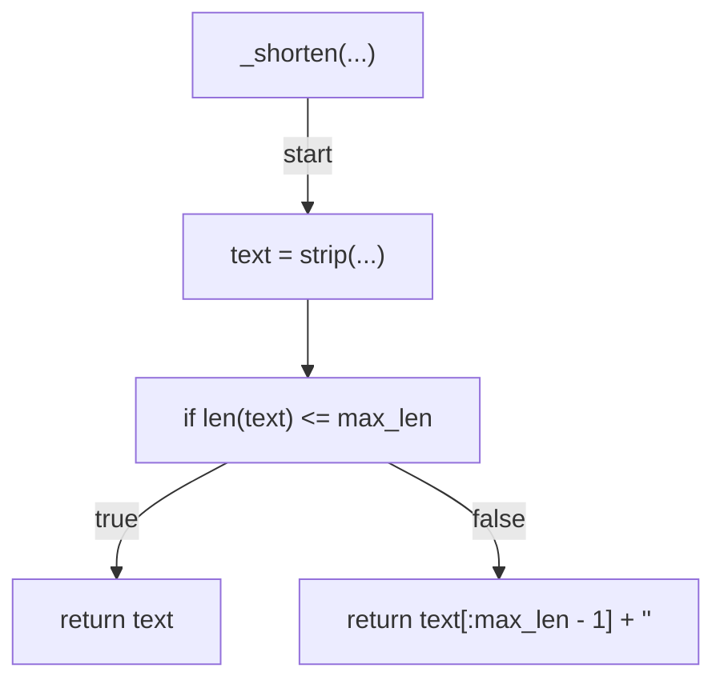

## render_mermaid(...)

```mermaid
flowchart TD
    N001["render_mermaid(...)"]
    N002["lines = ['<str>']"]
    N003["if diagram.triggers"]
    N004["append(...)"]
    N005["for t in diagram.triggers:     lbl = _mermaid_escape(t.label())     lines.append(f'<str>{t.node_id()}<str>{lbl}<str>')"]
    N006["append(...)"]
    N007["for j in diagram.jobs:     lines.append(f'<str>{j.node_id()}<str>{_mermaid_escape(j.job_id)}<str>')     for idx, step in enumerate(j.steps_with_if):         step_node = f'<str>{j.node_id()}<str>{idx}'         lbl = _mermaid_escape(step.name)         lines.append(f'<str>{step_node}<str>{lbl}<str>')"]
    N008["append(...)"]
    N009["job_by_id = {j.job_id: j for j in diagram.jobs}"]
    N010["for j in diagram.jobs:     if j.needs:         for parent_id in j.needs:             parent_job = job_by_id.get(parent_id)             if parent_job is None:                 continue             if j.if_condition:                 lbl = _mermaid_escape(_shorten(j.if_condition))                 lines.append(f'<str>{parent_job.node_id()}<str>{lbl}<str>{j.node_id()}')             else:                 lines.append(f'<str>{parent_job.node_id()}<str>{j.node_id()}')     else:         event_names = _EVENT_NAME_RE.findall(j.if_condition or '<str>')         for t in diagram.triggers:             if event_names and t.event not in event_names:                 continue             if j.if_condition:                 lbl = _mermaid_escape(_shorten(j.if_condition))                 lines.append(f'<str>{t.node_id()}<str>{lbl}<str>{j.node_id()}')             else:                 lines.append(f'<str>{t.node_id()}<str>{j.node_id()}')     for idx, step in enumerate(j.steps_with_if):         step_node = f'<str>{j.node_id()}<str>{idx}'         lbl = _mermaid_escape(_shorten(step.if_condition))         lines.append(f'<str>{j.node_id()}<str>{lbl}<str>{step_node}')"]
    N011["return '<str>'.join(lines) + '<str>'"]
    N001 -->|"start"| N002
    N002 --> N003
    N003 -->|"true"| N004
    N004 --> N005
    N005 --> N006
    N003 -->|"false"| N006
    N006 --> N007
    N007 --> N008
    N008 --> N009
    N009 --> N010
    N010 --> N011
```

## render_markdown(...)

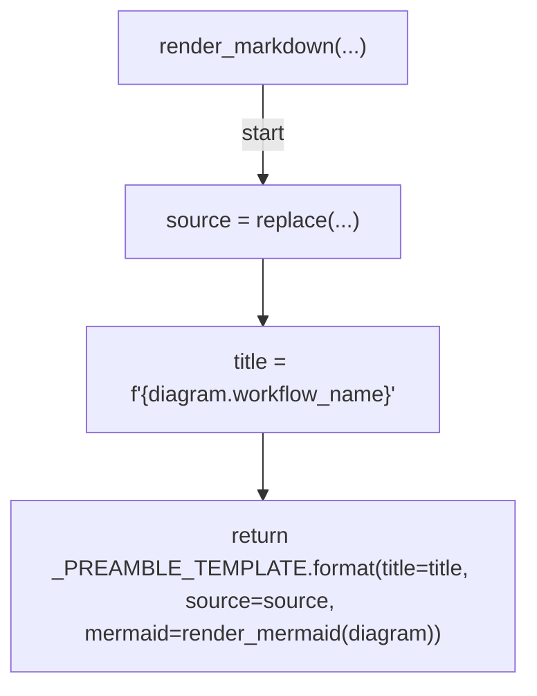

## output_path_for(...)

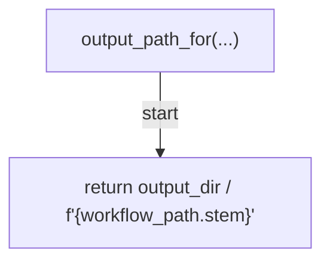

## _cmd_diagram(...)

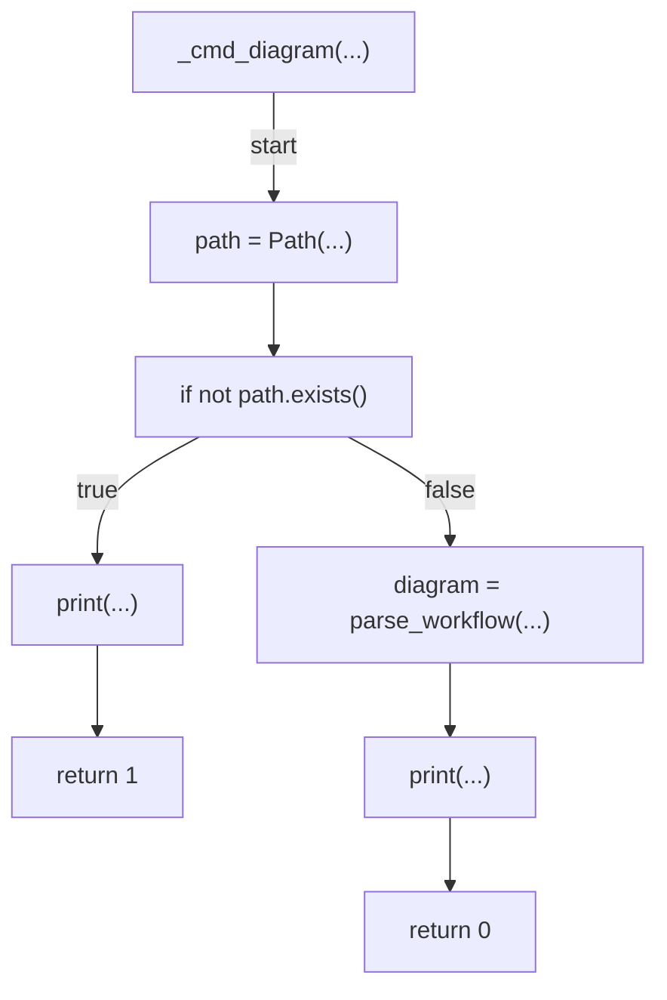

## _cmd_diagram_doc(...)

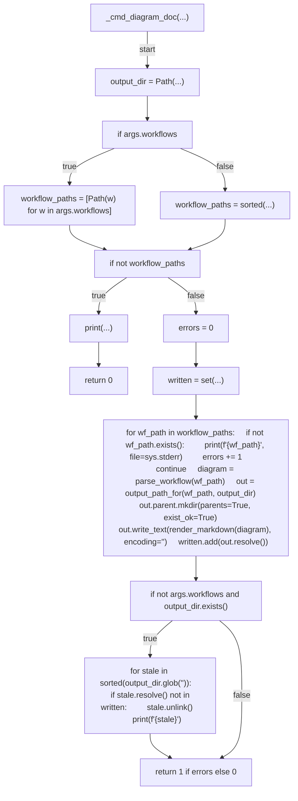

## main(...)

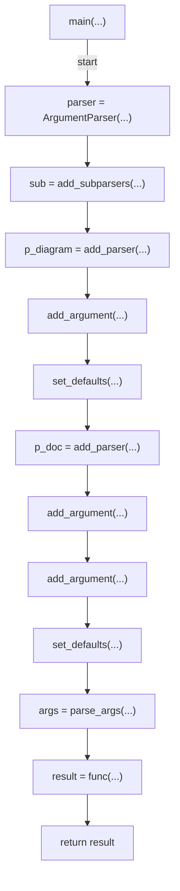
