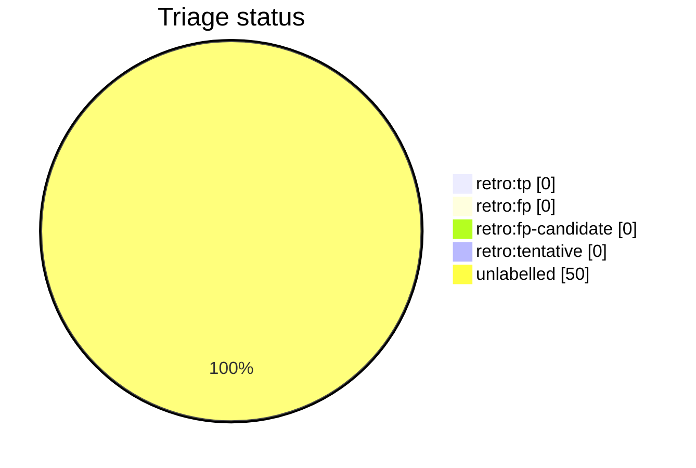

# Auto-retro triage report

This file is generated from live GitHub retro-issue labels by `python3 scripts/auto_retro.py triage-report`. Do not edit it by hand. Unlike the per-script AST docs it is a non-deterministic snapshot of repository state, so it is refreshed on merge by the `post-merge.yml` workflow (which opens a pull request when the snapshot drifts) rather than as part of the deterministic generated docs.

Retros observed: **50**

Open untriaged: **22**

## Anomalies

None: no fired signal clears both the FP-rate and sample-size thresholds.

## Triage status

## Signal occurrence and false-positive rates

| Signal | Fired | Fire rate | FP | FP rate | n | Anomaly |
| --- | --: | --: | --: | --: | --: | :-: |
| `inline_review_comments` | 41 | 0.82 | 0 | 0.00 | 41 |  |
| `fix_typed_title` | 9 | 0.18 | 0 | 0.00 | 9 |  |
| `multi_commit_pr` | 45 | 0.90 | 0 | 0.00 | 45 |  |

## False-positive rate trend

No triaged retros yet (no `retro:tp`/`retro:fp` labels).

## Recent retros

| # | State | Status | Title |
| --: | :-- | :-- | :-- |
| 2367 | open | untriaged | chore(auto-retro): review PR #2362 repair loops |
| 2365 | open | untriaged | chore(auto-retro): review PR #2345 repair loops |
| 2356 | open | untriaged | chore(auto-retro): review PR #2344 repair loops |
| 2353 | open | untriaged | chore(auto-retro): review PR #2321 repair loops |
| 2348 | open | untriaged | chore(auto-retro): review PR #2347 repair loops |
| 2346 | open | untriaged | chore(auto-retro): review PR #2343 repair loops |
| 2335 | open | untriaged | chore(auto-retro): review PR #2333 repair loops |
| 2330 | open | untriaged | chore(auto-retro): review PR #2329 repair loops |
| 2326 | open | untriaged | chore(auto-retro): review PR #2325 repair loops |
| 2322 | open | untriaged | chore(auto-retro): review PR #2320 repair loops |
