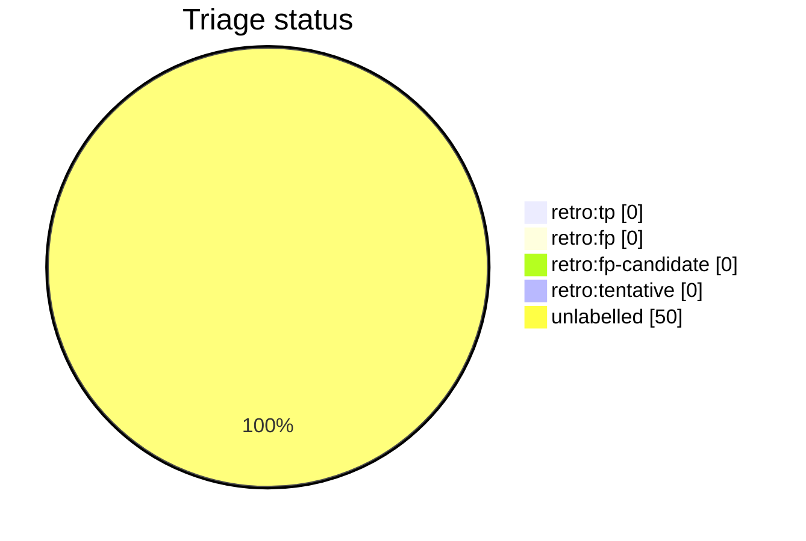

# Auto-retro triage report

This file is generated from live GitHub retro-issue labels by `python3 scripts/auto_retro.py triage-report`. Do not edit it by hand. Unlike the per-script AST docs it is a non-deterministic snapshot of repository state, so it is refreshed on merge by the `post-merge.yml` workflow (which opens a pull request when the snapshot drifts) rather than as part of the deterministic generated docs.

Retros observed: **50**

Open untriaged: **13**

## Anomalies

None: no fired signal clears both the FP-rate and sample-size thresholds.

## Triage status

## Signal occurrence and false-positive rates

| Signal | Fired | Fire rate | FP | FP rate | n | Anomaly |
| --- | --: | --: | --: | --: | --: | :-: |
| `inline_review_comments` | 40 | 0.80 | 0 | 0.00 | 40 |  |
| `fix_typed_title` | 8 | 0.16 | 0 | 0.00 | 8 |  |
| `multi_commit_pr` | 46 | 0.92 | 0 | 0.00 | 46 |  |

## False-positive rate trend

No triaged retros yet (no `retro:tp`/`retro:fp` labels).

## Recent retros

| # | State | Status | Title |
| --: | :-- | :-- | :-- |
| 2322 | open | untriaged | chore(auto-retro): review PR #2320 repair loops |
| 2305 | open | untriaged | chore(auto-retro): review PR #2302 repair loops |
| 2295 | open | untriaged | chore(auto-retro): review PR #2293 repair loops |
| 2289 | open | untriaged | chore(auto-retro): review PR #2288 repair loops |
| 2284 | open | untriaged | chore(auto-retro): review PR #2283 repair loops |
| 2279 | open | untriaged | chore(auto-retro): review PR #2278 repair loops |
| 2274 | open | untriaged | chore(auto-retro): review PR #2267 repair loops |
| 2259 | open | untriaged | chore(auto-retro): review PR #2258 repair loops |
| 2254 | open | untriaged | chore(auto-retro): review PR #2253 repair loops |
| 2249 | open | untriaged | chore(auto-retro): review PR #2247 repair loops |
