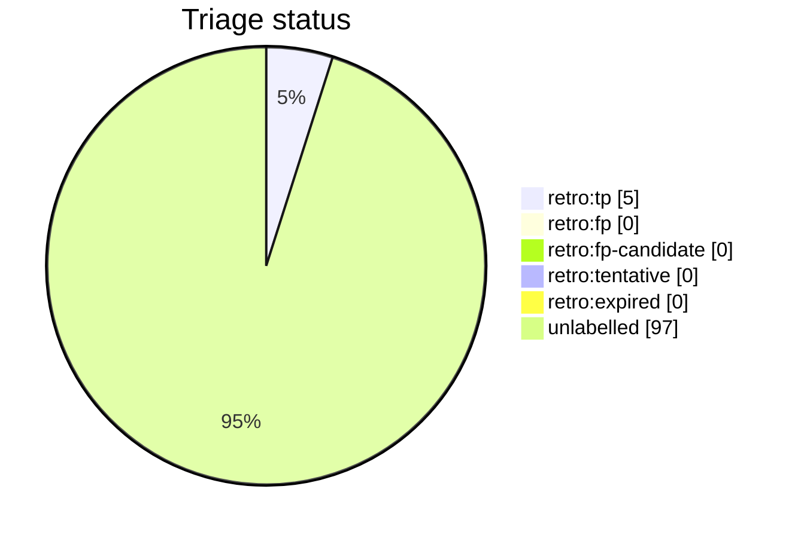

# Auto-retro triage report

This file is generated from live GitHub retro-issue labels by `python3 scripts/auto_retro.py triage-report`. Do not edit it by hand. Unlike the per-script AST docs it is a non-deterministic snapshot of repository state, so it is refreshed on merge by the `post-merge.yml` workflow (which opens a pull request when the snapshot drifts) rather than as part of the deterministic generated docs.

Retros observed: **102**

Open untriaged: **42**

## Anomalies

- **unlabelled ratio 0.95**: 97 of 102 observed retros carry no `retro:*` label (>= 0.50, n >= 5); retros are being opened faster than they are triaged.

## Loop health

- Triage rate: **5 / 102** (5%) of observed retros carry a `retro:*` label; **97** (95%) remain unlabelled.
- Sentinel disposal: **0** (0%) auto-closed via `retro:expired` without operator engagement.

## Triage status

## Signal occurrence and false-positive rates

| Signal | Fired | Fire rate | FP | FP rate | n | Anomaly |
| --- | --: | --: | --: | --: | --: | :-: |
| `inline_review_comments` | 31 | 0.30 | 0 | 0.00 | 31 |  |
| `fix_typed_title` | 7 | 0.07 | 0 | 0.00 | 7 |  |
| `multi_commit_pr` | 37 | 0.36 | 0 | 0.00 | 37 |  |

## False-positive rate trend

- All-time: 0.00 (n=5 triaged)
- Last 20 retros: 0.00 (n=0 triaged); n/a

## Recent retros

| # | State | Status | Title |
| --: | :-- | :-- | :-- |
| 2498 | open | untriaged | chore(auto-retro): review PR #2497 repair loops |
| 2493 | open | untriaged | chore(auto-retro): review PR #2492 repair loops |
| 2489 | open | untriaged | chore(auto-retro): review PR #2488 repair loops |
| 2485 | open | untriaged | chore(auto-retro): review PR #2484 repair loops |
| 2480 | open | untriaged | chore(auto-retro): review PR #2479 repair loops |
| 2469 | open | untriaged | chore(auto-retro): review PR #2443 repair loops |
| 2464 | open | untriaged | chore(auto-retro): review PR #2463 repair loops |
| 2456 | open | untriaged | chore(auto-retro): review PR #2455 repair loops |
| 2449 | open | untriaged | chore(auto-retro): review PR #2447 repair loops |
| 2430 | open | untriaged | chore(auto-retro): review PR #2402 repair loops |
