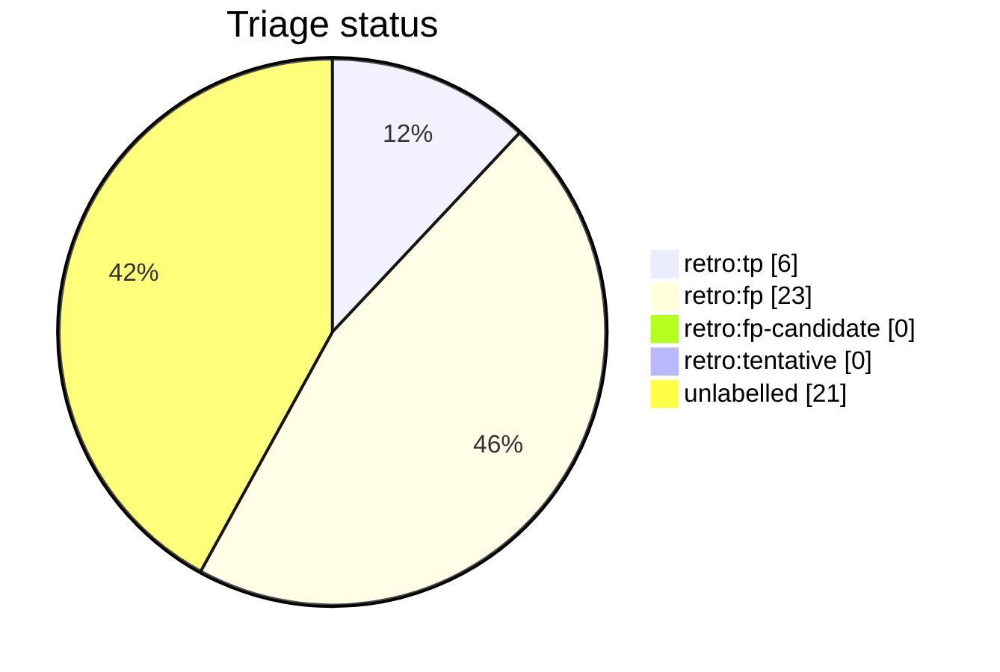

# Auto-retro triage report

This file is generated from live GitHub retro-issue labels by `python3 scripts/auto_retro.py triage-report`. Do not edit it by hand. Unlike the per-script AST docs it is a non-deterministic snapshot of repository state, so it is refreshed on merge by the `post-merge.yml` workflow (which opens a pull request when the snapshot drifts) rather than as part of the deterministic generated docs.

Retros observed: **50**

Open untriaged: **21**

## Anomalies

None: no fired signal clears both the FP-rate and sample-size thresholds.

## Triage status

## Signal occurrence and false-positive rates

| Signal | Fired | Fire rate | FP | FP rate | n | Anomaly |
| --- | --: | --: | --: | --: | --: | :-: |
| `inline_review_comments` | 9 | 0.18 | 0 | 0.00 | 9 |  |
| `fix_typed_title` | 17 | 0.34 | 5 | 0.29 | 17 |  |
| `multi_commit_pr` | 27 | 0.54 | 6 | 0.22 | 27 |  |

## False-positive rate trend

- All-time: 0.79 (n=29 triaged)
- Last 20 retros: 0.00 (n=0 triaged) -- n/a

## Recent retros

| # | State | Status | Title |
| --: | :-- | :-- | :-- |
| 1803 | open | untriaged | chore(auto-retro): review PR #1801 repair loops |
| 1797 | open | untriaged | chore(auto-retro): review PR #1796 repair loops |
| 1791 | open | untriaged | chore(auto-retro): review PR #1790 repair loops |
| 1786 | open | untriaged | chore(auto-retro): review PR #1785 repair loops |
| 1781 | open | untriaged | chore(auto-retro): review PR #1777 repair loops |
| 1760 | open | untriaged | chore(auto-retro): review PR #1757 repair loops |
| 1758 | open | untriaged | chore(auto-retro): review PR #1755 repair loops |
| 1747 | open | untriaged | chore(auto-retro): review PR #1746 repair loops |
| 1741 | open | untriaged | chore(auto-retro): review PR #1738 repair loops |
| 1733 | open | untriaged | chore(auto-retro): review PR #1730 repair loops |
